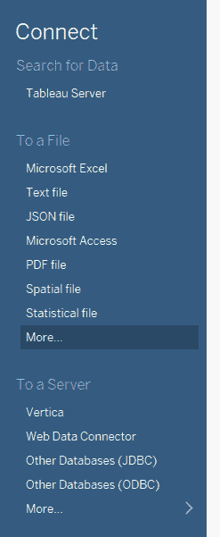
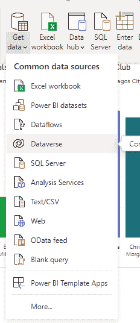

# tableau VS Power BI–有什么区别？

> 原文：<https://www.freecodecamp.org/news/tableau-vs-power-bi-whats-the-difference/>

Tableau 和 Power BI 都是数据可视化和商业智能工具。您可以使用这两种工具提取数据，可视化数据，分析数据，并将其转化为可操作的信息。

在本文中，您将详细了解什么是 Power BI 和 Tableau。我还将在两者之间创建一个事实比较，这样你就可以确定你应该在你的项目中使用哪一个。

**NB** :本文不是对权力 BI 和 Tableau 的非黑即白的对比。这两者之间有很多灰色地带，这是我们最关注的。

## 什么是 Tableau？

Tableau 在 21 世纪初开始流行。它是领先的数据可视化和商业智能工具，适用于希望实现数据驱动的公司。

Tableau 可以集成各种来源的数据，如 Microsoft Excel、Microsoft Access 和 Google Analytics。它甚至可以集成 JSON、文本、统计和空间文件等文件。

Tableau 有很多特点，例如:

*   无代码数据查询
*   拖放
*   实时分析
*   数据过滤
*   移动视图
*   数据连接器
*   文字编辑器
*   仪表盘
*   团队成员协作，等等。

## 什么是 Power BI？

Power BI 是一套数据分析和可视化工具和服务，可帮助您将数据转换为可视化交互式报告。它于 2011 年向公众开放。

Power BI 集成了各种数据源，如 Excel 工作簿、SQL server、PostgreSQL 和 Microsoft Access。然后，您可以将这些数据转换成任何您喜欢的可视化形式。您也可以手动输入数据。

该图表可以是饼图、条形图、漏斗图、R 和 Python Visual，甚至是问答。Power Bi 是一个强大的数据可视化工具。

Power BI 为您提供的超酷功能包括:

*   与微软产品的平稳集成
*   数据刷新
*   移动应用程序
*   地图创建
*   各种各样的图表
*   用 R 和 Python 定制图表
*   与 Azure 机器学习的集成

## 为什么要用 Power BI 或者 Tableau 而不是 Excel？

Tableau 和 Power BI 是为一件重要的事情而设计的，而 Excel 主要不是为它而设计的——数据可视化。我知道你仍然可以用 Excel 制作图表，但与 Power BI 和 Tableau 相比，这种功能是有限的。

此外，Tableau 和 Power BI 在视觉和仪表盘方面比 Excel 更强大。它们的处理速度也比 Excel 快。

简而言之，公司和创业公司应该选择 Power Bi 或 Tableau，而不是 Excel。

## Tableau 和 Power BI 的区别

| 基础 | （舞台上由人扮的）静态画面 | 功率 BI |
| --- | --- | --- |
| **用户界面** | 开始使用 Tableau UI 可能会令人生畏。 | 与 Tableau 相比，Power BI UI 相对更容易上手。 |
| **定价** | Tableau 更贵。Tableau Creator 的费用是每个用户每月 70 美元，按年计费 | Power BI Pro 每月花费 13.7 美元，Power BI Premium 每月花费 27.5 美元 |
| **数据处理能力** | Tableau 可以处理大量数据。当数据非常大时，它的性能会更好 | 当数据量有限时，Power BI 性能更佳 |
| **平台** | Tableau 是平台无关的。它可以在 Mac 和 Windows 上运行。 | Power BI 不能在 Mac 上运行 |
| **企业** | Tableau 适用于希望更加数据驱动的大型企业。 | Power BI 适合创业公司和小规模企业。 |
| **数据来源** | Tableau 可以访问广泛的数据源，包括文件 | Power BI 的数据源比 Tableau 少 |
| **机器学习支持** | Tableau 内置了对 Python 机器学习的支持 | Power BI 与 Azure 机器学习集成。 |
| **社区** | Tableau 有一个拥有超过一百万用户的支持社区。还有一个用户可以获得帮助的论坛。 | Power BI 在市场上比 Tableau 年轻，所以没有 Tableau 那么多社区成员 |

## 最后的想法

Power BI 和 Tableau 在商业智能方面的表现都不错，所以很难说谁更胜一筹。

唯一比较容易得出的结论是 Tableau 比 Power BI 更健壮。这是因为 Tableau 可以处理更多的数据，并且可以访问几个常见和不常见的数据源。

但是如果你真的需要选择一个，下面是一些可以考虑的标准:

*   如果您预算有限，Power Bi 可能是更好的选择
*   如果你有一群高技能的数据专家，Tableau 比 Power BI 更健壮，所以 Tableau 是更好的选择
*   如果你的公司还是一家创业公司，可以考虑 Power BI，但是如果公司已经小规模以上移动，并且持续增长，就应该选择 Tableau。
*   如果您有大量的数据要处理，并且您认为数据会继续增加，那么您应该选择 Tableau。但是，如果要处理的数据相对较少，并且您认为不会增加太多，Power Bi 是一个不错的选择。

感谢您的阅读。