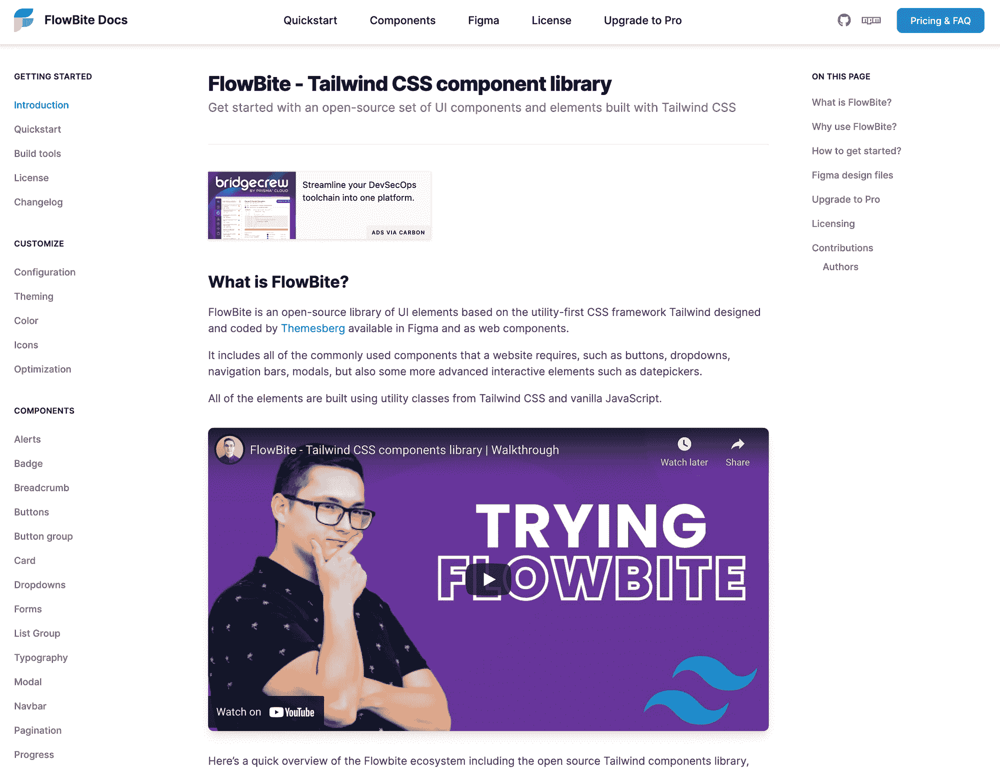
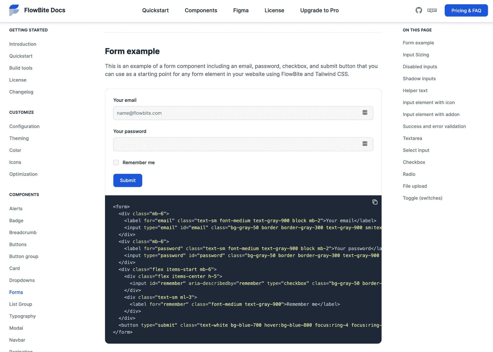
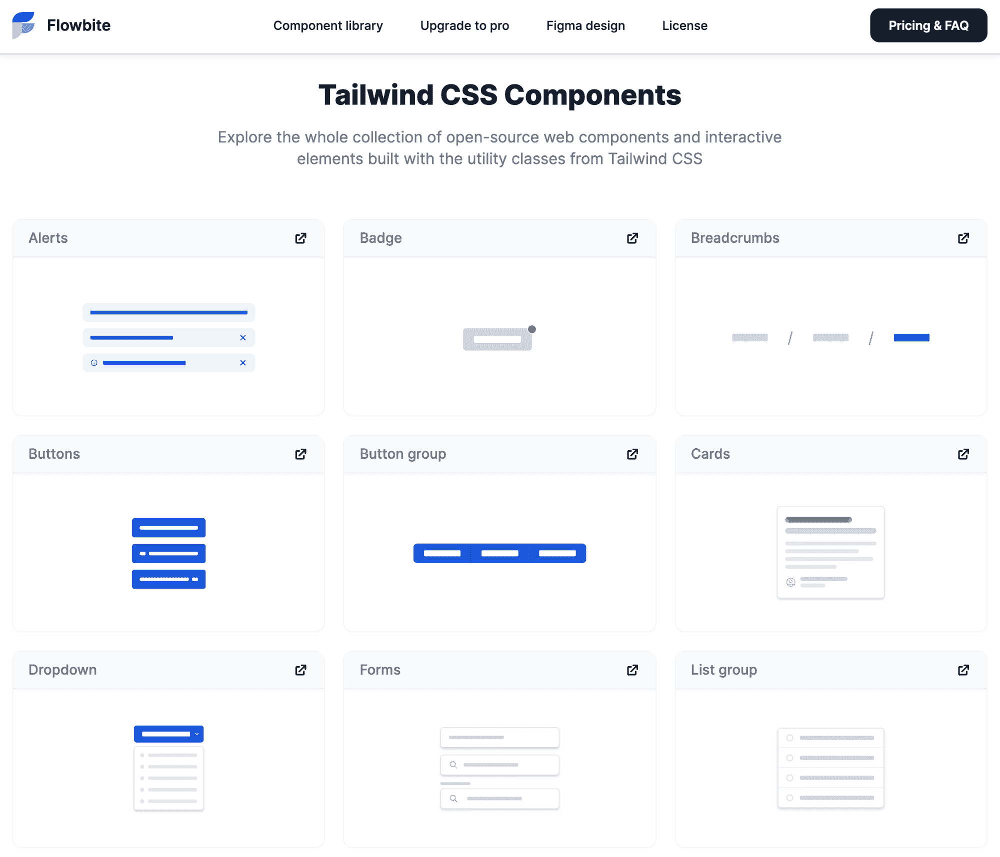
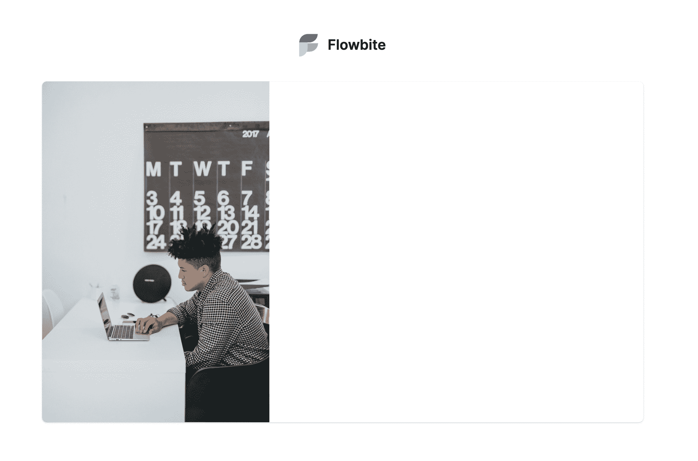
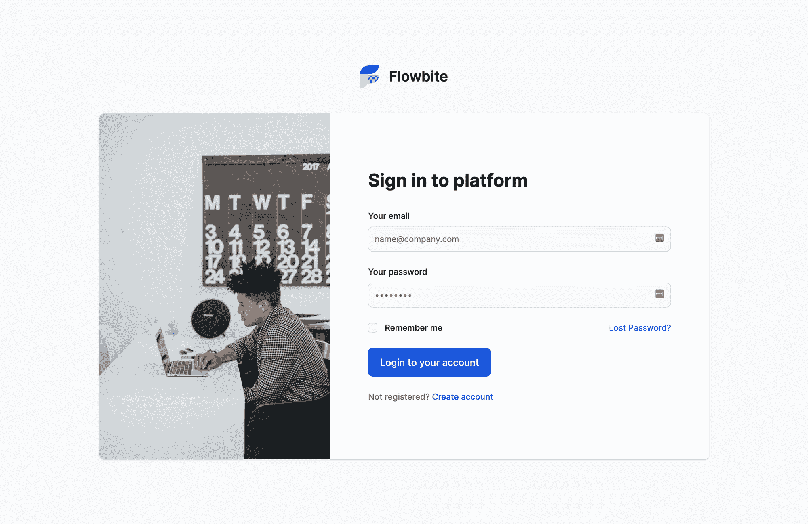

# Tailwind CSS 组件教程–如何开始使用 Flowbite

> 原文：<https://www.freecodecamp.org/news/tailwind-css-components-flowbite/>

Flowbite 是一个开源的 web 组件库，由 Tailwind CSS 中的实用程序优先类构建而成。它还包括交互式元素，如下拉菜单、情态动词、日期选择器。

Tailwind CSS 是我最近在我的 web 相关项目中经常使用的一个框架，因为它使用实用优先类构建页面的速度非常快。

然而，我遇到的一个问题是,*框架不包括一组基本的组件*来开始。所以我不得不为每个项目一遍又一遍地构建它们。

但是后来我发现了一个基于 Tailwind CSS 的[组件库叫做 Flowbite](https://flowbite.com/docs/getting-started/introduction/) 。它附带了最常用的 web 组件，比如按钮、导航栏、卡片、表单元素等等，这些组件都是用 Tailwind CSS 的*实用程序类方便地构建的。*



Flowbite - Tailwind CSS component library

今天我想向你展示如何开始使用这个库，并开始使用 Tailwind CSS 和 Flowbite 的组件更快地构建网站。

该项目在 Github 上[可用，并且在 MIT 许可下是开源的。](https://github.com/themesberg/flowbite)

## Flowbite 入门

首先你需要了解 Flowbite 是如何工作的。这个库不是另一个框架。相反，它是一组基于 Tailwind CSS 的组件，您只需从文档中复制粘贴即可。



Flowbite - Tailwind CSS form components

它还包括一个 JavaScript 文件，支持交互式组件，如模态、下拉菜单和日期选择器，您可以通过 CDN 或 NPM 将这些组件包含到您的项目中。

您可以查看[快速入门指南](https://flowbite.com/docs/getting-started/quickstart/)，通过将 CDN 文件包含到您的项目中来探索这些元素。但是如果你想用 Flowbite 构建一个项目，我建议你遵循[构建工具](https://flowbite.com/docs/getting-started/build-tools/)的步骤，这样你就可以清除和缩小生成的 CSS。

对于更快的配置，我们将包括使用 CDN 的一切。

## 如何通过 CDN 包含 Flowbite 和 Tailwind CSS

让我们从将 CSS 文件包含在 HTML 的`head`标签中开始:

```
<link rel="stylesheet" href="https://unpkg.com/flowbite@latest/dist/flowbite.min.css" />
```

然后还包括 JavaScript 文件，该文件在`body`标记结束之前启用交互元素:

```
<script src="https://unpkg.com/flowbite@latest/dist/flowbite.bundle.js"></script>
```

如果您正确地遵循了这两个步骤，那么现在您的项目中应该已经包含了 Tailwind CSS 和 Flowbite，并且 Flowbite 中的组件现在应该都可以工作了。

## 探索 Flowbite 的组件

下一步是查看文档中的组件，这些组件都是使用 Tailwind CSS 中的实用程序类构建的。

您可以找到任何东西，从警告、按钮和徽章，一直到导航栏、模态、下拉菜单，甚至日期选择器。



Flowbite - Tailwind CSS components

以下是组件的完整列表:

*   警报
*   徽章
*   面包屑
*   小跟班
*   按钮组
*   卡片
*   下拉菜单
*   形式
*   列表组
*   排印
*   情态的
*   导航条
*   页码
*   进度条
*   桌子
*   工具提示
*   日期选择器

你可以在主页上查看[的所有组件](https://flowbite.com/#components)，然后从文档的每一页都可以访问到它。

现在你需要做的就是将你选择的元素复制粘贴到你的项目中，然后以你认为合适的方式使用它们。

让我们使用 Flowbite 中的组件和 Tailwind CSS 中的实用程序类创建一个用户验证页面，向您展示这个库的工作流程。

下面是它最终的样子:


Authentication page built with Flowbite

## 如何用 Flowbite 构建用户认证页面

第一个要求是将 Flowbite 包含到您将通过 CDN 或 NPM 使用的 HTML 页面中。我已经在本文中向您展示了如何做到这一点，所以我假设您已经做到了。

让我们首先构建包装器元素，稍后我们将向其中添加徽标和主卡元素。

```
<div class="mx-auto md:h-screen flex flex-col justify-center items-center px-6 pt-8 pt:mt-0">
    <!-- content will go here -->
</div>
```

Wrapper element

这个元素确保了在更大的屏幕上所有的东西都水平和垂直居中。

现在让我们添加有利于品牌推广的徽标，用户也可以点击它返回主页。

```
<div class="mx-auto md:h-screen flex flex-col justify-center items-center px-6 pt-8 pt:mt-0">
    <a href="#" class="text-2xl font-semibold flex justify-center items-center mb-8 lg:mb-10">
      
      <span>Flowbite</span>
    </a>
</div>
```

Logo inside wrapper element

接下来，我们应该创建主卡片元素，它就在我们已经添加的徽标之后，并且还要在卡片内添加图像。

```
<div class="bg-white shadow rounded-lg lg:flex items-center justify-center md:mt-0 w-full lg:max-w-screen-lg 2xl:max:max-w-screen-lg xl:p-0">
	<div class="hidden lg:flex w-2/3">
		
	</div>
	<div class="w-full p-6 sm:p-8 lg:p-16 lg:py-0 space-y-8">
		<!-- Authentication form goes here -->
	</div>
</div>
```

Card element

如果你按照正确的步骤，你应该有一个空的认证卡，里面有一个图像和上面的标志。



Empty authentication card

### 如何使用 Flowbite Tailwind CSS 表单元素

这就是 Flowbite 发挥作用的地方，因为我们需要构建一个包含两个文本输入字段、一个复选框和一个按钮的表单元素。我们不必自己构建它，因为我们可以使用 Flowbite 中的 [Tailwind CSS 表单元素](https://flowbite.com/docs/components/forms/)。

让我们在卡片的第二个`div`元素中添加下面的标题和表单元素。

```
<h2 class="text-2xl lg:text-3xl font-bold text-gray-900">
   Sign in to platform
</h2>
<form class="mt-8 space-y-6" action="#">
   <div>
      <label for="email" class="text-sm font-medium text-gray-900 block mb-2">Your email</label>
      <input type="email" name="email" id="email"
         class="bg-gray-50 border border-gray-300 text-gray-900 sm:text-sm rounded-lg focus:ring-blue-500 focus:border-blue-500 block w-full p-2.5"
         placeholder="name@company.com" required>
   </div>
   <div>
      <label for="password" class="text-sm font-medium text-gray-900 block mb-2">Your password</label>
      <input type="password" name="password" id="password" placeholder=""
         class="bg-gray-50 border border-gray-300 text-gray-900 sm:text-sm rounded-lg focus:ring-blue-500 focus:border-blue-500 block w-full p-2.5"
         required>
   </div>
   <div class="flex items-start">
      <div class="flex items-center h-5">
         <input id="remember" aria-describedby="remember" name="remember" type="checkbox"
            class="bg-gray-50 border-gray-300 focus:ring-3 focus:ring-blue-300 h-4 w-4 rounded" required>
      </div>
      <div class="text-sm ml-3">
         <label for="remember" class="font-medium text-gray-900">Remember me</label>
      </div>
      <a href="#" class="text-sm text-blue-700 hover:underline ml-auto">Lost Password?</a>
   </div>
   <button type="submit"
      class="text-white bg-blue-700 hover:bg-blue-800 focus:ring-4 focus:ring-blue-300 font-medium rounded-lg text-base px-5 py-3 w-full sm:w-auto text-center">Login
   to your account</button>
   <div class="text-sm font-medium text-gray-500">
      Not registered? <a class="text-blue-700 hover:underline">Create account</a>
   </div>
</form>
```

Authentication form element

最终结果应该是这样的:



Authentication page built with Flowbite and Tailwind CSS

恭喜你！您已经使用 Tailwind CSS 和 Flowbite 构建了您的第一个页面。想象一下，它对您的项目有多大的帮助，您不必一遍又一遍地构建所有常用的 web 组件。

## 结论

我希望这篇教程已经帮助你理解了 Flowbite 是什么，以及如何使用它来驱动和加速你的 Tailwind CSS 开发流程。

YouTube 上有一个关于[试用 Flowbite 的视频，如果你想看到一个有经验的开发人员使用这个库，你可以看看这个视频。](https://www.youtube.com/watch?v=4bnJG2UDr9A)

对于那些想要升级他们的顺风 CSS 工具包的人来说，还有一个 Flowbite 的 [pro 版本，因为它包括一个](https://flowbite.com/pro/)[顺风 CSS Figma 设计工具包](https://flowbite.com/figma/)，你可以在实际编码之前使用它来原型化你的网站设计。


Preview of Flowbite Pro

您还将收到许多有用的应用程序 UI、营销 UI 和电子商务页面，它们可以帮助您更快地开始您的项目。你可以查看这个[对照表](https://flowbite.com/pro/#pricing)来更好地理解开源版和 pro 版 Flowbite 的区别。