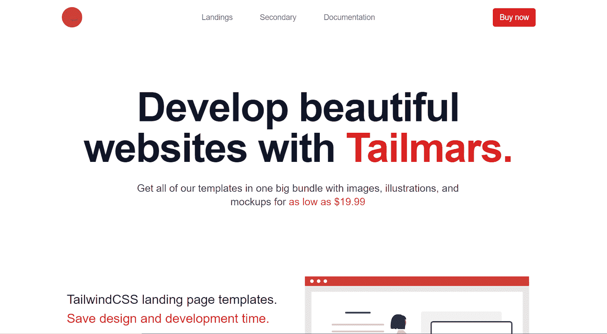
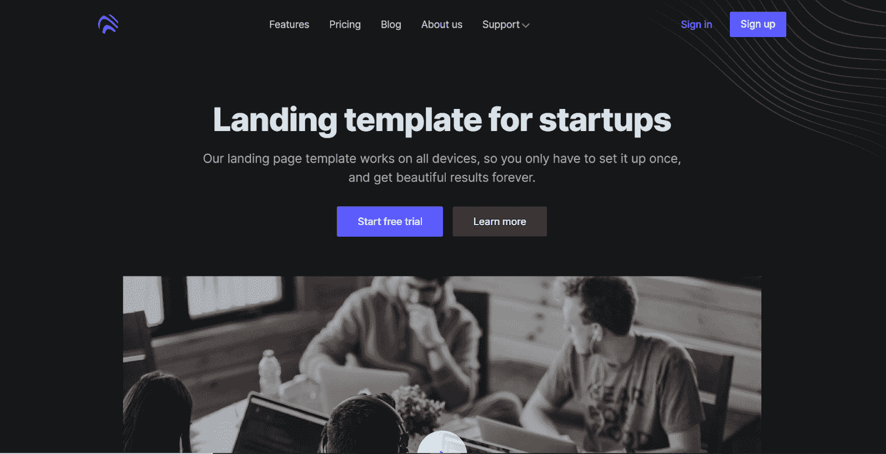
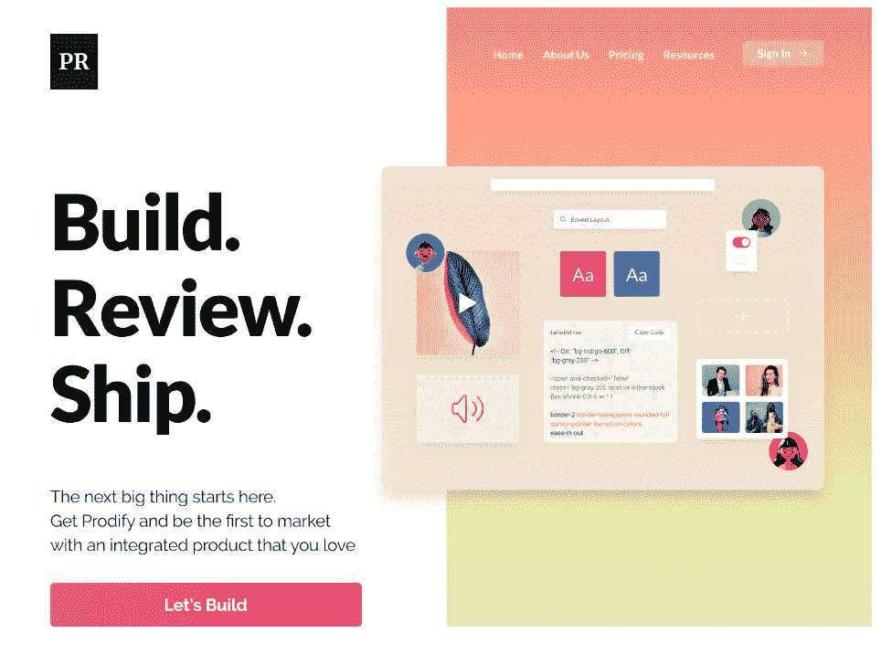
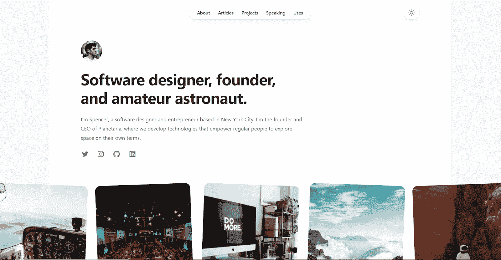
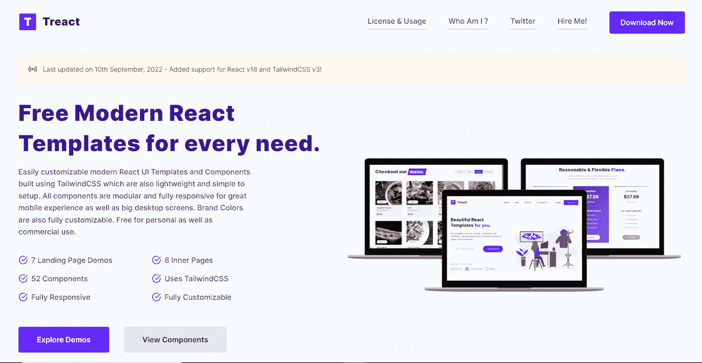
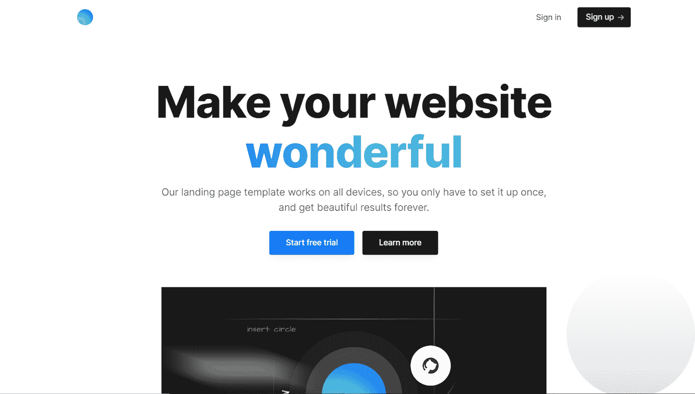
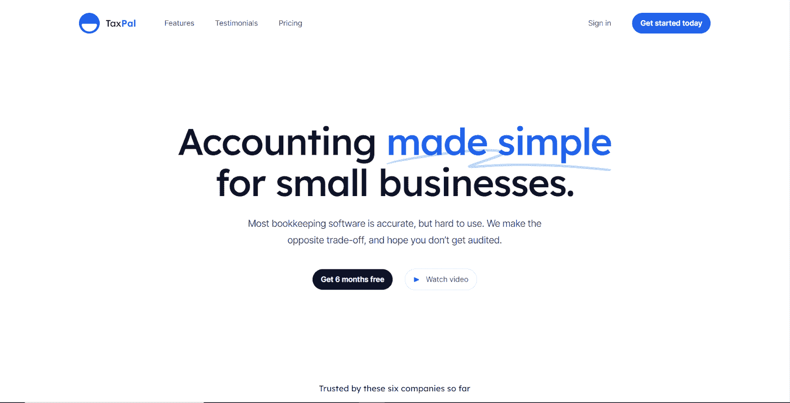
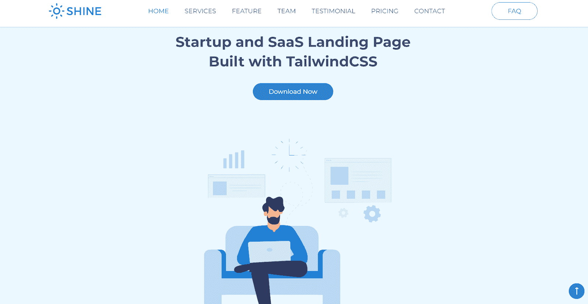

# 为忙碌的开发人员提供的 CSS 登录页面主题

> 原文：<https://www.freecodecamp.org/news/tailwind-css-landing-pages-and-themes-for-busy-developers/>

不同经验水平的开发人员花费数小时在电脑前，试图将 UI 设计者的想法转化为一个功能性的网站或应用程序。

考虑到你正在读这篇文章，这可能是一个与你非常相关的场景。你非常清楚这个过程有多乏味。

除此之外，您还必须编写许多行定制的 CSS 代码。你还必须非常小心，不要犯任何让网站失去吸引力的错误，更糟糕的是，不专业。

Tailwind CSS 的免费和付费资源库使得建立一个看起来专业的网站变得非常容易。你可以做到这一切，而不需要绞尽脑汁，编写数百行定制的 CSS 代码，这些代码甚至可能都不正确。

这篇文章将涵盖八个伟大的模板，你可以用它来建立一个惊人的网站。

## 什么是顺风 CSS，你如何设置它？

如果你是第一次使用 Tailwind CSS，如果你对它是什么和它做什么有点困惑，这是可以理解的。

在这种情况下，值得注意的是，Tailwind CSS 本质上是一个包含大量 CSS 实用程序类的框架。这些可以让你快速建立一个视觉上吸引人的功能性网站。

Bootstrap 和 Materialize 以及其他框架已经帮助解决了几乎所有开发人员都有的 CSS 编码和类命名问题。但是，他们很大程度上是为具有独特风格的高级组件这样做的。

Tailwind CSS 的方法略有不同。具体来说，使用 Bootstrap，您可以使用像 card 类这样的框架。如果没有前面提到的 CSS 框架(普通框架)，您首先必须创建并命名一个元素。然后，根据你想在网站上创建的内容，给这个元素附加不同的属性，包括背景颜色、填充和边框半径。

另一方面，使用 Tailwind，您可以使用实用程序类在您的网站中创建特定的组件。您的实用程序类可能看起来有点像这样:

`
`

此外，您在网站上使用的每个实用程序类都可能因具体情况而异。其中最常见的一个条件是屏幕大小，填充和边距等内容可以根据屏幕的大小自动增加或减少。

Tailwind CSS 可以完美地与不同的框架兼容，包括 React、Next、Angular 等等。[文档](https://tailwindcss.com/docs/installation)涵盖了根据需要进行设置的所有必要步骤。

## 八个顺风 CSS 登陆页面和主题

不管你的产品有多好，或者它解决了多少问题，如果你没有设计好登陆页面，你很可能会很快失去你的访问者。

下面的顺风 CSS 主题和登陆页面可以帮助防止这种情况。

### 1.泰尔马尔斯

[Tailmars](https://www.tailmars.com/) 通过其收集的 Tailwind CSS 资源，提供了价值和可负担性的完美结合。我的团队创造了它，我对此非常兴奋:)

您可以找到多达九个不同的登录页面模板，这些模板是为机构、企业、企业公司甚至移动应用程序而构建的。除此之外，你可以得到二级页面，包括一个关于页面，一个联系页面，以及几乎所有你需要建立一个功能性网站的东西。

这些独特设计和编码的组件可以低至 19.99 美元。通过一次性付款，您可以访问 Tailmars 提供的不断增长的资源库中的所有内容。

### 2.打开专业版

这个登录页面模板展示了一个黑暗的主题和微妙的组件，实际上是现代和美学的尖叫。

鉴于它的其他页面，包括一个定制定价部分， [Open Pro](https://cruip.com/demos/open-pro/) 是完美的，如果你想为你正在开发的 SaaS 工具或技术产品建立一个网站。

这个模板被设计成轻量级和功能性的，并且在 Vue、HTML 和 React 中可用。该模板是高级的，但考虑到其独特的组件、设计和屏幕适应性，它是绝对值得的。

### 3.生产

如果你不是特别喜欢黑暗的主题，你更喜欢一些更乐观的东西，那么 [Prodify](https://tailwinduikit.com/templates/prodify-modern-product-website) 可能正是你想要的。

这个明亮活泼的主题非常适合营销产品或服务，并附带一些其他页面，让您在充分开发产品时更加轻松。

它已经在多种浏览器上测试成功，很容易适应不同的屏幕尺寸。所以，你几乎不需要担心用户体验。只需对代码进行一些修改，使其与您的品牌颜色和色调相匹配，您就可以马上起步了！

### 4.斯潘塞

与榜单上几乎所有其他主题不同的是，[斯潘塞](https://tailwindui.com/templates/spotlight)不是为初创公司打造的。这是一个为自由职业者、企业家和任何提供或实践数字技能的人设计的个人网站模板。默认情况下，它是亮模式，但它有一个暗模式选项，网站用户/访问者可以随意打开和关闭。

斯潘塞有五个单独的网页，所有这些网页都很简洁，并与普通专业人士的需求相关。

因为它是 TailwindUI 工具包的一部分，所以可以一次性购买。或者，您可以购买包含多个主题和有用资源的整个 TailwindUI 工具包。

值得注意的是，TailwindUI 的价格高于 Tailwind CSS 资源。如果在您的预算范围内，购买整个工具包可能是个不错的主意。如果你经常为多个客户承担项目，这将对你特别有益。否则，你可以很容易地考虑其他选择。

### 5.治疗

Treact 本质上是多达八个不同登录页面模板的集合，以满足您的任何需求。餐厅、营销服务、酒店、云存储服务等等都有。考虑到这些都可以用不同的文案和插图进行编辑，可能性几乎是无穷无尽的。

说到插图，有些模板带有定制的插图，可以增加你要建立的网站的美学吸引力。

最好的部分是，开发人员 Owais Khan 没有为了外观而牺牲功能，因为所有模板都完全响应几个内页。

### 6.简单的

很少有登陆页面主题比简单的 T1 更能代表他们的名字。它的设计既专业又直白。虽然它是基于 Tailwind CSS 构建的，但它完全是在 React.js 上编码的，包含了创建 SaaS 登陆页面可能需要的所有基本组件。

登陆页面是免费的，但是你可以选择一个包含多个其他页面的[高级版本](https://cruip.com/simple/)来建立一个完整的网站。

### 7.显著的

作为 TailwindUI 工具包的一部分， [Salient](https://tailwindui.com/templates/salient) 是一个优质的登录页面，如果你正在构建一个相当复杂的 SaaS 产品，它对你来说是完美的。

仅登录页面就有一个推荐部分、常见问题解答、价格表、功能等。这是完美的 SaaS 建筑公式，但当然，你可以随时编辑它，以适应你的目的。

还有一些额外的页面专门用于功能、定价和推荐。像斯潘塞一样，你可以购买这个主题作为一个独立的产品，也可以通过一次性付款在 TailwindUI 工具包中与其他几个一起使用。鉴于其价格，从长远来看，后者可能是更好的选择。

### 8.光亮，光泽；发光，照耀

Shine 是一个面向 SaaS 初创公司和服务提供商的单页登陆页面。它提供了所有必要的元素和部分，无论你在做什么项目，你都需要启动一个简单的单页网站。

它有一个免费的高级版本，包括 500 多个不同的图标来满足你的设计需求。

## 最后的想法

Tailwind CSS 有一个蓬勃发展的开发者社区。因此，您可以选择多种主题、模板和登录页面来满足您的需求。

其中许多都物有所值，所以请随意探索。毕竟，我们提到的八个只是市场上可用选项中的几个。

也就是说，如果你必须得到一个列表之外的，确保它尽可能接近你正在建造的东西的主题。这样，你就不需要在达到目标之前做大量的修改。

此外，一些最好的顺风 CSS 模板是高级的。所以，你需要在开始寻找之前设定一个预算，并且你需要在这个过程中保持灵活性，以防你找到一些物超所值的东西。