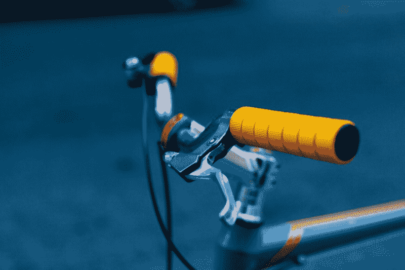

# 花 10 分钟开始使用车把

> 原文：<https://www.freecodecamp.org/news/take-10-minutes-to-get-started-with-handlebars-298632ed82ab/>

用翅膀推动

# 花 10 分钟开始使用车把



Photo by [Dan Gold](https://unsplash.com/photos/_BaWRZMLq8I?utm_source=unsplash&utm_medium=referral&utm_content=creditCopyText) on [Unsplash](https://unsplash.com/search/photos/handlebars?utm_source=unsplash&utm_medium=referral&utm_content=creditCopyText)

如今前端开发不再是构建静态 HTML 标记和编译 SASS 文件。单页应用(SPAs)的兴起意味着我们可以在客户端完成大量的渲染逻辑。现代 web 开发经常需要动态数据输入。

虽然 [React.js](https://reactjs.org/) 很棒，但通常开发人员在将它融入团队之前需要一个学习曲线。最近，我的任务是建立一个课程网站的前端。这标志着我开始探索 [Handlebars.js](https://handlebarsjs.com/) 。

Handlebars 是一个流行而简单的模板引擎，使用简单。它看起来很像普通的 HTML，在花括号{{}}中嵌入了 handlebars 表达式。

```
<div class="entry">   <h1>{{name}}</h1>   <div>{{quote}}</div> </div>
```

在我们继续讨论手柄的细节之前，让我们看看如何通过普通的 Javascript 将数据插入到页面中。我们将以构建一个列出几段引文的网页为例。因为，嘿，每个人都需要一些灵感。

### 普通 javascript

#### **数据检索**

大多数时候，您可能会通过 ajax 检索数据，但是为了简单起见，我们将创建自己的数据对象。

```
// quotes.js var quotes = [   {name: "Frank Lloyd Wright", quote: "You can use an eraser on the drafting table or a sledge hammer on the construction site."},  {name: "Douglas Adams", quote: "The major difference between a thing that might go wrong and a thing that cannot possibly go wrong is that when a thing that cannot possibly go wrong goes wrong it usually turns out to be impossible to get at or repair."},   {name: "Ettore Sottsass", quote: "I try and be as stupid as possible regarding my profession, which means I try to look at as few design magazines as possible."},   {name: "Shaun White", quote: "I’m a big fan of doing what you are really bad at. A lot."} ]
```

#### **创建 HTML 标记**

```
// index.html<div class="container>  <div class="row" id="quotes">  </div></div>
```

#### **用 Javascript 添加数据**

我们将使用一个 *for* 循环来遍历上面的内容。

```
//quotes.jslet quoteMarkup = '';
```

```
for (var i = 0; i < quotes.length; i++) {  let name = quotes[i].name,       quote = quotes[i].quote;
```

```
quoteMarkup += '<div class="col-12 col-sm-6">' +                  '<h5>' + name + '</h5>' +                  '<p>' + quote + '</p>'                 '</div>'}
```

```
document.getElementById('quotes').innerHTML = quoteMarkup;
```

对于这样的代码，阅读起来很困难，编写起来也很乏味。这个页面的 HTML 标记现在位于 index.html 和 quotes.js 中

### 输入把手

#### **入门**

首先，我们需要包含车把源代码文件。你可以在 head 标签里面或者在结尾之前添加链接。

```
&lt;script src="js/handlebars.js">&lt;/script>
```

或者，您也可以从 CDN 链接到车把。

```
<script src="//cdnjs.cloudflare.com/ajax/libs/handlebars.js/4.0.12/handlebars.min.js"></script>
```

#### **创建模板**

我们仍将使用上述文件中引用的数据对象。我们将在 index.html 文件上撒一些把手魔法。

```
//index.html<div class="container>  <div id="quotes">
```

```
<script id="quotes-template" type="text/x-handlebars-template">                  <div class="row">                    {{#each this}}                      <div class="col-12 col-sm-6 p-3">                          <div class="card">                              <h4 class="card-header">                                  {{name}}                              </h4>                              <div class="card-body">                                  {{quote}}                         </div>                          </div>                     </div>                    {{/each}}                </div>            </script>    </div></div>
```

*   *each* :遍历数据
*   *此* : *R* 引用到当前上下文。
*   *text/x-handlebars-template*:告诉浏览器不要像普通 Javascript 一样执行脚本。

#### **编译带把手的模板**

用 Handlebars 编译数据只需要几行。这就是我喜欢它的原因。即使团队中有人以前没有使用过手柄，脚本和标记对他们来说也非常简单，易于理解和掌握。

```
let content = document.getElementById('quotes'),    src = document.getElementById('quotes-template').innerHTML,     template = Handlebars.compile(src),            html = template(quotes);
```

```
content.innerHTML = html;
```

*   *content* :返回要插入编译信息的元素。
*   *src* :检索模板的标记。
*   *Handlebars.compile(src)* :编译正在使用的模板。它将返回一个函数，可以将数据传递给该函数，以便呈现数据。
*   *template(quotes)* :将数据编译成模板。
*   *content.innerHTML* :将上面的内容呈现给 DOM

您可以在此查看[项目。](https://wing-puah.github.io/learn_handlebars/)

### 奖金

我为一个多模板网站使用手柄。我发现自己多次编写相同的 ajax 和 Handlebars 代码。所以，这是我为了让我的生活更简单而创造的两个功能。

#### **用 Javascript 从 ajax 获取数据**

```
function ajaxGet(url, callback) {    let xmlhttp = new XMLHttpRequest();    xmlhttp.onreadystatechange = function() {        if (xmlhttp.readyState == 4 && xmlhttp.status == 200) {            // console.log(xmlhttp.responseText);            try {                var data = JSON.parse(xmlhttp.responseText);            } catch(err) {                console.log(err.message +' Getting: ' + url);                return;            }            callback(data);        }    };
```

```
xmlhttp.open("GET", url, true);    xmlhttp.send();}
```

#### **运行车把的功能**

```
function runHandlebars(id, dataSrc, src) {  if(document.getElementById(id) != null) {    let content = document.getElementById(id);    ajaxGet(dataSrc, function(data){      let source = document.getElementById(src).innerHTML,           template = Handlebars.compile(source);
```

```
content.innerHTML = template(data);    });  }}
```

有了这两个函数，我可以在一个 Javascript 文件上运行我所有的手柄代码。它看起来会像这样。

```
runHandlebars('nav-sub-1', '/data/courses.json', 'nav-submenu-template');
```

```
runHandlebars('contributors', '/data/contributors.json', 'contributors-template');
```

### 结论

我对车把的体验是积极的。在我的项目中，我与 gulp 和 metalsmith 一起使用它。我会将它用于其他项目吗？我的看法是，我更喜欢 React 或 Jekyll 这样成熟的静态站点生成器。但在这种情况下，当团队对 HTML 标记更熟悉，并且它是一个相对简单的网站时，Handlebars 是一个不错的选择。