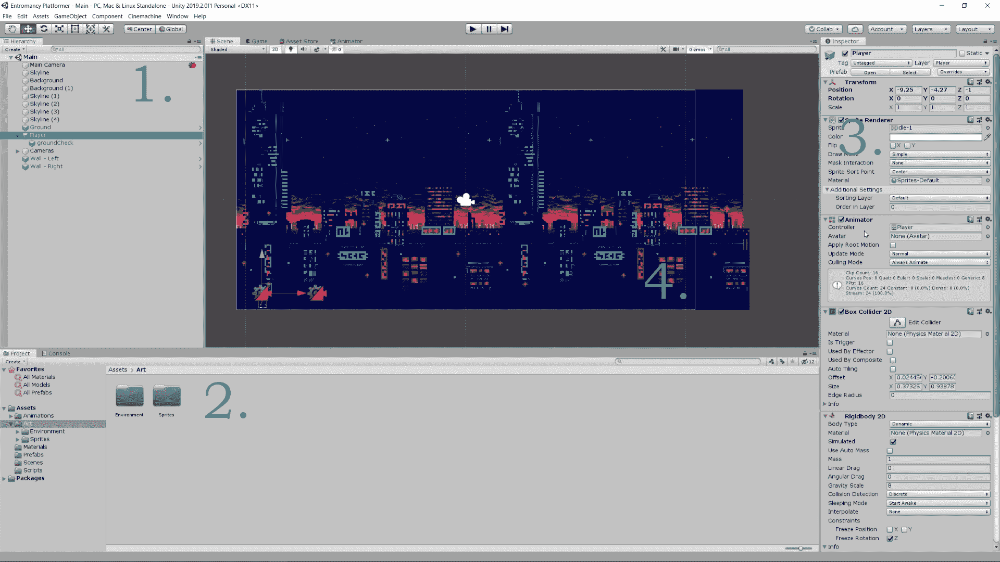
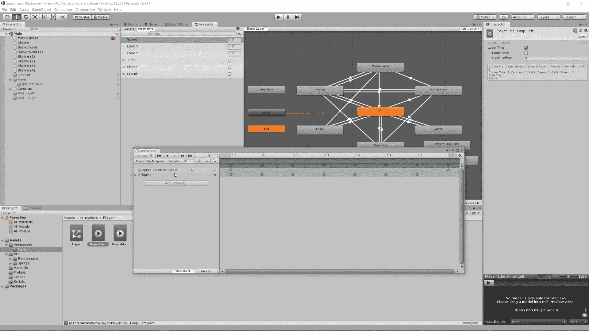
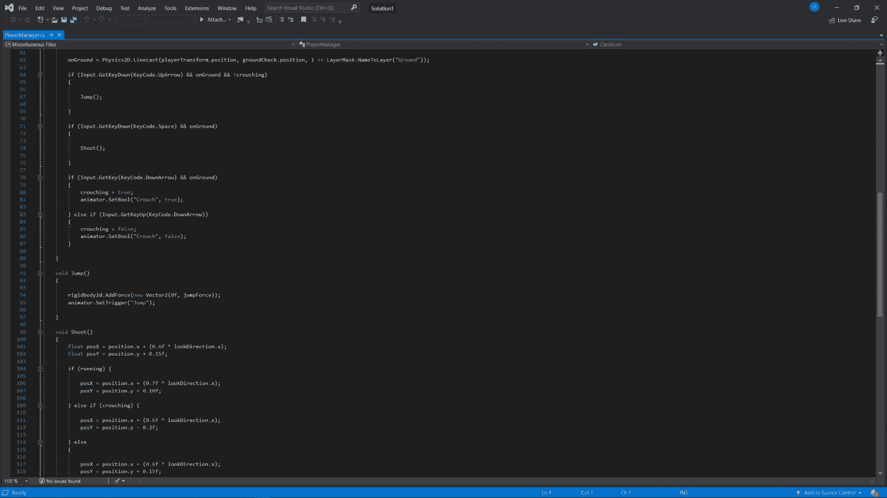
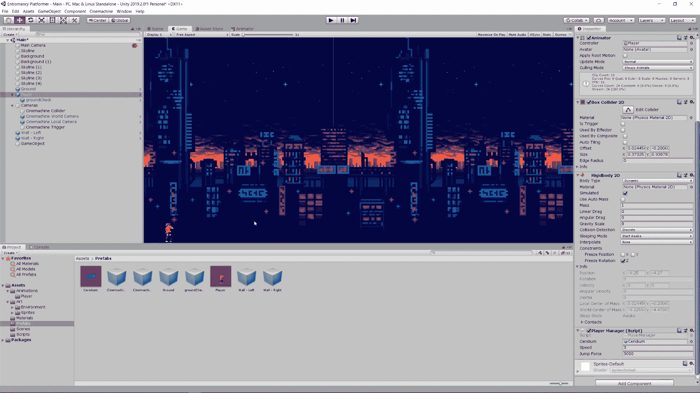

# 通过此概述了解 Unity 2D 和平台基础知识

> 原文：<https://www.freecodecamp.org/news/take-a-tour-of-unity-2d/>

如果你正在选购一款 2D 游戏引擎，你无疑会遇到 Unity。如果你还没有很好地了解所有工具所在的位置，接触 Unity 的编辑器可能会很困难，特别是如果你还是第一次使用 C#编写脚本。

在这篇文章中，我将带你参观 Unity 的 2D 功能，并概述你需要什么工具来创建一个平台或者任何类型的 2D 游戏，以及在编辑器的哪里可以找到它们！

如果你正在考虑其他 2D 游戏引擎的统一，看看这篇文章中的一些选项。

如果你更喜欢 Unity 的视觉之旅，可以看看这个视频(28 分钟观看):

[https://www.youtube.com/embed/w2hxVVnbEFA?feature=oembed](https://www.youtube.com/embed/w2hxVVnbEFA?feature=oembed)

在这个概述中，我们将使用由[安西穆兹](https://assetstore.unity.com/publishers/18720)制作的[扭曲的城市团结资产包](https://assetstore.unity.com/packages/2d/environments/warped-city-assets-pack-138128)。

## 概观

乍一看，如果你使用过另一个“一体化”游戏引擎，Unity 的编辑器会很熟悉，但如果这是你第一次进入游戏开发，它可能会让人不知所措。此外，如果你还没有 C#的工作经验，我*强烈推荐*用[微软的做一些教程。NET](https://dotnet.microsoft.com/learn) 或类似。Unity 有一个相对陡峭的学习曲线，如果你能熟练掌握一些 C#，你会有一个更容易的入门体验。

你的大量时间将花在层级(1)上，这允许你在给定的“场景”中跟踪你的所有游戏对象，这是你游戏的一个特定部分(像你的“开始”菜单或你的 platformer 中的一个特定游戏世界)。有了它，你可以在其他对象下嵌套对象，管理你的相机和画布，并浏览你创建的所有游戏对象。

您将希望在您的项目选项卡(2)中保持有序，该选项卡充当一个文件系统，您可以按照自己认为合适的方式构建它。例如，一个最佳实践是将您的所有资源收集在一个文件夹中，将动画收集在另一个文件夹中，将脚本收集在另一个文件夹中，以此类推。如果你已经指示 Unity 在你指定的情况下记录东西，你也可以点击控制台标签。

当点击一个游戏对象时，无论是在层级还是项目标签中，你都会在检查器(3)中看到更多的细节。这些细节将取决于你点击了什么样的对象，以及你给那个游戏对象附加了什么。例如，如果你已经创建了一个空的游戏对象，那里就不会有太多了。但是，如果您制作了一个附加了精灵的玩家角色，以及一个动画控制器、管理物理的 rigidbody2d、管理碰撞的 collider2d 和管理用户输入和交互性的脚本，所有这些都将出现在检查器中供您修改。

编辑器中的其余部分由场景本身占据(4)，这是您构建游戏世界、添加对象和触发器以及进行游戏设计的地方。您可以点击“游戏”选项卡，查看游戏实际运行时的样子(并点击“播放”按钮进行游戏)，或者从 Unity 客户端的安全位置查看资产商店。

## 哪里可以找到像动画师这样的东西

如果你读过我写的任何关于游戏引擎的文章，你会听到我抱怨 Unity 的 2D 支持被硬塞进 3D 环境，以及找到完成工作所需的工具有多困难。

我们只能说，与其他 2D 游戏引擎相比，有些事情在 Unity 中很难完成，但它们都是可能的。例如，如果你试图访问动画制作程序，你需要选择窗口>动画>动画制作程序，这与你在项目标签中创建和保存动画的位置不同。

同样，如果你想访问物理 2D 设置，无论如何，点击编辑>项目设置，这与你的个人偏好*不同*，位于编辑>偏好下。如果你想修补构建，你会想去文件>构建设置。

类似地，如果你只是想创建一个普通的游戏对象，去游戏对象>创建空的(或者 2D 对象，如果你知道你在找什么)。相反，如果你试图添加一个刚体到一个现有的游戏对象，你需要去组件>物理 2D >刚体 2D(或者当你在层次中选择游戏对象时，点击检查器中的“添加组件”)。

我认为这一点很清楚，找到完成工作所需的东西可能很复杂，因为它们嵌套在不同的菜单中。与其他 2D 游戏引擎相比，一些工具本身，如 animator，显得笨拙，但一旦你掌握了它们的工作原理，你会发现它们非常好用。

## Visual Studio 和 C#脚本

Unity 支持用 C#编写脚本，你可以把它和 Visual Studio 配对，得到一个相对轻松的集成开发环境。

通过编辑器可以很容易地访问脚本，你必须将它们附加到你的游戏对象上，让你的游戏做几乎任何事情。一个有趣的特性是在脚本中声明一个公共变量——比如一个叫做“jumpSpeed”的整数——然后将该脚本附加到检查器中的一个游戏对象上。你会在 Unity 编辑器中看到这个变量，你可以在游戏运行的时候动态地修改它，看看你的修改是如何起作用的。

## 预制构件

最后，Unity 利用他们所谓的“预置”来简化你的工作流程。本质上，一个预置是一种你创建的可重复使用的对象，这样你就可以一次又一次地把它放到你的游戏世界中，而不需要重复定制。

假设您在自上而下的 2D 冒险游戏中创建了一个怪物作为一个空的游戏对象，然后附加一个 sprite、rigidbody2d、collider2d、动画和控制器脚本。你可以将那个怪物拖到你的项目标签中，使它成为一个预置，这允许你在你的游戏世界中一次又一次地使用它，而不必每次都经历整个过程。

Unity 还有几个支持 2D 游戏开发的特性，其中一些我在上面的视频中提到过，如果你考虑在下一个游戏中使用它，看几个关于编辑器特定方面的教程会有帮助。我特别建议在使用编辑器之前先温习一下 C#，因为这样做可以提供一个更温和的学习曲线。

希望这个概述对你接下来的游戏有帮助！

如果你喜欢这篇文章，请考虑[查看我的游戏和书籍](https://www.nightpathpub.com/)，[订阅我的 YouTube 频道](https://www.youtube.com/msfarzan?sub_confirmation=1)，或者[加入 *Entromancy* Discord](https://discord.gg/RF6k3nB) 。

****M. S. Farzan，**** 博士，曾为电子艺界、完美世界娱乐、Modus Games、MMORPG.com 等知名视频游戏公司和编辑网站撰稿和工作，并担任过 ****地下城&龙无冬**** 和 ****质量效应:仙女座**** 等游戏的社区经理。他是****[Entromancy:一款赛博朋克奇幻 RPG](https://www.entromancy.com/rpg)**** 的创意总监兼首席游戏设计师，也是 *[黑夜之路三部曲](http://nightpathpub.com/books)* 的作者。在 Twitter 上找到 m . s . Farzan[@ sominator](http://www.twitter.com/sominator)。