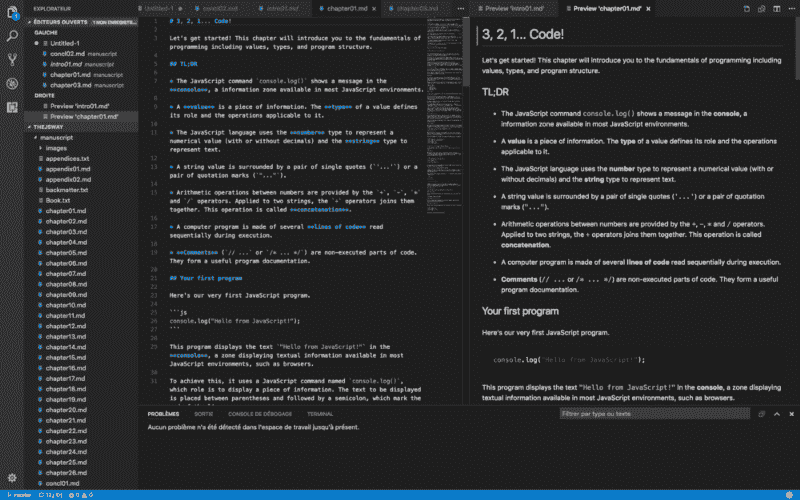
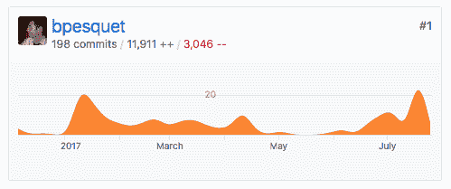
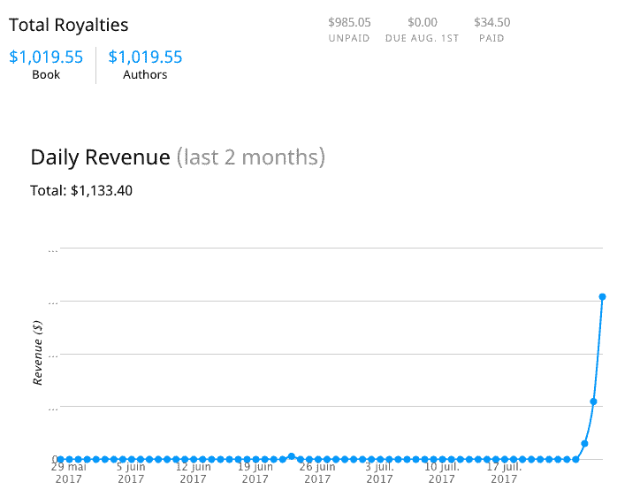

# 如何推出自己的受欢迎且有利可图的开源图书

> 原文：<https://www.freecodecamp.org/news/taking-off-the-successful-launch-of-an-open-source-book-7553a2262898/>

作者:巴蒂斯特·佩斯凯

# 如何推出自己的受欢迎且有利可图的开源图书

A Soyuz rocket launched from the Baikonur cosmodrome in Kazakhstan.

我是《JavaScript 之路》一书的作者，这是一本自我出版的学习编码的开源书籍。尽管缺乏任何初始受众，但在推出期间，它在 GitHub 全球趋势排行榜上名列榜首。

这就是这个意外成功的故事。

### 项目启动

在这个项目的开始，我[解释了](https://medium.com/@bpesquet/walk-this-javascript-way-e9c45ab5b696)我为什么开始这个项目，并回顾了我最初的一些选择。简而言之:

*   需要一本向初学者教授现代 JavaScript 的书。
*   我决定自己出版这本书，并在 GitHub 上公开发表。这样做，我希望能接触到尽可能多的人。此外，利用伟大的[协作模型](https://en.wikipedia.org/wiki/Open-source_model)，这是开源的核心。
*   这本书将会有一个知识共享许可。只要遵守一些规则，它允许任何人分享或建立在我的工作之上。特别是，除了我的目的之外，任何商业目的都是不允许的。

此外，决定中的一些关键因素是:

*   文本仍然是传递知识的重要媒介。所以，选择一本书而不是一些基于视频的材料。
*   我已经写了两个相同主题的在线课程(这里的和那里的)。他们的反馈非常积极，所以我知道我手头有一些相当可靠的内容。
*   我想磨练我的 JavaScript 技能，并且亲身体会到教东西是掌握它的好方法。

我缺少的是最初的观众，这通常被视为这类项目的重要资产。既然总得有人从某个地方开始，我还是继续下去了。

### 选择商业模式

每个创作者都面临着同样的困境。如何与世界分享你的工作，既能产生影响，又能获利？这个古老的问题没有确定的答案。

数字革命让作者的生活发生了天翻地覆的变化。它将分销和共享成本降至零。在我们的“声誉经济”中，内容创作者必须努力获得消费者的关注。作为这个领域的新玩家，如果你的所有内容都在付费墙后面，要想获得成功将会非常困难。其中一些*有*可以免费获得。

对于作者来说，现在最常见的营销策略是把你的作品分成几部分。第一个免费，让潜在客户一瞥你的内容和风格。希望联系上的客户会购买其他部分。

Kyle Simpson 的另类选择因其相当成功的[你不知道 JS](https://github.com/getify/You-Dont-Know-JS) 系列吸引了我。和他一样，我决定免费赠送整本书的内容，但让用户通过电子书版本为更好的阅读体验付费。

以另一本自助出版的畅销书中的[为例，我选择将编码练习和项目直接包含在书中，但将它们的解决方案作为额外内容出售。](https://leanpub.com/rprogramming)

这种“混合”商业模式似乎是开放性和潜在利润之间的合理平衡。

### 培养观众(或不培养观众)

另一个常见的营销建议是通过邮件列表建立一些受众，使用一些现有的内容(例如，你自己的博客)作为磁铁。

我不太喜欢这种方式，也不想用订阅来打扰我的读者。

我也考虑过发起众筹活动。没有任何最初的观众，对我来说，这似乎是一个非常不确定的结果的大量工作，所以我回避它。也许下次吧！

### 工具和流程

创作任何书籍(不仅仅是技术书籍)的最佳文件格式是 T2 纯文本。不需要专门的编辑器。没有互操作性问题。使用[版本控制](https://en.wikipedia.org/wiki/Version_control)系统如 [Git](https://git-scm.com/) 跟踪变更的能力。

在各种基于文本的标记语言中。我选择了 [Markdown](https://en.wikipedia.org/wiki/Markdown) ，因为我已经知道并喜欢它的语法。Markdown 也是 GitHub 上的一等公民，这对这个项目至关重要。

自助出版的作者需要一个工具链来将原始手稿文件转换成各种电子书格式(PDF、EPUB、MOBI)。对我来说， [Leanpub](https://leanpub.com) 平台符合所有的条件:降价支持、与 GitHub 的整合以及公平的版税结构(每笔销售 90%减去 50 美分)。

我使用自由文本编辑器 [Visual Studio 代码](https://code.visualstudio.com/)在我的电脑上创作图书文件。它有很好的现成的降价支持和非常方便的并排文件预览(见下图)。可以安装像[markdownlint](https://marketplace.visualstudio.com/items?itemName=mdickin.markdown-shortcuts)和 [markdownlint](https://marketplace.visualstudio.com/items?itemName=DavidAnson.vscode-markdownlint) 这样的扩展来变得更加高效。

选择好所有工具后，我以之前的课程为基础，起草了书籍大纲(非常重要的第一步)。然后我就一头扎进了写作过程。

### 早期出版

Leanpub 的座右铭是“早出版，常出版”。这个平台让你能够发布作品的早期草稿。接收反馈并创造动力，实现类似于 [MVP](https://en.wikipedia.org/wiki/Minimum_viable_product) 的图书创作方式。

这在理论上是一个很好的想法……不幸的是，对我来说根本不起作用。写作过程开始一个月后，我在 Leanpub 上公开了这本书。那时，电子书的价格是 0 美元，所以任何人都可以免费获得。

我把这件事告诉了我的个人网络，[推特](https://twitter.com/bpesquet/status/836354787616641024)了这件事，提交给了 [Reddit](https://www.reddit.com/r/javascript/comments/5wmw8q/the_javascript_way_a_new_book_for_learning_modern/) 和[黑客新闻](https://news.ycombinator.com/item?id=13749641)。我还联系了其他书籍作者或杰出人士。我还联系了凯尔·辛普森、罗宾·维鲁奇和自由代码营的昆西·拉森，寻求建议和支持。

结果是好坏参半。几个 GitHub 明星，Twitter 和 Reddit 上的几条消息。一个脱离主题并被埋没的 HN 线索。执行力很差，缺乏最初的观众是一个很大的劣势。

大多数评论都是“完成后给我回电话”。人们可能不想投入时间阅读正在进行的书籍，这毕竟是可以理解的。

但是，凯尔、罗宾和昆西的个人反应令人温暖。他们在让我保持动力方面起了很大的作用。我非常感谢他们。

### 写作阶段

即使在这个平淡无奇的早期发布之后，我仍然相信我的书是有价值的。在已经花了几十个小时之后，我不想放弃。使用一个不变的书大纲，我走了一条没有反馈的路线，一直自己写，直到这本书完成。

这是最难的部分。日复一日，花费无数个小时，却只能看到事情慢慢成形。不可避免地，怀疑浮出水面:它怎么可能成功？这一切都是浪费时间吗？为什么我要把这一切强加给自己？

克服这些障碍的关键是**给自己适当的压力**。如果你的时间承诺太稀缺，你就会失去动力，放弃。但是，试图前进得太快，忽略了生活中其他重要的方面，在很多层面上都是危险的。

毕竟，这只是一个附带项目。低风险，低压力！自助出版意味着我没有最后期限，这可能是一件好事，也可能是一件坏事。我试图利用这一点:我可以自由地在我相信的事情上投入时间，但要按照我自己的节奏。

我在工作、个人生活和写作过程之间找到了一个合理的平衡(大约每周 10-15 小时)。有限的长时间危险休息。这篇关于附带项目的文章给出了有用的建议，让事情在这个阶段继续进行。

My commit statistics on GitHub during the writing phase

幸运的是，我有一些现有的材料来建立。有些经历是我自己写的…也是一个非常善解人意的配偶；)

### 发布日

经过八个月的稳定工作和最后几个小时狂热地修改东西，我的书终于准备好了！

像我一样在真空中写作的好处是，你的新书发布会成为一个相当大的事件。在如此巨大的时间投入之后，向世界展示你完成的创作是一种很棒的感觉(也是一种巨大的解脱)。

由于没有更好的选择，我重新使用了之前的发布策略。[推特](https://twitter.com/bpesquet/status/890564975596630017)、 [Reddit](https://www.reddit.com/r/javascript/comments/6poszc/the_javascript_way_a_new_book_for_learning_modern/) 和[黑客新闻](https://news.ycombinator.com/item?id=14865043) ( [定时提交](https://www.quora.com/When-is-the-best-time-to-post-on-Hacker-News-to-get-and-stay-long-on-the-front-page)最具可视性)。此外，在早期发布后让我保持动力的那些好人。

令我惊讶的是，这次的结果是压倒性的积极。凯尔·辛普森和昆西·拉森好心地在推特上向他们成千上万的粉丝推荐这本书。

一个小时又一个小时，我怀着难以置信的敬畏看着大量的评论和转发涌入我的收件箱。我终于知道我的书会有影响。

发布也是开源奇迹发生的幸福时刻。人们可以免费阅读和分享您的图书。无需任何营销努力就能创造吸引力。但是他们也可以通过使用 GitHub [issues](https://guides.github.com/features/issues/) 和 [pull requests](https://help.github.com/articles/about-pull-requests/) 来提高它的质量。

因为我不是英语母语，也没有一个编辑在我身边校对内容。我知道我的书在发布时包含了许多错别字和错误。我希望人们能帮助发现并纠正它们，并没有失望。

以下是发布两天后收集的一些数据:

*   GitHub 上的图书仓库有来自 **17k 个独立访问者**的超过 **51k 次浏览**。大部分流量来自黑客新闻，其次是 Reddit。
*   它获得了超过 2400 颗星，并成为全球一天内**排名第一的回购**。
*   黑客新闻报道在头版攀升至第五名，产生了一百多条评论。
*   读者提交了 **30 个拉请求**，纠正了这本书最初的许多错误。大部分是小错别字，但也有语法上的改进，甚至还有一些编码错误。
*   我已经收到了两个翻译请求，分别是西班牙语和中文。

总之，远远超过了我的梦想。

### 财务结果

开源的书到底能不能盈利？当然，现在下结论还为时过早。发布两天后，它成为 Leanpub 的本周最畅销书籍，版税超过 1000 美元。

Leanpub royalties dashboard two days after launch

盈利并不是这个项目启动的首要原因。然而，免费资源和付费电子书/修改的混合定价模式，最终将有助于该书的声誉，同时带来一些受欢迎的被动收入。

稍后，如果有任何需求，我可能会创作这本书的平装本(可能是亚马逊的创作空间)。提供更丰富用户体验的互动在线课程已经在进行中。

最重要的是，我对自己为社区做出的有意义的贡献深感满意。世界上成千上万的人将使用我的书来学习编码，提高 JavaScript，这可能会让他们的生活变得更好。

这是无价的。

### 结论

这并非一帆风顺，但是在没有任何读者的情况下自行出版一本成功的开源书籍绝对是可能的。

我希望这个小故事能让你开心。我也希望它能激励你自己开始一个创造性的项目，无论是一本书还是完全不同的东西。

我期待看到你会取得什么成就！