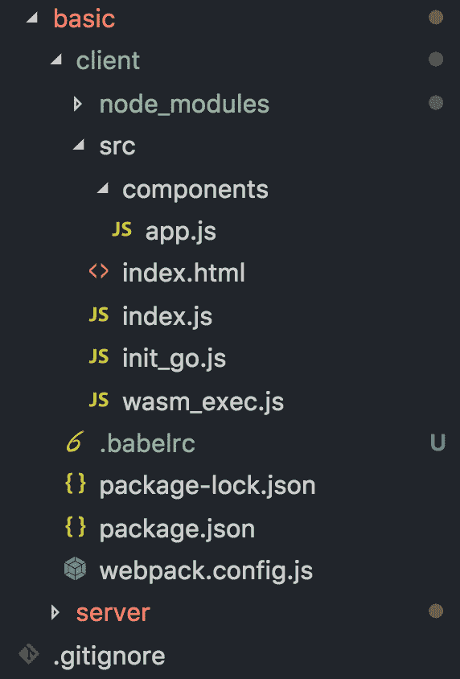
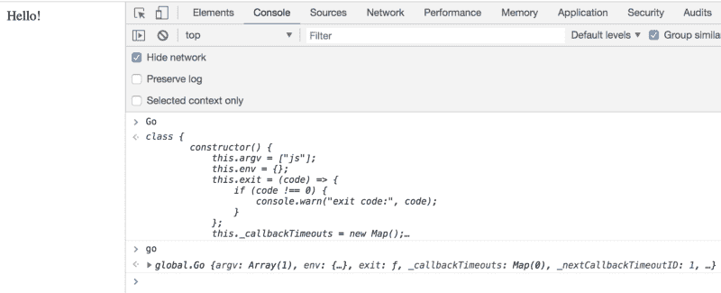
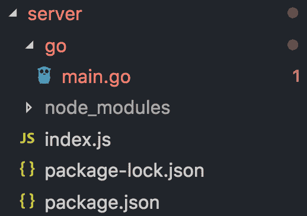
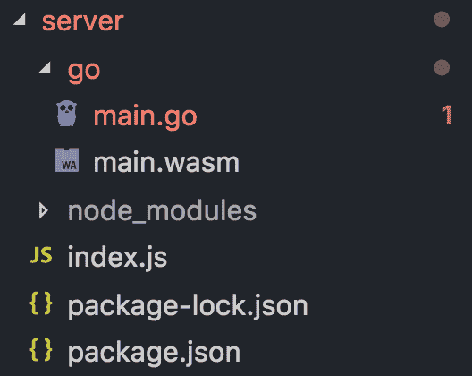
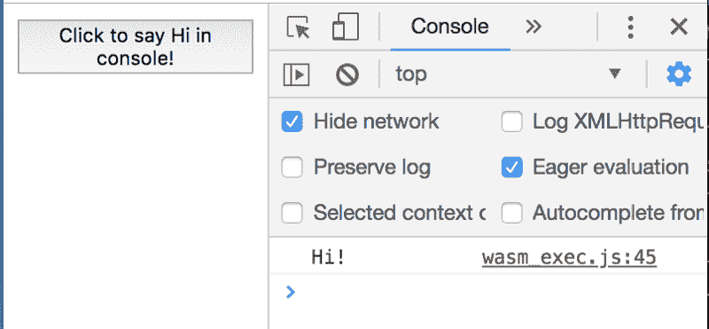

# 如何用 WebAssembly 起飞，以便投入使用

> 原文：<https://www.freecodecamp.org/news/taking-off-with-webassembly-for-go-in-react-7c099bd907fa/>

作者克里斯·查克

# 如何用 WebAssembly 起飞，以便投入使用


有了 Go 版本 1.11，我们现在得到了一个实验版本的 [WebAssembly](https://webassembly.org/) 。如果你不知道什么是 WebAssembly，不要着急。简而言之，WebAssembly 旨在将高性能、类似汇编的代码引入浏览器。这使得开发者可以在浏览器中执行更多计算密集型任务，无论是玩[游戏](https://webassembly.org/demo/Tanks/)还是制作一些超级酷的[动画](https://demos.alanmacleod.eu/wasm-render/pub/)。

因此，我将向您展示如何将基于 Go 的 WebAssembly 添加到 React 应用程序中！本指南假设您对 Webpack、Babel 和 React 有所了解。如果你是这些技术的新手，我强烈推荐你去看看这个教程。

本教程将向您展示如何创建一个利用 WebAssembly for Go 的基本 React 应用程序。在不久的将来，我将向您展示如何构建一个计算机 100%不可战胜的井字游戏，我们将使用 WebAssembly 来支持 minimax 算法(别担心，这听起来比实际困难！) ?

这部分(和未来部分)的代码将在 Github [这里](https://floooh.github.io/oryol/asmjs/InfiniteSpheres.html)上。

#### 先决条件和初始设置

确保安装了 Go 1.11(最低)和 Node.js。

我使用的是 Chrome 版本 69，所有当前版本的 Edge、Firefox 和 Safari 都支持 WebAssembly [。但是，本教程的结果可能会因版本/浏览器而异。](https://caniuse.com/#feat=wasm)

直接跳进去，创建一个文件夹并`cd`进去。

在该文件夹中创建一个`client`和一个`server`文件夹。

#### React 应用程序

让我们从构建 React 应用程序开始。它只不过是一个普通的客户端渲染应用程序，增加了一些额外的功能！

首先将`cd`放入`client`文件夹，运行`npm init -y`来初始化你的`package.json`。

之后，运行以下命令:

```
npm install --save react react-dom && npm install --save-dev @babel/core @babel/plugin-proposal-class-properties @babel/plugin-proposal-decorators @babel/plugin-syntax-dynamic-import @babel/polyfill @babel/preset-env @babel/preset-react add-asset-html-webpack-plugin babel-loader html-webpack-plugin webpack webpack-cli webpack-dev-server
```

完成后，将`package.json`的`scripts`部分更改为以下内容:

```
"scripts": {  "dev": "webpack-dev-server --mode development",  "build": "webpack --mode production"},
```

接下来，在客户端文件夹中，创建两个文件，一个`.babelrc`和一个`webpack.config.js`。

在`.babelrc`中粘贴以下内容:

```
{  "presets": [ ["@babel/preset-env", { "modules": false } ],  "@babel/preset-react"],  "plugins": [    "@babel/plugin-proposal-class-properties",    ["@babel/plugin-proposal-decorators", { "legacy": true }],    "@babel/plugin-syntax-dynamic-import"  ]}
```

并在`webpack.config.js`中粘贴以下内容:

注意`AddAssetHtmlPlugin`，我们用它通过脚本标签将`wasm_exec.js`文件和`init_go.js`文件注入到我们的应用程序中。这些文件必须按顺序显示，这样`wasm_exec.js`文件才能在`init_go.js`文件之前运行。`wasm_exec.js`只是在浏览器上设置 Go 的运行时，而`init_go.js`文件给了我们一个全局的、可工作的 Go 对象实例。但稍后会有更多关于这些文件的内容。

现在创建一个`src`文件夹，并添加一个`index.js`文件、`index.html`文件、`init_go.js`文件、`wasm_exec.js`文件和一个包含`app.js`文件的`components`文件夹。您的目录应该如下所示:



从这里开始，将它添加到您的`index.html`:

在`index.js`中添加以下内容:

在您的`components/app.js`文件中添加以下内容:

现在我们有了一个非常基本的 React 应用程序！

#### **客户端上的 web assembly**

在`wasm_exec.js`文件中，将[中的代码粘贴到这里的](https://github.com/golang/go/blob/master/misc/wasm/wasm_exec.js)(为简洁起见省略)。

就像我们之前说的，这只是在客户端实例化了 Go 的基本运行时。它提供了一个全局`Go`构造函数，我们稍后会用到。

接下来，我们需要对那个`Go`对象做一些实际的事情。因此，在您的`init_go.js`文件中，添加以下内容:

这只是从我们之前制作的`Go`构造函数中创建一个新的`go`对象，并将其绑定到全局状态。

继续运行`npm run dev`并在浏览器中导航到`localhost:8080`，您应该会看到“Hello！”在你的网页上。不是很有趣对吗？但是你没有看到的是，我们已经注入了我们的全局`go`对象！



现在将您的`components/app.js`文件改为如下:

我们改变了什么？让我们从简单的东西开始。首先，我们为 state 添加了一个`isLoading`属性。这是为了让我们知道 WebAssembly 仍在加载。在`render`函数中，我们使用 state 中的`isLoading`属性有条件地呈现一个表示“正在加载”的`div`或一个`button`。

你可能会问自己，“那个按钮有一个带功能`sayHi`的`onClick`，但是我在任何地方都没有看到一个`sayHi`功能。”这就是 WebAssembly 的用武之地。当我们编写 Go 代码时，我们将定义该函数并将其绑定到全局状态。这就是为什么我们必须等待 WebAssembly 加载，然后才能呈现按钮。但我们稍后会填补这些空白。

查看`componentDidMount`函数，您可以看到我们正在调用`WebAssembly.instantiateStreaming`，这是加载 WebAssembly 代码的[最佳方式。它将返回一个`wasm`文件和一个`importObject`的承诺作为其参数。它返回已编译的 WebAssembly 模块。该承诺是对我们的 API 的获取请求(接下来我们将构建它！)并且该端点只返回一个`wasm`文件。在我们得到模块后，我们使用`go`来运行它，然后我们将`isLoading`设置为`false`。](https://developer.mozilla.org/en-US/docs/Web/JavaScript/Reference/Global_Objects/WebAssembly/instantiateStreaming)

但是当然，因为我们没有任何关于`localhost:3000`的东西，这个会被打破。

### 服务器

现在我们需要设置服务器来服务我们的`wasm`文件。首先，打开一个新的终端，将`cd`放入你之前创建的`server`文件夹，并运行`npm init -y`来初始化你的`package.json`。

接下来，让我们安装一些软件包。运行以下命令:

```
npm install --save compression cors express && npm install --save-dev nodemon
```

将`package.json`的`scripts`部分改为:

```
"scripts": {  "dev": "nodemon index.js"},
```

现在在`server`目录下，创建一个`index.js`文件和一个`go`文件夹。在`go`文件夹中，创建一个`main.go`文件。

您的文件夹应该如下所示:



在`index.js`中粘贴以下内容:

这只是一个简单的 express 服务器，它从`go`文件夹中提供一个`wasm`文件。让我们现在就开始吧！

#### **服务器上的 web 程序集**

在你的`main.go`文件中加上这个(非常感谢 TutoiralEdge 的[教程](https://tutorialedge.net/golang/go-webassembly-tutorial/)):

我们来分析一下。首先，我们需要导入用于基本打印的`fmt`和`syscall/js`，这样我们就可以使用 Go 的所有新 [JavaScript 好东西](https://tip.golang.org/pkg/syscall/js/?GOOS=js&GOARCH=wasm)。接下来我们将创建带有参数`args []js.Value`的`sayHi`函数，尽管我们不会传入任何参数。这个函数所做的就是打印“嗨！”

在`registerCallbacks`函数中，我们将函数绑定到浏览器中的全局状态。现在，当我们调用`js.Global().Set`函数时，我们首先将全局变量命名为“sayHi ”,然后通过将它包装在`js.NewCallback`函数中，将它与上面的`sayHi`函数配对。

最后，在我们的`main`函数中，我们打开一个通道并运行`registerCallbacks`。通道只是暂停我们的 Go 代码，这样它就不会完成执行。

现在剩下的就是将这段 Go 代码编译成 WebAssembly。

`cd`到`go`文件夹，并运行以下程序:

```
GOOS=js GOARCH=wasm go build -o main.wasm
```

注意，我们的`GOOS`被设置为`js`，我们的`GOARCH`被设置为`wasm`。这意味着我们的目标操作系统是`js`，编译架构是`wasm`。

您的文件夹结构现在应该是这样的:



如您所见，现在我们有了一个可以服务的`main.wasm`文件。

`cd`回到`server`文件夹，运行`npm run dev`。

您的服务器现在应该在`localhost:3000`上运行。回到浏览器中的`localhost:8080`(假设您的客户端仍在运行)并刷新它。加载后，打开控制台并单击按钮。它应该打印“嗨！”在控制台里。



It works!

正如你可能看到的，在我们的按钮出现之前，它会说“正在加载”。这是我们使用 WebAssembly 产生的[开销](https://medium.com/@mbebenita/webassembly-is-30x-faster-than-javascript-c71ea54d2f96)。然而，在这个初始负载之后，我们可以享受低水平、高性能的荣耀。

要杀死客户端和服务器，只需在您的终端上按`ctrl + c`。

### 结论

感谢您的阅读，希望您喜欢和我一起学习 WebAssembly。虽然这是 React 中 WebAssembly 的一个非常基本的实现，但在本系列的下一部分，我们将制作一个在井字游戏中无与伦比的 AI 代理。如果你对此感兴趣，请继续关注！

如果你有任何意见或问题，请在下面留下。

再次感谢您的阅读！求分享，滴个？(*一二)，快乐编码。*

在 [LinkedIn](https://www.linkedin.com/in/the-chris-chuck/) 上加我！