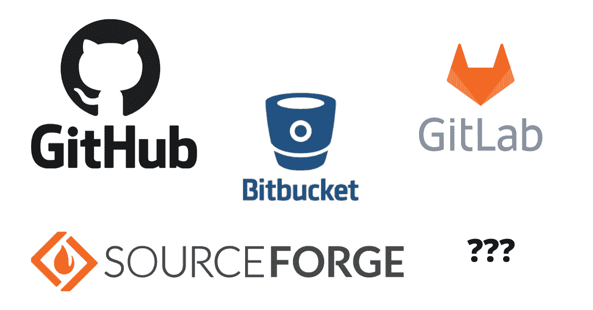
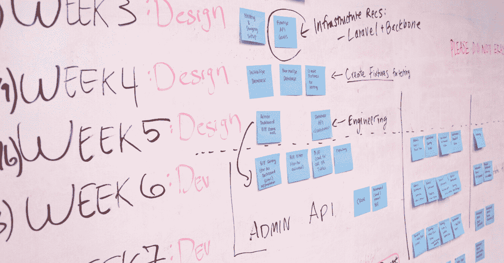

# 遗留代码技巧——如何接管现有项目及其代码库

> 原文：<https://www.freecodecamp.org/news/taking-over-an-existing-project/>

作为一名开发人员，意味着你需要知道如何深入现有的代码库。当你继承一个项目时，有很多细节你不知道，比如为什么一些代码以某种方式编写。

因此，当要参加移交会议时，你需要知道要问什么问题。这是您获取启动和运行所需信息的最佳时机。

这些问题在每个项目中都会出现。你可能开始了一份新工作，或者在你目前的公司从事一个不同的项目。不管怎样，这里有几件事你应该在调动会议上提出来。

## 知道它应该做什么吗


这个应用到底是用来做什么的，谁在用？没有这个环境，就很难弄清楚如何实现新功能或修复错误。

询问 app 的整体使用情况。了解应用程序不同部分的工作流程以及用户如何在其中移动。如果有一个任务清单，就去完成或了解清单上每一项的更多细节。

这是每个人都准备好集中回答有关该项目的问题的罕见时刻之一。因此，如果有任何你不清楚的事情，不要在没有更好地理解之前离开会议。

当然，一旦你开始钻研，事情就会出现，但这是你先发制人解决一大块困惑的机会。在深入具体问题之前，试着对应用程序有一个高度的了解。了解应用所处的行业也有助于回答你开发过程中出现的问题。

## 了解源代码管理是如何处理的



虽然大多数项目都使用 Git，但并不是每个人都使用 GitHub。有些项目可以托管在 BitBucket、Azure DevOps 甚至 SVN 上。您需要知道代码保存在版本控制中的什么地方，这样您就可以将它下载到您的机器上，并且当那些不可避免的产品错误出现时，您还可以进行故障排除。

请确保您有权访问代码库，并且您拥有完成所需工作的适当权限级别。当您收到登录凭据时，请立即检查它们。

你越早发现这样的小问题，项目从长远来看就越顺利。修复一个小错误，并进行快速提交，以确保您可以将本地分支推到远程存储库所在的位置。

此外，快速查看一下可以访问存储库的每个人。当需要拉取请求和代码审查时，这将是有用的信息。这也是确保只有必要的人才能访问代码的时候。

记下任何您不熟悉的用户，并向项目经理或其他人咨询，看他们是否仍然需要访问。

## 知道如何运行项目


承担一个新项目最困难的部分是第一次在你的机器上设置和运行它。如果没有很好地记录该过程，有许多一次性命令可能会丢失。

您需要检查的一些可能不明显的东西包括您的 env 变量、您正在运行的软件的版本以及您正在引用的文件名。

其他可能发生的事情是建立一个新的本地数据库，加载种子数据，更改 API 或数据库的任何连接字符串。

```
REACT_APP_NAME="Boogaloo"
REACT_APP_API="https://not-staging.morwl.com/api"
API_KEY=ij2i0r9j02tt904tn93
```

Example .env file for a React project

如果您在安装过程中发现自己遇到了问题，请确保您记录了这些问题，以便下一个开发人员更容易完成。另外，你永远不知道什么时候你会需要工厂重置你的电脑，这些笔记会派上用场。

一旦你运行了应用程序，检查所有的功能，就像在开发或生产中一样。您应该在所有环境中看到相同的行为，直到人们开始推动改变。

## 了解测试流程


你的应用可以通过许多不同形式的测试，你需要知道这个过程是如何进行的。在某种程度上，单元测试在大多数项目中都很常见，所以要经常检查。一些公司进行集成测试，以确保没有破坏性的变化潜入构建或部署管道。

其他地方甚至有专门的软件测试人员，他们将在用户场景中运行，看看当真正的用户看到更新时，事情将如何工作。你需要知道你的应用程序将要经历的所有步骤。

当你开始这个新项目时，看看测试可以让你很好地了解应用程序是如何工作的。如果项目中没有任何测试，那么这是您开始添加它们的机会。拥有一些代码覆盖率为未来的应用程序定下了基调，即随着代码的开发，可能会添加更多的测试。

```
import React from 'react';
import ReactDOM from 'react-dom';
import { configure, shallow } from 'enzyme';
import Adapter from 'enzyme-adapter-react-16';
import Items from '../src/components/Items';
import CreateItemModal from '../src/components/CreateItemModal';

configure({ adapter: new Adapter() });
jest.mock('../__mocks__/getAllItemsMockRequest.js');

describe('Items component works', () => {
    it('Items renders without crashing', () => {
        const div = document.createElement('div');
        ReactDOM.render(<Items />, div);
        ReactDOM.unmountComponentAtNode(div);
    });

    it('should toggle CreateItemModal', () => {
        const div = document.createElement('div');
        const ItemComponent = shallow(<Items />, div);
        ItemComponent.find('#add-item-icon').simulate('click');
        expect(ItemComponent.contains(<CreateItemModal />)).toBe(true);
        ReactDOM.unmountComponentAtNode(div);
    });
});
```

Example of tests written for a React project

与软件测试人员一起工作通常是一个更复杂的过程。通常有一些类似吉拉或 Basecamp 的系统，在那里可以通过 sprints 讨论和跟踪 bug 和特性。遵循他们现有的流程，这将有助于您的代码更快、更一致地进入部署阶段。

## 了解部署流程


尽管云服务几乎已经满足了大多数公司的托管需求，但您可能仍然需要使用物理服务器。拥有这些信息将有助于您理解将要使用的部署策略。

是否有一个连续的构建/部署流程，或者您是否需要从您的机器上进行手动部署？了解如何在不同的环境中处理迁移。为这个特定的应用程序弄清楚部署应用程序的所有常见部分。

云服务中会发生一些只有以前负责部署的人才知道的不可靠的事情，所以一定要问一下是否有什么奇怪的行为需要注意。既然您已经修复了一个小的 bug 来检查您是否可以推进您的更改，那么继续将这个小的修复部署到开发环境中。

```
version: 2
jobs:
  build:
    docker:
      - image: circleci/<language>:<version TAG>
    steps:
      - checkout
      - run: <command>
  test:
    docker:
      - image: circleci/<language>:<version TAG>
    steps:
      - checkout
      - run: <command>
workflows:
  version: 2
  build_and_test:
    jobs:
      - build
      - test
```

Example config file for CI/CD in CircleCI

这是您的测试，看看您是否真正理解部署将如何工作。希望您不必进行许多手动部署，并且您将使用 CI/CD 管道，因此该过程将保持一致。

## 知道项目的不同部分可以向谁求助


除非您负责从前端到数据库的整个应用程序，否则可能会有其他人负责您从未接触过的部分代码或系统。知道这些人是谁很重要，这样你就知道向谁提问。

此外，这也是一个很好的方式去了解参与这个项目的其他团队，并了解他们在做什么。如果只是你在一个项目的每个部分工作，确保你得到了你能得到的每一个登录凭证，因为它将由你来回答所有的问题。

## 了解项目使用哪些第三方服务


当您开始调试问题时，知道到哪里去找文档是解决问题的最快方法。这意味着知道应用程序使用什么服务以及它们在哪里被使用。找到这个问题的一个方法是检查项目的 *package.json* 或 *App.config* 文件，看看安装了什么。

```
{
    "name": "dog-finder",
    "version": "0.1.0",
    "scripts": {
        "build": "npm install",
        "start": "npm run build && concurrently --kill-others \"node ./server.js\" \"http-server\""
    },
    "dependencies": {
        "concurrently": "^5.1.0",
        "cors": "^2.8.5",
        "express": "^4.17.1",
        "johnny-five": "^1.4.0",
        "path": "^0.12.7"
    }
} 
```

这将帮助你解决生产中出现的许多问题，并帮助你提出更好的问题。对于大多数服务，您还需要凭证，这样当您第一次尝试运行项目时，可能会出现凭证。

尽早查看第三方服务的几大优势是了解任何版本兼容性更改和任何已知问题。

你在老项目中遇到的一个常见抱怨是，应用程序不能像以前那样工作，没有人知道为什么。在您准备接手时，查看这些服务是一个快速而简单的起点。

## 知道与决策者联系的最佳方式


即使你接管了项目的初级开发，仍然会有像项目经理这样的人来指导你的工作。一旦你得到项目启动的许可，就获取他们的联系信息。这是能够回答你的高层次问题的人之一。

如果你在一家小公司工作，最好能有 CEO 或 CTO 这样的人的联系方式，因为他们可以直接回答你的许多问题。

例如，如果你研究了一种新的数据库服务，它将减少 10%的费用，并提高应用程序的整体性能，你想知道你是否能做出这些改变。

了解哪些人可以对你的下一步行动给予认可或指导，然后保存他们的电子邮件和电话号码。

这一点尤其重要的一个例子是生产过程中发生火灾。当你能立即得到这些快速的决定时，这能为公司节省数千美元，所以如果你打电话给他们，他们会理解的。

## 知道你的时间表是什么



有时候太容易被细微的细节所缠绕，以至于当时间线被抛出时，同意是有意义的。

在你完全投入到任何长度的工作之前，确保你已经对你被要求用你所提供的资源做什么做了适当的评估。做一个快速的代码扫描，了解你将使用什么，看看人们需要多长时间来回应你最初的问题。

这样，当给你一个截止日期时，你可以解释为什么它对于被要求的工作量是合理的或不合理的。你总是想给出现实的估计，这样你的客户或项目经理就不会让别人抱有过高的期望。最好提前告诉他们某件事是否会花费更长的时间或者没有他们预期的那么长。

当你有合理的期望时，它会使整个项目对每个人都更好。没有那么多惊慌失措的编码会议，你能够交付高质量的代码，而不必在生产中进行调试。

## 了解你的工作范围


随着你的进步，项目的范围会慢慢扩大。你开始得到一些关于应该做的“小调整”的反馈。然后，这就变成了一个什么优先于什么的问题，而且这不是你开始的原创作品。

防止范围蔓延的一种方法是就需要实现的一组任务或特定功能达成一致。其他任何事情都可以写下来，并在项目工作的另一部分提出来，但不是现在。

一旦工作达成一致，那么应该有一个明确的完成状态，表明项目将在最后完成。

## 最后的想法

接管一个现有的项目是一项特殊的技能，因为它不是你一直在做的事情。有些人在职业生涯的大部分时间里都在做一个产品或产品线，所以建立新项目只是偶尔发生。

尽管如果你曾经做过咨询或自由职业者，你需要知道如何自信地定期这样做。通常会有一些小的配置变化需要你去解决，一旦你设置好了，你就再也不用担心它们了。

这些只是我在建立一个新项目时试图检查的几件事。其中一些技巧也适用于开源项目。你有没有什么东西是你在准备的时候经常检查的？

* * *

我也写一些其他科技方面的东西，比如空气吉他和虚拟现实。你应该在推特上关注我，了解那些很酷的东西。