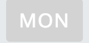

# 一个 C++开发人员如何学习 JavaScript:一个令人沮丧但最终令人满意的故事

> 原文：<https://www.freecodecamp.org/news/tales-of-a-c-developer-learning-javascript-96b0a3324d25/>

作者:达拉·多希

# 一个 C++开发人员如何学习 JavaScript:一个令人沮丧但最终令人满意的故事


When self-doubt strikes in the face of a stubborn bug!

今年，我开始了我的 Web 开发之旅。正如网络上无数的文章所宣称的:JavaScript 是圣杯。

因此，我开始了我的旅程，进入这个新的堆栈，新的领域，和一个全新的水平。

所以，在一天当中，在我实现一个功能的过程中，我几乎到了想拔毛的阶段。我的挫败感没有止境，我的冒名顶替综合症空前高涨。

在我告诉你更多关于什么事情差点让我发疯之前，让我先介绍一下我自己的背景。

我基本上刚刚开始接触 JavaScript 的皮毛，并且上过一些 FreeCodeCamp 课程(并且对昆西·拉森的成就感到惊讶)。自从 10 多年前我作为一名计算机科学毕业生开始我的旅程以来，我从未见过以如此结构化的方式教授编码。

我从 2018 年 2 月开始 JavaScript 开发(在我用 edX 上了一门关于 JavaScript & JQuery 的课程，名为[用 JavaScript](https://courses.edx.org/courses/course-v1:PennX+SD4x+2T2017/courseware/05f321f8b38c400b96330598e23d639c/66cdc9f1359c44e698177abcd5ab480e/?activate_block_id=block-v1:PennX+SD4x+2T2017+type@sequential+block@66cdc9f1359c44e698177abcd5ab480e) 为 Web 编程之后)。这意味着我已经做了五个月了。奇怪的是，我现在而不是几个月前在这个问题上卡住了，这让我感到愤怒，但开发者在这样的事情上几乎没有选择。每次你都得吞下你的自负。还有学习！

你想知道是什么特定的 JavaScript 问题让我问了我生活中所有的存在主义问题吗？

### 周一先生的插图故事，按钮。

这是一个按钮的故事:


Meet Mr. Monday (a button )

舒克先生的人格可以定义为:

```
<button type=”button” class=”btn btn-sm btn-success” id=”<mon-week-day”>MON</button>
```

但是星期一先生并不像我们希望的那样有创意。他是以一个模板为基础的，他真实人格的来源是这样的:

```
<button type=”button” class=”btn btn-sm btn-success” id=”<%=day%>-week-day”>day.substr(0, 3).toUpperCase()</button>
```

```
where day is the days of the week: monday, tuesday, wednesday etc.
```

声明:代码为 t；是 EJS。

在某些情况下，我想给周一先生的个性一点灰色。



Doesn’t he look gorgeous ? :P

但是星期一先生就是不知道怎么找乐子。唉！他不会变成灰色的！

### 我是如何让周一先生发挥出最佳水平的

我对他说，让我们这样做吧，所以让我来培养你，为你的形象增加档次。

```
$('#'+day+'week-day').addClass('unselected')
```

他没有让步。我将 addClass 改为 toggleClass，但仍然没有任何反应。我认为他并不热衷于“未被选中”，尽管我向他解释了为什么这是必要的。

然后我拿出了大枪，控制台。我试图改变他。控制台让人对舒克先生转弯的能力产生了怀疑。

它会说它改变了颜色，但我仍然会看到一个非常绿色的星期一先生。这里发生了什么？我的夏洛克思维拯救了我，瞧，我意识到了人类编程史上最大的错误(或者至少在我看来是有史以来最大的错误)。

还有一个元素和周一先生的 id 一样。这就是为什么他不肯让步，所有的改变可能都是针对其他人的。我必须说，这是一个严重的身份危机案例！

这是怎么发生的？嗯，你听说过“厨子多了烧坏汤”这句话吗事情是这样的:两三个人以前处理过同一个文件，不知何故，这个新的 id 与他们以前用于某个元素的 id 相匹配。唷，这对我来说是如此重要的一课。

所有元素都应该有唯一的 id。

反正我换了周一先生的 id，又试了一次。

```
<button type=”button” class=”btn btn-sm btn-success” id=”<monday-hours-day”>MON</button>
```

```
$('#'+day+'hours-day').addClass('unselected')
```

尽管如此，周一先生不会变成灰色。

### 弥补有史以来最大的错误

在谷歌搜索了几个小时后，我想知道这是否真的是我余生想要做的事情(眼珠子几乎要跳出眼眶，试图找到让周一先生变成灰色的方法)，我找到了问题所在。

我知道你很想知道。我保证当你知道的时候，你会恨我犯了人类历史上最愚蠢的错误。

问题是，当添加未选择的类时，我在小时之前的 id 中遗漏了一个'-'(连字符)。

```
$('#'+day+'hours-day').addClass('unselected')//is clearly wrong.
```

```
$('#'+day+'-hours-day').addClass('unselected') //is the perfect code ever
```

周一先生终于变灰了！这给了我巨大的快乐，那天我睡得像只小狗！是的，就像这张照片上的一样。


Photo by [Adam Grabek](https://unsplash.com/photos/JCXANpeR2XI?utm_source=unsplash&utm_medium=referral&utm_content=creditCopyText) on [Unsplash](https://unsplash.com/search/photos/happy-sleeping?utm_source=unsplash&utm_medium=referral&utm_content=creditCopyText)

要阅读更多关于我在 code land 的恶作剧的故事，请多次点击“鼓掌”图标来激励我——理想情况下是 50 次，但如果你像我一样懒，我会接受其中的 20 次(请不要少于 20 次；) ).

*最初发表于[www.heisenbugtech.com](http://www.heisenbugtech.com/2018/06/26/tales-of-a-c-developer-learning-javascript/)*