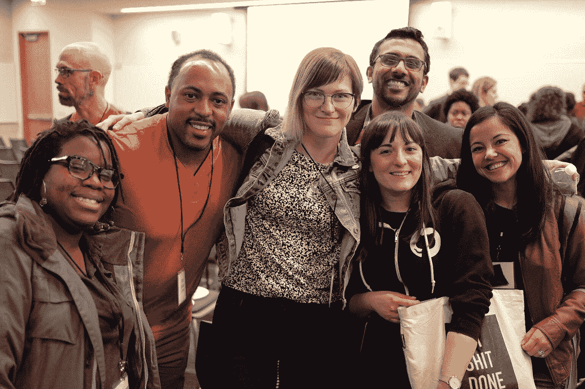

# CodeNewbie 创始人谈论她的移民故事和她的科技之旅-播客采访

> 原文：<https://www.freecodecamp.org/news/talking-with-codenewbie-saron-yitbarek/>

在本周的播客中，我采访了萨隆，讲述了她的童年，以及她成年后进入科技行业的曲折历程。

萨隆小时候从埃塞俄比亚搬到了美国。她的父母对她的学业有很高的标准，他们甚至会每晚给她补上额外的家庭作业。

学完文科后，萨隆从事科学新闻工作。最终她决定学习编码。自学了一段时间后，她参加了一个编码训练营。从那以后，她开始在 ThoughtBot 做开发人员，然后在微软工作。

萨龙在 2014 年创建了 CodeNewbie，并开始为有兴趣学习编码的人提供 Twitter 聊天。然后她推出了 CodeNewbie 播客，现在有超过 200 个对世界各地开发者的采访。

尽管 Saron 的生产力极高，但这种生产力来之不易。她谈到最近被诊断患有双相情感障碍和一般焦虑症，她已经适应了自己的情况，在如何投入时间和精力方面非常有条不紊。

这是一个 2 小时的采访，在你最喜欢的播客播放器应用程序中听-只要搜索“免费代码营”，你应该可以找到它。

如果你有亚马逊 Echo，你可以直接说“Alexa -播放 freeCodeCamp 播客”

或者你可以在你的浏览器里听它[。](https://podcast.freecodecamp.org/ep-65-codenewbie-founder-talks-about-her-immigrant-story-and-her-journey-into-tech)

Photo by [McBilly Sy](https://www.mcbilly.com/)

此外，2017 年，萨龙在纽约市为新开发人员举办了一场名为 Codeland 的会议。会议旨在尽可能地包容各方。

你可以在这里阅读我的代码世界经历。

你可以在这里获得 2019 年 7 月 22 日 Codeland 大会的门票。