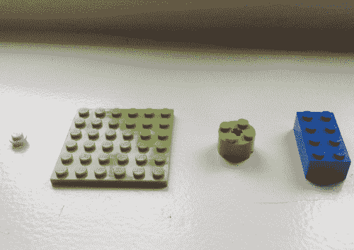
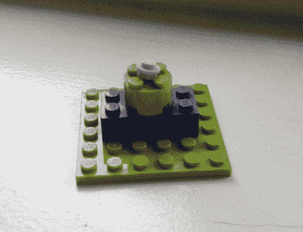
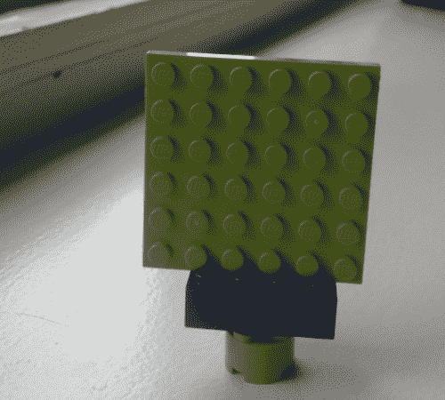
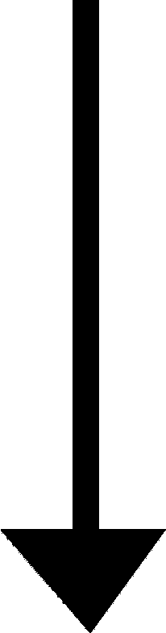
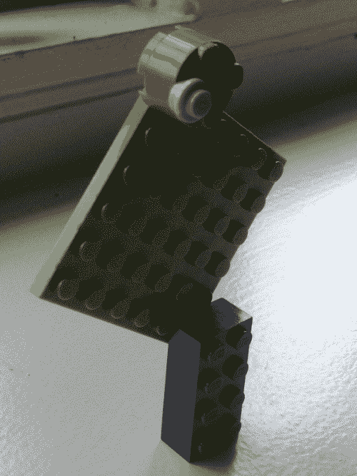

# 用这 4 块积木你能做出最高的乐高建筑是什么？

> 原文：<https://www.freecodecamp.org/news/tallest-lego-building-with-4-pieces-ec99cb520928/>

由约尔波斯

# 用这 4 块积木你能做出最高的乐高建筑是什么？

我女儿问我:“爸爸，用这四块积木我们能建起最高的建筑是什么？”

她的唯一规则是:“**这个结构需要独立存在。**

这里有一个简单的解决方案:

但是我们可以做得更好:

The pink circle is hidden between two pieces, and it adds to the height

更好的是:

The pink circle does not add to the height

现在停下来。

你能想到如何让它变得更高吗？

以下是我们的最佳解决方案:

