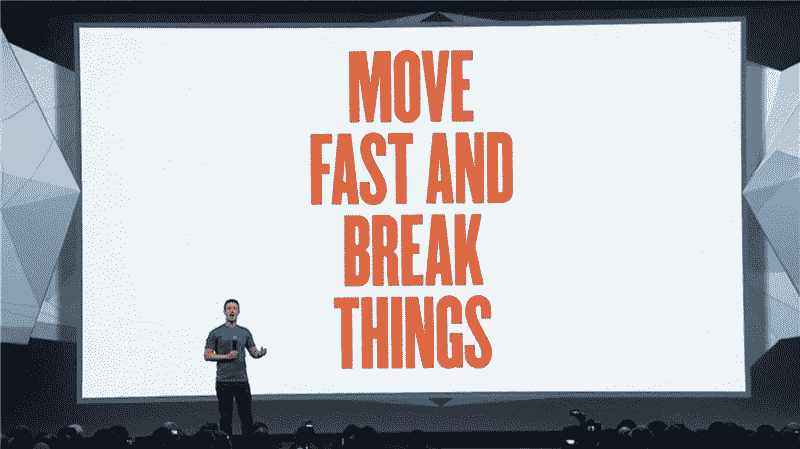

# 如何处理技术债务，拯救你的理智

> 原文：<https://www.freecodecamp.org/news/tame-your-tech-debt-by-refactoring-more-often-fcc34dd24a33/>

加布里埃尔·科伦坡

# 如何处理技术债务，拯救你的理智

Picture by Dominic — [https://www.flickr.com/photos/dwxh/](https://www.flickr.com/photos/dwxh/)

你最后一次发现自己在一个包含 7000 多行代码的文件中工作是什么时候？

此时此刻，我正在这么做。在撰写本文的同时，重构了遗留项目的一些功能。

相信我，这糟透了。

不幸的是，这是许多开发者的现实。项目由于各种原因失去控制。特定的变更可能不适合当前的流程，或者从长远来看变得无效。

这些情况通常会导致开发人员实施临时解决方案来保持运行。这没什么不好。

当这些解决方案在不同的功能中被重用时，问题开始恶化。

重复使用一个解决方案，而不了解它是在什么条件下开发的，以及它要解决什么问题，只会增加你的技术债务。

### 什么是技术债务

下面的陈述反映了我最喜欢的技术债务的定义:

> 在应用程序的不同开发阶段进行的一系列权衡。

但这意味着什么呢？

当创造一个新产品时，重要的决定必须发生在每个阶段。每个决策都有影响开发过程的特殊权重。必须进行权衡。

“我们会牺牲编码标准来提高速度吗？”

*“我们如何在不过度工程化的情况下创建这个功能？它现在不需要一个完整的架构，但我们以后必须改进它。”*

随着我们做出更多的决策，这些权衡开始影响开发过程。出现了维护问题，新功能的发布速度不如以前。

这是动力付诸东流的时刻。

我从事的项目基于以下前提:

“我们将转向一种不同的技术，所有的东西都将被丢弃。就目前而言，只要行得通，就不要太担心编码标准。”

如果这对你来说听起来不太糟糕，让我们从另一个角度来看:

我们总有一天会死去，所以当你活着的时候，做你想做的事情，不要担心后果

明白我的意思吗？

每个项目都应该有一套标准，让每个人都知道自己应该怎么做事。当有人在项目中工作时，这些标准应该总是重要的。

### 为什么要重构？

当我在第一份工作中还是初级开发人员时，我们是一个 5 人团队，所以每个人都必须同时扮演许多角色。

我开始用 Laravel 开发前端和后端。学习框架和理解 [PSRs](http://www.php-fig.org/psr/) (PHP 标准建议)需要时间，因为我以前从未处理过它。在这期间，我写的一些代码不符合标准。

每周一我都回去看一看我前一周写的代码，一切都符合标准。我的老板每周都进行重构，如果有些事情看起来不可思议，有时甚至每天都重构。

这种不断的重构使得项目的结构有些不可预测。事情确实会时不时地发生，尤其是在不同的分支上工作的时候。哦，你知道他们怎么说的:

Just make sure you have stable infrastructure. ([source](http://mashable.com/2014/04/30/facebooks-new-mantra-move-fast-with-stability/))

所以有一天我们一起吃午饭，我决定问问他为什么如此频繁地重构我们的代码。他的回答大概是这样的:

*“如果我不重构，没有人会重构。*

我们有一个非常小的团队，但最终它会成长。

如果你去了我们的代码库，发现它很乱，不符合标准，你可能不会花时间去做正确的事情，你会简单地添加另一个 If 语句，然后继续前进，但是如果一切都很整洁，你会觉得不遵循标准就做错了”。

那次谈话改变了我看待事物的方式，不仅是作为一名开发人员，也是作为一个个体。为此我很感激。

詹姆斯·q·威尔逊和乔治·l·凯林用破窗理论探索了他的解释的一般概念。

[**破窗理论——维基百科**](https://en.wikipedia.org/wiki/Broken_windows_theory)
[*破窗理论是关于城市无序化的规范制定和信号效应的犯罪学理论……*en.wikipedia.org](https://en.wikipedia.org/wiki/Broken_windows_theory)

他们的理论提出了以下概念:

保持一个整洁有序的环境，可以发出该区域受到监控、犯罪行为不被容忍的信号。相反，一个混乱的环境，一个没有得到维护的环境(破窗、乱涂乱画、乱丢垃圾)，会发出一个信号，即该地区没有受到监控，犯罪行为几乎没有被发现的风险。

当涉及到编程时，这很有意义。如果没有人关心，低质量的代码就会被发送出去，从长远来看，项目越来越难维护。

了解了这个背景故事，让我们看看什么时候应该考虑重构代码。

#### 何时重构您的代码库

持续重构提供了一致性、更高的生产率和对代码库的更多控制。

如果出现以下情况，您应该考虑重构代码:

*   该项目将持续运行很长时间。
*   你有维护问题。(发现和解决问题或对特定功能进行更改的难度)。
*   某些功能不一致(相同的组件在不同的页面上表现不同)。
*   代码重复太多了。
*   你的功能有太多的商业逻辑。

#### 何时抵制重构的冲动

*   项目不会增长，也不需要太多维护。
*   您缺乏自动化测试，并且不打算实现它们。
*   你想迁移到一个不同的技术，因为它是流行的。
*   什么时候重构会消耗太多时间。

### 结论

JUST DO IT!

技术债务对任何项目来说都是一笔巨大的交易，尤其是遗留项目。我们越早采取行动来控制它，最终质量就越高。

不断的重构有助于减少依赖性，提高可维护性。代码库变得更容易测试和推理。

首先，试着找出上面列出的一些情况，并思考如何改善它们。这里有一篇很棒的[文章](https://medium.com/web-engineering-vox/how-to-write-solid-code-that-doesnt-suck-2a3416623d48)可以帮助你开始。

感谢阅读！我希望你喜欢这篇文章。

如果它在任何方面对你有帮助，请通过分享来帮助我传播这个词:)

哦！还有，在推特上向我问好— [@gcolombo](https://twitter.com/gcolombo_)