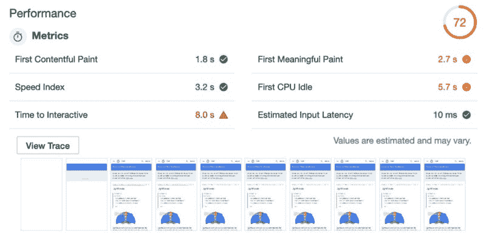
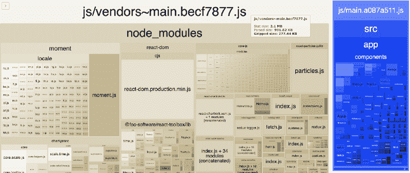
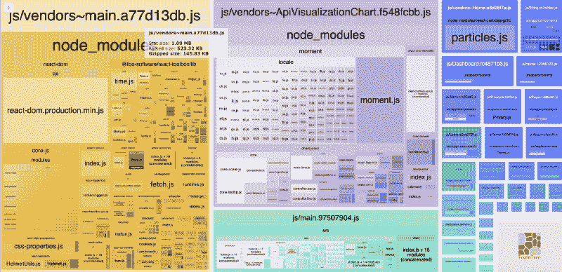
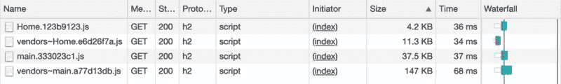
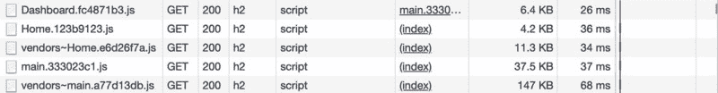
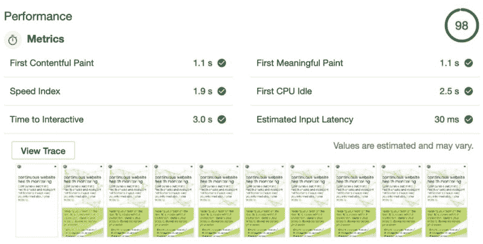

# 如何使用 Lighthouse、Webpack 和 React 可加载组件提高应用程序的性能

> 原文：<https://www.freecodecamp.org/news/taming-performance-in-todays-web-app-with-lighthouse-webpack-and-react-loadable-components-b2d3fa04e0ab/>

亚当·汉森

# 如何使用 Lighthouse、Webpack 和 React 可加载组件提高应用程序的性能

#### 提高网页性能的现代概念、工具和示例策略概述

Not Impressed at Penn Station

2018 年 3 月，谷歌通过宣布迁移“移动优先”索引网站来证实谣言。

### 这意味着什么

> 移动优先索引意味着谷歌将主要使用移动版本的内容进行索引和排名。从历史上看，在评估页面与用户查询的相关性时，索引主要使用页面内容的桌面版本。由于大多数用户现在通过移动设备访问谷歌，该索引将主要使用页面内容的移动版本。我们不会创建一个单独的移动优先指数。我们继续只使用一个指数。~ [准备移动优先索引](http://Mobile-first indexing means Google will predominantly use the mobile version of the content for indexing and ranking. Historically, the index primarily used the desktop version of a page's content when evaluating the relevance of a page to a user's query. Since the majority of users now access Google via a mobile device, the index will primarily use the mobile version of a page's content going forward. We aren't creating a separate mobile-first index. We continue to use only one index.)

“呀！”—你可能在想。对于任何一个拥有依靠有机搜索结果成功的网站的人来说，这是一个合理的反应。考虑一下极端的例子，一些网站每天带来数百万美元的收入，这些网站依赖于这些排名。这些网站中的许多并不一定支持移动设备作为最高优先级。

### 对抗性能

确保网页在移动设备上获得最佳性能的第一步是理解现代测试中的关键指标。我们可以通过利用谷歌的开源工具 [Lighthouse](https://developers.google.com/web/tools/lighthouse/) 直达源头。你可以在 Chrome DevTools 中运行它，从命令行，或者作为一个节点模块。

Lighthouse 有各种选项，允许在各种条件下进行性能测试，特别值得注意的是设备和连接类型。

#### 灯塔指标和评分

在 Lighthouse 性能审计中，结果是作为一组带有值的指标提供的。分数是一个介于 0 和 100 之间的数字，数字越大越好。分数由一组加权的选择指标计算得出，如[文档](https://developers.google.com/web/tools/lighthouse/v3/scoring)中所述。

> 负载不是一个单一的时刻，它是一种没有一个指标可以完全捕捉的体验。在负载体验过程中，有多个时刻会影响用户对它的感知是“快”还是“慢”。

> ~ [绘制时间规格](https://w3c.github.io/paint-timing/)

每个指标不仅可以捕捉页面负载的特征，还可以包含其他指标的结果。

Nobody is perfect — an audit of the Lighthouse’s own documentation page

### 改进的机会和解决方案

我已经根据复杂性确定了一些常见的低指标和相当简单的解决方案。[时间互动](https://developers.google.com/web/tools/lighthouse/audits/time-to-interactive)是最重要的。

#### 互动时间到了

在撰写本文时,“互动时间”指标对整体绩效得分的影响权重最高。

> 互动时间(TTI)指标衡量页面变成互动状态所需的时间。“互动”的定义是:

> 页面已经显示了有用的内容，这是用[第一次内容丰富的描绘](https://developers.google.com/web/tools/lighthouse/audits/first-contentful-paint)来衡量的。

> 大多数可见的页面元素都注册了事件处理程序。

> 页面在 50 毫秒内响应用户交互。

> 为了提高您的 TTI 分数，推迟或删除页面加载过程中出现的不必要的 JavaScript 工作。参见[优化 JavaScript 启动](https://developers.google.com/web/fundamentals/performance/optimizing-content-efficiency/javascript-startup-optimization/)和[用树抖动减少 JavaScript 有效载荷](https://developers.google.com/web/fundamentals/performance/optimizing-javascript/tree-shaking/)，以及[用代码拆分减少 JavaScript 有效载荷](https://developers.google.com/web/fundamentals/performance/optimizing-javascript/code-splitting/)。

> ~ [互动时间](https://developers.google.com/web/tools/lighthouse/audits/time-to-interactive)

#### 缩短互动时间

Webpack 现在提供复杂的定制来改进优化。它提供了开箱即用的配置选项来分割代码并防止重复，如[文档](https://webpack.js.org/guides/code-splitting/#prevent-duplication)中所示。通过使用 [Webpack Bundle Analyzer](https://github.com/webpack-contrib/webpack-bundle-analyzer) ，我们可以可视化“防止重复”代码分割方法的结果。

Webpack Bundle Analyzer: Standard code splitting of a “vendors” bundle

好吧，嗯…还能更糟吗？！重要的部分是我们分离了公共代码。通过这样做，我们可以从主执行线程中释放工作，提供资产缓存潜力，以及 Addy Osmani 和 Jeremy Wagner 详述的其他有趣的事情。但是等等……还有！

#### 动态代码拆分

我们在上面讨论了一种方法。Webpack 支持的另一种代码分割技术涉及到使用动态导入。通过使用[可加载组件](https://github.com/smooth-code/loadable-components)来处理我的“通用”应用程序中的渲染，我相当容易地完成了这个任务，并获得了惊人的结果。我选择这个库是因为它支持“服务器端渲染”和它的[文档](https://www.smooth-code.com/open-source/loadable-components/docs/server-side-rendering/)。它提供了一个 [Babel 插件](https://www.smooth-code.com/open-source/loadable-components/docs/api-loadable-webpack-plugin/)(在构建过程中委托组块)和一个[组块提取器](https://www.smooth-code.com/open-source/loadable-components/docs/api-loadable-server/#chunkextractor)——用于在服务器端收集组块并在页面渲染中提供脚本标签。这似乎令人困惑，所以说够了…让我们来扮演我们的角色吧！

想象一个用动态导入定义的页面组件。

为了在构建期间处理和委托可加载的组件，我们可以用 Babel 插件配置 Webpack(如上所述)。

在我们的客户端渲染条目中，我们封装了可加载就绪的。可加载组件异步加载所有脚本，以确保最佳性能。所有脚本都是并行加载的，所以您必须使用`loadableReady`等待它们准备好。

在服务器端渲染，可加载组件`ChunkExtractor`只提供初始页面加载使用的脚本标签，其余的异步，客户端！JS 是在后台按需加载的。

动态提取特定页面所需的脚本和样式标签是非常强大的。我在所有页面组件和专门导入大型库的组件中使用了动态导入。差别真大！？

Webpack Bundle Analyzer: Dynamic code splitting

我们减少了超过 100kb 的主要供应商捆绑包。上图中的蓝色方块代表用动态导入的页面组件创建的包。中间上方的紫色大方块是供应商从一个特定组件中分离出来的包，我将其标识为唯一导入大型库。

#### 好吧，我们真的做了什么吗？

简短的回答是——是的！！我们可以通过检查 Chrome Dev Tools 中的网络面板来了解 JS 是如何加载的。让我们假设一个主页请求。

Chrome Dev Tools network panel: An example home page

好的，等等…现在都想起来了…

> 大捆绑包的一种替代方法是代码分割，即把 JavaScript 分割成更小的块。这使得能够发送最少的代码来预先提供价值，从而缩短页面加载时间。其余的可以按需加载。

> ~ [通过代码分割减少 JavaScript 负载](https://developers.google.com/web/fundamentals/performance/optimizing-javascript/code-splitting/)

啊哈，当用户导航到另一个路由客户端时，我们可以看到这一点。假设用户从主页导航到“仪表板”页面。`Dashboard.fc4871b3.js`是点播下载！

Chrome Dev Tools network panel: An example home page and client side navigation to a “dashboard” page

而且……谷歌喜欢它！有了上面的改动，我看到一个灯塔评分提升了 10 多分。？

A Lighthouse audit with success written all over it!

### 结论

通过利用现代工具和功能，我们可以有效地识别、测量、可视化和处理网页性能。这对于适应谷歌的移动优先索引非常重要。Google 记录的衡量绩效的关键指标，如“[互动时间](https://developers.google.com/web/tools/lighthouse/audits/time-to-interactive)”，可以帮助我们找到改进的机会。