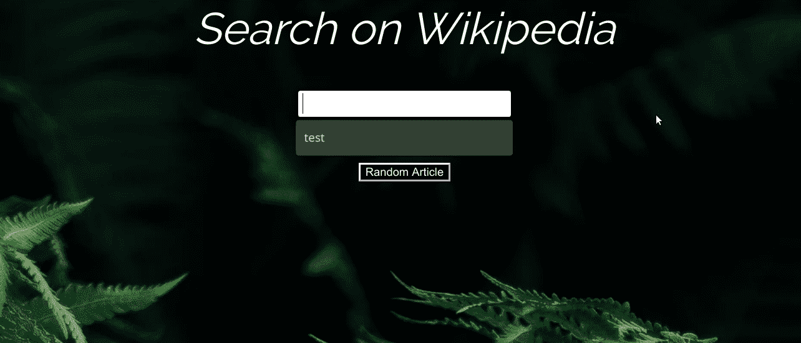

# 目标点击输入栏上的“清除”按钮

> 原文：<https://www.freecodecamp.org/news/targeting-click-of-clear-button-x-on-input-field/>

jQuery 使得项目的启动和运行变得很容易。尽管它在最近几年已经失宠，但它仍然值得学习基础知识，尤其是如果您想快速使用它的强大方法。

尽管 jQuery 是一个强大的库，但它不能做所有的事情。这就是对普通 JavaScript 有扎实理解的地方。

假设你有这样一个[维基百科浏览器](https://www.freecodecamp.org/learn/coding-interview-prep/take-home-projects/build-a-wikipedia-viewer)项目:

```
<div class="search">
  <p id="text">Search on Wikipedia</p>
  <input id="searchbox" type="search"></input>
  <button id="searchbutton">Search</button>
  <a href="https://en.wikipedia.org/wiki/Special:Random" target="_blank"><button id="searchbutton">Random Article</button></a>
  <div class="resultingarticles"></div>
</div>
```

Source: [Sandris Kupavskis](https://codepen.io/sk1995/pen/YYEbYz)

```
$("#searchbox").keyup(function(event) {
  if(event.keyCode === 13) {
    $("#searchbutton").click();
  };
});

$("#searchbutton").click(function() {

  var searchInput = document.getElementById("searchbox").value;
  searchInput = searchInput.toLowerCase();

  if(searchInput !== "") {

    var myRequest = new XMLHttpRequest();
    myRequest.open('GET','https://en.wikipedia.org/w/api.php?action=query&list=search&srsearch='+ searchInput + '&utf8=&format=json&origin=*');

      myRequest.onload = function() {
      var searchResults = JSON.parse(myRequest.responseText);

      $(".resultingarticles").empty();  

      for(i=0; i<10; i++) {
        var articleTitle = searchResults.query.search[i].title;
        var articleSnippet = searchResults.query.search[i].snippet;
        var articleId = searchResults.query.search[i].pageid;
        var articleLink = "https://en.wikipedia.org/?curid=" + articleId;
        $(".resultingarticles").append("<a href='" + articleLink + "' target='_blank'>" + "<div class='article'>" + "<p>"+articleTitle+"</p>" + "<p>" + articleSnippet + "</p>" + "</div>" + "</a>");
      };

      };

    myRequest.send();

  };
});
```

一切都如你所料——你可以在搜索框中输入文本，点击回车或“搜索”按钮，然后看到维基百科文章列表。

因为你在你的`input`元素上使用了`type="search"`，如果有文本并且你悬停在输入上，Chrome 浏览器会自动在输入的末尾添加一个“X”。注意，其他浏览器可能会以不同的方式处理`type="search"`。

当你点击“X”时，文字消失。

但是假设您已经有了一个文章列表，当您清除文本时，您还想清除填充的文章:


原来，单击搜索框中的“X”会触发一个“search”事件。jQuery 不支持“搜索”事件，所以您必须用普通的 JavaScript 编写一个事件监听器:

```
document.getElementById("searchbox").addEventListener("search", function(event) {
  $(".resultingarticles").empty();  
});
```

现在，当搜索事件触发时，您可以使用 jQuery 清除包含文章的`div`元素:

