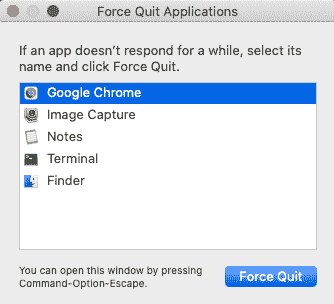
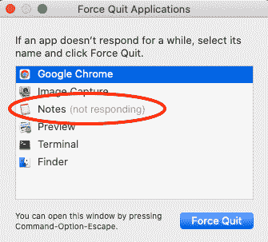
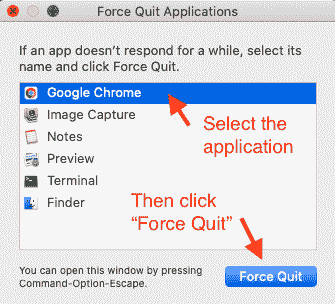

# 任务管理器 Mac 指南——如何使用 Apple Control-Alt-Delete 快捷键强制退出应用程序

> 原文：<https://www.freecodecamp.org/news/task-manager-mac-how-to-force-quit-beach-ball-control-alt-delete-shortcut-equivalent/>

你有没有试过在你的笔记本电脑上使用一个应用程序，却发现你的光标是一个旋转的沙滩球？

你可以在屏幕上移动沙滩球，但无论你做什么，你似乎都不能点击任何东西。

你不能保存你的工作。您不能关闭应用程序。你不能编辑任何东西。这是一份冻结的申请。

在这种情况下，你只能做两件事:

1.  强制应用程序关闭并丢失任何未存储的更改(也称为强制退出)
2.  或者等待并希望应用程序自行解冻

## 如何强制退出一个 Mac App Control+Alt+Delete 风格

如果您需要立即使用该应用程序，请使用此选项。请注意，您将会丢失任何尚未保存的工作。

首先，打开应用程序，最后一次尝试以标准方式关闭它，方法是单击应用程序左上角的红色“x ”:

Click the red 'x' to close the application in the standard way

如果你的光标仍然是一个旋转的沙滩球，点击“x”没有关闭应用程序，那么是时候强制关闭应用程序了。

在 PC 上，使用键盘快捷键强制关闭应用程序是 **control + alt + delete** 。你同时按住三个按钮。你可能想知道:Mac 有没有等效的快捷方式？

为什么是的，它是。Mac 等效键盘快捷键为: **command + option + escape** 。

这将显示以下屏幕，称为 Mac 任务管理器:

In this image, all applications are running normally, and none are frozen.

我有多个应用程序在运行。它们中的每一个看起来都像上图中预期的那样运行。没有一个是冷冻的。

如果你的应用程序被冻结，它旁边应该有一个小纸条，上面写着“没有响应”。如果它没有这个注释，如果您有没有保存的工作，那么可能值得执行选项#2(等待和希望)。

Mocked up example of the "Notes" application not responding

单击您想要强制退出的应用程序。以上，我已经点过谷歌 Chrome 了。

现在，点击弹出窗口右下角的“强制退出”按钮。

Steps to force quit an application

## 选项#2:等待并希望应用程序自我修复

如果你有时间，你可能更喜欢等待，希望应用程序自己解冻。

你为什么要这么做？通常是因为在应用程序冻结之前，您有一些工作没有保存。例如，假设您正在处理一个电子表格，并进行了大量修改。遗憾的是，在您保存更改之前，Excel 死机了。

这是一个经典的例子，你可能更喜欢等待和希望。

不能保证应用程序需要多长时间来解决问题，也不能保证它是否能够解决问题。

如果你决定尝试这种方法，我建议每 5-10 分钟检查一次应用程序。四处点击，看看有没有什么变化，给自己一个最大的时间限制。我个人只会等大约一个小时，然后决定是时候告别我的工作了。

## 综上所述，以下是如何应对“死亡沙滩球”

概括来说，这些步骤是:

1.  按住 **command + option + escape**
2.  选择您想要强制退出的应用程序
3.  单击强制退出按钮

您可以强制退出仍有响应的应用程序。然而，强制退出将意味着应用程序的状态不会被保存，并且应用程序不会以其预期的方式关闭。我建议只强制退出冻结的应用程序。

祝你好运！