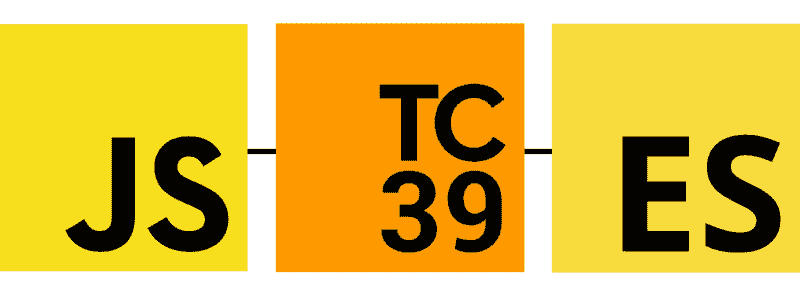
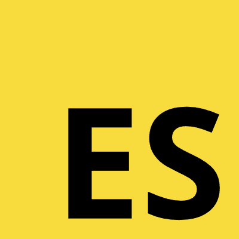
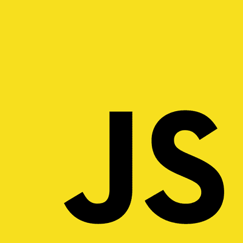
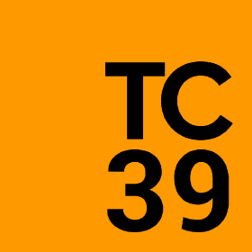
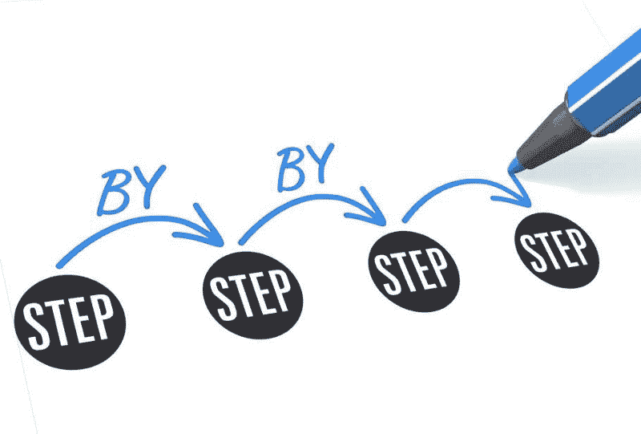

# TC39 及其对 ECMAScript 的贡献

> 原文：<https://www.freecodecamp.org/news/tc39-and-its-contributions-to-ecmascript-c178b77f32e1/>

作者:帕斯·尚迪雅

# TC39 及其对 ECMAScript 的贡献

很多人搞不清楚什么是 JavaScript，什么是 ECMAScript。有时很难区分它们之间是如何联系的，以及 ECMA International 和 TC39 在 JavaScript 的标准化中扮演了什么角色。

Source : Warosu.org

在这篇博文中，我将讨论 TC39 及其对 ECMAScript 的贡献。

让我们从讨论 JavaScript 和 ECMAScript 时使用的所有基本术语开始。

Source : [GitHub](https://github.com/exercism/meta/issues/39)

### 什么是 ECMAScript？

ECMAScript 是一种标准脚本语言，由网景公司和微软公司合作开发，主要来源于网景公司的 JavaScript。JavaScript 是一种广泛使用的脚本语言，在网页中用来影响它们对用户的外观或行为。

ECMA-262 是由 ECMA 国际发布的标准。它包含了通用脚本语言 ECMAScript 的规范。

Source : [my.wikipedia.org](https://my.wikipedia.org/wiki/File:Javascript-736400_960_720.png)

#### 关于 JavaScript 的更多信息

JavaScript 是一种脚本语言，它能让你创建动态更新的内容，控制多媒体，制作图像动画，以及做其他几乎所有的事情。(好吧，并不是所有的事情，但是用几行 JavaScript 代码就能实现的事情是惊人的。)

#### 什么是 ECMA？

ECMA 是信息和通信系统的标准组织。ECMA 的目标是制定标准和技术报告，以促进和规范信息通信技术和消费电子产品的使用。它通过影响应用标准的环境来鼓励标准的正确使用，并以电子和印刷形式发布这些标准和报告。

现在，让我们介绍 ECMAScript: TC39 背后辛勤工作的人们。

Source : [GitHub](https://github.com/tc39)

### TC 39 是什么？

TC39 是指技术委员会第 39 号。它是 ECMA 的一部分，该机构根据“ECMAScript”规范对 JavaScript 语言进行标准化。它致力于通用、跨平台、厂商中立的编程语言 ECMAScript 的标准化。这包括语言语法、语义、库和支持语言的补充技术。

#### **TC 39 工作于**:

*   维护和更新 ECMAScript 编程语言的标准。
*   识别、开发和维护扩展 ECMAScript 功能的库标准。
*   开发可用于验证这些标准的正确实施的测试套件。
*   向 ISO/IEC JTC 1 委员会提交选定的标准。
*   评估和考虑补充或附加技术的提案。

自从 ES6 问世以来，TC 39 简化了提案预测过程，以满足现代人的期望。新流程使用 HTML 的超集来格式化建议书。他们使用 GitHub pull 请求，这有助于促进社区的参与。提出的建议数量也有所增加。

该规范现在更像是一种生活标准，这意味着提案会更快地被采纳，我们不会花费数年时间等待新版本的规范出台。

#### 更普遍的观点

通过阅读 [ECMAScript 规范](https://www.ecma-international.org/publications/files/ECMA-ST/Ecma-262.pdf)，你学习如何创建一种脚本语言。通过阅读 [JavaScript 文档](https://developer.mozilla.org/en-US/docs/Web/JavaScript)，你可以学习如何使用这种脚本语言。

Source : [tc39/ecma262](https://tc39.github.io/ecma262/)

### 提案处理

Source : pyrus.com

#### 阶段 0:稻草人

尚未作为正式提案提交的任何讨论、想法、变更或增补在此阶段被视为“稻草人”提案。只有 TC39 的成员可以创建这些提议，而今天有超过 12 个活跃的 strawman 提议。

#### 第一阶段:提案

在这个阶段，一个提议被正式化，并被期望解决横切关注点、与其他提议的交互以及实现关注点。此阶段的提案确定了一个离散的问题，并提供了该问题的具体解决方案。

在这个阶段，提案通常包括高级 API 描述、使用示例以及对内部语义和算法的讨论。随着这些提案在流程中的进展，它们可能会发生重大变化。

#### 第二阶段:草稿

此阶段的提案应提供规范的初始草案。

此时，对于实现者来说，开始在运行时试验实际的实现是合理的。实现可以有多种形式:polyfill、使运行时符合提议的用户代码、引擎实现(它本身为提议提供支持)，或者它可以由 Babel 这样的构建时编译器支持。

#### 第三阶段:候选人

此阶段的提议是候选人推荐。在这个高级阶段，规范编辑和指定的审阅者必须已经签署了最终的规范。第三阶段的提议不太可能超出对在野外发现的问题的修复。

实施者也应该对提案表示出兴趣——没有实施者支持的提案是行不通的。在实践中，至少有一个浏览器实现，一个高保真的 polyfill，或者有 Babel 这样的构建时 transpiler 的支持，提案就可以达到这个级别。

Source : [Expert Elevation](https://expertelevation.com/how-may-project-not-finished)

#### 第四阶段:完成

最后，当至少有两个独立的实现通过验收测试时，提案就到达了这个阶段。

#### 下一步是什么？

进入第四阶段的提案将包含在 ECMAScript 的下一个版本中。当规范作为标准通过年度批准时，提案也作为它的一部分被批准。

Source : [get-it-done.co.za](http://get-it-done.co.za/)

这就是进化 ECMAScript 语言的想法被接受并添加到 ECMAScript 的下一个版本中的方式。我们都感谢 TC39 所做的工作，这是非常宝贵的。

至此，我们结束了对 TC39 及其对 ECMAScript 的贡献的讨论。

感谢阅读。

来源: [TC 39 流程](https://tc39.github.io/process-document/)， [ECMA 国际](https://www.ecma-international.org/memento/TC39.htm)

Did you like the read? Medium doesn’t offer partner program in my country―so I ask people to buy me coffee instead.