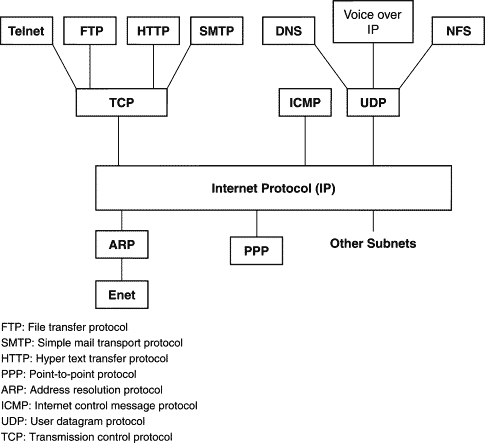
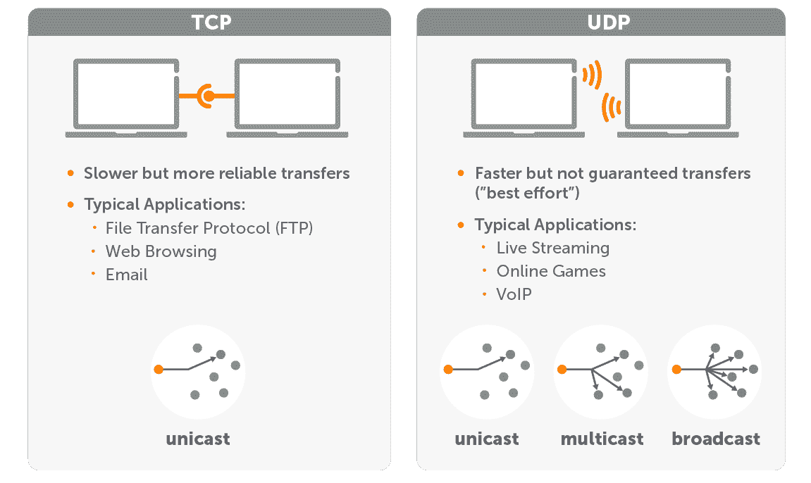
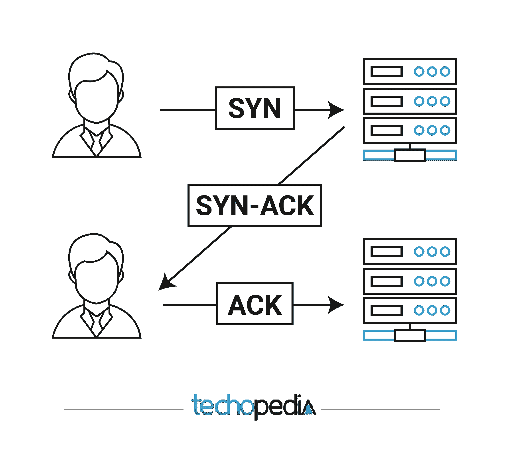
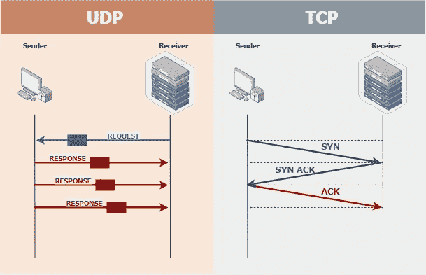
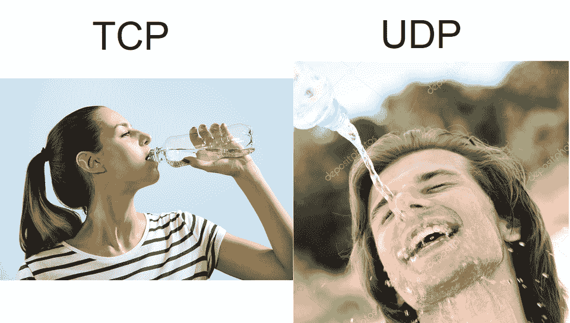

# TCP 与 UDP —有什么区别，哪种协议更快？

> 原文：<https://www.freecodecamp.org/news/tcp-vs-udp/>

如果你正在研究计算机网络，或者如果你已经研究了一些应用程序的网络设置，你可能已经看到了这些术语:TCP 和 UDP。

TCP(代表传输控制协议)和 UDP(用户数据报协议)都是互联网协议套件的一部分。TCP 和 UDP 是通过互联网发送信息的不同方法。

但是，即使知道它们代表什么，也很难知道应该使用哪种协议，或者为什么要使用一种而不是另一种。

在本文中，我们将回顾计算机网络基础知识、TCP 和 UDP 之间的区别、各自的使用时间等等。

## 计算机网络基础

在深入研究 TCP 和 UDP 的工作原理之前，了解一下互联网的基本工作原理是很有帮助的。

一般来说，互联网是一个连接设备的网络。每个设备，无论是智能手机还是服务器，都通过互联网协议套件进行通信。

互联网协议组是设备相互通信的不同协议或方法的集合。TCP 和 UDP 都是互联网协议族中的主要协议:

[Source](https://www.sciencedirect.com/topics/computer-science/internet-protocol-suite)

连接到互联网的每台设备都有一个唯一的 IP 地址。每当两台设备通过互联网进行通信时，它们很可能会使用 TCP 或 UDP 进行通信。

下面是两者的简单对比:

[Source](https://www.wowza.com/blog/udp-vs-tcp)

要更深入地了解互联网的工作原理，请观看这段五分钟的视频:

[https://www.youtube.com/embed/7_LPdttKXPc?feature=oembed](https://www.youtube.com/embed/7_LPdttKXPc?feature=oembed)

## 什么是 TCP？

TCP 或传输控制协议是最常见的网络协议。TCP 非常可靠，用于从网上冲浪(HTTP)、发送电子邮件(SMTP)和传输文件(FTP)的所有事情。

TCP 用于需要一台设备发送的所有数据被另一台设备完整接收的情况。

例如，当您访问一个网站时，TCP 用于保证呈现页面所需的所有内容(从文本、图像到代码)都能到达。如果没有 TCP，图像或文本可能会丢失，或者以不正确的顺序到达，从而破坏页面。

TCP 是面向连接的协议，这意味着它在传输数据之前在两个设备之间建立连接，并在整个传输过程中保持该连接。

为了在两台设备之间建立连接，TCP 使用一种称为三次握手的方法:

[Source](https://www.techopedia.com/definition/10339/three-way-handshake)

例如，要在您的设备上阅读这篇文章，您的设备首先向 freeCodeCamp 新闻服务器发送一条名为 SYN(同步序列号)的消息。

然后，freeCodeCamp 新闻服务器发回一个确认消息，称为 SYN-ACK。

当您的设备从服务器收到 SYN-ACK 时，它会发回一条 ACK 确认消息，从而建立连接。

一旦两个设备之间建立了 TCP 连接，该协议将保证所有数据都被传输。

回到您的设备和 freeCodeCamp 新闻的例子，一旦三次握手完成，新闻服务器就可以开始发送您的设备的 web 浏览器呈现这篇文章所需的所有数据。

在通过互联网发送数据之前，所有设备都将数据分解成小数据包。这些数据包需要在另一端重新组装。

因此，当 freeCodeCamp 新闻服务器发送本文的 HTML、CSS、图像和其他代码时，它会先将所有内容分解成小数据包，然后再发送到您的设备。然后，您的设备将这些数据包重新组装成呈现本文所需的文件和图像。

TCP 确保这些数据包都到达您的设备。如果在传输过程中丢失了任何数据包，TCP 可以让您的设备很容易地让服务器知道它丢失了数据，并让服务器重新发送这些数据包。

一旦您的设备接收到呈现文章所需的所有数据，TCP 会使用类似于三次握手的方法自动终止两个设备之间的连接，这一次使用 FIN 和 ACK 数据包。

## 什么是 UDP？

UDP，即用户数据报协议，是构成互联网协议簇的另一个主要协议。UDP 没有 TCP 可靠，但简单得多。

UDP 用于某些数据丢失可以接受的情况，如实时视频/音频，或者速度是关键因素的情况，如在线游戏。

虽然 UDP 与 TCP 相似，都是用于在线发送和接收数据，但还是有一些关键的区别。

首先，UDP 是一种无连接协议，这意味着它不像 TCP 那样通过三次握手预先建立连接。

其次，UDP 不能保证所有数据都成功传输。使用 UDP，数据被发送到任何碰巧在监听的设备，但它不在乎数据是否在途中丢失。这也是 UDP 被称为“一劳永逸”协议的原因之一。

思考这些差异的一个好方法是，TCP 就像两个人之间的对话。人 A 请人 B 说话。人 B 说当然，那好。A 同意了，他们俩开始说话。

UDP 更像是外面拿着扩音器的抗议者。每个关注抗议者的人都应该听到他们说的大部分内容。但是不能保证这个地区的每个人都能听到抗议者在说什么，或者他们真的在听。

UDP vs TCP — [Source](https://www.dpstele.com/snmp/transport-requirements-udp-tcp.php)

## TCP 和 UDP 哪个更快？

通常，UDP 是更快的协议。

UDP 要简单得多，在发送数据之前，它不会尝试在设备之间建立连接，也不会验证所有数据是否都已到达。它只是向任何请求它的设备发送数据，并一直这样做，直到另一个设备断开连接或没有数据可发送。

想想用软管喝水，而不是用瓶子啜饮。无论哪种方式，你都会解渴，但使用前一种方法可能会得到一件潮湿的衬衫。

Not a hose, but still pretty accurate. Also imagine that the TCP bottle keeps asking if you received water while you drink from it. [Source](https://www.reddit.com/r/ProgrammerHumor/comments/9gcwgw/tcp_vs_udp/e63axmd/)

但是更快并不意味着 UDP 是更好的协议。只是意味着在某些情况下更好。

如前所述，在所有数据包都按顺序发送并且所有数据包都到达的情况下，TCP 是必要的。没有 TCP，网络就无法运行。

尽管 TCP 由于其建立连接的方式以及对丢失数据包的检查而变得较慢，但它仍然可以非常快。因为它们在网上，使用 HTTP，像 YouTube 或网飞这样的网站都使用 TCP 向你的设备发送数据。

TCP 还允许缓冲，因此您的浏览器可以在您观看时请求和加载更多数据，从而实现平滑回放，并允许您跳到视频的其他部分。

对于速度比潜在的数据丢失更重要的实时视频和音频或在线游戏，UDP 是更好的选择。

当您通过 Google Meet 或 Zoom 拨打电话时，您的视频和音频将通过 UDP 传输。如果一些数据包在传输过程中丢失，它只会表现为一点延迟或视频/音频剪辑。

如果您玩视频游戏，您可能会认为 TCP 确保所有数据包到达另一台设备的方式是理想的选择。但实际上，TCP 所做的所有检查和重新发送数据只会增加延迟。

游戏开发者已经找到了其他聪明的方法来确保玩家的输入和状态尽可能准确。如果你有兴趣阅读更多关于为什么 UDP 是在线游戏首选的信息，请查看本文。

## 鳍状物

我希望这篇文章能帮助你理解 TCP 和 UDP 之间的一些细微差别。如果有人问哪个更快，告诉他们你在这里读到的:“UDP 更快，*但是*……”

如果你喜欢你所读的，请在推特上告诉我。