# 获得一些 C#测试驱动开发的实践机会

> 原文：<https://www.freecodecamp.org/news/tdd-explanation-hands-on-practice-with-c-a0124338be44/>

摩西·比涅利

# 获得一些 C#测试驱动开发的实践机会

Introduction Image

### 那么让我们来谈谈 TDD——它是什么？

TDD 代表**测试驱动开发**，是软件开发中的一个设计过程。它依赖于非常短的开发周期的重复，并且需求被转化为非常具体的测试用例。

在 TDD 过程中有几个步骤:

1.  编写一个失败的单元测试。
2.  编写足够的代码使测试通过——在这一步，我们不关心好的代码。
3.  从上一步开始重构代码。

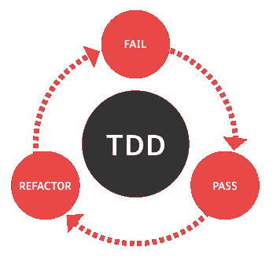

TDD Life cycle

### 这种方法的好处是什么？

首先，在编写代码之前，您对实际代码有了更好的理解。这是 TDD 最大的好处之一。当你首先编写测试用例时，你会更清楚地考虑**系统需求**和更关键的**角落用例**。

此外，当谈到**依赖**时，提到使用 TDD 让您专注于类的逻辑是很重要的。通过这种方式，您可以将所有的依赖关系保留在您的类之外。还有一点很重要，那就是您的代码将更加安全地运行**，因为逻辑将不必处理不同的依赖关系，比如数据库连接、文件系统等等。**

**这也是一种更安全的**重构**代码的方式。当编写 TDD 时，会对某一部分逻辑进行测试。当您重构代码时，您可能会破坏一些东西，但是使用这种方法，您知道测试会支持您。**

**当你使用 TDD 时，你也有一个更快的方法去理解代码做什么。当你开始处理一段你不熟悉的代码时，你可以阅读那段代码的测试用例，理解它的用途。那些测试也是你代码的**文档**。**

**最后，你可以**专注于以最好的方式构建较小的组件，避免大图带来的麻烦。那么这有什么帮助呢？您将编写一个失败的测试，并专注于它以使它通过。它迫使你一次考虑更小的功能块，而不是整个应用程序。然后，您可以在通过测试的基础上逐步构建，而不是一开始就试图解决更大的问题，这可能会导致更多的错误。****

#### **在我们开始写 TDD 之前…**

**老实说，有更多的文章可以让你更深入地了解 TDD。因此，我避免在这里写 TDD 的全部理论，因为阅读所有内容需要很长时间。**

**因此，我只是解释了 TDD 设计过程的一般思想和优点。**

### **是时候写一些测试了，让我们开始吧**

#### **描述和要求**

****

**我们将使用 C#编写一个堆栈实现。为什么用 C#？嗯，因为我爱 C#，所以为什么不呢？？**

**所以我们的需求非常简单:我们想要实现一个堆栈类，所以需求是:**

1.  **限制堆栈的大小。**
2.  **添加元素。(推)**
3.  **移除元素。(流行音乐)**
4.  **检查最后一个元素是什么。(peek)**
5.  **获取堆栈的当前大小。**
6.  **拥有一个可以接受任何数据类型的类。**
7.  **当客户超过堆栈的大小时，我们需要抛出一个适当的异常。**

**在我们知道系统的需求是什么之后，我们可以开始定义我们将如何解决这个问题。我们将使用数组来实现它。**

#### **TDD 中的堆栈实现—构建基础设施**

**我用的是 visual studio 2017。在里面，我会打开一个新项目:
**File->New->P**project，C **hoose Conso** le App(。NET 框架)。
选择一个项目名称，如“Stack”。**

**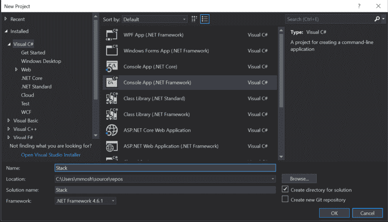

Create project visualization** 

**现在我们将为测试打开另一个项目，我们称之为“StackTests”。**

**打开解决方案资源管理器。我们在那里有一个项目叫做“堆栈”。现在右击解决方案并选择**添加- >新项目**等并选择 **se 类库**。NET 框架)。**

**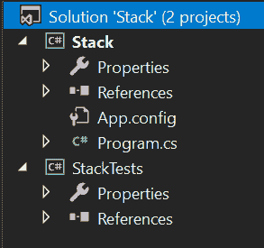

Solution explorer visualization** 

**让我们安装我们的单元测试:右键单击 **StackTests** 项目，选择 **Manage NuGet Packages** ，导航到**“浏览”**，安装下面的包:**

*   **NUnit**
*   **nunit 3 测试适配器**

**向 **StackTests** 项目添加一个新类，并将其命名为 **StackTest。**现在，解决方案应该是这样的:**

**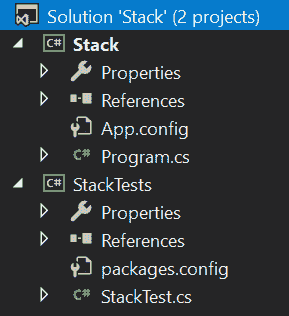

Solution explorer visualization** 

****packages.config** 应该是这样的:**

**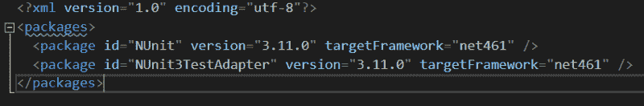

packages.config visualization** 

#### **TDD 中的堆栈实现—编写代码**

**我们将开始在 StackTest 类下的 StackTests 项目中写出测试单元。**

**在我们开始编写代码之前，我们需要学习 3 件重要的事情: **TestFixture、Test 和 Assert。****

**[**TestFixture**](http://nunit.org/docs/2.5/testFixture.html) 是标记一个类的属性，该类包含测试和可选的[设置](http://nunit.org/docs/2.2.7/setup.html)或[拆卸](http://nunit.org/docs/2.2.7/teardown.html)方法。**

**[**Test**](http://nunit.org/docs/2.5/test.html) 属性是将 TestFixture 类中的方法标记为测试的一种方式。**

****[断言](https://docs.microsoft.com/en-us/dotnet/api/microsoft.visualstudio.testtools.unittesting.assert?view=mstest-net-1.2.0)** 类是一个助手类的集合，用于测试单元测试中的各种条件。如果不满足正在测试的条件，则会引发异常。**

**导入 **"NUnit。框架"**，并将**【测试夹具】**属性放在您的类定义之上。**

**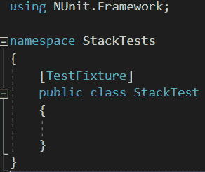

Class visualization** 

#### **创造测试**

**好了，该写我们的第一个函数了。我们将编写一个创建测试，它将创建我们堆栈的一个新对象，它将检查堆栈的大小在开始时是否为 0。**

**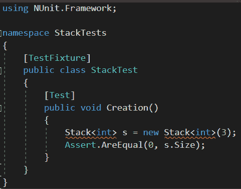

Creation test visualization** 

**现在我们已经编写了第一个测试，让我们运行它。**

**在你的工具栏中点击**测试- >运行- >所有**测试。**

> **如果你的**测试浏览器**没有打开，点击**测试- >窗口- >测试浏览器**打开，这将会打开测试浏览器。**

**如您所见，我们甚至没有定义堆栈类，所以我们得到了一个编译错误。现在让我们编写足够的代码来通过测试。**

**让我们进行第一次测试:**

*   **在**栈项目**中新建一个类，并将这个类**称为“栈”。**使这一级成为**通用型**级(T 型)。**
*   **我们将这个类(Stack)定义为一个数组，因此我们将成员字段定义为 T 类型的**数组。****
*   **我们需要在构造函数处传递栈的最大长度，因此我们将创建一个接受大小参数的构造函数。**
*   **由于我们需要在任何时候接收堆栈的当前大小，我们将定义一个属性**“Size”。**当然，没有人能够改变大小，因此这将是一个**私人设置**。**

**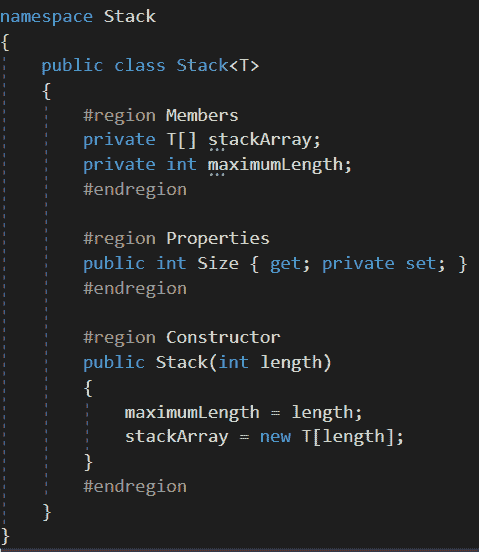

Stack class visualization** 

**现在让我们再次运行测试(查看上面如何运行测试)并查看结果。**

**

Tests status** 

**好了，我们已经完成了 TTD 设计的第一次迭代！现在我们应该重构我们的代码——但是在这一点上，我们真的没有什么可重构的，所以我们将继续前进。**

#### **推动和弹出测试**

**现在我们想要测试推送和弹出功能，所以让我们创建测试用例。**

*   **Push 将接受一个参数并将其添加到堆栈的顶部。**
*   **Pop 将从堆栈中移除元素并返回它。**

**我们将向堆栈中添加 3 个元素，然后取出最后一个元素。此时，我们将检查最后一个元素是否正是我们期望得到的元素，以及堆栈大小是否减小了。**

**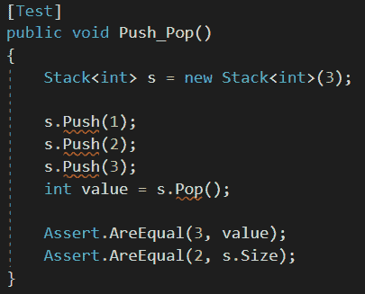

Push and pop test case** 

**如您所见，push 和 pop 函数甚至不存在，所以当我们运行测试时，我们在我们的测试结果中得到一个**失败**。让我们转到**栈类**并实现它们。**

**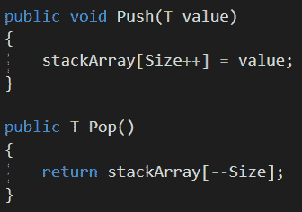

Push and pop functions** 

**让我们再次运行我们的测试，嘣，一切都完美地工作！所有测试都成功通过了？**

#### **超出允许大小的错误**

**我们希望在以下情况下抛出自定义异常:**

1.  **当堆栈已满时，推送新元素。**
2.  **当堆栈中没有元素时弹出元素。**

**你已经知道了…我们现在应该做什么？**

**正确！我们定义测试用例，然后让代码工作。**

**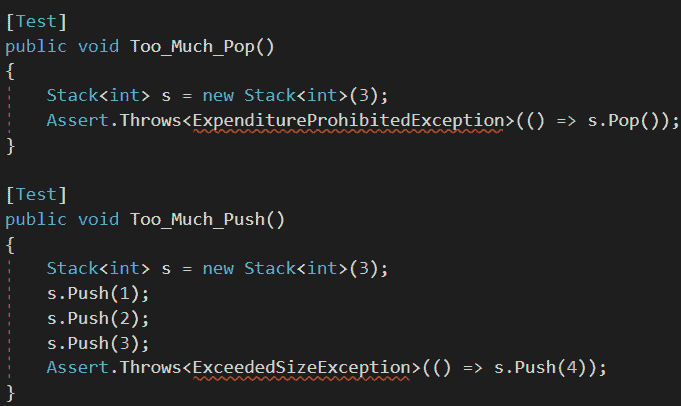**

**如您所见，我们需要创建两个新的自定义异常。**

*   ****ExpenditureProhibitedException**—当堆栈为空并且客户端试图弹出一个新元素时，会发生该异常。**
*   ****ExceededSizeException** —当堆栈已满且客户端试图向堆栈中添加新元素时，将会发生此异常。**

**转到**堆栈项目**并创建一个名为 **CustomExceptions 的新类。在这个类中，我们将定义新的异常，它们将从 Exception 类继承。****

**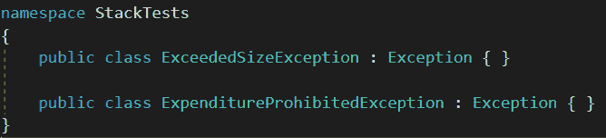

Custom exceptions** 

**修改我们当前的 push 和 pop 功能，以便在需要时抛出异常。**

**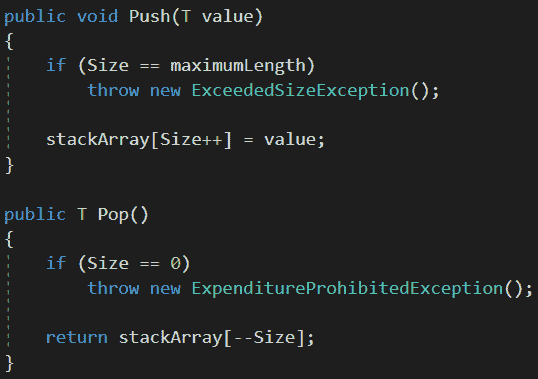

Custom exceptions** 

**所以现在，作为 TDD 生命周期的一部分，我们正在运行测试…万岁！所有测试都已成功通过。**

#### **查看最后一个元素**

**我们即将完成最后的测试。我们想查看堆栈中的最后一个元素。如果堆栈为空，我们将抛出 ExpenditureProhibitedException 异常，否则，我们将返回最后一个元素。**

**让我们创建我们的测试用例。**

1.  **当堆栈为空时，尝试查看元素。在这个测试中，我们将抛出一个自定义异常。**
2.  **在堆栈中插入一些元素，然后查看一个元素，确保这是正确的元素，并检查数组大小没有改变。**

**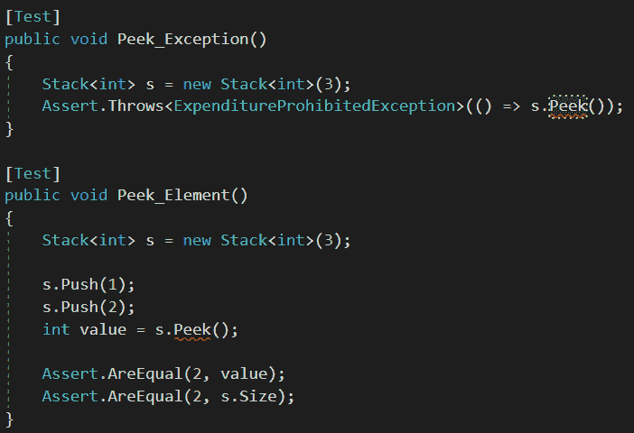

Peek test cases** 

**当我们运行测试时，它们会失败 peek 方法甚至不存在，也没有任何功能。**

**我们将在**栈类**中**创建**函数 **Peek** 。**

**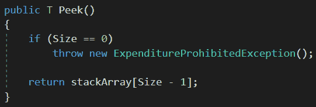

Peek implementation** 

**现在，当我们再次运行测试时，我们可以看到所有测试都成功通过。**

### **最后**

**正如您所看到的，这个想法并不复杂，有许多工具可以帮助实现 TDD 原则。**

**你可以在 Pastebin 查看全部代码。**

**stack 类——这个类包含了 Stack 的所有实现。
[StackTests 类——包含所有的测试用例。](https://pastebin.com/5FcMXqYS)
[CustomExceptions 类——包含系统进行 TDD 设计所需的异常。](https://pastebin.com/z7rWFtxj)**

**欢迎所有评论和反馈——如果有必要，我会修改文章。**

**欢迎直接在 LinkedIn 上联系我— [点击这里](http://www.linkedin.com/in/moshe-binieli-22b11a137)。**