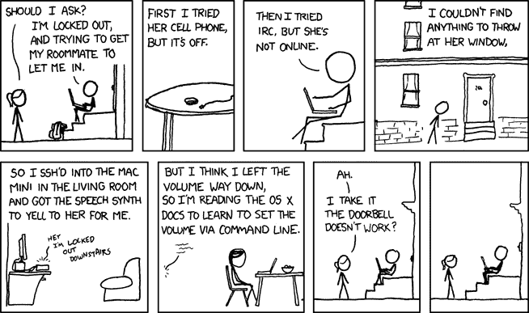
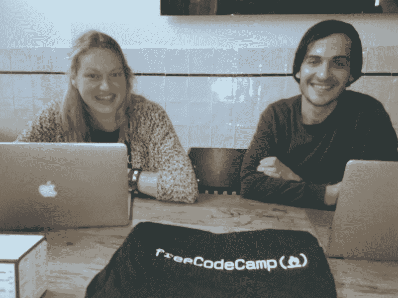

# 拆开任天堂 Switch 看看它是由什么制成的

> 原文：<https://www.freecodecamp.org/news/tearing-apart-a-nintendo-switch-to-see-what-its-made-of-4f9a5ab4b7df/>

这里有三个值得你花时间的链接:

1.  任天堂 Switch 和数百个使游戏系统运行的电子元件的详细拆卸( [10 分钟阅读](http://bit.ly/2lKyp5z)
2.  优步、大众和捷恩斯有什么共同点？他们都使用隐藏代码来违反法律。( [5 分钟读数](http://bit.ly/2lKAqie))
3.  如何选择和配对字体( [8 分钟阅读](http://bit.ly/2m6fqnf)

### 想到这一天:

> 应该注意的是，没有一个受过道德训练的软件工程师会同意编写一个摧毁巴格达的程序。相反，基本的职业道德要求他编写一个摧毁城市的程序，巴格达可以作为一个参数。”纳撒尼尔·博伦斯坦

### 今日趣事:

网络漫画作者 [XKCD](https://xkcd.com/530/)

### 今日学习小组:

[阿姆斯特丹自由代码营](http://bit.ly/2lqleec)

编码快乐！

–昆西·拉森，自由代码营的老师