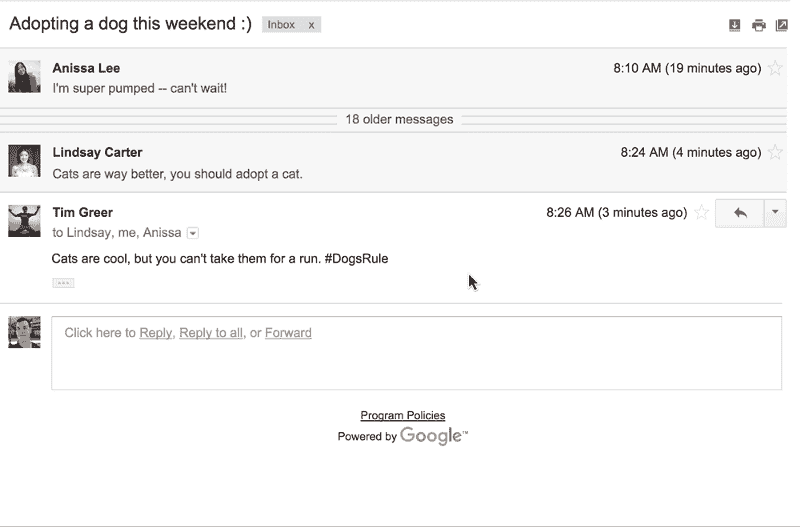
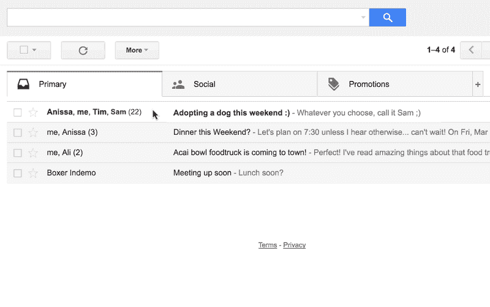
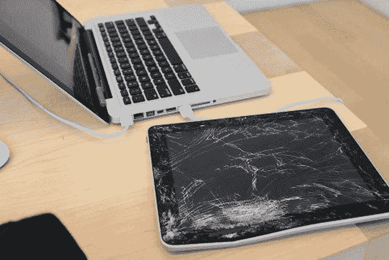
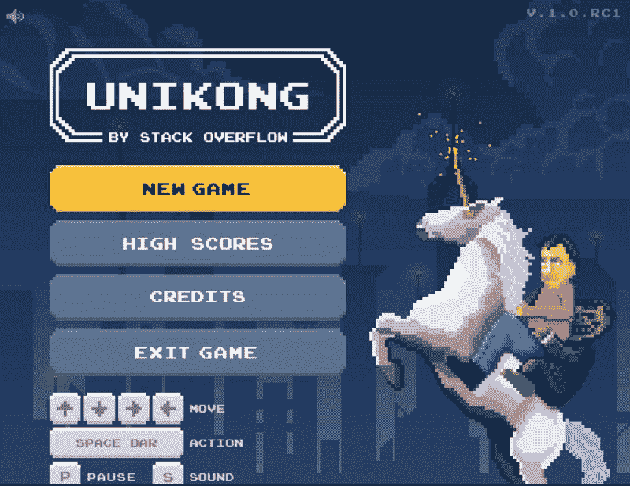

# 2016 年科技行业最佳愚人节玩笑

> 原文：<https://www.freecodecamp.org/news/tech-s-best-april-fool-s-day-jokes-for-2016-ef0bc1e66950/>

我们的开源社区为愚人节玩笑抛出了一些想法。但在我们参考了埃隆·马斯克的流程图后，我们决定把它留给专业人士。

幸运的是，谷歌和它的朋友们确实设法提供了一些荒谬的东西，在某些情况下，甚至打破了第四堵墙:

他们还介绍了一种使用谷歌图片搜索的有用的新方法:

而且——有史以来最大的沟通突破之一——一劳永逸地结束优柔寡断的群发邮件暴政的新方法:

还记得 iPad 秤 app 吗？

嗯，你可能不记得它实际上像上面的图片那样工作，但你肯定记得在 Genius Bar 的那次谈话，当时你要求退款，但没有成功。

事实证明，触摸屏设备能做的不仅仅是测量你的体重，在你拖着不上厕所的时候给你看猫的视频。

呸。你不知道你的触摸屏上有多少细菌吗？哦，等等——你不知道确切的数字？好吧，如果你是一只好奇的猫，这里有一个 [13 步的过程来解决这个问题](http://theoatmeal.com/quiz/phone_germs)。

在法律上允许自动驾驶汽车在大多数道路上行驶还需要几年时间，但今天你可以使用“自动驾驶”汽车。

如果 Zipcar 似乎太努力了，相信我——在你玩过 Stack Overflow 作为他们的愚人节玩笑开发的这款完整版大金刚风格的浏览器游戏之前，你不会看到太努力。

没错——uni kong！

要赢，你必须避开卑鄙的独角兽，建立你的堆栈溢出式的“rep ”,并把巨魔从他们的痛苦中解救出来。

是的，这是一个真实的游戏，你是的，你应该现在就去玩。

你看这篇文章干什么？

点击下面的绿色心形轮廓，然后前往[玩一些 Unikong](http://stackoverflow.com/seriously/unikong) ！

*如果您喜欢，请点击？下面。关注我和免费代码营，获取更多关于技术的文章。*

