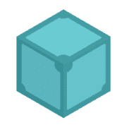
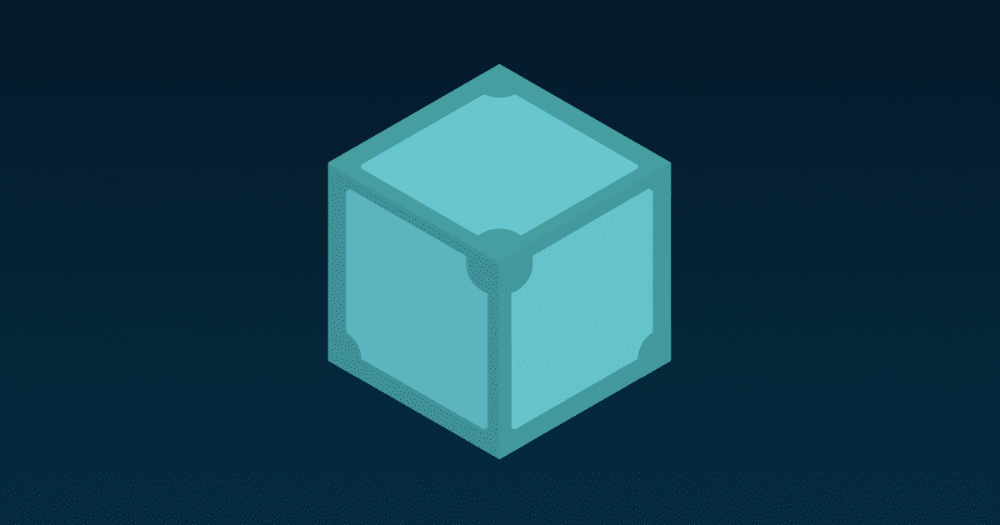
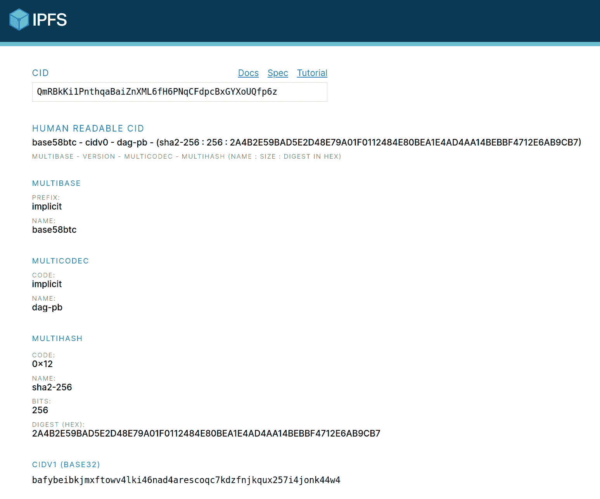
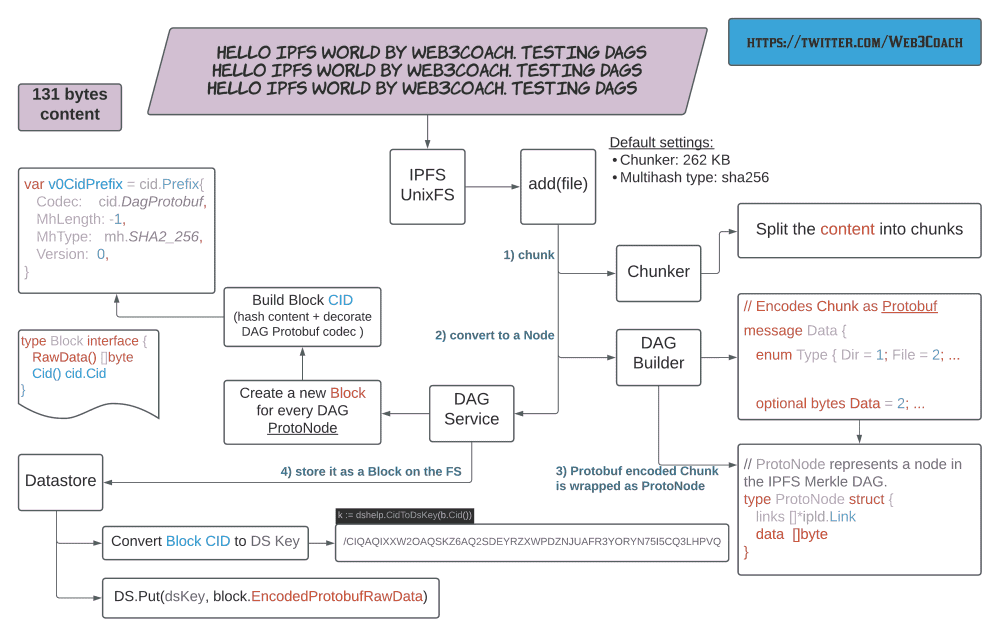
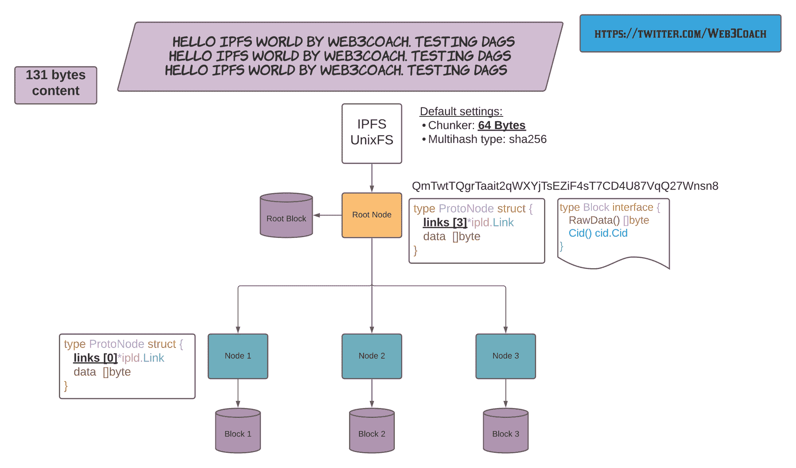
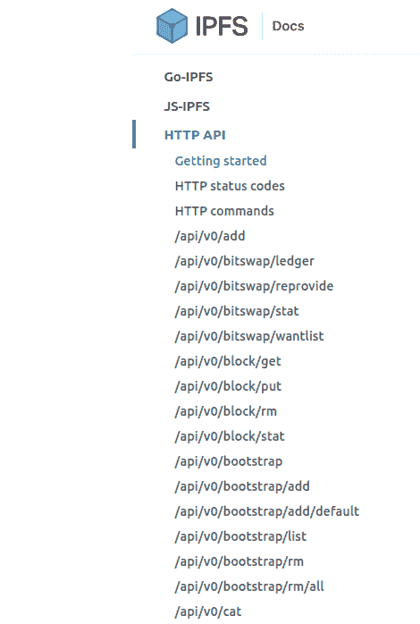
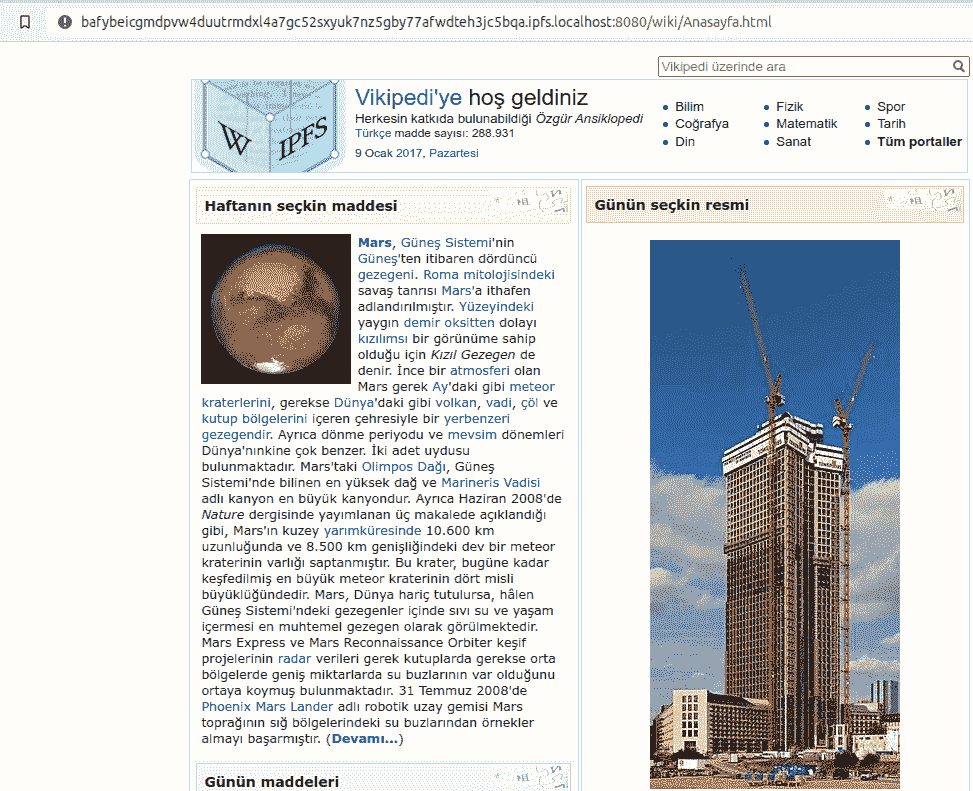
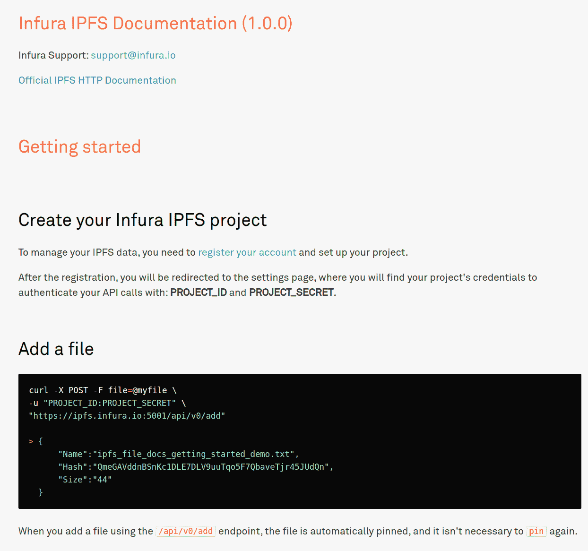

# IPFS 技术指南 Web3 的分散存储

> 原文：<https://www.freecodecamp.org/news/technical-guide-to-ipfs-decentralized-storage-of-web3/>

当您考虑开发一个去中心化的应用程序时，像以太坊这样的区块链可能会出现在您的脑海中。

区块链非常适合管理状态、通过智能合同实现流程自动化以及交换经济价值。

如果你想了解更多，你可以[按照这个教程从头开始建造一个来学习区块链](https://www.freecodecamp.org/news/build-a-blockchain-in-golang-from-scratch/)。

但是你将应用程序的内容存储在哪里呢？图片？视频？应用程序的网站前端由所有的 HTML、CSS 和 JS 文件组成？您的应用程序和用户的内容是从集中的 AWS 服务器加载的吗？

将内容存储在区块链上既昂贵又低效。

您的区块链应用程序需要分散存储！

在本教程中，我将向您介绍星际文件系统，或 IPFS。您将了解到:

1.  如何从分散存储中存储和检索内容
2.  如何运行你的 IPFS 节点
3.  关于 IPFS 协议底层内部的所有内容
4.  我们会阅读储存在 IPFS 的维基百科网站

准备好了吗？我们走吧。

## 目录

*   [什么是 IPFS？](#what-is-the-ipfs)
*   [如何设置 IPFS 节点](#how-to-setup-an-ipfs-node)
*   [如何使用 CLI 和 HTTP 存储和检索 IPFS 内容](#how-to-use-ipfs)
*   [什么是 IPFS 基于内容的标识符 CID](#how-ipfs-content-addressing-works)
*   [如何对 IPFS 数据存储实施反向工程](#how-ipfs-stores-content-on-the-file-system)
*   [如何将 IPFS 节点连接到分散式网络](#how-to-connect-an-ipfs-node-to-the-p2p-network)
*   [如何使用对等比特交换协议交换数据](#how-nodes-exchange-data-using-the-bitswap-protocol)
*   [如何保存来自对等网络的内容](#how-to-persist-content-from-the-p2p-network)

## 什么是 IPFS？

星际文件系统，简称 IPFS，是一种对等超媒体协议，旨在使网络更快、更安全、更开放。

IPFS 是一种用于存储和共享内容的协议。就像在区块链世界一样，每个用户都在运行它的节点(服务器)。这些节点可以相互通信并交换文件。

### IPFS 有什么独特之处？

首先， **IPFS 是分散的**,因为它从成千上万的对等点而不是一个集中的服务器加载内容。每一段数据都经过加密哈希处理，产生一个安全、唯一的**内容标识符** : CID。

把你的网站放在 IPFS，以避免审查和单点故障。你的个人 IPFS 节点离线了？不要担心，该网站仍将从全球各地为其服务的其他节点加载。

例如，假设你的政府禁止维基百科。在这种情况下，你仍然可以通过从 IPFS 点对点网络下载 4 月 17 日索引的维基百科去中心化版本，并保存在 CID:

> **【qmt 5 nvutom 5 nwffdvrftvgfkfmg 7 ah8p 34 isapyhcxx】**

**第二， **IPFS 内容的完整性可以用密码验证。****

**最后，**对 IPFS 内容进行重复数据消除。**如果您尝试在同一个 IPFS 节点中存储两个相同的 1MB 文件，它们将只存储一次，消除了重复，因为它们的散列将产生一个相同的 **CID。****

## **如何设置 IPFS 节点**

### **安装 IPFS**

**打开[IPFS 官方文档](https://docs.ipfs.io/install/)安装页面，根据您的操作系统(Windows、macOS、Linux)按照说明进行操作。我将在下面记录 Ubuntu 的安装过程。**

**[Command-lineUsing IPFS through the command-line allows you to do everything that IPFS Desktop can do, but at a more granular level since you can specify which commands to run. Learn how to install it here.IPFS Docs](https://docs.ipfs.io/install/command-line/#official-distributions)

IPFS installation docs** 

**我更喜欢从头开始编译 [ipfs/go-ipfs](http://github.com/ipfs/go-ipfs) 存储库，以便在需要时调试代码，说实话:GoLang 太棒了。**

#### **在 Go 中编译代码库**

**克隆存储库并在 Makefile 中运行安装脚本。**

```
`git clone https://github.com/ipfs/go-ipfs.git
cd go-ipfs
git checkout v0.8.0-rc2
make install`
```

**或者下载预编译的 IPFS:**

```
`sudo snap install ipfs`
```

### **验证安装**

**实话实说吧。Go 令人惊叹，而自己编译代码库是糟糕的，分散的。生成的二进制文件将在您的`$GOPATH`中创建。**

```
`which ipfs
> /home/web3coach/go/bin/ipfs

ipfs version
> ipfs version 0.8.0-rc2`
```

### **初始化一个新节点**

**运行`ipfs init`来创建您的新节点。默认情况下，它会创建一个文件夹并将所有数据存储在`~/.ipfs`中，你可以通过配置`IPFS_PATH` ENV 变量来调整它。**

```
`IPFS_PATH=/home/web3coach/.ipfs_tutorial ipfs init

> generating ED25519 keypair...done
> peer identity: 12D3Koo...dNs
> initializing IPFS node at /home/web3coach/.ipfs_tutorial`
```

**您的节点现在已经完全初始化，正在等待您的内容。**

## **如何使用 IPFS**

### **添加内容**

**IPFS 可以处理各种不同的数据类型——从简单的字符串到图像、视频和网站。**

**首先存储一条短消息`hello IPFS world by Web3Coach`:**

```
`echo "hello IPFS world by Web3Coach. BTW: Ethereum FTW" | ipfs add`
```

**内容现在被存储，并且由返回其唯一内容标识符(CID)的加密散列函数对**进行索引:****

```
`> added QmRBkKi1PnthqaBaiZnXML6fH6PNqCFdpcBxGYXoUQfp6z
> 49 B / 49 B [========] 100%`
```

**您的 IPFS 节点将在您的本地文件系统上生成与本教程中相同的 CID。这是因为 IPFS 散列内容并返回其唯一的指纹，正如我们所知，安全散列函数将总是返回相同的输入相同的输出。**

### **Pin 内容**

**当您`add`内容时，您只将它添加到您的本地节点。**内容不会在整个网络中自动复制**——这是 IPFS 用户和开发者之间的常见困惑。**

**当您通过`add`命令存储内容时，默认情况下，IPFS 也会执行`pin`命令:**

```
`ipfs pin add QmRBkKi1PnthqaBaiZnXML6fH6PNqCFdpcBxGYXoUQfp6z`
```

**为了复制内容，**您必须使您的节点联机，加入 p2p 网络，并从另一个节点获取特定的 CID。**你将在教程中进一步学习如何做到这一点，并了解后台发生了什么。**

### **阅读内容**

**将 **CID** 复制粘贴到 IPFS `cat`命令，从磁盘中读取:**

```
`ipfs cat QmRBkKi1PnthqaBaiZnXML6fH6PNqCFdpcBxGYXoUQfp6z
> hello IPFS world by Web3Coach. BTW: Ethereum FTW`
```

**`add`、`pin`和`cat`命令是最重要的 IPFS 函数，您刚刚学习了它们。恭喜，干得好！**

## **IPFS 内容寻址的工作原理**

**什么是 qmrbkki 1 pnthqabaiznxml 6 FH 6 pnqcfdpcbxgyxouqfp 6 z？**

**它是一个自描述的基于内容的标识符。**

**「自我描述」实际上是什么意思？这意味着，通过按照 IPFS 规范分割字符串，您将了解它所索引的数据的所有信息。**

*   **这是什么 CID 版本**
*   **如何读取 CID 字符串(base32？base58？妖术？)**
*   **数据是如何编码的**
*   **哪个哈希函数提取了数据的指纹**
*   **哈希函数的长度**

**IPFS 团队建立了一个方便的[网站](https://cid.ipfs.io/)用于分析 CID:**

****

**通过解析 **QmRBkKi1P…p6z** CID，您会发现:**

*   **CID 遵循版本 0 规范，因为它以 **Qm** 开始**
*   **使用`base58btc`对 **QmRBkKi1P…p6z** 字符串进行编码**
*   ****你好，IPFS 世界。顺便说一句:以太坊 FTW** 在存储到磁盘之前，在编解码器 **0x70** 下被编码为 **DAG Protobuf****
*   **散列码 **0x12** 表示使用`sha256`散列函数获得的数据指纹，产生唯一的 32 字节长的摘要**

**比 MySQL 表中简单的自动增量 INT“稍微复杂一些”...但是非常有力的未来证据。让我解释一下。**

### **CID 版本**

**目前有两个 CID 版本: **v0** 和 **v1** 。**

****CID v 0**不灵活，仅限于:**

*   **以字符“Qm”开头**
*   **其中 CID 字符串使用 base58btc 编码**
*   **默认情况下，数据用 dag-pb 编码**
*   **可以转换为 CID 版本 1，但不能反过来**

****CID v1**利用多个前缀实现最大的互操作性:**

> **CID v1 =多基+多码+多散列**

**换句话说，将二进制文件解析为 CID v1 字符串遵循以下规范:**

**`<base><codec><hash-function><hash-length><hash-digest>`**

### **多重散列**

**为了适应未来并支持不同的哈希算法，IPFS 创建了以下标准:**

**代码:尺寸:摘要**

```
`type DecodedMultihash struct {
   Code   uint64 // 0x12
   Name   string // sha2-256
   Length int    // 32 bytes
   Digest []byte // Digest holds the raw multihash bytes
}`
```

**Multihash 有很多优点。当计算机在 5 年内变得更强大时，你可以使用像`sha3-512`这样更强的散列函数，只要你将相应的`0x13`代码配置为 CID 前缀中的 Multihash 协议将准备好处理它。**

### **多码**

**`Code`属性告诉你**数据在被存储到磁盘上之前是如何被编码**的，所以你知道**当用户想要读取它的时候如何解码**。它可能是任何 CBOR，Protobuf，JSON…**

**IPFS 维护着所有可能的编解码器的公开列表。最常见的编解码器有:**

```
`raw       | ipld      | 0x55 | raw binary
dag-pb    | ipld      | 0x70 | MerkleDAG protobuf
dag-cbor  | ipld      | 0x71 | MerkleDAG cbor

// but you could also encode Ethereum blocks on IPFS!
eth-block | ipld      | 0x90 | Ethereum Block (RLP)`
```

### **多基地**

**CID v0 和`base58btc`编码的问题是缺乏环境之间的互操作性。多基前缀增加了对不同编码的支持，如`base32`，以实现 DNS 友好的名称。**

**[包含所有多基编码的表格](https://github.com/multiformats/multibase/blob/master/multibase.csv):**

```
`encoding  | code
base32    | b
base58btc | z
base64    | m`
```

**您发现了基于第一个字符的多基编码:**

****Q**mrb kki 1 pnhqabaiznxml 6 FH 6 pnqcfdpcbxgyxouqfp 6 z**

*   **是 CID `v0`**
*   **CID 字符串用`base58btc`编码**

****b**afybeibkkkjxftowv 4 lki 46 nad 4 arescoqc 7 kdznjkqx257 i4jonk 44 w4**

*   **CID `v1`**
*   **CID 字符串用`base32`编码**

**两个 CID 版本可以检索相同的内容，因为在去除编码之后，是 **Multihash** 在数据存储级别上索引数据块。相比之下，Multibase 仅用于在不同的环境(CLI、URL、DNS)中正确传递 CID。**

```
`ipfs cat QmRBkKi1PnthqaBaiZnXML6fH6PNqCFdpcBxGYXoUQfp6z
> hello IPFS world by Web3Coach. BTW: Ethereum FTW

// equivalent to
ipfs cat bafybeibkjmxftowv4lki46nad4arescoqc7kdzfnjkqux257i4jonk44w4
> hello IPFS world by Web3Coach. BTW: Ethereum FTW`
```

**唷。事情很快变得“有点复杂”。**

**说到复杂的主题，IPFS 是强大的，因为它不仅仅将内容视为“数据”，而是将内容视为**数据结构**–**特别是**星际链接数据**结构: [IPLD](https://docs.ipld.io/#what-is-ipld) 。简而言之，您可以在 IPLD 之上实现任何文件系统、数据库或结构。****

****例如，您可以在 IPFS 上存储所有以太坊块，只要您设置`eth-block`和`eth-tx`编解码器，并在使用 IPLD 图时注册一个合适的解码器。****

****让我们深入研究一下，并探索一下 DAG Protobuf 编解码器的默认 IPLD 结构。****

## ****IPFS 如何在文件系统上存储内容****

****“`ipfs add`命令将从遵循 [UnixFS 数据格式](https://github.com/ipfs/go-unixfs/blob/master/pb/unixfs.proto)的数据中创建一个 **Merkle DAG** 。使用**分块器**将您的内容分解成**块**，然后使用将它们连接在一起，排列成**树状结构。返回的 CID 是 DAG 中根节点的哈希。******

****迷茫？****

****回归基础。****

### ****让我们探索节点的数据目录****

****在本教程的开始，当您用`ipfs init`命令初始化 IPFS 节点时，您生成了以下目录:****

```
**`export IPFS_PATH=/home/web3coach/.ipfs_tutorial
cd $IPFS_PATH
~/.ipfs_tutorial  tree

.
├── blocks
│   ├── 6Y
│   │   └── CIQA4XCGRCRTCCHV7XSGAZPZJOAOHLPOI6IQR3H6YQ.data
├── config
├── datastore
│   ├── 000002.ldb
│   ├── 000003.log
│   ├── CURRENT
│   ├── CURRENT.bak
│   ├── LOCK
│   ├── LOG
│   └── MANIFEST-000004
├── datastore_spec
├── keystore
└── version`**
```

****从一个非常**高层次的角度来看:******

*   ****`blocks` — IPFS 在这里存储所有的分块数据，尽管`go-ipfs`灵活的接口**允许您为不同的数据库交换存储实现******
*   ****`config` —节点的设置(文件系统、身份、规格、网络)****
*   ****`datastore` —索引和其他逻辑****

****不要相信我的话。在本地文件系统上创建一个包含以下内容的新文件，然后将其添加到 IPFS:****

```
**`hello IPFS world by Web3Coach. Testing DAGs
hello IPFS world by Web3Coach. Testing DAGs
hello IPFS world by Web3Coach. Testing DAGs

ls -la hello_world.txt
> 131 bytes hello_world.txt

ipfs add hello_world.txt
> added QmNtQtxeavDXTjCiWAAaxnhKK3LBYfFfpXUXjdMDYXwKtH`**
```

****对`go-ipfs`代码库进行逆向工程，这是幕后发生的事情:****

****

IPFS UnixFS adding a new file and converting it to a block**** 

****通过检查块目录来验证持久性过程。您会发现内容是使用 **DAG Protobuf 编码** (131 字节+ Protobuf 额外编码)写在 Multihash Datastore 键下的。****

```
**`ls -la blocks/PV/
> 142 CIQAQIXXW2OAQSKZ6AQ2SDEYRZXWPDZNJUAFR3YORYN75I5CQ3LHPVQ.data

vim blocks/PV/CIQA...
<8b>^A^H^B^R<83>^Ahello IPFS world by Web3Coach. Testing DAGs
hello IPFS world by Web3Coach. Testing DAGs
hello IPFS world by Web3Coach. Testing DAGs^X<83>^A`**
```

****要与原始内容交互，请使用`ipfs object`命令。****

```
**`ipfs object get QmNtQtxeavDXTjCiWAAaxnhKK3LBYfFfpXUXjdMDYXwKtH | jq`**
```

```
**`{
  "Links": [],
  "Data": "\b\u0002\u0012�\u0001hello IPFS world by Web3Coach. Testing DAGs\nhello IPFS world by Web3Coach. Testing DAGs\nhello IPFS world by Web3Coach. Testing DAGs\u0018�\u0001"
}`**
```

*   ****因为内容只有 131 个字节，所以它适合一个 DAG 节点****
*   ****Dag 节点在磁盘上作为一个数据块保存****
*   ****DAG 节点没有到其他节点的链接****

****该实验了。****

****再次添加同一个文件，但是将分块器配置为 64 字节(或者使用更大的文件，但是更小的分块器将更好地演示这个概念)。****

```
**`ipfs add --chunker=size-64 hello_world.txt

> 131 bytes QmTwtTQgrTaait2qWXYjTsEZiF4sT7CD4U87VqQ27Wnsn8`**
```

****你得到了一个新的 CID！****

****IPFS 将内容拆分为 4 个 DAG 节点，并将包含以 DAG Protobuf 格式编码的数据的 4 个数据块写入磁盘。****

****

IPFS splits a file into multiple chunks (DAG Nodes + Blocks)**** 

```
**`ipfs object get QmTwtTQgrTaait2qWXYjTsEZiF4sT7CD4U87VqQ27Wnsn8 | jq`**
```

```
**`{
  "Links": [
    {
      "Name": "",
      "Hash": "QmTbsuUYzy3nT6NApb5t7VUq3iQKZXrJJJY2j1miMVgaJU",
      "Size": 72
    },
    {
      "Name": "",
      "Hash": "QmNy9iFF8uU1Cn7trxpSgqxMsjmi4zQ7xgyEgsWff5rnfH",
      "Size": 72
    },
    {
      "Name": "",
      "Hash": "QmdEitCfYgBNxLhxTNvdLaDmTypSAWkGErjw33VZxUbWK3",
      "Size": 11
    }
  ],
  "Data": "\b\u0002\u0018�\u0001 @ @ \u0003"
}`** 
```

****最终测试是检索每个 DAG 节点的数据，并验证文本是否被分成三个块:****

******DAG Protobuf Node 1:******

```
**`ipfs object get QmTbsuUYzy3nT6NApb5t7VUq3iQKZXrJJJY2j1miMVgaJU | jq`**
```

```
**`{
  "Links": [],
  "Data": "\b\u0002\u0012@hello IPFS world by Web3Coach. Testing DAGs\nhello IPFS world by \u0018@"
}`**
```

******DAG Protobuf Node 2:******

```
**`ipfs object get QmNy9iFF8uU1Cn7trxpSgqxMsjmi4zQ7xgyEgsWff5rnfH | jq`**
```

```
**`{
  "Links": [],
  "Data": "\b\u0002\u0012@Web3Coach. Testing DAGs\nhello IPFS world by Web3Coach. Testing D\u0018@"
}`**
```

******DAG Protobuf Node 3:******

```
**`ipfs object get QmdEitCfYgBNxLhxTNvdLaDmTypSAWkGErjw33VZxUbWK3 | jq`**
```

```
**`{
  "Links": [],
  "Data": "\b\u0002\u0012\u0003AGs\u0018\u0003"
}`**
```

### ****将内容分成多个块并使用内容寻址和 cid 有什么好处？****

*   ****重复数据删除****
*   ****分散****

****下次你想存储一个文件，将与另一个文件共享部分内容，IPFS 不会存储一个重复的块！相反，它将链接到一个已经存在的 DAG 节点，并且只存储新的、唯一的块。****

****将内容转换成具有许多节点的有向无环图也有助于并行加载内容。例如，一篇博客文章、图片、整个维基百科网站都可以从多个 IPFS 对等节点加载。然后，您的节点通过重新散列所有数据内容并断言构造的 CID 来验证接收到的块的完整性。****

****你现在已经学会了 IPFS 的面包和黄油——进步很大！****

****还有一个更重要的部分:**网络**。****

## ****如何将 IPFS 节点连接到 p2p 网络****

****每个节点都有在执行`ipfs init`期间生成的`config`文件。****

****打开它。****

```
**`vim $IPFS_PATH/config`**
```

****抛开其他设置，你找到你的节点的**身份(PeerID +私钥):******

```
**`"Identity": {
    "PeerID": "12D3KooWCBmDtsvFwDHEr...",
    "PrivKey": "CAESQCj..."
  },`**
```

****和一列**引导地址:******

```
**`"Bootstrap": [
    "/dnsaddr/bootstrap.libp2p.io/p2p/QmcZf59b...gU1ZjYZcYW3dwt",
    "/ip4/104.131.131.82/tcp/4001/p2p/QmaCpDMG...UtfsmvsqQLuvuJ",
    "/ip4/104.131.131.82/udp/4001/quic/p2p/Qma...UtfsmvsqQLuvuJ",
    "/dnsaddr/bootstrap.libp2p.io/p2p/QmNnooD5...BMjTezGAJN",
    "/dnsaddr/bootstrap.libp2p.io/p2p/QmQCU2Ec...J16u19uLTa",
    "/dnsaddr/bootstrap.libp2p.io/p2p/QmbLHAnM...Ucqanj75Nb"
  ],`**
```

****通过运行`ipfs daemon`命令，您可以连接到 IPFS 网络中的其他对等点。您的节点将首先与 Protocol Labs(IPFS 背后的公司)引导节点建立 p2p 连接，通过这些引导节点，您将进一步找到数百个其他对等节点。****

```
**`ipfs daemon 

> Initializing daemon...

Swarm listening on /ip4/127.0.0.1/tcp/4001
Swarm listening on /ip4/127.0.0.1/udp/4001/quic
Swarm listening on /ip4/172.17.0.1/tcp/4001
Swarm listening on /ip4/172.17.0.1/udp/4001/quic
Swarm listening on /ip4/192.168.0.142/tcp/4001
Swarm listening on /ip4/192.168.0.142/udp/4001/quic
Swarm listening on /ip6/::1/tcp/4001
Swarm listening on /ip6/::1/udp/4001/quic
Swarm listening on /p2p-circuit
Swarm announcing /ip4/127.0.0.1/tcp/4001
Swarm announcing /ip4/127.0.0.1/udp/4001/quic
Swarm announcing /ip4/192.168.0.142/tcp/4001
Swarm announcing /ip4/192.168.0.142/udp/4001/quic
Swarm announcing /ip4/88.212.40.160/udp/4001/quic
Swarm announcing /ip6/::1/tcp/4001
Swarm announcing /ip6/::1/udp/4001/quic

API server listening on /ip4/127.0.0.1/tcp/5001
WebUI: http://127.0.0.1:5001/webui

Gateway (readonly) server listening on /ip4/127.0.0.1/tcp/8080
Daemon is ready!`**
```

****请记住，通过运行 **IPFS 守护进程**:****

1.  ****您的节点连接到 p2p 网络，并且可以**与其他节点**交换块****
2.  ****其他对等体只要知道 cid，就可以访问您的节点–**上的内容******
3.  ******对等点会通过 TCP，UDP 在端口上跟你对话: **4001********
4.  ****如果您有一个应用程序，通过 HTTP API 监听端口: **5001** 开始存储和消费您的节点的内容。****

****对于应用程序开发，我推荐 JS 中的官方 [ipfs-http-client](https://www.npmjs.com/package/ipfs-http-client) 库公开所有核心命令——add、cat、object 和其他命令。它会加快你的编码进度。****

****我将使用`curl`与 API 进行交互，以保持本教程的“简短”****

### ****如何使用 IPFS HTTP API:****

******添加内容:** :5001/api/v0/add****

```
**`curl -X POST -F file=@/home/web3coach/go/src/github.com/ipfs/go-ipfs/hello_world.txt "http://127.0.0.1:5001/api/v0/add"`**
```

```
**`{"Name":"hello_world.txt","Hash":"QmNtQtxeavDXTjCiWAAaxnhKK3LBYfFfpXUXjdMDYXwKtH","Size":"142"}`**
```

******读取内容:** :5001/api/v0/cat****

```
**`curl -X POST "http://127.0.0.1:5001/api/v0/cat?arg=QmNtQtxeavDXTjCiWAAaxnhKK3LBYfFfpXUXjdMDYXwKtH"

hello IPFS world by Web3Coach. Testing DAGs
hello IPFS world by Web3Coach. Testing DAGs
hello IPFS world by Web3Coach. Testing DAGs`**
```

****关于可用命令的完整列表，请参见[官方 HTTP API 文档](https://docs.ipfs.io/reference/http/api/#getting-started)。****

********

### ****如何与其他 IPFS 节点对等****

****有趣的实验。使用`ipfs swarm`命令并检查您已经发现了多少个节点:****

```
**`ipfs swarm peers

> 
/ip4/85.70.151.37/tcp/4001/p2p/QmSuCtR...aPq6h4AczBPZaoej
/ip4/91.121.168.96/udp/54001/quic/p2p/QmeC7H...8j2TQ99esS
...
...
...

ipfs swarm peers | wc -l
> 186`**
```

****太棒了。你连接着 186 个同伴，形成了一个不可阻挡的点对点网络。****

### ****隐私呢？****

****其他对等用户可以访问您添加到 IPFS 节点的所有内容。没有内置的隐私机制，所以不要将未加密的敏感/个人内容添加到 IPFS！****

## ****节点如何使用位交换协议交换数据****

****到目前为止，您只与您的本地内容进行了交互。想象一下，你住在一个地方，当地政府决定禁止访问维基百科。不太好。****

****幸运的是，因为有人将所有维基百科的内容添加到了 IPFS，所以你可以运行你的节点，通过向全球的同行请求内容来访问它的知识。****

****[http://localhost:8080/IPF/qmt 5 nvutom 5 nwffdvrftvgfkfmg 7 ah8p34 isapyhcxx/wiki/anasay fa . html](http://localhost:8080/ipfs/QmT5NvUtoM5nWFfrQdVrFtvGfKFmG7AHE8P34isapyhCxX/wiki/Anasayfa.html)****

****DAG 服务将检查数据存储中的块，但它不会为 qmt 5 nvutom 5 nwffrqdvrftvgkfmg 7 ahe 8 p 34 isapyhcxx 找到任何块。****

****因此，该节点将通过`exchange`组件使用位交换协议向其对等节点创建网络请求:****

```
**`func getBlock(ctx context.Context, c cid.Cid, bs blockstore.Blockstore, fget func() exchange.Fetcher) (blocks.Block, error) {
   err := verifcid.ValidateCid(c) // hash security
   if err != nil {
      return nil, err
   }

   block, err := bs.Get(c)
   if err == nil {
      return block, nil
   }

   if err == blockstore.ErrNotFound && fget != nil {
      f := fget() // Don't load the exchange until we have to

      log.Debug("Blockservice: Searching bitswap")
      blk, err := f.GetBlock(ctx, c)`**
```

****在内部，CID 被添加到一个`Wantlist`:****

```
**`// Wantlist is a raw list of wanted blocks and their priorities
type Wantlist struct {
   set map[cid.Cid]Entry
}

// Entry is an entry in a want list, consisting of a cid and its priority
type Entry struct {
   Cid      cid.Cid
   Priority int32
   WantType pb.Message_Wantlist_WantType
}`**
```

****并且`PeerManager`将迭代已知的对等点和它们的对等点，直到它找到能够提供想要的块的在线节点:****

```
**`// PeerManager manages a pool of peers and sends messages to peers in the pool.
type PeerManager struct {
   pqLk sync.RWMutex

   peerQueues map[peer.ID]PeerQueue
   pwm        *peerWantManager

   createPeerQueue PeerQueueFactory
   ctx             context.Context

   psLk         sync.RWMutex
   sessions     map[uint64]Session
   peerSessions map[peer.ID]map[uint64]struct{}

   self peer.ID
}`**
```

****结果呢？****

****您可以直接从 **localhost:8080** 消费维基百科上的禁果:****

****

IPFS loading Wikipedia on your local node**** 

****不可审查的分散存储:)****

## ****如何保存 p2p 网络中的内容****

****你必须知道一件关于 IPFS 的重要事情:你从网络上获取的内容将被垃圾收集，除非你 **pin** 它。****

### ****锁定和垃圾收集****

****在本文的开头，您了解到通过`ipfs add`命令或其 HTTP 等价物添加到节点的内容在默认情况下是固定的。****

```
**`ipfs pin ls | grep QmNtQtxeavDXTjCiWAAaxnhKK3LBYfFfpXUXjdMDYXwKtH
> QmNtQtxeavDXTjCiWAAaxnhKK3LBYfFfpXUXjdMDYXwKtH recursive`**
```

******当垃圾收集运行时，固定的块被标记为不被删除**。****

****为什么垃圾收集会删除一些块？通过控制节点的存储大小来保持其健康。****

****通过阅读维基百科或从 p2p 网络访问任何其他内容，IPFS 下载了它的区块。随着节点的数据存储区大小的增长，定期的垃圾收集过程将删除未固定的块，因此您不会耗尽磁盘空间。****

****如果你希望你的内容在 IPFS 网络上 24/7 都可以访问，我建议你使用一个可靠的远程提供商来固定它: **[Infura](https://infura.io/docs/ipfs?utm_source=web3coach&utm_medium=article) -** 是最容易开始的方式，你可以获得 5GB 的免费分散存储空间。****

********

****遵循[入门文档。](https://infura.io/docs/ipfs?utm_source=web3coach&utm_medium=article)****

### ****如何在本地锁定维基百科****

****验证 Wikipedia 根级 CID(最高 DAG 节点)尚未固定在您的节点上:****

```
**`ipfs pin ls | grep QmT5NvUtoM5nWFfrQdVrFtvGfKFmG7AHE8P34isapyhCxX
> no output, not pinned`**
```

****IPFS 以 DAG 的形式存储维基百科的特定版本。我建议在锁定之前检查它的图形:****

```
**`ipfs object get QmT5NvUtoM5nWFfrQdVrFtvGfKFmG7AHE8P34isapyhCxX | jq`**
```

```
**`{
  "Links": [
    {
      "Name": "0C-",
      "Hash": "QmSEwJo8Z5bqVX3AhocyimJzPWetr7HgbWbwCg6zbp43AP",
      "Size": 1248085
    },
    {
      "Name": "43I",
      "Hash": "QmPW3kRjncDj145bP9DVNc791FowLPwYHnqbTzfe3whdyZ",
      "Size": 2611324931
    },
    {
      "Name": "58wiki",
      "Hash": "QmRNXpMRzsTHdRrKvwmWisgaojGKLPqHxzQfrXdfNkettC",
      "Size": 12295304394
    },
    {
      "Name": "92M",
      "Hash": "Qmbcvk7jpBTUKdgex139Nvv7BrKocE3pQVKhNJtTU77Qv5",
      "Size": 793
    },
    {
      "Name": "A0index.html",
      "Hash": "QmNqbYogAxH4mmt5WhuKN7NFEUDZ9V3Scxh7QbLwTKBJDk",
      "Size": 191
    }
  ],
  "Data": "\b\u0005\u0012\u0015\u0001\u0000\u0004\u0000\u0000\u0000\u0000\u0000\u0000\u0001\u0000\u0000\b\u0000\u0000\u0000\u0000\u0000\u0000\u0010\u0000(\"0�\u0002"
}`**
```

****根 DAG 对象有五个链接。四个链接相对较小，但是**一个链接指向一个总大小为 12GB 的 DAG 节点。**如果您检查这个 DAG 节点，您将看到多了 256 个链接，总累积(递归)大小为 12GB。****

```
**`ipfs object stat QmRNXpMRzsTHdRrKvwmWisgaojGKLPqHxzQfrXdfNkettC

NumLinks:       256
BlockSize:      12075
LinksSize:      12034
DataSize:       41
CumulativeSize: 12295304394`**
```

****每一个有重要文章、视频、纪录片或猫迷因的节点都让网络变得更容易访问、更不脆弱、更分散和更强大。****

```
**`ipfs pin add QmT5NvUtoM5nWFfrQdVrFtvGfKFmG7AHE8P34isapyhCxX`**
```

****锁定过程将递归遍历整个 DAG 节点，从 Bitswap 协议中获取其所有链接，然后将每个数据块锁定到您的本地数据存储。****

****恭喜你！在本文中，您了解了分散存储是如何在幕后工作的。****

### ****我花了 47 个小时写了这篇博文…但是你可以在 5 秒钟内转发它:****

> ****如何成为一名 Web3 区块链开发者？
> 
> 我从 2018 年开始编程以太坊 app，我的目标是将 1000 名开发者带入区块链生态系统。
> 
> 如果你想学习分布式和去中心化系统，我会在这个 WIP roadmap🧵和你分享我所有的知识****
> 
> ****— Lukáš Lukáč (@Web3Coach) [June 21, 2021](https://twitter.com/Web3Coach/status/1406997483281174528?ref_src=twsrc%5Etfw)****