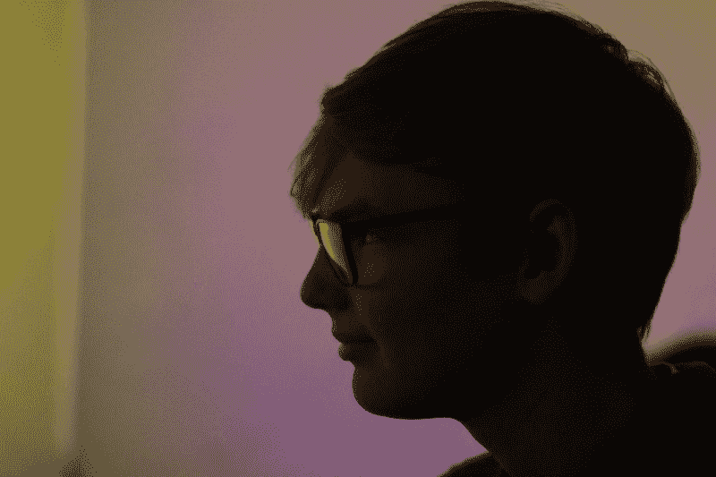
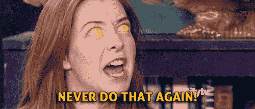
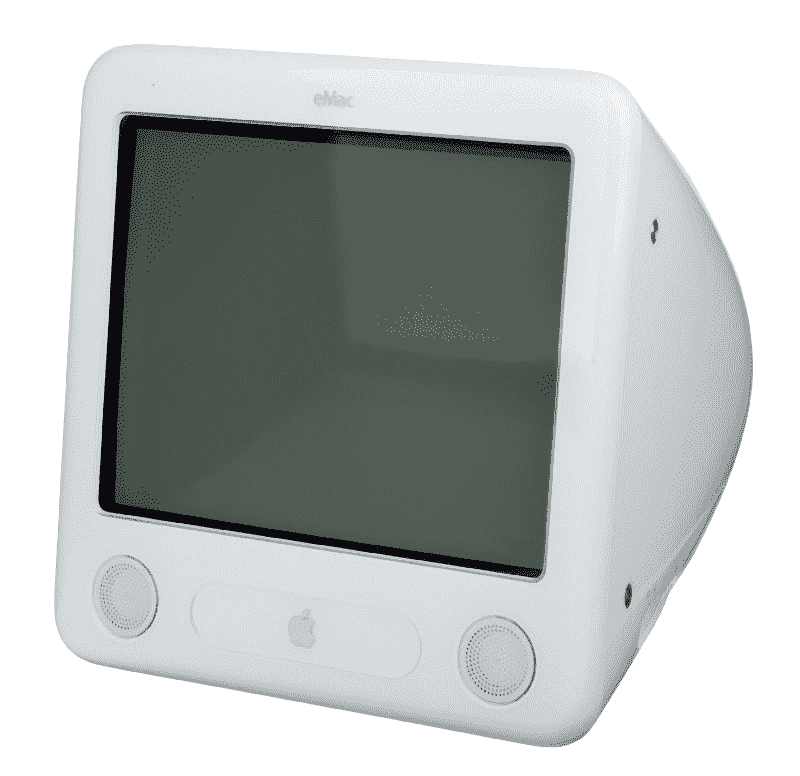
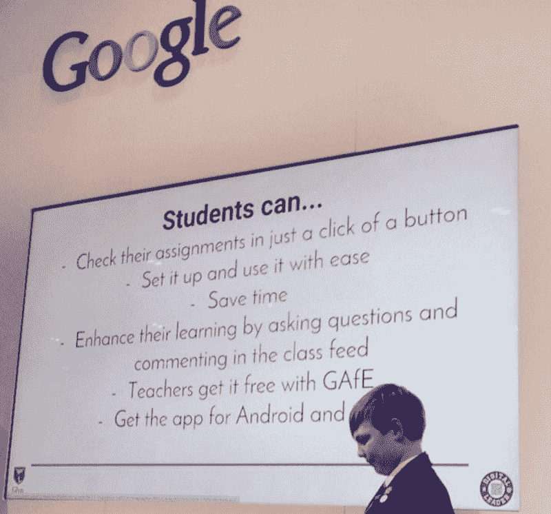
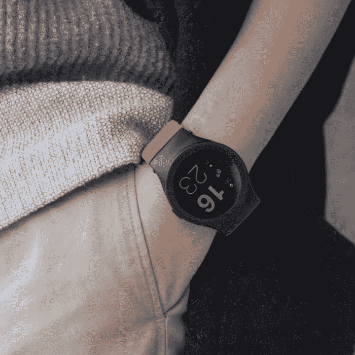

# 技术和我:在数字时代成长

> 原文：<https://www.freecodecamp.org/news/technology-me-growing-up-in-the-digital-age-f628f656558e/>

卢卡斯·约翰斯顿

# 技术和我:在数字时代成长

Since this is my first post, I thought I’d include this arty photo of me my friend took. Now you know what I look like. Or at least what my silhouette looks like.

17 岁时，我作为一名软件工程师在斯特林银行工作，我意识到我有一种独特的能力，可以让我的任何同事很快感到自己很老。

事实上，就在几天前，我们几个人在吃午饭时，有人提起了上中学的话题——我高兴地插话说，我去年刚刚完成了普通中等教育证书考试！我得到了一个响亮的信息，永远不要说这样的话，永远不要。

accurate representation of my colleagues.

作为一个孩子，我在科技的包围中长大。我不记得有哪一个时代没有点击几下万维网，因为我从未存在于一个没有万维网的时代。信不信由你，Google AdWords 和我差不多大。模拟人生比我大八个月。Windows ME 比我大不到 4 个月。可怕吧。

在我成长的同时，科技也在成长。

每年我都会长大一点。最新的笔记本电脑也是如此。

一年比一年聪明。最新的智能手机也是如此。

每年我都会长得更快一点。最新的处理器也会如此。

这激起了我的好奇心——我总是有兴趣了解这些奇怪的、神奇的机器以及它们是如何工作的。这在我很小的时候就很明显了(至少我妈妈是这么认为的)。每当我一拿到电脑，我就兴奋不已。我会浏览每个应用程序，看看我能做什么，看看当我按下*这个*按钮时会发生什么，看看当我输入*那个*键时会发生什么。

在我意识到这一点之前，我的父亲用手指控制着他的手机，我的母亲在车里开着一个设备尖叫着*“在可能的地方掉头”，*我的姐姐在这个带屏幕的小黑盒子里听着她的音乐，我的朋友们在马里奥赛车上用我们的 DS Lites 和我比赛，我们都不明白这个 WFC 的东西。

我的图钉板上有一句名言，它定义了我想要的生活——这句名言提醒我不要想太多，而要活在当下。

> "预测未来的最好方法是创造未来."—艾伦·凯

#### 我的电脑史

我和一个 eMac 一起长大，玩弹珠爆破金，试图从这个我听说过的叫做“Frostwire”的很酷的应用程序下载电影(那句话的关键词是“尝试”)。后来有一天，我爸从苹果店带了一台 iMac 回家。

Remember eMacs?

老实说，在我的一生中，我想不出有哪个时刻比 9 岁的我第一次看到我们桌上的电脑更让我兴奋的了。

我觉得这个地球上没有两台电脑比我的老 eMac 和 iMac 被虐的还多。在探索和发现的过程中，我可能下载了一些病毒在上面。

嗯，我说几个…

好吧，是的，我承认在下载恶意软件和间谍软件的时候，我可能已经把自己吓得不省人事很多次了，天知道还有什么恶意代码下载到那些电脑上。但随着时间的推移，我慢慢变得更加网络聪明。我知道了什么东西是“可以点击的”,什么东西不是。这实际上是反复试验。

这差不多就是我现在所知道的关于计算机的一切。

反复试验。

例如，当我 7 岁时，我在一个网站上(我*相信*是 BBC 主页)决定在 Safari 中点击“另存为”，只是想看看它会做什么。不出所料，它加载了我之前看到的网站的一个看起来有点不可靠的版本。

我很好奇，我决定用文字处理器打开它，看看会发生什么。让我惊讶的是，它打开了这个怪异的文本文件，里面有些字我懂，有些字我不懂，到处都是这些怪异的<>符号。

其中一个单词是“黑色”，所以我把它改成了“红色”，看看会发生什么。我保存了文件，并再次在 Safari 中打开它，这次页面上的一个元素变成了红色。

我一点也不知道，这是我尝试编码的关键时刻。

#### 成为数字领导者并深入挖掘技术

通过在 2010 年得到我的第一个 Raspberry Pi，我开始更多地了解 Python。多亏了 Codecademy 这样的网站(部分是因为英国计算 GCSE 教学大纲)，我开始发展我在 HTML、CSS、JavaScript、jQuery 和 Python 方面的技能。我甚至开始为一些当地企业开发网站，为自己赚点零花钱。

在学校的时候，我真的陷进了计算系。我的两位老师——我过去常常这样称呼他们，麦肯纳先生和哈丁小姐——领导着这个系，他们教会了我很多东西。我要感谢他们两个，还有阿巴比奥先生(我的第一位家庭教师/信息技术老师)，在整个中学期间，他们一直鼓励和激励着我——尤其是考虑到我知道自己在 11 岁时是多么令人恼火！

2013 年，我成为了本·劳斯领导下的学校的“数字领袖”。数字领导者实际上是学生，他们是教育技术大使。我们努力在课堂上推广技术的使用，并建议教师和管理人员如何改进技术以提高教育水平。

作为其中的一部分，我被邀请参加 2015 年 BETT 会议，在谷歌展台上与我们学校的其他几位数字领袖交谈，主要是关于我们如何在课堂上整合技术。

演讲结束后，我一直与谷歌的人保持联系，并成为他们“教育应用”的大使——我现在意识到，这是我第一次尝试与科技公司建立联系和互动。

A very flattering photo of 14-year old me talking on the Google stand at BETT

几年后，在阅读一些科技博客时，我偶然发现了这篇关于模块化智能手表的帖子——它有点像谷歌的 Project Ara，但在你的手腕上，这让我着迷。

在我看来，软件只受运行它的硬件的限制。因此，如果你能消除硬件的一些主要限制，你将向软件的几乎无限的可能性敞开心扉。这就是我真正投入模块化技术的原因。

这种强烈的兴趣最终让我收到了 BLOCKS 首席执行官的电子邮件，并问他我是否可以在该公司工作一周。

令我惊讶的是，他答应了。

我在伦敦帝国理工学院的基地会见了整个 BLOCKS 团队，了解了他们都做了什么以及技术是如何工作的，并真正了解了产品。

当那一周的工作经历接近尾声时，首席执行官兼产品总监问我是否想留下来，把我的工作变成暑期实习。我欣然接受了这个机会，从某种意义上说，那份实习变成了一份工作，让我在中学学习期间成为了伦敦帝国理工学院街区的兼职软件工程师。

我从 BLOCKS 中获益匪浅——我加深了对 Java(平台)、Java (Android)的理解，并掌握了原生 HTML5 /CSS3、JavaScript (ES5)和 jQuery 的 web 开发技能。

[BLOCKS] I wrote the code for that watchface!

#### 家里有麻烦

下一部分对我来说有点难写，但我认为谈谈我的背景很重要。我很高兴能有今天的地位，但走到这一步绝非易事。

我完全认识到我有很多特权，并认为自己很幸运能有现在的机会。我在伦敦西南部和萨里郡交界处的一个相对中产阶级的家庭中长大，有母亲、父亲和两个兄弟姐妹。

这已经比很多孩子得到的多了。

我父亲是一名土木工程师。当我还小的时候，他经常在世界各地出差，但在我生命的大部分时间里，他都呆在伦敦做顾问。

另一方面，在我决定从事护理工作并为 NHS 工作之前，我的母亲在我一生中的大部分时间里都是一个全职妈妈。

不幸的是，我们并不是一个幸福的家庭。我们有问题。很多都是。

总的来说，家对我来说不是一个好地方。

回家从来都不容易。
*家*从来就不是“家”

当中学开始时，一切都开始建立起来——家庭、学校、性、考试和社交媒体都是巨大的压力，都给我的幸福带来压力。

对我来说， *home* 导致了相当多的心理健康问题，严重影响了我的健康和我在学校的表现。

我记得在我生命中的一个时刻，我真的以为几个月后我就不在了。

但是我得到了帮助，随着时间的推移，我变得更好了。

不过，我的普通中等教育证书并不是很好。他们不可怕，但我错过了很多学校。

到了六年级，我被禁止参加我想参加的 A 级考试，因为我没有达到入学要求——我被困在糟糕的选择中。我进入牛津剑桥大学或罗素大学的机会已经没有了。

标准的学校系统不再对我有利了。

因此，几个月后，我开始认真思考我这一生在做什么。家比以往任何时候都好，但对我来说仍然不是一个精神上的好地方。我知道呆在家里太久对我的健康不利。

然后是六年级——我并不喜欢它，我打算在接下来的两年里参加普通的 A-Levels 考试，以便在我 23 岁的时候(带着 6 万英镑的学生债务)进入一所普通的大学，在 T4 或者 T5 找到一份初级工程师的工作。

有些事情必须改变。

我知道一定有别的方法来做事情。我必须找到它。

所以，我决定开始寻找其他选择。我决定我想得到一个工程师的角色(这样我就可以发展我的技能，做我喜欢的事情)，搬出去(这样我就可以创造一个属于我自己的幸福的家)，然后成为一个独立的年轻人。

我整理了我的简历，美化了我的 LinkedIn 个人资料，开始申请工作和学徒。

#### 进入职场

我花了几个月的时间在业余时间开发自己的编码技能，寻找和研究工程角色，并试图收集尽可能多的信息。

我知道我需要找到一份高薪的工作，才能负担得起在伦敦的生活费用——要么这样，要么住在市政青年招待所的房间里，参加高级考试或当学徒。

有时我觉得有希望改变，有时我感到绝望。虽然我得到了很多人的鼓励，但我也受到了招聘人员和许多公司的阻挠，他们因为我的年龄和/或经验水平而拒绝了我。

在此期间，我在 Chrome 中清理旧书签时偶然发现了 Starling Bank 网站。我早就听说过史达琳，所以决定浏览他们的网站。我知道我喜欢他们的产品，所以我跳转到他们的职业板块，看到一个工程师的空缺，然后点击“申请”

几个小时后，他们的人力运营主管 Hessie 给了我一个回复，邀请我第二天早上去他家聊一聊——对此我明确地答应了！

第二天早上，我走进斯塔林在城里的办公室，非常喜欢它——办公室看起来很棒，他们做的工作看起来很有趣。事实上，我见到的每个人脸上都带着微笑。我只是觉得待在这样一个温暖而友好的环境里。

我和 Hessie 聊了聊，和 Sam(首席工程师)和 Rory(初级工程师)聊了聊，还有 John(首席信息官)和 Anne(首席执行官)，出乎我意料的是，他们当场就给了我一份工作。这一切感觉好得令人难以置信。

然而，我内心的一部分有所保留——我真的想为此放弃我的生活、大学、资格和家庭吗？

我违背了常规。我反对传统的学校结构，我习惯于认为这是“正确的方式”

老实说，这感觉不对。但我知道这对我是正确的。

我可以花两年时间读六年级，不学任何有助于我未来职业发展的东西。或者，我可以用这两年的时间为 Starling 这样一家出色的公司工作，每天做我喜欢做的事情，比我在六年级时学到更多的东西，获得真正有助于我职业生涯的宝贵经验，17 岁就能独自在伦敦舒适独立地生活，到 23 岁时积累了 7 年的综合职业经验。

这是我做过的最好的决定，我很高兴我做了这个决定。

#### 我今天的生活

尽管直到今天，我仍在焦虑中挣扎，但我还是控制住了。当我需要的时候，我有一个支持系统。我每周都去看心理医生，看着我。现在，我比以往任何时候都感到幸福。比以往任何时候都快乐。

现在，我是 Starling 市场团队的软件工程师。我的大部分工作都是用 Java 或 React/Redux 完成的，但我也在慢慢拓展到更多的移动开发和其他前端工作。

你可能已经猜到了，我对技术有着难以置信的热情，但是我不想让 T2 成为一名软件工程师。我想做更多。

我已经开始在 Starling 创建和领导一个项目，并组织我们的 LGBTQ+社区外展，做讲座，代表 Starling 参加活动，参与营销/设计，等等。

毕竟，我正在学习数学和计算机科学高级证书，因为史达琳很乐意支持我获得这些资格。

我认为自己很有创造力，我很高兴能在 Starling 工作，在这里我不仅仅是一名工程师。我真的真的很喜欢我的新工作。

#### 我前进的目标

在我有生之年，我想用科技改善这个星球上人们的生活。

不，我不是指为一家每年只发布一款新手机的公司工作。我想用科技来改善不如我幸运的人的生活。我想努力让世界变得更美好。

希望有一天，我会得到一个可以做到这一点的职位，我真的对未来感到兴奋。

现在，我每天都要写代码，让人们更容易存钱，改善每个使用 Starling 的人的财务状况。

我认为在我这个年龄成为一名软件工程师让我对技术如何影响年轻人有了一个独特的视角，因为我是受技术影响的年轻人之一，所以我亲眼目睹了这一切。当我为一项新技术的开发做出贡献时，我会把这种观点带到桌面上，这也是我想分享的观点。