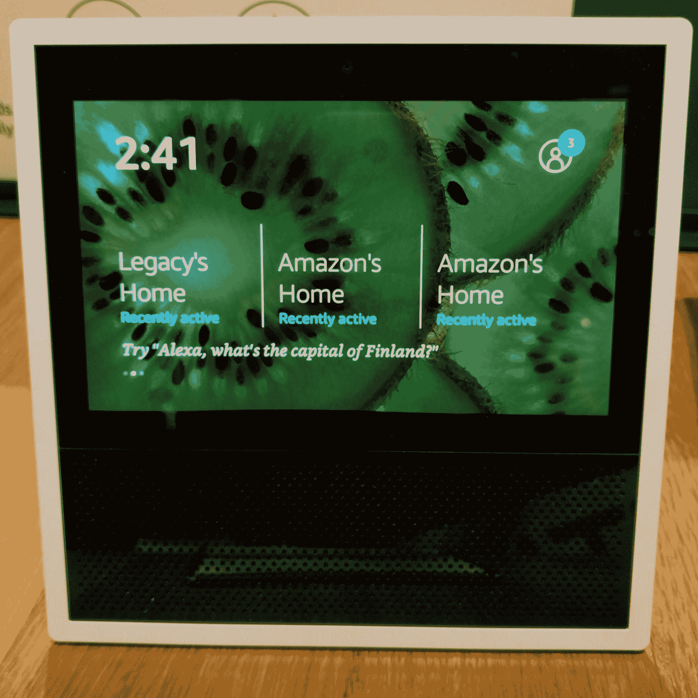
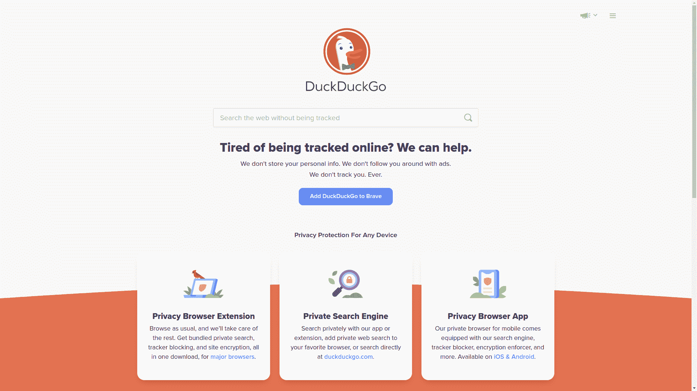
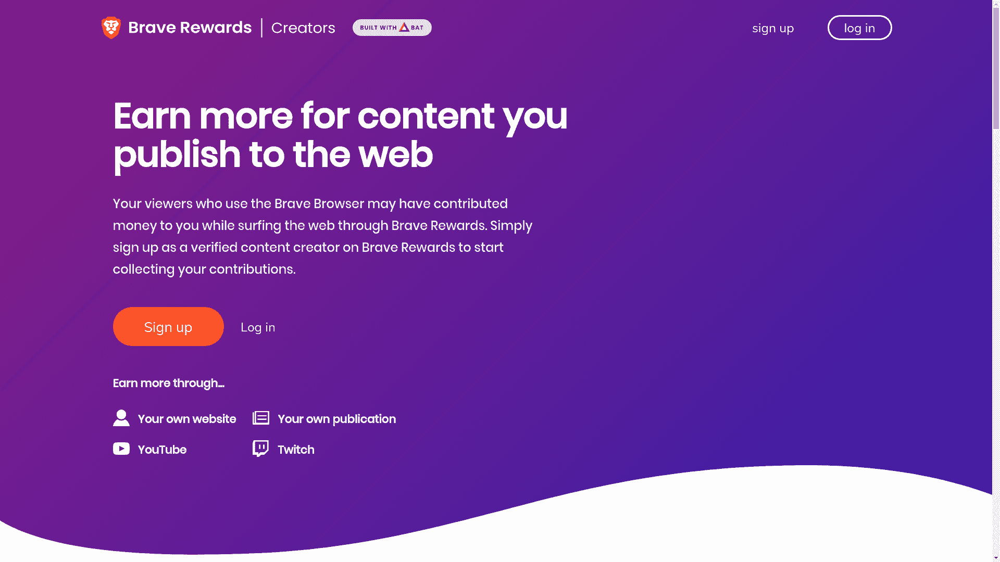
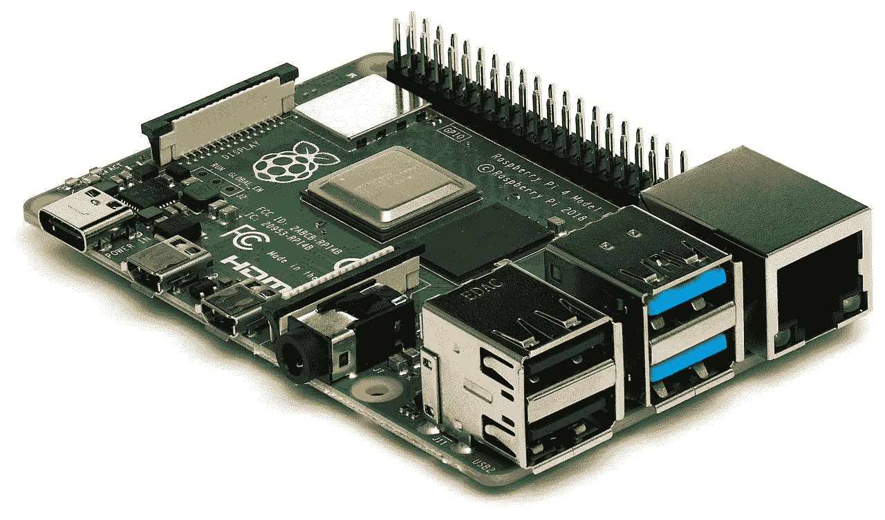
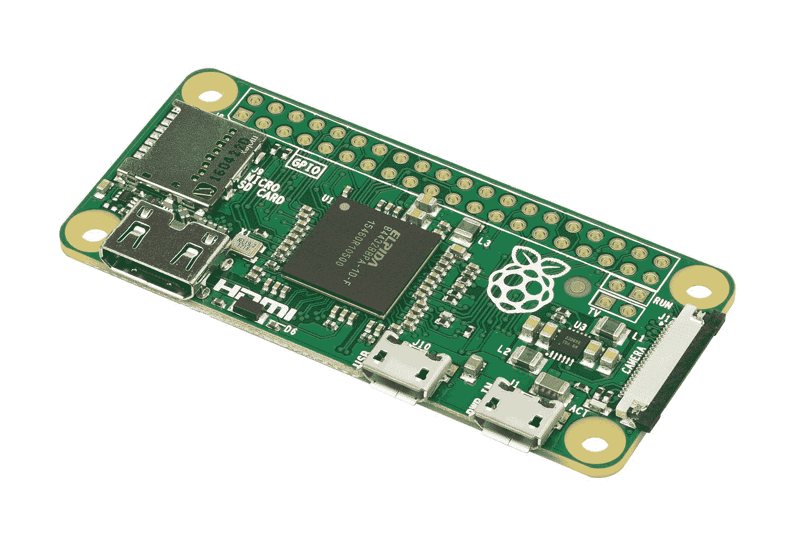

# 2022 年的技术趋势——跟上时代步伐[经理全书]

> 原文：<https://www.freecodecamp.org/news/technology-trends-in-2022-keeping-up-full-book-for-managers/>

这篇文章是基于我最近出版的书 *Keeping Up* ，这是一个关于科技行业现状和你不能忽视的大趋势的快速而易懂的指南。

在这篇文章中，我们将从数字安全、隐私、无服务器平台、物联网(IoT)、技术研究以及更多更高层次的内容进行讨论。

如果你是公司的经理或决策者，正在规划你的职业或教育轨迹的人，或者只是一个好奇的人，那么这本书就是为你准备的。

如果你想买一本，这里有一本实体书的链接。

## 目录

*   [第 1 章:了解数字安全](#chapter-1-understanding-digital-security)
*   [第 2 章:了解数字隐私](#chapter-2-understanding-digital-privacy)
*   [第 3 章:了解云](#chapter-3-understanding-the-cloud)
*   [第 4 章:了解数字连接](#chapter-4-understanding-digital-connectivity)
*   [第 5 章:了解技术研究业务](#chapter-5-understanding-the-business-of-technology-research)
*   [第六章:热门趋势走向何方](#chapter-6-where-hot-trends-go-to-die)
*   [第 7 章:计算平台](#chapter-7-compute-platforms)
*   [第八章:安全和隐私](#chapter-8-security-and-privacy)

## 第 1 章:了解数码保安

无论您与技术有什么联系，安全性都应该在您的思维和行为方式中扮演重要角色。

毕竟，技术放大了我们用它做的一切事情的影响。我们使用通讯技术说和写的东西可以被更多的人阅读和听到，而没有通讯技术是不可能的。方便地与人联系并在各种项目上协作的能力大大提高了。

通过自动化的魔力，我们可以完成的任务几乎是无限的。我们可以通过最简单和最便宜的设备即时获取的信息范围远远超过了几十年前最伟大的学者一生中可能希望看到的任何东西。

所有这一切意味着，犯罪分子和其他不受道德良知约束的个人将拥有更强大的工具来破坏您创建和消费的数据，窃取或破坏您获得的财产。所以你对学习如何保护你自己、你的财产以及你周围的人和组织有着浓厚的兴趣。

本章将简要概述技术安全领域的风险。我们将定义我们面临的各种威胁，并讨论我们可以使用的抵御这些威胁的关键工具。

如果你有兴趣深入探讨这个话题，我的《LPI 安全基础》一书将会给你一个完整的描述。

### 黑客？什么是黑客？

在某个地方，以一种不激怒某人的方式来定义电脑黑客，就像在工作中谈论政治一样。为长时间尴尬的沉默和可能的暴力做好准备。

你看，纯粹主义者可能会坚持认为，术语黑客应该专门适用于专注于强行将计算机硬件用于非标准目的的个人。其他人则为那些绕过认证控制、出于犯罪或政治目的闯入网络的人保留了这一头衔。那些戴着这个头衔的人又如何呢？他们认为这标志着他们在所有事情上的实际专长。(然后，当然还有饼干。)

但这是我的书，所以我想怎么说就怎么说。

因此，我宣布，黑客攻击完全是关于坏人对你的数字设备的计划。具体来说，他们的计划是未经授权就进来，不被发现就出去，离开时(有时)带走你的东西。

以这种方式使用这个术语给了我们一种有用的方式来组织一些常见的和特别可怕的威胁的讨论。

#### 黑客是如何进入的

诀窍是找到一种穿过你的防御(如密码、防火墙和物理屏障)的方法。在大多数情况下，密码可能提供最弱的保护:

*   密码通常很短，使用的字符范围很窄，并且很容易被猜到。
*   如果一个设备带有一个简单的出厂默认密码(如“admin”或“1234”)，只是为了让你第一次登录，那么很多用户很可能永远不会有机会用它来换取更好的东西。
*   即使强密码也可能被欺骗性网络钓鱼电子邮件窃取(“单击此处登录您的银行帐户...”);社会工程(“嗨，是 it 的 Ed。你的公司账户出了点问题。你介意在电话里告诉我你的密码吗，这样我可以很快修好它。”);和键盘跟踪软件。

我们将在本章的后面更多地讨论防火墙。还有物理障碍？我想你已经知道锁着的门是什么样子了。但是，花点时间思考其他类型的数字攻击可能是值得的。

大奖通常是拿到你的数据并复制走。但对一些人来说，简单地销毁原件也同样令人满意。

当然，使用偷来的密码登录您的设备是最直接的方法。但是也可以通过在数据通过不安全的网络时拦截数据来实现访问。

这里常用的一种方法被称为中间人攻击，在这种攻击中，数据包可以在传输过程中被截获并被修改，而两端的授权用户都不知道发生了什么问题。

适当地加密您的网络连接(并完全避免不安全的公共网络)是针对这种威胁的有效保护。稍后我们将更多地讨论加密。

如果你正在使用的硬件有一个未记录在案的“后门”,那么无论你做什么，你都会被烤熟。我们将在本书的后面更多地讨论后门。

但现在，我只想指出，工厂供应的笔记本电脑、机架式服务器，甚至是高端网络设备都不缺乏，这些设备都被故意设计成包含严重的访问漏洞。在购买计算设备时要非常小心。

如果攻击者找到了进入您的物理建筑的方法(有时伪装成快递公司的员工)，他们可以悄悄地将一个微型监听设备插入您网络上未使用的以太网插孔。这会给他们一个很好的观察平台，甚至从内部影响你的所有活动。

保护您的物理基础设施并仔细监控网络活动是您抵御这种入侵的最大希望。

即使你的家或办公室都很坚固，也不能保证在移动设备(如智能手机或笔记本电脑)上移动的数据不会落入坏人之手。

即使你已经小心翼翼地为这些设备使用最好的密码，数据驱动器本身仍然可以很容易地作为外部分区安装在小偷自己的机器上。一旦安装，您的文件和帐户信息现在将完全开放。

保护您的移动设备免受此类威胁的唯一方法是使用强密码加密整个驱动器。

#### 黑客在追求什么

现在整个经济都在直接连接到公共网络的计算机上运行，通过精心策划的企业、学术或政治间谍活动，可以获得金钱和价值...通过老式的传统盗窃。

无论目标是建立军事或商业竞争优势，彻底摧毁竞争对手，还是只是获得“免费”资金，非法访问他人的数据从未如此容易。

那么黑客可能在追求什么呢？

所有重要的财务和其他敏感信息，你宁愿他们没有。应该注意的是，包括您用来向银行、信用卡公司和政府机构表明身份的信息。

一旦坏人获得了重要的数据点，如你的出生日期、家庭住址、政府颁发的身份证号码和一些基本的银行信息，他们通常很容易伪装成你，在这个过程中完全接管你的身份。

数字攻击也可以被用作勒索手段，迫使受害者付钱来弥补他们造成的损失。

这是大多数勒索软件攻击的目的，黑客加密受害者电脑上的所有数据，并拒绝发送恢复你合法访问所需的解密密钥，除非你给他们很多钱。这种攻击已经有效地摧毁了关键的基础设施，如为医院和城市供电的 IT 系统。

防范勒索软件的最佳方法是对您的关键数据进行完整且经过测试的备份，并使用可靠的系统快速将其恢复到您的硬件中。通过这种方式，如果您遭到勒索软件攻击，您可以简单地清除现有的软件，并用包含备份数据的全新副本替换它。

但是你也应该加强你的一般安全设置，让勒索软件黑客更难进入你的系统。

当黑客的主要目标是阻止您或您的组织开展业务时，他们可以保持安全距离，对您的 web 基础架构发起分布式拒绝服务(DDoS)攻击。

历史上的 DDoS 攻击使用大量成千上万的非法劫持的网络连接设备来传输针对单个目标服务的大量请求。当规模足够大时，DDoS 攻击已经成功地让使用复杂防御的大型企业级公司一次瘫痪数小时。

托管我最喜欢的在线开源收藏之一的网站在一年多前遭受重创，至今仍未完全恢复。

### 什么是加密？

如果您的数据不可读，那么未经授权的个人能够利用它做的坏事就会少得多。但是如果它不可读，你可能也没什么办法。

如果有某种方法可以在任何情况下都将您的数据显示为不可读，除非有合理的原因，这不是很好吗？

知道吗？有，而且叫数据加密。

#### 加密传输中的数据

加密算法以一种使信息难以甚至不可能被读取的方式对信息进行编码。

一个简单的(也是古老的)例子是符号替换，其中消息中的每个字母“a”都将被替换为字母表中三个位置的字母(即“d”)。每个“b”都会变成“e ”,以此类推。“你好，世界”应该是“khoor zruog”。那么看到你的编码信息的人可能一眼就看不懂。

当然，一台现代计算机(甚至一个聪明的 8 岁小孩)不需要很长时间就能解码。

但是一些非常聪明的密码学家在过去一个世纪的大部分时间里一直在努力工作，以产生更有效的算法。

现代密码学有一些重要的变化。但总的想法是，人们可以对他们的数据应用加密算法，并通过不安全的网络安全地传输加密副本。然后，接收者可以对数据应用某种解密密钥，恢复原始版本。

加密现在广泛用于许多普通活动，包括发送和接收电子邮件。同样，通过检查浏览器地址栏中的锁图标，您可以确保您从网站请求的数据与最终显示在浏览器中的数据相同。该图标确认网站服务器采用传输层安全性(TLS)加密。

在过去的几年里，让我们加密项目([letsencrypt.org](https://letsencrypt.org/))通过提供免费的加密证书和简单易用的工具来帮助服务器管理员安装，鼓励了数百万新网站使用加密技术。

#### 加密静态数据

当你的数据外出时，TLS 会保护你的数据，但是当它在舒适的存储磁盘中放松时，什么能保证它的安全呢？文件和驱动器加密，就是这样。

所有操作系统现在都提供集成软件，用于在安装时或以后加密全部或部分存储磁盘。每次给加密磁盘加电时，都会提示您输入启用加密时创建的密码。

问题是，如果你忘记了你的密码，你几乎被永久地锁定在你的系统之外，数据就像永远消失了一样。

但是如果你不加密你的系统，就像我们之前提到的，任何窃取硬件的人都可以轻易获得你的私人信息。

外面的世界很残酷，不是吗？

### 防火墙是做什么的？

你可以把防火墙想象成一个过滤器。

就像水过滤器能够阻止某些杂质，只允许干净的水通过一样，防火墙可以检查进出您基础架构的每个数据包，在适当的时候阻止访问。

除了不需要每隔几周更换一次之外，防火墙相对于水过滤器的最大优势在于，它可以根据您的安全和功能需求进行精确配置，以允许和拒绝进入，并在您的需求发生变化时进行更新。

#### 硬件防火墙

硬件防火墙是专门构建的物理网络设备，通常在企业环境中使用。

此类防火墙安装在专用网络的边缘，设置为阻止具有潜在危险的传入流量，将其他流量重定向到远程目的地，或允许流量访问本地网络中的数千台主机。

硬件防火墙由 Cisco 和 Juniper 等专业公司销售，也由 HP 和 Dell 等通用设备制造商销售。

防火墙设备往往非常昂贵，通常要花费数千美元。它们通常只用于管理企业基础设施。

#### 软件防火墙

软件防火墙是一种运行在普通电脑上的应用程序，它可以执行你期望从硬件防火墙中得到的任何功能。

有两个重要的区别:

*   防火墙软件(如 Linux iptables 实用程序)通常是免费的，尽管很复杂，但可以享受大量文档资源的好处。该软件也可以安装在任何一台闲置的旧电脑上，将你的总成本降低到几乎为零。
*   然而，您不会希望在繁忙的业务环境中使用这样的防火墙，因为普通的 PC 可能不具备管理大量网络流量所需的计算能力。在大多数情况下，它也不足以提供全天候的关键任务服务。

还有另一种风格的软件防火墙，它被用作消费级操作系统的一部分。这种防火墙允许您通过设置允许何种活动的规则来更好地保护您的操作系统。这对于经常在网络间移动的移动设备尤其有用。

云计算平台——如亚马逊网络服务(AWS)和微软的 Azure——提供了一种类似防火墙的技术，用于你可能部署在它们系统内的资源。防火墙策略可能存在于名为“安全组”或“访问控制列表”的对象中，可以应用于任何需要它们的资源。

### 谁在安全方面做得最好？

在不久前，您会经常听到 IT 专业人员发誓说，他们永远不会在他们无法实际控制的基础架构上运行他们的 IT 运营。

这在提到外包给第三方、异地公司或云计算平台时很常见。

无论是因为这些管理员不信任陌生人运行的计算基础架构的可靠性和安全性，还是因为监管限制要求敏感工作负载保持在本地，这种观点都得到了广泛认同。这很有意义。

但过去是异国。如今，可以有力地证明，最安全可靠的环境可以在最大的公共云提供商那里找到。

为什么？他们有资金和动力去雇佣最好的工程师，也有资金和动力去建设最好的基础设施。

除此之外，云提供商在世界各地的政治管辖区维护数据中心，并竭尽全力确保其部署符合行业和政府标准。

让我举例说明。还记得我们在本章前面讨论的 DDoS 威胁吗？

好吧，回到 2020 年夏天，一个在 [AWS 上部署资源的无名组织遭到了峰值为 2.3 Tbps](https://www.zdnet.com/article/aws-said-it-mitigated-a-2-3-tbps-ddos-attack-the-largest-ever) 的 DDoS 攻击。也就是说，每秒钟都会有 2.3 万亿字节的数据请求到达该组织面向公众的服务。

“2.3 太字节”实际上是什么意思？

嗯，一兆字节(大约)是一百万字节的信息(这本书的 PDF 版本可能会占用六兆字节左右)。十亿字节是十亿字节的信息。一兆字节是十亿字节的信息。

这相当于大约 165，000 本 PDF 书籍。2.3 兆字节大约相当于 380，000 本 PDF 书籍。

现在试着想象一下，每秒钟有 380，000 本 PDF 书籍的所有文本字符被扔给 web 服务*。*

你脑子里有那个图像吗？

现在这个 web 服务发生了什么:什么都没有。它只是继续工作，好像它对这个世界漠不关心。

这怎么可能呢？

亚马逊的 AWS Shield 服务只是减轻了攻击。顾客什么都不用做。

*这就是为什么将您的工作负载迁移到公共云不一定会影响您的标准。*

## 第 2 章:理解数字隐私

公共服务警告:你可能会发现这一章有点令人沮丧。如果你现在更喜欢一些欢呼，也许可以跳到“理解云”

尽管我们从技术中享受了许多好处，尤其是构成公共互联网的技术，但显然也有大量的成本。弄清楚你想要如何平衡收益和成本可能需要一些仔细的思考。

这里有一个简洁有效的方法来描述这个等式(很遗憾，我已经忘记了它的来源):

> "选择隐私、安全和方便中的任意两个。但你不能三者兼得。”

换句话说，如果安全对你来说很重要，那么你需要放弃对你的钱、信用和个人账户的全天候即时访问。这是因为这种访问需要在公共网络上公开您的帐户，而这种级别不会允许您想要的那么多数据保护。

同样，如果你不能通过收集和使用你的个人信息的第三方企业的网站方便地获取新闻更新和社交联系，那该怎么办？好吧，你需要“为此付出代价”,放弃一部分隐私。

当然，我们大多数人会选择这三种元素的混合，这是基于在相互竞争的价值观和需求之间的实际妥协。

但是对这种混合做出合理的决定需要可靠的信息。这就是你在本章余下的内容中会发现的。

### 公司如何获取你的数据

好奇在互联网上的一天中，你可能会暴露哪些个人甚至私人数据？

答案是“各种各样”。

也许理解问题的范围和性质的最好方法是按平台来分解它。

#### 金融交易

花一点时间想象一下一个简单的网上信用卡交易包含了什么。

您可能使用您的电子邮件地址作为帐户标识符和唯一的密码(希望如此)登录了该商家的网站。

浏览了几个页面后，您可以将一个或多个商品添加到网站的虚拟购物车中。当你得到你需要的一切，你将开始结帐过程，输入送货信息，包括街道地址和你的电话号码。你也可以输入商家发给你的积分卡的账号和你在营销邮件中收到的优惠券代码。

当然，关键步骤包括输入您的支付信息，对于信用卡来说，这些信息可能包括持卡人的姓名和地址、卡号、有效期和安全码。

假设商家基础设施符合用于处理金融信息的支付卡行业数据安全标准(PCI-DSS)协议，那么这些信息被犯罪分子窃取和出售的可能性相对较小。

但无论哪种方式，它仍将存在于商家自己的数据库中。

为了使这一切更加具体，要明白使用你的积分卡账户和优惠券代码可以传达很多关于你的购物和生活方式偏好的信息，以及你以前一些活动的记录。

您在网站上的帐户还包括您的联系信息和您的家庭位置。

至少在理论上，所有这些信息都可以被整合在一起，形成一个关于你作为消费者和公民的强有力的形象。

正是出于这些原因，我个人更喜欢使用 PayPal 等第三方电子商务支付系统，因为这种交易不会在商家自己的数据库中留下我具体支付方式的记录。

#### 设备

现代操作系统从头开始构建，以多种方式连接到互联网。

他们通常会自动查询在线软件库以获取补丁和更新，并在出现问题时“请求”远程帮助。一些性能诊断数据被在线发送和存储，这些数据有助于统计分析或错误诊断和修复。

单个软件包可能独立于操作系统连接到远程服务器，以完成自己的工作。

一切都很好。

除此之外，你可能很难确定在你的设备和互联网之间来往的所有数据是否都是你可以分享的。

你能知道私人文件和个人信息没有和其他数据一起被清除吗？您确信您的任何数据都不会意外地进入您无法控制的意外应用程序中吗？

为了说明这个问题，我会向你推荐由数字助理驱动的设备，如亚马逊的 Alexa(图 2.1)和谷歌助理(“OK Google”)。

因为，根据定义，数字助理使用的麦克风一直在监听他们的关键词(“Alexa ...”)，任何人在设备范围内说的话都会被记录下来。

至少其中一些对话还被记录并存储在网上，事实证明，其中一些*最终被为供应商工作的人听到了。*

至少在一个案例中，无意中录下的对话被用来给谋杀嫌疑犯定罪。



Figure 2.1: A device with Amazon's Alexa digital assistant.

亚马逊、谷歌和这一领域的其他公司都意识到了这个问题，并正在努力解决这个问题。但是他们不太可能完全解决这个问题。

请记住，便利、安全和隐私不能很好地结合在一起。

现在，如果你认为来自电脑和平板电脑的可以被追踪和记录的信息令人毛骨悚然，那就等着听恒温器和灯泡吧。

随着越来越多的家用电器和工具成为“智能家居”系统的一部分，越来越多的性能数据流将随之产生。

而且，正如已经在多个现实世界的应用程序中所展示的那样，所有这些数据都可以通过编程来解释，以揭示关于家中正在发生什么以及谁在做什么的重要信息。

#### 移动设备

你有没有在旅途中停下来，拿出你的智能手机，在电子地图上查找方向？

你当然有。

嗯，地图应用程序正在使用你当前的位置信息，并向你发送有价值的信息，但同时，你也发回了一些同样有价值的信息。

那会是什么样的信息？

我曾经读到过德国一个淘气的家伙，他借了几十部智能手机，放在一辆儿童手推车上，然后慢慢地把手推车拉到一条空荡荡的城市街道中间。没过多久，谷歌地图就报告了一次严重的交通堵塞，而实际上并没有。

谷歌地图应用怎么会比你更了解你当地的交通状况？

一类重要的数据供给他们的系统，是通过持续监控他们可以接触到的每一部活跃的安卓手机的位置、速度和移动方向获得的——包括你的安卓手机。

就我个人而言，我很欣赏这项服务，我不太介意我的数据被使用的方式。但我也意识到，有一天，这些数据可能会以与我的利益严重冲突的方式被使用。称之为计算风险。

当然，谷歌和苹果这两个最流行的移动操作系统的创造者得到的不仅仅是基于 GPS 的移动信息。他们与其他一些行业参与者一起，也在处理我们所有搜索引擎活动的记录，以及运动和健康监测应用程序返回的数据。

换句话说，如果他们决定这样做，许多科技公司可以毫不费力地编写描述我们精确运动、计划和健康状况的档案。从那以后，想象这些数据的所有者预测我们在未来几周和几个月可能会做什么并不是一个巨大的飞跃。

#### 网络浏览器

我们大多数人在日常与互联网的互动中使用网络浏览器。而且，总的来说，网络浏览器是相当神奇的创造，经常充当一个不可思议的强大的看门人，给我们带来人类所有的财富，甚至不用流汗。

但是，我相信你已经预料到了，所有的权力都是有代价的。

为了体验一下你的浏览器自由分享的关于你的信息，看看图 2.2 所示的谷歌分析页面。这个仪表板显示了一个可视化的摘要，描述了在过去的七天里我自己的 bootstrap-it.com 站点的所有访问。我可以看到:

*   我的访客来自世界的哪个角落
*   当白天他们倾向于访问
*   他们在我的网站上花了多长时间
*   他们访问了哪些页面
*   他们在来我的网站之前离开了哪个网站
*   有多少游客会再次光顾
*   他们运行的是什么操作系统
*   他们使用的是何种设备外形规格(即台式机、智能手机或平板电脑)
*   他们所属的人口群组(性别、年龄组、收入组)


Figure 2.2: The home dashboard of a Google Analytics page displaying visualizations of visitors to a website.

除此之外，web 服务器自己的日志可以报告详细信息，特别是与每个访问者相关的具体 IP 地址和精确时间。

这意味着，无论何时你的浏览器连接到我的网站(或任何其他网站)，它都会给我的网络服务器提供大量的信息。谷歌只是把它收集起来，以一种花哨、容易消化的格式呈现给我。

顺便说一句，我充分意识到，让谷歌收集我网站用户的所有信息，我也是问题的一部分。我郑重声明，我确实对此感到有点内疚。

此外，网络服务器能够实时“观察”你在做什么，并“记住”你上次访问时做了什么。

解释一下，你有没有注意到在一些网站上，就在你点击离开页面之前，一个“等等！走之前！”弹出消息？服务器可以跟踪你的鼠标移动，当他们“太接近”关闭标签或移动到不同的标签时，他们会显示弹出窗口。

类似地，许多网站会在你的电脑上保存名为“cookies”的小数据包这种 cookie 可能包含会话信息，这些信息可能包括购物车中以前的内容，甚至是您的身份验证状态。目标是在多次访问中提供方便和一致的体验。但是这些工具可能会被滥用。

最后，像操作系统一样，浏览器也会与提供它们的厂商进行无声的交流。获得使用反馈可以帮助提供商了解最新的安全和性能问题。但是独立的测试表明，在许多情况下，更多的数据被“带回家”，这似乎是合适的。

#### 网站互动

尽管这一章的前几节可能已经涉及到了其中的一些内容，但我还是要强调至少几个特别相关的问题。比如，网站喜欢让你注册额外的增值服务。

他们将向您发送的简讯和产品更新可能是完全合法的，并且确实提供了巨大的价值。但他们还是会来交换你的一些私人联系信息。

只要你意识到这一点，我已经完成了我的工作。

一个很好的例子就是你贡献给社交媒体平台的数据，比如 Twitter、脸书和 LinkedIn。

你可能认为你只是在与你的关系和追随者交流，但实际上远不止如此。

以一款神奇而可怕的软件 Recon-ng 为例，它被网络安全专家用来测试一个组织的数字漏洞。一旦你用你的组织的一些基本知识配置了它，Recon-ng 将向互联网前进并且搜索任何公开可获得的信息，这些信息可能被用来穿透你的防御或者对你造成伤害。

例如，你确定外人不可能对你的开发人员工作的软件环境有足够的了解而对你造成任何伤害吗？

或许你应该看看你在 LinkedIn 上发布的一些招聘广告中的“资格”部分。或者你的开发人员在 Stack Overflow 上发布的问题(或答案)怎么样？

每一篇文章都讲述了一个故事，而且不缺少爱读故事的聪明人。

像 Recon-ng 这样的软件可以帮助你识别潜在的威胁，但这只是强调了你首先要避免将你的数据公开的责任。

底线呢？微笑。你被监视了。

### 为什么公司想要你的数据

数据就是金钱。过去一二十年中，一些最大、最成功的科技公司都是通过数据赚到了数十亿美元。一般来说，那是来自你的数据。

当然，价值不会都朝一个方向移动。

大型科技公司通常会提供有用的服务。健康追踪应用程序会追踪并报告你的健康状况。社交媒体公司确实(在极少数情况下)提供健康的社交互动。历史性能数据有时确实有助于改善客户和技术服务。

但企业的存在是为了产生收入，通常，他们拥有的数据越多，产生的收入就越多。

提供电子邮件和社交媒体账户坐标的潜在客户越多，就越容易联系到他们，提供新的优惠。在重叠行业工作的其他公司也就越容易联系到企业的客户。你向感兴趣的第三方出售你的联系人名单的动机是显而易见的。

自然，法律限制和用户协议有时会阻止数据集的销售。但是并不是每一个用例都必须被这样的法律覆盖，也不是每一个公司都必须被遵守法律的强烈愿望所约束。

一个很好的例子是 2004 年加拿大的不要打电话名单。法律禁止电话销售人员联系任何将自己加入国家名单的人。该法律要求所有电话销售人员从他们自己的通话清单中删除所有条目。

问题是垃圾邮件发送者很高兴地下载了“不要打电话”列表，并确信它们代表了已确认的活跃帐户，从而专门打电话给这些帐户。在这种情况下，唯一有效的法律是*意外后果法*。

您的数据还可以用于个性化您从搜索引擎查询中获得的结果。当然，你有时可能喜欢看到与以前的浏览行为相关的结果，但不要忽视这样一个事实，即你的行为正被用作向你推销商品的活动的一部分。

不仅仅是搜索引擎:智能手机的浏览历史有时会被附近的企业用来向你推送定制广告——有时甚至通过实体广告牌和其他标牌上的自动数字显示。

也许你的数据能提供的最大价值是当它与成千上万的其他用户生成的数据聚合在一起时。数据科学家可以流式传输和解析巨大的动态数据集，以提取关于微妙但重要的趋势的重要见解。在许多情况下，这种数据被净化，以消除任何个人身份信息(PII)。

我们可以用这个流行且准确的表述来很好地总结 21 世纪的 web 应用程序商业模式:

> “如果你不为产品付费，你就是产品。”

### 如何保护您的数据

所有这些听起来都相当黯淡。毕竟，乔治·奥威尔的《1984》是一个警告，而不是指南。

你能做些什么来反击？

注意你周围的环境。

你还会注意到那些你在允许你使用某些服务或工具之前“点击签署”的服务条款吗？

其中一些披露的内容和这一章一样长，如果我可以这么说的话，一点也不有趣。但事实是，它们包含的信息会对您和您的数据产生深远的影响。

许多协议描述了他们可能会收集哪些数据，以及他们计划用这些数据做什么。他们通常还会保证永远不会将你的数据出售给第三方——这种保证他们有时甚至会遵守法律的条文和精神(尽管也有一些公司既不遵守也不遵守的著名案例)。

我从来没有遇到过有时间和精力从头到尾通读那些没完没了的披露的人。但是如果一个组织付钱给一群律师来写东西，你可以打赌这是一个严肃的事情。

意识到你的权利。

除了您与技术服务提供商的具体协议之外，您的数据的使用可能受到政府立法的监管。

一个例子是欧盟的通用数据保护条例(GDPR ),该条例控制组织必须如何处理他们在运营过程中遇到的任何个人数据。

另一个例子是美国政府的健康保险携带和责任法案(HIPAA ),该法案规定了健康保险和医疗保健行业中私人信息的处理。

留意你的选择。

考虑采用隐私优先的工具，而不是你现在使用的更商业化的服务。

例如，DuckDuckGo.com 搜索引擎，其主页如图 2.3 所示，并不跟踪你的搜索行为，并会为你和其他人返回相同的结果。

他们是一家盈利企业，但他们的大部分收入是通过附属链接获得的，这些链接为他们通过搜索链接产生的销售支付佣金——这些都不会对你的隐私产生任何影响。



Figure 2.3

作为另一个例子，Brave browser 比其他主流浏览器向互联网发送的未记录数据要少得多。

具体来说，在 2020 年初，都柏林圣三一学院计算机科学与统计学院的道格拉斯·利斯测试了六种浏览器泄露主机独特识别信息的风险([scss.tcd.ie/Doug.Leith/pubs/browser_privacy.pdf](https://www.scss.tcd.ie/Doug.Leith/pubs/browser_privacy.pdf))。他发现 Brave 显然提供了最大的隐私保护。

Brave 还默认屏蔽网页广告，这就提出了一个问题。既然许多网页完全通过展示广告获得收入，Brave 是否期望内容提供商免费提供他们的服务？

浏览器提供商实际上有一个包括内容提供商的商业模式:勇敢浏览器的用户可以选择向他们展示来自精心策划的广告商的简单且极其不显眼的广告，以换取加密货币的小额支付。

然后，用户可以选择使用这些资金向网站内容提供商进行小额支付，作为通过勇敢奖励计划(如图 2.4 所示)为其内容付费的一种方式。



Figure 2.4

选择开源应用也是一种有效的隐私策略。

OpenStreetMap(openstreetmap.org)是谷歌地图的替代产品。它可能没有您可能习惯的所有花哨功能和内置连接，但正是这种连接为我们的预订提供了动力，不是吗？

如果你对大型移动操作系统(Android 和 iOS)感到不舒服，你可以买一部手机，安装一个实验性的移动 Linux 版本。

沿着这条路走下去可能会崎岖不平。预计会遇到意想不到的配置和兼容性挑战，不要指望在大型应用商店中找到所有你已经知道并喜欢使用的便利应用。

看到一个需要填补的洞？为什么不通过参与现有的开源项目或向社区添加您自己的解决方案来贡献您自己的创新呢？

## 第 3 章:了解云

您可能并不总是意识到这一点，但是您几乎每天每时每刻都在享受着云的诸多成果。没有它，现代生活的许多快乐(和恐惧)都是不可能的。

在我们谈论它的作用和它将把我们带到哪里之前，我们应该解释它到底是什么。

“云”就是使用别人的电脑，而不是你自己的。就是这样。不，真的。

云提供商运行大量的计算服务器(这些计算机只是为了响应外部请求而“服务”应用程序和数据)、存储设备和网络硬件。无论何时，您都可以为自己的工作负载提供这些服务器、设备和网络容量。当你增加数百万被类似冲动所吸引的用户时，你就得到了现代云。

对于许多(尽管不是全部)应用程序来说，通过部署到云可以实现巨大的成本和性能优势。无数的应用程序——无论是小型的、大型的还是超大型的——都在这样或那样的云平台上找到了高效的家园。

因此，让我们看看它是如何工作的，以及您可以用它做些什么。

### 应用服务器部署模型

几十年来，我们经历了许多运行服务器工作负载的模式。在某种程度上，所有这些变化都是两种技术的产物:

*   允许连接节点之间通信的网络协议
*   虚拟化允许快速、高效且经济高效地将硬件资源用于多种并行用途

网络，很大程度上是因为它现在是一种如此稳定和完善的技术，不是我们在这里要关注的东西。但是我们稍后会回到虚拟化。

#### 本地数据中心

在过去，如果你想启动一台新服务器来执行一项计算任务，你需要花一周左右的时间来计算你的工作需要多少计算能力。然后，你可以联系一些硬件供应商的销售代表，等待他们给你回复标书，比较标书，当你选定一个后，再等几个星期，你的新硬件就会送到。最后，你将所有的部件放在一起，插上电源，开始加载软件。

运行服务器的房间需要可靠和强大的电源以及某种冷却系统:就像愤怒的孩子一样，服务器产生大量的热量，但不喜欢热。您可能不想在那个房间里做任何其他工作，因为您的服务器的强大内部冷却风扇的噪音很难忽略。

虽然本地部署的服务器可以让您直接手动控制您可能需要的硬件，但这是有代价的。

首先，基础设施冗余的机会(以及随之而来的可靠性)是有限的。毕竟，即使你定期备份你的数据(假设你的备份是可靠的)，它们仍然不能保护你免受像灾难性火灾这样的设施范围内的事故。

你还需要管理你自己的网络，当远程客户需要从你的大楼之外访问时，这可能是特别棘手和危险的。

顺便说一句，不要被我这里误导性的使用过去式(“被限制”、“备份”)所迷惑。仍有大量各种规模的工作负载在内部数据中心愉快地运转。

但毫无疑问，趋势正朝着另一个方向发展。

#### 服务器协同定位

中型到大型组织的另一个选择是将自己的服务器存储在其他人的数据中心，这种安排称为托管。

托管公司提供服务器机架和电源，以及您需要的所有网络和冷却设备。无论何时你需要物理访问你的服务器，当你来打招呼时，他们总是很高兴的。

这是一种保持对服务器直接控制的便捷方式，同时将物理安全和更大的基础架构难题留给专家处理。协同定位设施的安全性和可靠性标准通常比小型运营机构自己能够管理的要高得多。

出于安全原因，协同定位中心可能不会在街道级别宣传他们的服务。

但是如果你想看看它们是什么样子，在你所在的城市搜索“服务器托管协同定位”,然后使用谷歌卫星查看一两个返回的地址。如果你看到一个巨大的、没有标志的建筑，屋顶上有几十个大功率的空调设备，那就是数据中心。

#### 虚拟化

正如我前面暗示的，虚拟化是一种比其他任何技术都更能定义现代互联网及其支持的许多服务的技术。

从本质上来说，虚拟化是一个聪明的软件技巧，它让你让操作系统相信它在裸机上是独立的，而事实上，它只是共享一组物理资源的许多操作系统中的一个。虚拟操作系统将被分配虚拟存储磁盘上的空间、通过虚拟网络接口的带宽以及来自虚拟 RAM 模块的内存。

这就是为什么这么重要的原因:假设您的服务器主机上的存储磁盘总容量为 2tb，而您有 64GB 的 RAM。您可能需要 10GB 的存储和 10GB 的内存用于主机操作系统(或者， *hypervisor* 是一些虚拟化主机的名称)。这为您的虚拟操作系统实例留下了很多空间。

您可以轻松地启动几个虚拟实例，每个实例都分配了足够的资源来完成各自的工作。当不再需要某个实例时，您可以将其关闭，释放其资源，以便其他实例可以立即使用这些资源来执行其他任务。

但是真正的好处来自虚拟化可以如此高效地利用您的资源。比方说，一个实例可能被给予 RAM 和存储，但后来证明是不够的。您可以很容易地从池中分配更多的内存——通常甚至不需要关闭实例。同样，当实例的需求下降时，您可以减少实例的分配。

这消除了服务器规划中的所有猜测。您只需购买(或租赁)通用硬件资源，并根据需要以增量单位分配它们。当你试图预测五年后你会做什么时，没有必要再去窥视遥远的未来。五*分钟*计划绰绰有余。

现在想象这一切在更大的范围内发生:假设您在某处的一个仓库中运行着数以千计的服务器，为数以千计的客户托管工作负载。

也许一个客户突然要求另一个 1tb 的存储空间。即使客户当前使用的磁盘已达到极限，您也可以轻松地从其他磁盘添加 1tb 的容量，这些磁盘可能插在几百米之外的仓库的另一边。

客户永远也不会知道其中的区别，但变化几乎是瞬间的。

##### 牛 vs 宠物

服务器虚拟化改变了我们看待计算甚至软件开发的方式。

将配置接口构建到应用程序中，让您能够动态地调整和修复，不再那么重要。对于您的开发人员和系统管理员来说，构建一个定制的操作系统*映像*(几乎总是基于 Linux 的)并预先设置所有软件通常会更有效。然后，每当需要更新时，您可以基于您的映像启动新的虚拟实例。

如果出现问题或者您需要应用更改，您只需创建一个新映像，关闭您的实例，然后用运行新映像的实例替换它。

实际上，您对待虚拟服务器的方式就像奶农对待奶牛一样:当时机到来时(这是不可避免的)，您将一头老牛或病牛牵出并杀死，然后引入另一头(更年轻的)牛来替换它。

任何曾经参与过传统服务器机房管理的人都会对这样的想法感到惊讶！我们的旧物理机器将被视为心爱的宠物。

哪怕是最轻微的痛苦迹象，我们都会站在它的身边，关心它，试图诊断问题出在哪里，如何解决它。如果所有其他的都失败了，我们将被迫重启服务器，希望它能再次恢复。如果连这个都不够，我们就放弃，更换硬件。

但是我们从虚拟化中获得的模块化给了我们各种新的灵活性。

既然硬件方面的考虑已经基本上被抽象出来了，我们的主要焦点就在软件上(无论是整个操作系统还是单个应用程序)。

多亏了脚本语言，软件可以自动化。因此，使用像 Ansible、Terraform 和 Puppet 这样的编排工具，您可以自动化应用程序服务实例的创建、供应和全生命周期管理。

甚至错误处理也可以内置到您的编排中，因此您的应用程序可以被设计为神奇地修复它们自己的问题。

##### 虚拟机与容器

虚拟实例有两种风格。虚拟机(或 VM)是运行在主机上的完整操作系统，但在某种程度上独立于主机。

这是一种使用虚拟机管理程序来管理每个虚拟机对底层硬件资源的访问的虚拟化，但这种虚拟机通常会选择自己的方式。

虚拟机管理程序环境的示例包括开源 Xen 项目、VMware ESXi、Oracle 的 VirtualBox 和 Microsoft Hyper-V。

另一方面，容器不仅共享硬件，还共享它们的主机操作系统的软件内核。这使得容器实例更快、更轻量级(因为它们的映像不需要包含内核)。

这不仅意味着容器可以几乎立即启动，而且它们的文件系统可以在主机之间传输和共享。可移植性意味着实例环境可以在任何地方可靠地复制，使得协作和自动化部署不仅可能，而且容易。

容器技术的例子包括 LXD 和 Docker。企业容器实现包括 Google 的开源 Kubernetes 编排系统。

#### 公共云

公共云平台将计算资源的抽象和动态分配提升为一种艺术形式。大型云提供商利用分布在世界各地数据中心的成千上万台服务器和无数存储设备组成的庞大网络。

任何人、任何地方都可以在提供商处创建一个用户帐户，使用自定义的容量请求一个实例，并在几分钟内运行一个功能完整的面向公众的 web 服务器。由于您只为您使用的东西付费，因此您的收费将密切反映您的实际需求。

我在亚马逊网络服务(Amazon Web Services)上运行的一个网络服务器，用来托管我的两三个中等繁忙的网站，每年只需花费我 50 美元左右，并且有足够的能力来处理更多的流量。

视频流媒体公司网飞使用的 AWS 资源可能会更贵一点——毫无疑问是每年数百万美元。但是他们显然认为他们得到了一笔好交易，并且更喜欢使用 AWS 而不是自己托管他们的基础设施。

你肯定会问，这些公共云提供商都是谁？

这个对话必须从 AWS 开始(通常也是结束)。他们是每个房间里的大象。

亚马逊庞大且无处不在的数据中心内运行的数百万工作负载，以及他们疯狂的创新步伐，使他们成为这场竞赛中的佼佼者。这还没有考虑到他们每个季度获得数十亿美元的净利润。

在这一点上，AWS 唯一真正的竞争对手是微软的 Azure，它在服务类别方面做得很好，而且据说在这个过程中赚了很多钱；而阿里云在这一点上主要专注于亚洲市场。

谷歌云参与了这场游戏，但似乎专注于他们能够真正竞争的一系列更窄的服务。

由于进入该市场的障碍令人生畏，只有少数其他公司受到关注，包括 Oracle Cloud、IBM Cloud 以及对命名惯例进行了可喜改变的 Digital Ocean。

#### 私有云

云的好处也可以在离家更近的地方得到，如果那是你所追求的。没有什么可以阻止您在自己的数据中心内的基础架构上构建自己的云环境。

事实上，有很多成熟的软件包可以帮你处理这个过程。其中最突出的是开源的 open stack([openstack.org](https://www.openstack.org/))和 VMware 的 VSP here([vmware.com/products/vsphere.html](https://www.vmware.com/products/vsphere.html))环境。

构建和运行云是一个非常复杂的过程，不适合业余爱好者或胆小的人。我不会尝试下载和测试 open stack——即使只是为了实验——除非你有一个快速而强大的工作站作为你的云主机，至少有几台机器作为节点。

你也可以两者兼得，一方面在家附近维持某些操作，另一方面将其他操作外包到云中。这称为混合云部署。

例如，监管限制可能要求您在自己的运营中保留一个包含敏感客户健康信息的后端数据库，但您希望面向公众的 web 服务器运行在公共云中。可以将一个域(比如 AWS)的资源连接到另一个域(您的数据中心)来创建这样的安排。

事实上，有一些方法可以将您的本地资源和云资源紧密结合。AWS 上的*VMware Cloud*服务使得使用部署在本地的 VMware 基础架构无缝管理 AWS 资源(【aws.amazon.com/vmware】T2)变得(相对)容易。

### 外包计算运营的价值

为什么您可能希望将工作负载迁移到云中？你最终可能会省下一大笔钱。所以就这样了。

当然，并不是每个部署都是这样，但是似乎有很多用例是这样的。

为了帮助您做出明智的决策，云平台通常会提供复杂的计算器，让您比较在本地运行应用程序和在云中运行应用程序的成本。AWS 版本在这里:[aws.amazon.com/tco-calculator](https://calculator.aws/#/)

定价计算的一部分是你支付的方式。

传统的内部模式需要对昂贵的服务器硬件进行大量的前期投资，您希望这些硬件能够在未来五到十年内提供足够的价值，从而证明购买的合理性。这些投资被称为*资本支出*(“资本支出”)。

另一方面，云服务是按照你实际消费的服务单位数量来计费的(按小时，甚至分钟)。这通常被归类为*运营费用* (Opex)。

使用 Opex 模型，如果您只需要每隔几天运行一次服务器工作负载，每次运行五分钟以响应外部触发事件，您可以自动使用“无服务器”工作负载(使用类似 Amazon 的 Lambda 这样的服务)，只在需要时运行。总成本:也许一个月只有几便士来支付服务实际运行的时间。

除了成本考虑之外，云世界中还有很多值得您考虑的事情。

您已经看到了在本地部署新服务器的决策和实际部署之间的滞后时间(数周或数月)与公共云中类似的决策/部署流程(几分钟)的对比。

但是大型云提供商也有能力提供更加安全可靠的环境。

作为一个例子，你可能记得我们在第 2 章(理解数字安全)中关于 DDoS 攻击的故事。这就是每秒钟相当于 380，000 本 PDF 书籍的数据被用来轰炸 AWS 托管的网络服务的事件...这项服务幸存了下来。你有信心自己能做到吗？

冗余带来的可靠性如何？如果发生灾难性的场所损失，您的内部基础架构能否幸存？即使您做了正确的事情并维护了异地备份，将它们应用到重建的、网络连接的和正常工作的硬件需要多长时间？

大型云平台在世界各地相距遥远的地方运行数据中心。它们使得在多个位置复制您的数据和应用程序变得容易(在某些情况下是不可避免的),因此，即使一个数据中心出现故障，其他数据中心也会正常运行。你能复制那个吗？

云提供商还管理内容分发网络(cdn ),允许您将经常访问的数据的缓存副本暴露在靠近客户居住的边缘位置。这大大减少了延迟，改善了您的客户将获得的用户体验。那是你自己能做的事情吗？

还有一个想法。如今，对新 IT 技术的大部分投资都投入到了云生态系统中。

这部分是因为大型云提供商产生现金的速度远远超过了他们预期的支出速度。但这也是因为他们参与了一场生死竞赛，在竞争对手占领基础设施市场之前抢占新的细分市场。

结果是，云计算领域的创新速度惊人。

我靠密切关注 AWS 谋生，甚至我经常错过新产品发布。我避免在我的书和视频课程中包含 AWS 管理控制台的截图的原因之一是因为他们的控制台更新如此频繁，在这本书上市之前，这些图像往往已经过时了。

在某些情况下，这可能意味着本地部署将在固有的劣势下运行，因为他们无法获得同等的尖端技术。

### 外包计算运营的风险

尽管如此，就像生活中的大多数事情一样，在云和本地之间做出选择并不总是像我说的那样显而易见。

例如，仍然可能有法律和规则强制您将数据保存在本地。也会有数学不成立的情况:有时在自己的数据中心做事情真的更便宜。

您还应该担心平台锁定。在准备启动复杂的多层云部署之前，学习曲线是必不可少的。你可以肯定的是，它在 AWS 上的工作方式可能不会与 Azure 上的工作方式完全相同。

一旦做出选择，你需要进行的知识投资可能会很昂贵。

但是，如果提供商的政策突然改变，迫使您离开平台，那么这项投资会发生什么情况呢？或者如果他们真的倒闭了(这是可能发生的:柯达、百视达视频和 Palm 也曾经很大)？

如果出于某种原因你的账户被锁定了呢？对你来说，在其他地方重组和重新加载所有东西有多难？

只要提前考虑，确保你的选择是理性的。

## 第 4 章:了解数码联通

电话改变了我们所有人相互交谈和工作的方式(至少是像我们的曾祖父母那样)。信息现在可以即时交流，而不是通过缓慢的陆路传送。

但如今这对任何人来说都不是什么新闻了。现代网络——众所周知的互联网——同样促进了交流，尽管这一次是数据的流动而不是 T2 的声音得到了促进。

在互联网诞生后的五十年左右的时间里，越来越多的数据的移动、存储和管理都被托付给了互联网。这些变化带来了巨大的机遇、风险和压力。

现在，保持联系是最基本的需要。

管理我们所有的许多互联设备并利用我们的认证方式来扩展我们的身份也带来了挑战。我们将在本章中讨论所有这些。

### 连接到互联网

如今，除了食物和住所，最基本的资源之一就是互联网连接。

如果你不能上网，你会发现很难办理银行业务、自学、预订旅行安排，甚至很难确定自己的确切位置。

广泛、可靠和相对快速的互联网接入对一个地区的总体经济发展至关重要，这不是没有道理的。

即使 internet 最初是作为一个分散的、分布式的资源网络而构建的，您仍然需要建立某种连接来访问它。

最好的连接由网络运营商运营，即所谓的第一层网络。这些网络可以通过对等协议连接到所有其他网络，无需支付 IP 传输费用。

你可以把这些网络想象成互联网的主干，它们的网络基础设施就是它的结构。

管理一级网络的公司包括美国的美国电话电报公司和威瑞森、塔塔通信(印度)和德国电信(德国)。这些运营商将把带宽转售给较小的互联网服务提供商(ISP ),后者再把接入权卖给像你我这样的最终用户。

#### 宽带选项

寻求家庭或小型企业宽带接入的个人通常可以选择以下四种接入模式之一:

*   **电缆**。由于他们已经在通过现有的物理连接为数百万家庭提供数据，有线电视提供商可以很容易地通过相同的电线传输互联网。
*   **数字用户线路**。DSL 是允许数字数据通过铜电话线的一系列技术，它可以提供与有线电视大致相似的服务水平，但不需要基础有线电视服务。事实上，使用“干铜”连接，你甚至不需要一个电话座机帐户。
*   **光纤**。由于一些神秘的技术细节(包括物理定律)，以红外光的形式传输数字信号比类似的电缆速度更快，需要的中继器更少。光纤互联网连接通常可以提供 10-40Gbit/s 的传输速度，比目前使用电缆或 DSL 的标准速度快 1000 倍。
*   **卫星**。在人口密集的城市铺设新电缆成本很高，但公司可以通过他们将签署的许多接入合同迅速收回投资。

    但是人烟稀少的农村地区就难服务多了。部分是为了填补农村连接的空白，许多公司雄心勃勃地发射由数千颗轨道卫星组成的星座来提供全球互联网覆盖。在撰写本文时，SpaceX 的项目进展最快，已经成功发射了 500 多颗卫星，作为 Starlink 系统的一部分。

除了这些主流技术之外，还尝试了不少其他连接解决方案。有些是实验性的，但很有前景，而其他的则更具投机性。

谷歌的气球互联网(官方名称为 Loon LLC)试图让高空气球舰队漂浮起来，为地面范围内的任何人提供 1 Mbps 的信号。

Loon 旨在为难以到达的地区提供低端宽带，在这些地区，可靠的服务很难甚至不可能。截至 2020 年，该项目似乎处于后期实验阶段。

电力线宽带(BPL)可以利用所有连接电力部门、家庭和企业的电网来提供互联网数据。

最终，该技术只能提供有限的带宽，因为线路噪声会导致显著的数据信号损失。承载数据的电力线也会对高频无线电通信造成干扰。

最终，相对较低的信号质量和来自其他技术的强大竞争意味着 BPL 可能永远不会被广泛采用。

使用无线互联网服务提供商(WISP)形式的网络可以为更大地理区域内的家庭和办公室提供服务，而无需为每栋建筑布线。

有线连接安装在一个地区的中心，必要时，连接回程安装在高架地区，以加强针对消费者的无线信号。现有的无线电塔或其他高大结构可以用于回程中继器，使得 WISP 系统的安装相对便宜。

较小规模的无线网络合作可以通过使用*邻近互联网服务提供商(NISP)* (使用屋顶天线)或*无线网状网络*(其中联网设备充当对等节点)来有效地共享单个物理连接。

这些系统主要是为我们的生活和工作服务的。但是移动数据访问肯定也是一个东西。

我相信你已经熟悉了移动电话公司在提供通话和短信服务的同时提供的数据套餐。

#### 移动电话数据访问

小区连接通过地理区域(称为“小区”)分布，这些地理区域来自遍布小区的单个无线电发射机。

由于每个小区内的发射机将使用与其周围的小区不同的无线电频率，所以当用户在小区之间移动时，现代无线技术允许无缝、自动的“切换”。

自 80 年代以来，用于无线电话的技术已经发生了变化，当时推出了现在所知的 1G(“第一代”)手机。用非常概括的术语来描述手机的发展，我们可以说:

*   1G 电话只能进行语音通信，最高传输速度为 2.4 Kbps。
*   2G 手机可以传送短消息服务(SMS)和多媒体消息服务(MMS)消息，包括短视频和图像。
*   3G 手机的传输速率(高达 2 Mbps)比任何 2G 手机都要高，因此被称为“移动宽带”
*   4G 手机可以达到高达 100 Mbps 的速度，这使得高清手机电视、在线游戏和视频会议成为可能。
*   5G 手机——当在兼容网络上使用时——有望在非常低的延迟下达到高达 20 Gbps 的传输速度，允许完全沉浸式虚拟环境。

    如果 5G 部署成功(在撰写本文时，这还不清楚)，可能部署的新服务类别的范围和限制也尚不清楚。

当谈到规划一个新的风险投资时，长期以来公认的智慧是没有什么可以替代坚实的市场研究。

在不知道你的客户是谁，他们住在哪里，他们喜欢什么的情况下，你怎么能恰当地服务他们呢？

好吧，现在你可以在这个列表上加上“他们的互联网连接有多可靠和强大”，因为如果没有数字接入，他们可能永远找不到你或无法使用你的服务。

### 与物联网对话

最重要的是，最近的两个变化促成了物联网(IoT)生态系统:廉价的嵌入式单板计算机(如图 4.1 所示的 Raspberry Pi)的出现，以及廉价的永远在线的互联网连接。



Figure 4.1

这些微小的单板-通常比信用卡还小-很容易整合到你计划制造的任何东西中。这种设备成本很低——有时一台只需几美元——而且它们通常是为运行全功能(且免费)的 Linux 发行版而构建的。

网络可用性意味着所有这些车载摄像头、传感器和其他外围设备生成的大量数据流可以自动发送回“家里”进行处理和分析。

#### 物联网的梦想

以下是物联网应用已经在积极改变商业和消费者行为的一些方式:

*   **库存控制**。第一个物联网设备至少可以说是卡内基梅隆大学的可口可乐自动售货机。早在 80 年代初，这台机器被改装成数字报告其正在进行的库存。

    物理设备可以监控自身及其周围环境，向远程服务器提供准确、最新的状态报告，这一简单理念是无数现代工业解决方案的核心。

    现代零售、批发、物流和制造业务现在可以持续访问他们的库存，使他们能够了解趋势并预测问题。
*   **农业**。现代农业越来越多地融合了机器人灌溉、施肥、种植甚至收割技术。所有那些在你的财产周围运行的机器人都在生成数据，并不时地给自己带来麻烦。

    将数据“移回”管理服务器对于跟踪正在发生的事情、可能需要修复的内容以及您的实际服务器场的运行情况至关重要。

    因此，你可以期待这些设备都将成为某人物联网的一部分。
*   **军事**。通信是军事行动的关键。但是，如果连武器、车辆和其他设备都可以自主通信，如果有专门的服务器来解释和处理这种通信，那么你就已经遥遥领先了。

    传感器连接到数百个部件中的每一个，比如说，一架战斗机，可以为规划者提供一个前所未有的真实情况。
*   **智慧城市**。当嵌入建筑物、道路、公共照明、智能手机和电气系统的传感器与来自交通摄像头和公共部门的数据相结合时，数据驱动洞察的潜力是巨大的。

    正确理解数据可以帮助城市更有效地管理其资源、公用事业甚至交通，并更好地维护其物理基础设施。
*   **智能家居**。在远小于智能城市的规模上，家用电器可以通过智能手机应用程序或远程服务器进行连接、监控和控制。

    智能家居设备已经包括加热和冷却系统、灯泡、机器人吸尘器、车库门和安全系统。这些设备可以通过手机应用程序控制，但在许多情况下，也可以通过语音控制设备，如亚马逊 Echo (Alexa)。

关于物联网的对话总是离时髦用语只有一步之遥——在时髦用语中，词语失去了意义，夸张成为一种可以接受的生活方式选择。

不是所有物联网的东西都是物联网的。或者，换句话说，并非所有物联网都值得讨论。

但这里有一个对特定技术进行分类的好方法:如果一小时又一小时，某样东西产生的数据超过了任何人可能吸收的数据，那么它可能是一种物联网设备。

有效地处理所有这些数据可能是一个问题。这并不是物联网领域唯一的潜在问题。

#### 物联网的噩梦

在信息技术领域，一般来说，基础设施中的网络连接越活跃，被成功攻击的风险就越大。

这是因为成功的黑客入侵通常来自配置不良或未打补丁的设备。您暴露的面向公众的设备越多，其中一个设备存在严重漏洞的可能性就越大。

我们在谈论什么样的漏洞？

嗯，美国政府的公共漏洞和暴露数据库包含近 140，000 个条目，每个条目代表一个独特的软件弱点，可能允许未经授权的访问和破坏 IT 系统。

存在影响所有操作系统(Windows、Linux、macOS)、所有格式(服务器、PC、智能手机)和所有年龄层的威胁(存在可追溯到 20 世纪 90 年代的活跃威胁)。

并且每个月都会增加数百个新条目。

从这个意义上说，物联网设备与任何其他类型的计算机没有什么不同。但是有一点他们更糟糕。

因为你通常不会在操作系统层面上直接与物联网设备进行交互，并且因为它们通常是由数十甚至数千人购买和部署的商品，所以你不会本能地将它们视为计算机。

例如，我们大多数人都知道，我们应该为笔记本电脑和 WiFi 路由器创建复杂而独特的密码。

但是你的冰箱呢？插上就好了！

问题是许多物联网设备——如“智能”冰箱——都有自己的嵌入式操作系统，通常还有自己的网络接口。

很有可能任何人在你安静的住宅街道上开车都可以扫描可用的网络，并快速识别你正在使用的物联网设备的品牌。然后，他们可以假设您没有更改他们出厂默认的身份验证凭据，并登录到您的专用网络。

更糟糕的是，许多设备制造商仍然使用 admin/admin 的某种变体来运送他们的产品和认证凭证。

这是个大问题。

### 利用联合身份

所有这些关于身份验证和凭证所带来的危险的讨论应该会让你对如何使用它们来产生一些好的连接性的东西感到好奇。

一个词，那就是*联邦。*

身份联合是一种跨多个网络服务链接个人身份的技术。联盟可以让你使用谷歌账户凭证登录在线游戏或网络应用网站。

联合的好处是，当你在你经常使用的许多在线服务之间移动时，你只需要一次登录。这样可以降低通过易受攻击的网站暴露密码的风险。

当然，这也增加了您的联邦提供者所使用的服务器的严重数据泄露所带来的损失。

联合可用于集成第三方单点登录(SSO)身份验证系统，如 Kerberos、轻量级目录访问协议(LDAP)和微软的活动目录(AD)。当与云服务一起使用时，SSO 系统可以安全地允许消费者或流程根据需要自动访问私有帐户资源。

除了方便之外，所有这些身份验证的优点推动了大型复杂项目安全远程协作的机会——这本身就是一个快速增长的趋势。

## 第五章:了解技术研究的业务

将新技术提供给消费者通常需要优秀的人才和大量的资源，包括资金。一般来说，很多钱。

这些钱中的大部分将会花在研究上，而通常情况下，将一个伟大的想法转化为一个可用的产品所需的艰苦研究将会由一个头衔不是“企业家”的人来完成。

事实上，有时这项研究是由那些几乎意识不到他们的创新有任何商业价值的人完成的。

如果你来这里是因为你想了解前沿技术，那么你可能想关注那些以进行实用研究而闻名的组织。知道谁在研究中占主导地位，谁在资助它，以及大笔资金被花在哪里，可以让你对下一步可能发生的事情有有用的见解。

从那里开始，你就离花时间学习新技术带来的工具或在新技术最终出现时定位自己获利只有一步之遥了。

### 谁资助商业科学，为什么？

曾几何时，严肃科学研究中的重大突破都是私人资助的产物。例如，意大利人美第奇家族曾支持过许多人，他们的工作被证明是至关重要的，包括达芬奇和伽利略。

然而，在第二次世界大战之前的几年里，研究项目的范围和复杂性远远超出了私人支持的能力。战争对空前复杂的技术的依赖——以制造原子弹的曼哈顿计划为例——推动了越来越多的研究由政府负责。

战后几代人以来，政府一直参与研究。尽管如此，据估计，大学和政府只负责它们之间 30%的研究经费，其余大部分由私营企业提供(见[en.wikipedia.org/wiki/Funding_of_science](https://en.wikipedia.org/wiki/Funding_of_science))。

让我们看看这是如何分解的。

#### 纳税人

当然，民主政府不会花自己的钱，因为传统上他们没有钱。

他们的许多项目和服务都是通过各种方式从他们的资本资产和人口中获得的收入资助的。在现代民族国家中，“人口”是指纳税的个人和公司。

公共研究和开发可以在政府机构内进行。根据一些机构授权的条款，研究成果必须立即进入公共领域。

但是，即使是那些保留其研究权利的人，也常常会将他们的研究成果指向能够有效利用这些成果的企业和机构。

比如，美国国家科学基金会(NSF)用其 80 亿美元的年度预算资助“美国高校开展的所有联邦资助基础研究的大约 25%”([https://www.nsf.gov/about/](https://www.nsf.gov/about/))。

其他美国机构在内部进行大部分或全部的研究。以下是一些例子:

*   国家标准与技术研究所(NIST)的使命是“促进创新和工业竞争力”

    该任务的一个非常重要的部分是维护国家漏洞数据库(NVD)，该数据库在保护我们的信息技术基础设施的漏洞评估和检测系统的管理中发挥着基础性作用。
*   美国军方的国防高级研究计划局(DARPA)与私人和公共部门合作伙伴合作，帮助开发新兴技术。近年来的工作包括机器人和自动驾驶汽车的研究，但你可能更熟悉几十年前 DARPA 的一项创新:互联网。
*   美国国立卫生研究院(NIH)在 27 个研究机构和中心雇用了 6000 名研究科学家。他们的“使命是寻求关于生命系统的本质和行为的基础知识，以及这些知识在增进健康、延长寿命、减少疾病和残疾方面的应用。”

美国政府研究机构的完整列表(可在[en . Wikipedia . org/wiki/List _ of _ United _ States _ research _ and _ development _ agency](https://en.wikipedia.org/wiki/List_of_United_States_research_and_development_agencies)获得)很值得一读。你自己看看吧。

自然，其他国家的政府也有自己的研究机构。一个例子是加拿大国家研究委员会(NRC ),它从两次世界大战的军事技术起源发展到目前专注于与私营和公共部门技术公司的合作。

NRC 现在将其工作分为四个“业务线”

*   战略研究和发展
*   技术服务
*   科学技术基础设施管理
*   NRC-工业研究援助计划(IRAP)

正如我们在讨论国家科学基金会时提到的，很大一部分用于研究和开发的纳税人资金被授予公立和私立学院和大学。

但是，从学院的角度来看，有多少学术 R&D 资金来自政府来源？

2016 年对在 R&D 花费最多的 20 所美国大学的审查发现，他们每个人都花费了 83.7 万至 240 万美元，他们总支出的大约 47-87%来自这样或那样的政府来源(见[best colleges . com/features/colleges-with-high-research-and-development-expenses/](https://www.bestcolleges.com/features/colleges-with-highest-research-and-development-expenditures/))。

相比之下，企业只提供了 2%到 22%的资金。

#### 私人慈善基金

当我们谈到学术研究时，我们不应该忽视第三个资金来源:私人捐赠。

一些——尽管不是全部——永久捐赠基金在研究活动中被他们的捐赠者盯上了。虽然基金资本不能每年花掉，但是资本产生的收益可以。

众所周知，哈佛大学的捐赠总额超过 400 亿美元。毫无疑问，其中一些会进入研发领域。

奇怪的是，根据 2016 年的研究，哈佛大学当年的 R&D 支出总额——包括由政府(52.1%)、企业(4.7%)和捐赠基金资助的活动——刚刚超过 100 万美元。

当然，捐赠也支持学术环境之外的大量研究。大多数严重的疾病都与慈善基金会有关联，这些基金会的存在是为了给受害者护理和医学研究筹集资金。

世界各地有成千上万注册的非营利组织支持非医疗事业，包括许多与技术相关的研究。比尔和梅林达·盖茨基金会是一个特别著名的例子。

#### 企业

以技术为导向的公司有强烈的兴趣在竞争前获得创新。为了提高他们的机会，许多人会在内部运行他们自己的研究实验室。

例如，贝尔电话公司及其后继者，包括美国电话电报公司(美国电话电报公司)，保持了贝尔实验室的活跃和巨大的创造力。贝尔实验室以各种名义负责许多创新，包括晶体管、激光和 Unix 操作系统。

一些公司的技术人员通常是创新的源泉。例如，3M 公司有他们所谓的“15%文化”，允许员工利用公司的时间和空间，根据自己的想法和兴趣进行研究。

多年来，该计划已经为公司创造了成功的产品，包括他们的便利贴。另一个例子是，珀西·斯宾塞在为美国国防承包商雷神公司研究雷达时，意外发现微波可以烹饪食物。

应该注意的是，并非所有的企业创新都是真正的本土创新。其中很多实际上是通过税收优惠或信贷形式的政府资金间接资助的。

在这样的计划下，公司可能被允许使用与研究相关的支出(包括工资支出)来减少他们原本要支付的所得税。

### 商业技术研究的主要领域

试图在这个历史时刻掌握技术发展的全部范围是一种不可原谅的时间浪费。

一天中的每一分钟，在每个时区，通过无数的实验室、办公大楼、仓库、车库、地下室、卧室，当然，在创造性的人们的头脑中无形地存在着重大的创新。

没有人会去记录这一切，因为这是不可能的。更不用说很多创新都是在保密的情况下进行的。

但是可能值得提供几个例子来给你一个在哪里寻找的感觉。

#### 量子计算(以及我们为什么应该关注它)

我的一个拥有剑桥大学高级物理学学位的表兄曾经试图向我解释量子力学。

他失败了。惨了。

我可怜的老脑子就是吸收不了。因此，不要期望这里有任何完整的、有分寸的对潜在科学的描述。相反，我将试着向你展示依赖于物理学的实验性计算技术可能如何工作，以及它们能做些什么。

超快的执行摘要版本是，由一种或另一种量子技术驱动的计算机将比我们现在拥有的任何超级计算机快得多。事实上，速度如此之快，以至于他们可能能够解决使用传统计算机根本无法解决的问题(这一成就被称为*量子优势*)。

这意味着一些关于软件工作方式的长期假设将不再适用。

例如，我们使用目前使用的加密工具来保护敏感数据的全部原因是，破解一个加密密钥需要数百甚至数千小时的高性能计算时间。

在大多数情况下，这是不值得的努力和费用。

但是，如果你可以在一台处理运算速度成倍增长的计算机上轻松买到时间，那么两件事就会立即发生:

*   破解加密算法将变得微不足道
*   诚实的人将不得不认真寻找一种新的方法来保护他们的数据

目前，谷歌和 IBM 是在量子计算研究项目上投入巨资的主要公司之一。

据我所知，量子计算机将测量亚原子粒子的状态，并使用二进制测量来表示计算值。

这种状态的描述被称为*量子比特*，它实际上是传统计算的*比特*的量子等价物。

但是因为一个量子位也可以存在于所谓的*相干叠加*中——这意味着它的值可以存在于两个可能状态的*叠加*中——它可以用来表示更复杂的值范围。

我相信，这意味着这样的计算机将能够比现在做事情快得多。如果这真的发生了，那就太大了。

#### 能源技术

现代世界消耗了大量的能源。

我们不停地移动，控制我们的室内(和运输途中)气候条件，交换信息，并期望世界上所有的财富都能送到我们家门口。明天之前。

但是这些高耗能的活动是有代价的，尤其是它们留下的排放物。寻找可靠、稳定和负担得起的能源，帮助我们找到消费和排放之间的健康平衡的工作正在进行；而且贵得难以想象。

小型模块化核反应堆(SMRs)是近年来一些重大发展的焦点。它们似乎承诺提供可靠、稳定和廉价的能源，而它们昂贵而复杂的核能前辈却无法做到。

总的来说，第一代和第二代反应堆是可靠和稳定的——它们也是清洁的——但是它们巨大的资本成本和巨大的占地面积使它们不太灵活。

SMRs 背后的想法是，高效反应堆可以在场外制造，然后用卡车一次一个模块地运送到现场组装。这使得每兆瓦发电成本低得多，项目完成也快得多。这使得核能的部署能够服务于以前认为不现实的较小市场。

顾名思义，SMR 比传统的反应堆要小。与之前常见的 800 至 1200 兆瓦的输出相比，它们的设计输出功率在 50 至 300 兆瓦之间。

大量参与这项研究的公司包括英国的劳斯莱斯和一家与美国能源部有历史联系的美国公司 NuScale Power。

世界各国政府也以这样或那样的方式投资于这项技术。

#### 医疗技术研究

如果你认为我们在能源上花了很多钱，那就等着看医疗费用有多高吧。

在经济合作与发展组织(OECD)的 37 个成员国中，医疗保健行业的支出约占国内生产总值的 10%。这相当于每个男人、女人和孩子一年 3000 多美元。

一方面，随着大量资金的投入，无疑有许多商机等待发掘。但是新的和创新的技术也有很大的空间，可以改善医疗保健的提供，同时降低成本。

远程医疗和远程手术是两个很好的选择。

远程保健涉及通过电信媒介提供保健服务(如病人-医生咨询)。这可能意味着进行简单的电话交谈，而不是去办公室，但它也可以包含视频会议工具，甚至使用远程诊断设备。

例如，小型、偏远的社区可以在距离最近的医学实验室和放射专家数百英里之外维护成像设施和技术人员。

数字连接可以让远处的医生看到，比如说，超声波结果，直接与病人交谈，并自信地得出诊断结果。所有这些都不需要任何人进行令人疲惫和昂贵的旅行。

远程保健还允许有意义的患者-医生接触，而没有传播疾病的风险。

远程手术是远程医疗的延伸，即使医生离病人很远，也可以进行一些外科手术。这项技术利用了高清视频和特制的机械臂，医生可以远程控制这些机械臂。

远程手术工具有可能为资金紧张的卫生系统节省资金，但更重要的是，它们可以改善医疗保健并拯救生命。

## 第六章:热门趋势走向何方

您正在阅读这本书，所以我假设您对了解热门技术趋势有着浓厚的兴趣。但是你不想把这些小玩意和商业时尚看得太重:有些肯定会让人失望。

(尽管我不认为你可以让我个人对我的任何预测负责:当这本书上市时，我预计我会住在证人保护计划下的一个阳光普照的热带岛屿上。)

要了解创新行业有多脆弱，请记住教导我们十个创业公司中有九个会失败的流行智慧。

现在，再乘以科技行业的投机性，你就会明白事情是多么容易出大差错。

这并不是说，那些构想出我们即将讨论的所有注定失败的企业的人是傻瓜或骗子。享受着历史后见之明的好处，我们很容易判断他们的努力。

我们应该敏感地意识到，在最激动的时刻，事情看起来会有多么不同。尽管如此，记住这一点，至少尝试了解哪里出了问题还是有价值的。

所以这里有一些特别令人印象深刻的例子，来自科技历史的垃圾场。重温历史上一些最大的商业灾难可能会很有趣，但在评估今年“不会失败”的设备时，我们也可以借鉴一些重要的经验。

### 市场研究每次都胜过一厢情愿的想法

我不确定有多少个人和公司向我们保证，我们终于到达了使用飞行汽车绕过拥堵的高速公路，同时通过视频电话与亲人愉快聊天的时代。

自从第二次世界大战后不久，就有了混合的轮式/翼式原型，而且至少在理论上，从 20 世纪 70 年代初就有了向世界展示你穿睡衣的样子的电话。

现在，通过任何智能手机或个人电脑都可以轻松进行视频通话。在经历了 75 年的失败后，运送消费者航班的热潮丝毫没有减缓。

但这两项技术最值得注意的是很少使用:飞行汽车，因为没有一项技术达到满负荷生产；视频电话，因为似乎很少有人感兴趣。

有什么麻烦吗？这些年来，工程、安全和监管方面确实出现了一些小问题。毫无疑问，飞行汽车制造商将很难找到大量同时也是合格飞行员的司机客户群(尽管自动驾驶/飞行版本在理论上可以避免这个问题)。

但我怀疑问题的很大一部分是市场营销:没有人费心去问 Joe Q. Customer 对此事的看法。

### 但是营销不是一切

一开始，科技业内人士评论说，一款新设备将会是有史以来最重要的东西。随后，一本未经授权的书泄露了有趣的信息，一些雄心勃勃的公开声明，以及一场产品发布会。

最终，出现了赛格威:一种个人交通工具，对于人行道来说太大太快，对于公路来说又太大又太慢，对于大多数顾客来说又太贵。在雨中或雪地里使用它一点也不好玩。

今天，你可能要费很大劲才能在你家附近找到一辆活生生的赛格威。它们有时用于警察街头巡逻和旅游，但它们并没有淘汰汽车或彻底改变城市发展。

据我所知，他们也没有让公司的投资者变得异常富有。事实上，该公司位于新罕布什尔州贝德福德的制造厂已于 2020 年夏天停止运营。

哪里出了问题？

嗯，也许炒作有点过头了。好，从上面过去。把期望提高到不可能实现的程度从来都不是一件好事。

此外，也没有将工具与适当的环境相匹配。毕竟，它应该用在哪里呢？

但是，要取得真正的成功，新产品必须建立在聪明的工程设计之上。它还必须解决一个现实而紧迫的问题。

### 当太多的权力不是一件好事

早在 2013 年，谷歌推出了一款新的消费电脑产品，他们称之为 *Glass* 。这是一个时尚的耳机，可以作为一副设计师处方眼镜的附件佩戴。

通电后，谷歌眼镜可以接受语音和触摸命令，记录佩戴者看到的一切，并显示数据——通常完全“知道”佩戴者当前的物理位置。

谷歌眼镜是一种单一的设备，旨在取代目前由智能手机、笔记本电脑和媒体播放器提供的大部分功能。

对于将我们的物理世界与描述它的无尽数据整合的任务来说，这将是完美的。然后就不是了。

随着关于谷歌眼镜的更多细节为人所知，在更广阔的技术世界里，问题也随之而来。悄悄录制他人的视频合适吗，甚至合法吗？人脸识别软件是否应该应用于人行道上随机走过的行人，而不经过他们的同意？戴着眼镜开车安全吗？

潜在客户有他们自己的问题。该产品价格合理吗(起价 1500 美元)？有必要吗？它符合我对自己公众形象的愿景吗？

这些问题在网上流传的时间越长，得到的答案就越多。总的来说，答案只有一个词:“不”

谷歌眼镜作为一种消费产品，慢慢淡出，最终彻底消失。大规模的媒体宣传活动一无所获。

这并不是说产品本身完全失败了。

事实证明，眼镜在医疗环境中取得了相当大的成功，例如，它可以用于远程手术体验。它还在工业环境中找到了一席之地，在这些环境中，一线工人经常需要即时、免提地访问相关图表和方向。

但是在所有的好事发生之前已经过了很长一段时间。

也许有人应该在某个时候放慢速度，说:即使有可能将所有这些功能设计到一个消费产品中，这一定是一个好主意吗？

### 当一千块碎片没有全部落在它们应该落的地方

有时候衡量成功和失败并不容易。以网络电视为例。

谁没有电视机？(除了我，我是说。)难道不应该创造一种廉价且易于使用的产品，利用数十亿台现有的家庭电视来实现非标准但流行的用途吗？有没有一种设备可以把你已经拥有的电视变成网络浏览器和电子邮件门户？

如果这在今天听起来不那么令人兴奋，那么早在 90 年代中期，网络电视背后的想法就有其明确的魅力。

想象一下这将会产生的二级收入流。难道广告商不会互相攀比，花大价钱把他们的产品推销给所有的电视吗？

如果网络电视能够从“易于使用”的角度出发，事情可能会有所不同。

但事实证明，这种设备的主要人群严重偏向老年人；他们在安装过程中需要大量(昂贵的)客户支持指导。

他们无法跟上快速变化的互联网浏览标准，这也使得他们很难提供一致的最佳浏览体验——特别是对于坐在离屏幕十英尺远的沙发上的用户。

事情实际上是如何发展的？

一方面，在推出两年内，该公司被微软以超过 4 亿美元的价格收购，并更名为“MSN TV”以这样或那样的形式，他们一直坚持到拨号上网时代结束后很久。所以这是件好事。

但是，可以说，它们没能获得本应获得的关注和采用。

真正的奖励是成为互联网接入的主要门户。因为这个平台是专有的，该公司可以有效地控制数亿用户的整个互联网体验。

产品的潜在范围会使他们实际获得的微薄收入相形见绌。所以这不是一件好事。

他们是不是太超前了？他们坚持使用一个封闭的专有平台是不是失算了？他们没有看到独立个人电脑(PC)行业的巨大增长吗？

不管怎样，这都不是一个童话般的结局。

### 当你不擅长把握时机时

科技行业发展迅速。我相信这个小小的智慧不会让你们任何人陷入震惊的沉默。

但是当你想到在你把一个新鲜的、新的想法转化成一个现成的产品之前需要做多少工作时，任何创新都是不可思议的。

那么，糟糕的时机是几乎所有新技术走向市场时背后的人所面临的风险。

举例来说，来自任天堂和索尼 PlayStation 等公司的强大竞争可能是苹果公司的 Bandai Pippin 游戏机在 90 年代中期过早死亡的主要原因。

不过，事实上，在这款设备上运行的游戏从未超过 25 款，而且像所有苹果产品一样，它的定价比竞争对手高得多，这也于事无补。

那些年对苹果来说，一切都不是黑暗和不祥的。

回顾我们现在所知道的，他们 iPod 数字音乐播放器平台的强大存在可能是微软 Zune 的宿命。

凭借 Zune，微软运气不佳(或者缺乏远见),陷入了因简单而占据主导地位的 iPod 设备和即将到来的智能手机时代(独立的便携式音乐播放器变得无关紧要)之间。

很明显，正如莎士比亚所说，“成熟就是一切。”

但是关于时间还有另外一件事:最终，你需要交付货物。

消费者对这种已经在每个人的“必备品”清单上停留了太长时间，却没有真正出现在现实世界中的光明新技术的等待时间是有限的。当心空头承诺。

你还应该对好的、过时的坏的商业行为保持批判的眼光——那种永远不会过时的商业行为:不切实际的商业计划；不熟悉企业的核心、潜在的基本面；以及不合理、贪婪的启动成本。

此外，21 世纪初互联网繁荣和随后的泡沫破裂所带来的灾难性后果也浮现在脑海中。“采用任何商业模式并建立一个网站”的模式看起来不错，但是它被应用得太广泛了，并且经常忽略了过程中明显的背景。

不要盲目相信流行趋势和流行短语。

到目前为止，我们已经讨论了一些“大画面”技术主题，如隐私和连接，跟随它们扭曲的触角将我们带到任何地方。

在接下来的章节中，我们将关注六大类别，每章一个类别，每个类别都有一些特定的技术。

这些技术的名字你可能已经听说过，并且在很大程度上，已经扮演了重要的经济角色。有时它们的意义和影响可能被夸大了，但它们都是真实的。

## 第 7 章:计算平台

现在的情况是，如果你对电脑过敏，无论你在哪里，你都很难真正将它们从你的生活中驱逐出去。

在树林里安静地散步？口袋里的智能手机呢？

把手机落在车里了？看到那些树后面的手机信号塔了吗？

很有可能这座塔不仅仅是一个天线，它还可以托管一台边缘计算服务器。

不要以为开车送你过去的汽车(或公共汽车)的引擎盖下没有嵌入电脑。

抛开过敏症不谈，如果你想完全掌握计算机世界的现状，了解计算机可能出现的所有地方以及它们可能的样子会很有帮助。

在本章中，我们将列举现代计算设备可以归入的类别，并描述它们的优势、劣势和潜力。

### 什么是服务器？

老实说，在我能够正确回答这个问题之前，我已经作为一名专业的系统管理员工作了一段时间。

事实是，每个服务器都是一台电脑，任何电脑都可以是服务器。术语*服务器*仅仅意味着该设备正在向至少一个外部设备(称为*客户端*)提供某种*服务*。

如果你的台式电脑上的打印机可以被本地网络中的其他电脑共享，那么你的台式电脑就是一个服务器(确切地说是一个*打印机服务器*)。

从所有定义来看，你的互联网服务提供商提供的 WiFi 路由器是一个*网络服务器*，因为它*为其客户提供*网络接入。

为你自制的监控摄像头供电的 5 美元的小树莓 Pi Zero 单板设备(图 7.1)是一个*视频服务器*——尽管如果不连接一个 7 美元的摄像头模块，它就无法工作。



Figure 7.1

但这并不是大多数人在使用这个术语时所想的。

当我第一次走进一家中型企业的服务器机房时，我被几十个强大的机箱风扇的声音以及辛勤工作的 CPU 和快速旋转的磁盘驱动器的热量所震撼。

我立刻知道人们通常是如何使用这个词的。

(此外，我很快发现热量是一个巨大的问题:管理员正在努力保持他们的服务器机房适当冷却，随着时间的推移，最终不得不因为与热量相关的故障而放弃一些昂贵的硬件。)

因此，对于“服务器”，我们通常指的是安装在那些机架安装、可堆叠机箱中的计算机，这些机箱是为了有效容纳和保护高性能、昂贵和精密的组件而构建的。

服务器机架通常安装在通风和冷却良好的房间内，易于获得充足的电力。你可能不得不去寻找它们，但是这样的房间也总会包含五颜六色的电缆束，将服务器连接到网络。

一般来说，服务器通常没有显示器，甚至没有键盘，因为它们可能被远程管理，或者更有可能是完全自动化的，根本不需要管理。

属于像亚马逊网络服务这样的巨型云提供商的服务器农场将会有成千上万的商用计算机在巨大的仓库中一个接一个的过道中运行。

当一个服务器出现故障时，某处的监控面板将会亮起，最终将会派遣一名技术人员来移除服务器，将其扔掉，并将替换服务器放入新的可用机架中。

当我们告别那些地方勤劳奉献的老硬件时，没有眼泪流下。

### 什么是 Linux？

说到服务器，我有没有提到它们都需要安装某种操作系统？我有没有进一步提到，支持互联网及其所有功能的绝大多数操作的绝大多数服务器都在运行 Linux 操作系统？哦，你知道开源的 Linux 操作系统是免费的吗？

我没提到这些吗？我的错。

服务器需要操作系统。大多数服务器(例如，超过 90%的虚拟机运行在 Amazon 的 AWS EC2 上)运行 Linux。事实上，Linux 可以在任何服务器、笔记本电脑、台式机、路由器、嵌入式系统或超级计算机上免费使用。

事实上，世界前 100 台超级计算机中的每一台都使用 Linux。而安卓智能手机 OS 呢？没错。也是 Linux。

严格地说，“Linux”是允许计算机用户控制计算机物理硬件元件的软件内核。内核将你的击键转换成一种能被驱动程序理解的格式，驱动程序控制着你的存储驱动器、内存、网络接口、显示器，事实上还有键盘和鼠标。

成千上万的附加软件程序与 Linux 密切相关，但它们实际上是徘徊在 Linux 内核“之上”的用户空间的一部分。

尽管如此，Linux，包括其更广泛的软件生态系统，目前主导着服务器计算市场。事实上，您可以自由地安装和启动任意数量的物理或虚拟实例，这使得 Linux 非常有吸引力，尤其是在脚本化的工作负载编排领域。

虚拟化的 Linux 实例通常会被激活，然后在完成一个任务后，即使只需要几秒钟，又会被终止。

Linux 给计算带来的多功能性和灵活性是一些令人印象深刻的创新和创造力的火花。

Linux 多功能性的一部分在于您可以从数百种版本中进行选择(称为*发行版*)。

您是否希望运行企业支持的服务器？物联网(IoT)设备？安全测试机？多媒体管理？视频还是音频制作？以上全部？以上都不是？一定会有适合你的发行版。

如果找不到您需要的具体规范，请随意重写内核本身并创建您自己的发行版。

完全公开:我对 Linux 略知一二，是《Linux in Action 》( Manning)的作者，Ubuntu Bible (Wiley)的合著者，也是 Pluralsight 的 Linux Fundamentals learning path 的作者。

更全面的披露:我是在我家的 Ubuntu Linux 工作站上写这篇文章的，在那里，我们所有的设备都是 Linux 驱动的，已经有十多年了。

### 什么是虚拟化？

我们已经在第 3 章(了解云)中深入讨论了虚拟化，所以我们在这里只讨论一些宏观的概念基础。

在过去，你会想出一个新的计算项目的想法，并向你的经理提交一份提案，要求提供资金。

当项目获得批准时，您会评估您的需求，向硬件供应商招标，订购一台新的服务器，当它最终到达时，加载您的应用软件，启动它，让世界看到您所做的一切。

事情通常就是这样运作的:一个项目。一台服务器。很多等待时间。

但是，如果您将您的计算需求高估了 50 %,该怎么办呢？那会白白浪费掉几千美元。如果一个重要但轻量级的项目并不真的需要一个完整的、独立的服务器，无论如何你都必须经常购买它。

如果这个项目只需要运行几个月呢？花掉这笔钱，并希望一旦你最初的项目停止，你会为它找到新的用途。

尴尬。堆积如山的尴尬。

虚拟化(主要)是一种软件技巧，它让你欺骗多个已安装的操作系统，让它们以为自己在一台物理计算机上是独立的，而实际上它们是与其他操作系统共享的。

您可以供应并运行一个不同风格的虚拟化主机，然后用一个或一百个虚拟服务器来填满它。

其中一台服务器可能需要大量系统内存，但只有一两个 GB 的存储空间。另一个可能需要大量的视频转换任务和存储，但每天只需要半个小时。第三种可能是一个 24/7 的监控系统，它只需要一个安静的地方来做它的事情，没有人打扰它。

只要您不会让物理主机超过其整体资源限制，虚拟机就可以愉快地共存。当不再需要某项服务时，您可以将其释放的资源重新分配给其他服务。

典型虚拟服务器生命周期的起伏很快。出于各种意图和目的，它们通常会立即启动和关闭。

这是可能的，因为底层硬件始终在运行，而且操作系统映像很小，通常针对虚拟环境进行了优化。

正如我们在第 3 章中看到的，云托管服务都是虚拟化的。随着越来越多的 IT 基础设施迁移到云，越来越多的在线活动将由虚拟机驱动。您不会注意到区别，但每次您搜索互联网或验证一个在线帐户时，很可能您连接的是一个容器或虚拟机，而不是直接连接到物理机器。

### 你到哪里去找那朵云呢？

像虚拟化一样，我们在第 3 章也谈到了云——考虑到这一章叫做“理解云”,这是有意义的。

我们提到了公共云市场如何被 AWS 主导，以及在较小程度上被微软的 Azure 主导。

我将在这里花一两分钟的时间来快速介绍一些云行业最糟糕的术语。

**基础设施即服务(IaaS)** 环境让您能够完全访问虚拟服务器实例。提供商将确保底层硬件、网络和安全元素就位并正常工作，而管理运行在您的实例上的操作系统和其他软件则是您的工作。

主要的 IaaS 参与者包括亚马逊的弹性计算云(EC2)和 Azure 的计算。

**平台即服务(PaaS)** 环境对您隐藏了大部分或所有基础架构管理任务，为您留下了一个可以运行自己的数据或代码的界面。

AWS Elastic Beanstalk 就是一个很好的例子，它允许你上传你的应用程序代码，代码将被自动部署到 Amazon 的云中。该领域的其他提供商包括 Heroku 和 Salesforce Lightning Platform。

**软件即服务(SaaS)** 环境只暴露最终用户界面，以不可见的方式管理管理基础架构的所有层。

微软的 Office 365 和谷歌的 G Suite 都是广泛使用的 SaaS 办公生产力工具。但是有一个不断增长的 SaaS 工具市场，为许多应用程序提供在线软件等价物，而在过去几年，这些应用程序只能在独立的工作站上使用。这些应用包括会计、计算机辅助设计(CAD)和图形设计解决方案。

**基于消费的定价**或者有时被称为现收现付，是云概念的基石。这个想法是，你不必冒险预先投资基础设施，但你可以在使用时为计算服务单位支付增量。

从长远来看，它可能并不总是更便宜，但在全面部署之前，现收现付无疑可以轻松测试应用程序堆栈和试验多种替代配置。

这也意味着——假设你没有犯任何愚蠢的配置错误——严重过度配置几乎是不可能的。

**按需**有时也被称为自助服务。能够在一天/一周/一年的任何时间请求即时交付计算资源，让您能够完全控制组织的应用程序生命周期。你永远不会受制于别人的时间表和限制。

**服务水平协议(SLA)**是提供服务的公司发布的法律信息。即使各大公有云平台提供的资源可靠性标准普遍优秀，事故还是会发生。

当你按小时或按月支付云服务费用时，该公司的 SLA 会告诉你，你应该预计每月一定数量的停机时间。

例如，亚马逊的 SLA 将其 EC2 可用率设定为每月 99.99%。如果在某个特定月份，您遇到更长的停机时间，您可能有资格获得服务积分或退款。

**多租户**是将属于多个云客户帐户的虚拟实例放置在单个硬件资源上。

服务器实例的多租户设置可能比专用实例便宜得多。然而，选择一个专用实例将保证您的实例永远不会与来自第二个帐户的实例一起托管在物理服务器上。出于安全或法规方面的考虑，您可能需要避免多租户。

**迁移**描述了将现有业务应用和数据库工作负载从本地(内部)部署迁移到云提供商的过程。提供商通常为迁移提供专门的工具和免费的技术支持。

**弹性**描述了快速增加虚拟化云资源以满足不断增长的需求，或者快速减少虚拟化云资源以应对不断下降的需求的方法。

弹性资源特别适合维护应用程序的可用性和健康，而不会产生不必要的成本。弹性通常是自动化的，因此应用程序将对不断变化的环境做出即时响应，而无需人工干预。

### 什么是“无服务器”计算？

无服务器计算与服务器计算没有什么不同。只是，即使你把眼睛眯得很紧，你也看不到服务器。

或者，换句话说，无服务器计算就像运行一个虚拟服务器实例，但不必配置其实例设置或登录进行设置。

换句话说，如果没有计算机在某个地方处理你的命令，你就不能运行任何类型的软件代码。

假设无服务器是虚拟化的一种形式，除了应用程序代码之外的所有东西都被抽象出来。从这个意义上说，像亚马逊的 Lambda 和 Azure 的 Functions 这样的无服务器平台很像亚马逊 Elastic Beanstalk 使用的模型，只是它们非常简单，可以很容易地集成到一个更大的、高度自动化的多层工作负载中。

### 什么是边缘计算？

延迟是我们用来描述数据通过网络从远程服务器传输到您的计算机(或从另一个方向返回)所需的时间的术语。

假设您更喜欢快速服务而不是慢速服务(这似乎是一个安全的假设)，高延迟数字是一件坏事。

网络工程师可以调用各种魔法——哎呀！我指的是巧妙的配置效率——减少延迟造成的延迟。

但是不管他们神秘的黑包里藏着多少诡计，他们都不能无视物理定律。即使使用最好的连接和配置文件，数据仍然需要在远程位置之间进行物理移动。

减少这种延迟的唯一方法是缩短距离。我认为一种方法是，在线服务提供商非常礼貌地要求他们的客户卖掉房子，搬到离办公室运行的服务器更近的地方(好像硅谷的房地产价格还不够高)。或者，把服务器搬到离客户更近的地方怎么样？

啊。您已经发现了边缘计算:安装小型服务器的大型分布式网络的艺术，其中可以存储服务器数据的镜像副本，并在必要时提供给该地区发起请求的任何客户。

如果您有足够多的服务器均匀分布在客户居住的地理区域，那么您就可以显著减少他们遇到的延迟。

一种执行此功能的边缘计算被称为内容分发网络(CDN)。Cloudflare 和亚马逊的 CloudFront 是目前正在运营的较大的 cdn。

cdn 所使用的边缘计算资源也越来越多地用于管理物联网设备(如嵌入汽车的计算机)的大数据流。

将有能力的计算设备放置在大型网络的边缘，可以比将数据一路移回更远的云更快地消费和转换此类数据集。

### 什么是关键的计算外形？

计算机和自我一样，有各种形状和大小。您愿意随身携带一个装满裸机服务器的机架来支付购物费用吗？你最好在智能手机上使用某种移动支付应用。

尺寸很重要。很多。设备的外形将决定其内部组件的尺寸和容量。这意味着您为设备选择的特定主板、内存模块、存储驱动器、外设端口和电源将受到您的整体外形的限制。

无论是新项目还是个人使用，您选择的外形都是显而易见的(服务器机架可能会很重，不适合旅行)。但是知道什么是可用的可以使计划变得更容易。

#### 使用视频显示器的设备

如今，术语个人电脑(PC)被用来描述台式电脑或笔记本电脑。

笔记本电脑，因为它们被设计成可移动的，在很大程度上是独立的。相比之下，台式机通常将核心计算元件放在一个盒子中，盒子中包括用于连接键盘和显示器等外围设备的外部端口。

虽然您可以找到在非常小(信用卡大小)的机箱中具有与 PC 相当的能力和功能的计算机，但是台式机使用的更大的机箱允许更容易的定制和升级。

游戏机——如索尼的 PlayStation、微软的 Xbox 和任天堂 Switch——实际上相当于台式电脑，只是它们的软件是建立在封闭系统上的。

它们是“封闭的”,因为它们的软件界面只暴露制造商希望你看到的功能。修改或定制游戏控制台的操作系统或内部工作通常是不可能的。

触摸屏设备使用它感应到的用户手势和点击作为输入设备，取代传统的鼠标或键盘。触摸屏技术是消费者更小外形背后的主要灵感，因为不需要外部输入设备。

这比其他任何事情都更能推动平板电脑和智能手机市场的巨大增长。(这也解释了整整一代年轻人异常敏捷的拇指。)

#### 没有视频显示器的设备

通过 WiFi 或以太网电缆将设备连接到网络的路由器包含与任何其他计算设备几乎相同的内部主板和网络接口。最大的区别是没有 HDMI、DVI 或 VGA 视频端口。

路由器应该是自主运行的，当需要管理时，通常会通过网络上的浏览器界面进行管理。

通过在浏览器中输入路由器的 IP 地址，并在出现提示时进行身份验证，启动与路由器的管理会话。在某些情况下，您还可以通过安全外壳(SSH)协议启动终端会话。

这种远程管理模式被许多无显示设备类型所共享。这些将包括医疗(和非医疗)植入物或*可穿戴设备*，它们配有微型计算机，用于监控、报告甚至与宿主环境互动。

(就可穿戴设备而言，我至少会在这里简要讨论一下智能手表，但就我而言，我想不出为什么会有人想要智能手表。)

无显示计算机也嵌入在医疗设备、电器、汽车、物流车队和工业机械中。所有这些嵌入式计算机都是不断发展的物联网的组成部分。

## 第 8 章:安全和隐私

让我们从最开始就解决一些管理上的琐事。毫无疑问，您会记得在前两章(分别名为“理解数字安全”和“理解数字隐私”)中，安全和隐私是如何被覆盖的。那么，为什么我们现在要鞭打这匹被证明是死马呢？

因为它没死。安全和隐私比 IT 中的其他任何东西都重要。我们大多数人都没有足够地考虑它们，但这是一件你不能过分考虑的事情。

我曾经共事过的一位杰出的 IT 专业人士会说:“偏执只是开始。”此外，还有一些紧迫而有趣的话题我们还没有解决。

因此，我们将花一些时间探索如何应用核心安全工具(如认证控制和加密)来解决更广泛的安全和隐私问题。我们还将直面一些存在的重大威胁，这要归功于我们所钟爱的设备。

### 块链

当区块链首次引起公众注意时，这部新技术炒作机器就爱上了它。媒体上经常有滔滔不绝的文章谈论这是怎么回事:区块链准备好改变世界，迎来一个充满无尽欢乐和毛绒绒独角兽的黄金时代。欢呼吧！救赎即将来临。

尽管如此，区块链科技公司实际上是一个大公司。不过，在我们去那里之前，这到底是怎么回事？

区块链是用于记录和验证交易的分布式数字记录串。其目标是维护一个可靠和廉洁的交易公共“分类账”,以保护和改善金融和商品业务的记录方式。

*区块链*中的*块*实际上是包含一些识别元信息(包括时间戳)和加密散列的数据包。

哈希(由生成数据块的计算机上运行的软件生成)源自链中前一个数据块的唯一内容，而链中前一个数据块又基于它之前的数据块。

因为一个块的内容依赖于其他块的状态，所以没有一个单独的块可以被修改而不留下一些明显的和容易追踪的证据。

这解释了为什么它被称为*链*，因为如果任何一个环节(块)被改变，整个链将会断裂。实际上，一个链永远不会被信任，除非它保持所有它的区块的创造者的明确共识。

为区块链生成散列是计算密集型的，并且会在计算能力和电力方面产生巨大的成本。

这是有意为之的，因为它几乎迫使区块链落入分布式社区的手中，而不是个人或小团体的手中。这种去中心化使链更不容易受到攻击，并为被管理的数据增加了强大的可靠性。

#### 区块链和加密货币

和大多数人一样，我第一次听说区块链是在比特币和以太坊等密码货币的背景下。加密货币是可以用作法定货币替代品的数字资产(即在国家货币等交换工具中发现的虚拟和相互接受的价值表示)。

使用加密货币账户中的资金，我可以支付商品或服务，同时在许多情况下，保持匿名。当然，这种匿名方式本身就带有很大的风险。

例如，加密货币已被用于支持犯罪活动。勒索软件攻击背后的人通常会要求支付加密货币以换取解密密钥，你*希望*可以恢复对你丢失数据的访问。

当控制服务器崩溃(或被迫关闭)时，或者至少在一个案例中，当价值数百万美元的货币的管理员在没有共享其认证信息的情况下死亡时，大型加密货币账户的内容实际上已经丢失。

值得注意的是，账户中资金本身的相对价值——当与将它们兑换成法定货币的能力相比时——历史上一直不稳定，不可预测地受到剧烈市场波动的影响。

#### 区块链和会计

区块链可以解决许多传统会计方法解决的老问题。具体来说，将区块链验证集成到企业的财务流程中，可以提供安全的交易和对不可变的透明记录的按需访问。

此类记录的持续实时存在可能会消除定期审计和每月对账的需要。

许多同样的特征可能会深刻改变合同的本质和价值——这种变化可能会超出会计范畴，影响到法律实践。

#### 区块链和保险

适当设计的区块链的潜在安全和隐私特征也可以在保险业中创造效率和价值。

例如，拥有一个单一的区块链，特定市场中的所有保险公司都可以可靠地共享他们的客户帐户信息，这有助于减少索赔欺诈。

在一个透明且高度可访问的系统中，包括来自所有参与方的数据，可疑行为和对单个事件的多个声明将更容易被发现。

能够减少行政重复还可以大大简化合法索赔的处理。

当你考虑到受害者的保险公司通常会使用与你索赔的保险公司相似的步骤来处理他们客户的索赔时，你就会明白这一点了。但是如果两家公司都能够公开分享他们的数据，这个过程可以统一，甚至更好的是自动化。

也许最重要的是，如果关键的个人记录能够被安全和即时地访问，那么医疗保健的提供将会得到加强并变得更加高效。而且——你猜对了——区块链在这里也能帮上忙。

我们谈论的是哪种自动化？好吧，回到事故索赔，“智能合同”是一种定期检查相关对象状态变化的软件。例如，保险估价师的简单鼠标点击批准可以启动支付索赔所需的所有事件，通知所有相关方，并更新现有记录。

也许——仅仅是也许——保险并不像人们想象的那么无聊。

### 多因素认证

密码是很可怕的东西。当然，我们不能让我们的设备和在线账户对任何人开放。但是，是谁决定让人们记住一长串无意义的文本(如 *sIIkdm^ & sv234LKi* )是解决办法呢？

当然，你可以选择容易记住的密码，比如 *mysecret* 或者这个聪明的变体: *mysecret22* ，但是任何容易记住的东西都同样容易被猜到。如果你为多个账户使用同一个密码，密码翻倍。换句话说，这种保护是不值得努力的。

顺便说一下，有两种方法可以提高你的密码:

*   使用密码库来生成并安全地存储你不需要记住的极其复杂的密码:你可以将它们复制并粘贴到你访问的任何登录页面中。
*   使用长(15-20 个字符)密码，包含容易记忆但不相关的单词。类似于:

*宅-七十-战-小牛*。

从数学上来说，任何人都不太可能拥有破解这个问题所需的计算能力和时间。而且也不难背。

但是对于特别敏感的网站——比如你办理银行业务的网站——即使是好的密码也不够好。因此，越来越多的组织将多因素身份认证(MFA)纳入其安全配置文件中。

配置了 MFA 的网站或应用程序要求您提供多种证据来证明您就是您所声称的那个人。一个可能是基于你知道的东西，另一个可能是基于你有的证据。

“你知道的东西”可以是密码，而“你拥有的东西”可以是独立的 MFA 设备或在智能手机上运行的应用程序。

它的工作原理通常是让应用程序通过即时消息向预设的电话号码发送一个短期代码。您需要在认证登录页面上输入代码。

### 联合身份

一旦您通过强密码和/或 MFA 解决了身份验证的基本问题，接下来就是授权的问题了。换句话说，您的登录帐户将能够访问哪些资源。

单个系统将通过某种访问控制来控制用户。例如，Microsoft Windows 使用 Active Directory，Linux 具有对象权限，像 Amazon Web Services 这样的云提供商可以应用角色和策略。

但是如果您希望您的用户能够在服务之间移动*,而不必单独登录每个服务，或者如果您不希望必须管理认证，您可以实现联合身份。*

您可能已经在不知不觉中体验过联邦了。使用你的谷歌账户登录第三方网络服务是一种联盟形式。

该服务使用安全断言标记语言(SAML)或 OAuth 等身份技术将其身份验证系统与联合提供者集成在一起。当您接受条款并登录时，提供商将与第三方服务共享足够的您的身份信息以启用帐户。

### 数字监控

因为它既可以保护你免受伤害，也可以侵犯你的隐私，监视是一把双刃剑。但是数字监控是一把双刃剑，要锋利得多。让我解释一下为什么会这样。

至少自 20 世纪 30 年代以来，闭路摄像机就已经在安全系统中使用，但它们实际上只做一件事:记录通常存储在本地的图像，然后，大约几天后，用新的记录覆盖。

这是有帮助的，但是，为了有用，你需要亲自拿到磁带，然后费力地搜索、找到并观看任何感兴趣的图像。

数字监控摄像机当然比模拟摄像机更便宜，更容易隐藏，也更容易通过网络访问。

但是你还可以用数字视频源做更多的事情。例如，您可以在摄像头检测到移动时配置电子邮件提醒。或者你可以将视频流重定向到云服务(如亚马逊的 Kinesis)，在那里它可以与你的数据分析和机器学习操作相集成，或者由对象和人脸识别服务进行近乎实时的解释(如亚马逊的 Rekognition)。

所有这些工具都可以用来为积极和有害的目标服务。事实是，现在世界各地部署了数以百万计的此类摄像机，在许多情况下，这些摄像机与大规模监控行动相关联。至少你应该意识到这些技术存在的潜在风险。

### 秘密的

*后门*是一种基于硬件或软件的漏洞，被故意嵌入设备或运行该设备的操作系统中。

在某些情况下，后门在客户完全知情的情况下存在，因为它旨在实现远程支持或自动安装补丁和更新。但事实并非总是如此。

政府、政府关联公司和犯罪组织被发现运输带有危险后门的敏感计算和网络设备。此类漏洞已被用于绕过加密保护来监控通信、窃取研究数据和获取认证信息。

后门可以采取主动恶意软件的形式，收集本地数据，然后将其发送到远程攻击服务器，或者被动地允许通过不安全的网络环境进行远程登录。

保护自己免受后门攻击需要多层面的防御，包括:

*   仔细审查潜在的硬件供应商(考虑他们的母国和协会)
*   定期监控可靠的技术信息源，了解新漏洞发现的消息
*   仔细监控您设备的网络活动
*   定期修补您的网络和计算系统
*   盲目，愚蠢的运气在很大程度上

## 第 9 章:管理数据存储

我们都已经经历了 21 世纪的事情有一段时间了，现在很明显，数据是一切的主要驱动力。

政府围绕经济和人口数据制定政策。科学家围绕环境、物理和生物数据建立他们的理论。企业围绕生产、销售和消费者行为数据制定计划。

数据正以前所未有的速度生成。我听说波音 787 梦想飞机上的一对通用电气 GEnx 引擎上的传感器每天产生 1tb 的数据。

一辆联网汽车(比如特斯拉)平均每天可以上传大约 100MB 的位置、性能和维护相关数据。

将这个数字乘以即将在世界各地投入使用的数百万辆这样的汽车，再将这个数字乘以成千上万的其他设备，数据“问题”的规模应该就很清楚了。

计划将您自己的数据添加到洪水中，并且您也觉得有必要保存和存储它？你需要能够解释为什么你需要它，这样你就知道应该怎么做。这个“为什么”我帮不了你，但我想我可以给你一些关于“如何”的有用想法

您存储数据的方式将取决于数据产生时的样子以及您以后可能需要如何访问它。*你将数据存储在哪里取决于数据的数量、数据丢失对你的影响程度，以及你需要多长时间拿出来玩一次。让我们来看看这两个变量。*

### *数据存储格式*

*由于并非所有的数据都是相同的，所以寻找与您计划要做的工作最匹配的工具和环境是有意义的。以下是一些选项:*

#### *电子表格*

*它们可能是华而不实、丰富多彩、面向消费者的应用程序，但当涉及到严肃的数据处理时，电子表格就不是轻量级的了。*

*稍后我们会更详细地看到，电子表格有其局限性。但是，当涉及到以直观的方式呈现数据、对数据应用数学、统计和金融操作，甚至集成远程数据源(如股票市场行情)时，没有其他工具可以与之媲美。*

*电子表格可以从任何大小的文件中导入简单的纯文本数据，只要文本可以被分隔。也就是说，数据划分之间的分隔符应该用一些一致的字符来标记。*

*导入数据时，可以指定适当的分隔符。制表符、硬回车和逗号是常见的定界字符。事实上，流行的缩写 *CSV* 代表*逗号分隔值。**

*下面是几行 CSV 文本可能的样子。请注意，第一行包含列标题。电子表格很容易理解这些应该如何区别对待。*

```
*`Year,Volume,Rate,Growth
2015,56,10,15
2020,90,11,(2)
2022,109,8,12`* 
```

*电子表格在单元格中显示数据，这些单元格排列成水平行和垂直列。*

*函数可以应用于单个单元格的内容，也可以应用于一列或一行中的部分或全部单元格，还可以合并相对位置单元格中的值。*

*电子表格中的数据集可以呈现为图形。电子表格可以用作 web 表单，用户可以在其中输入数据，这些数据会保存下来供将来使用。*

*最流行的电子表格可能是微软的 Excel，这是他们的微软 365 办公套件的一部分。但就功能而言，LibreOffice 套件附带的开源 Calc 是一个可行的替代方案。Google Sheets 是一个基于云的电子表格解决方案，可能缺乏其他解决方案的一些功能深度，但它是一个强大的协作工具。*

#### *数据库*

*通常，数据库不是为了以吸引人和直观的格式可视化数据而构建的。而且，就其本身而言，它们也不以复杂的数学计算而闻名。但是好家伙，他们能处理超大数据集和多表关系吗？*

*当我说数据库不能真正帮助您可视化数据时，那通常是因为它们应该在多层部署中的前端应用程序的“后面”使用。*

*例如，一个电子商务网站将显示网页，用户可以浏览你出售的商品，将商品添加到虚拟购物车，并使用他们的支付信息结账。*

*网页本身只是绘制了一个图形界面，并告诉你在哪里点击鼠标，但是关于你正在销售的商品的信息——包括它们的价格和相关图像——很可能在页面加载时从后端数据库中检索。*

*同样，您的选择以及最终的付款信息将被写入不同的数据库。处理您的运输的软件进程可能稍后会向付款数据库查询运输地址。*

*每个阶段都有数据库，但是没有人会真正看到它们。*

*管理大型数据库以使其高效、安全和可靠需要严肃的工程设计，在某些情况下，需要大量的资金。*

*在构建数据库部署之前，您需要知道您的操作是否需要强原子性、一致性、隔离性和持久性(ACID)以及对复杂和灵活查询的支持。如果是这样的话，您可能正在寻找一个关系数据库引擎，比如 SQL Server、MariaDB 或 Amazon 的 Aurora。*

*或者您可能需要更快的性能，并且更喜欢更灵活的无模式环境(建议您最好使用 NoSQL 解决方案，比如 MongoDB 或 Redis)。*

**SQL* ，顺便说一下，代表*结构化查询语言*——这是一种使用类似语言的代码与数据交互的既定语法。*

*与直觉相反，取决于你问谁， *NoSQL* 可能不代表*而不是 SQL* 。有些人更愿意把它看作是*而不仅仅是 SQL* 。*

#### *Jupyter 笔记型电脑*

*不要认为你必须使用存储数据的工具来消费数据。例如，可以将存储在本地或远程站点的现有数据导入 Jupyter Notebook 等交互式计算环境。*

*这种设置的优点是，现在可以在健壮的 Python 编程环境中处理数据，而不会实际触及——或者潜在地破坏——原始源。*

*开源的 JupyterLab 是使用 Python 处理大型数据集的流行资源。你可以下载并构建自己的 JupyterLab，或者通过云提供商远程运行它，比如亚马逊的 Elastic Map Reduce 服务，或者微软的 Azure 笔记本。*

*对于特别大的数据集——尤其是那些已经存在于云中的数据集——现有的云平台是有意义的。*

### *数据存储设备*

*尽管事情没这么简单，但我们假设有四大类数据存储介质驱动器:*

*   *开放卷轴、盒式磁带或盒式磁带上的磁带*
*   *光盘包括光盘(CD)和数字视频光盘(DVD)*
*   *2.5 英寸和 3.5 英寸硬盘外壳中的磁介质–包括旋转硬盘*
*   *固态硬盘，包括 2.5 英寸和 3.5 英寸硬盘外壳中的固态硬盘、SD 卡和 USB 闪存驱动器*

*一些磁带系统可能仍然存在，但费力而缓慢地将大型数据集复制到多个备份磁带的日子——并希望备份能够实际工作——已经基本结束了。*

*相信我:没有人在抱怨。CD 和 DVD 正朝着同一个方向发展。它们的最大容量无法满足当今企业数据的巨大需求，而且消费者也不再像以前那样在本地拷贝大量的大型媒体文件。*

*剩下旋转的磁性和固态驱动器。*

*千兆字节对于千兆字节来说，旋转硬盘可能仍然比固态硬盘便宜一点(尽管价格差异正在缩小)，但固态硬盘带来的性能提升非常明显。*

*不久前，我意识到我可以通过为我的个人工作站和笔记本电脑购买更小容量的固态硬盘而不是更大容量的硬盘来节省资金。*

*让我解释一下。近年来，我们在个人电脑上使用数据的方式已经发生了变化。我们不会将媒体和软件存档存储在本地，而是更倾向于假设它们可以在我们需要的时候进行流式传输或下载。*

*对于我们大多数人来说，更快的下载速度让“生活在云端”变得很容易。所以我们通常不再需要那么多的存储空间。插入我繁忙的工作站的 500GB 固态硬盘几乎没有半满——即使考虑到十几个虚拟机和我在那里的许多 ISO 映像。这款硬盘的价格比我购买一个 1tb 或 2tb 硬盘的价格还要低。*

*存储的主要作用之一是数据备份。本地数据归档(使用 SSD 或 HDD 介质)通常通过跨网络移动归档来工作，而不是在介质之间物理传输备份。*

*诀窍是设计一个备份系统，自动为您提供足够的档案副本，在适当的生命周期内循环使用它们(最终，它们会被淘汰和销毁)，并且不会产生不必要的网络流量开销。*

*除了备份之外，您还经常希望在整个校园内工作的用户之间共享数据。*

*用于管理备份和文件共享的两种工具是网络连接存储(NAS)和存储区域网络(SAN)。他们相似的名字表明他们从事同一行业。相信我:他们不是。*

#### *网络连接存储(NAS)*

*NAS 是通过局域网共享文件的一种相对简单且廉价的方式。它通过包含多个存储驱动器的独立服务器设备工作。这些驱动器通常配置为廉价磁盘冗余阵列(RAID)阵列，以提供冗余和性能优势。*

*NAS 设备通过以太网电缆连接到网络，并使用常规的 TCP/IP 网络。局域网中的客户机将通过标准文件共享协议(如服务器消息块(SMB)和网络文件系统(NFS ))看到 NAS 资源。*

*NAS 解决方案非常适合小型家庭或办公室环境，但随着您的成长，这种乐趣会很快消失。NAS 设备本身通常不够强大，无法处理太多的客户端工作负载，而且通过以太网处理大文件可能会降低速度。*

#### *存储区域网络(SAN)*

*如果 NAS 设置“相对简单和便宜”，那么 San 就复杂和昂贵。它们被设计用于大型企业部署并非偶然。由于您在 NAS 系统中加入了高端硬件，因此性能将会很好，而且您可以进一步扩展。*

*与以太网不同，San 通过速度更快的光纤通道交换机(或者有时是速度较慢的 iSCSI)运行。它们提供基于数据块的存储，而不是文件系统，并作为本地驱动器安装在客户机上。*

### *数据存储服务*

*随着互联网连接速度的提高，至少将一些数据存档转移到云中变得更加实际。*

*数据可以定期保存到在线平台，而不是本地备份——本地备份可能会在火灾等灾难性事件中丢失。到了那里，您就有了一个可行的异地备份。但是，如果你愿意，你也可以从地球上的任何地方访问这些数据。如果你和一个分散的团队一起远程工作，那会很有帮助。*

*你可能已经在 Dropbox、Microsoft 365 或 Google Drive 上拥有甚至合作过文档。*

*对于大多数人来说，这些服务的主要交互点是网络浏览器。但是，严肃的数据管理——甚至是相对复杂的常规文件备份——在浏览器中是不切实际的。因此，云计算提供商提供存储和归档服务，这些服务的管理可以脚本化和自动化。*

*云存储服务，如亚马逊的简单存储服务(S3)，提供完整的归档生命周期管理。例如，必须保持高可用性的数据可以保存到 S3 标准存储级别。*

*几个月后——当你不太可能需要数据，但出于监管原因仍必须保留副本时——你可以将档案转移到更便宜的 S3 冰川类别。Glacier 中的数据是安全和持久的，但访问起来需要更长的时间。*

*一年后，你也许可以完全删除它。更好的是，有一些简单的方法可以自动化数据在其生命周期中的移动方式。*

*所有主要的云提供商都将拥有自己的可比数据存储服务。自然，价格和确切的服务功能会有所不同。当然，功能和定价细节也会经常变化。*

*通过互联网将数据传输到云中并不总是可行的。即使使用高速互联网连接，非常大的数据集也可能需要很长时间才能上传。*

*当然，如果你足够幸运，有一个每秒 1gb 的光纤连接，那么 1tb 的上传只需要两个半小时左右(假设没有其他人使用该连接)。*

*但是 100 TBs 的数据怎么办(这将花费您十多天的时间)？而如果只得到 100 MB/秒(三个月以上)呢？如果你每周上传超大尺寸的档案或者你的互联网连接有其他用途，那么上传不是一个选项。*

*在这种情况下，你仍然可以将你的数据放入云端，但是它将不得不另寻出路。*

*事实证明，AWS 提供了他们的斯诺家庭服务。雪球是一个安全的大型存储设备。它可以安全地运送给 AWS 客户，装载数十 TB 的数据，然后再运送回来。一旦回到亚马逊，数据将直接上传到客户账户的一个桶中。或者，雪球可以放在原地，用作边缘计算设备。*

*雪球的老大哥是 AWS Snowmobile，这是一个 45 英尺长的安全运输集装箱，能够处理千兆级的数字迁移。*

*Snowball 的小表弟 AWS Snowcone 是一个坚固的容器，大小相当于一个纸巾盒，可以处理 8tb 的可用存储，以及虚拟云实例和与 AWS 云的网络连接的可能性。除了传输数据，Snowcones 本身还可以用作高度移动的边缘计算设备。*

### *感谢阅读！*

*我希望你喜欢这本书。如果你想买一本纸质的，你可以使用[这个链接](https://www.amazon.com/gp/product/B08HL9WQ1H/)。*

*或者如果你想看看我关于渗透测试、软件配置管理和物联网的其他书籍，看看我的作者页面。*