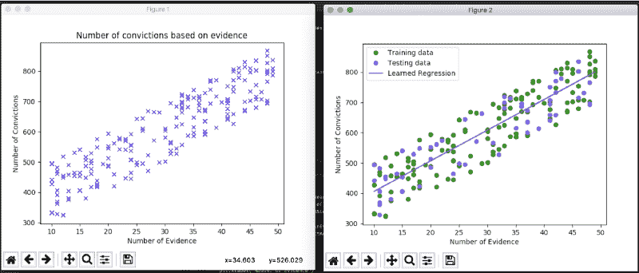

# 关于法律和统计的 TensorFlow 入门

> 原文：<https://www.freecodecamp.org/news/tensorflow-starter-on-law-and-statistics-646072b93b5a/>

丹尼尔·多伊奇

# 关于法律和统计的 TensorFlow 入门


Photo by Steve Roe on Unsplash — [https://unsplash.com/photos/bD5lzOBx-Cs](https://unsplash.com/photos/bD5lzOBx-Cs)

*   [这是怎么回事](https://github.com/Createdd/Writing/blob/master/2018/articles/LawStatisticsExample.md#what-this-is-about)
*   [我们将使用什么](https://github.com/Createdd/Writing/blob/master/2018/articles/LawStatisticsExample.md#what-we-will-use)
*   [开始使用](https://github.com/Createdd/Writing/blob/master/2018/articles/LawStatisticsExample.md#get-started)
*   [安装所需一切的 Shell 命令](https://github.com/Createdd/Writing/blob/master/2018/articles/LawStatisticsExample.md#shell-commands-for-installing-everything-you-need)
*   [获取数据并绘制图表](https://github.com/Createdd/Writing/blob/master/2018/articles/LawStatisticsExample.md#get-data-and-draw-a-plot)
*   [导入您需要的一切](https://github.com/Createdd/Writing/blob/master/2018/articles/LawStatisticsExample.md#import-everything-you-need)
*   [创建并绘制一些数字](https://github.com/Createdd/Writing/blob/master/2018/articles/LawStatisticsExample.md#create-and-plot-some-numbers)
*   [建立张量流模型](https://github.com/Createdd/Writing/blob/master/2018/articles/LawStatisticsExample.md#build-a-tensorflow-model)
*   [准备数据](https://github.com/Createdd/Writing/blob/master/2018/articles/LawStatisticsExample.md#prepare-data)
*   [为 TensorFlow](https://github.com/Createdd/Writing/blob/master/2018/articles/LawStatisticsExample.md#set-up-variables-and-operations-for-tensorflow) 设置变量和操作
*   [以张量流会话开始计算](https://github.com/Createdd/Writing/blob/master/2018/articles/LawStatisticsExample.md#start-the-calculations-with-a-tensorflow-session)
*   [可视化结果和过程](https://github.com/Createdd/Writing/blob/master/2018/articles/LawStatisticsExample.md#visualize-the-result-and-process)

### 这是怎么回事

当我在探索 TensorFlow 时，我想构建一个初学者示例并记录下来。这是一个非常基本的例子，使用梯度下降优化来训练 TensorFlow 的参数。关键变量是**证据**和**定罪**。它将说明:

*   定罪的数量如何取决于证据的数量
*   如何使用回归模型预测定罪数量

Python 文件在 GitHub 上我的[存储库中。](https://github.com/Createdd/lawstatistics/blob/feature/ReferenceBranchForArticle/evidencePrediction.py)

[参见 GitHub 上更好的格式中的文章。](https://github.com/Createdd/Writing/blob/master/2018/articles/LawStatisticsExample.md)

### 我们将使用什么

#### 1\. TensorFlow (as tf)

[张量](https://www.tensorflow.org/programmers_guide/tensors)

*   tf .占位符
*   tf。变量

[助手功能](https://www.tensorflow.org/programmers_guide/variables#initializing_variables)

*   tf.global _ variables _ 初始值设定项

[数学运算](https://www.tensorflow.org/api_guides/python/math_ops)

*   tf.add
*   tf .乘法
*   tf.reduce _ 总和
*   tf.pow

[构建图表](https://www.tensorflow.org/programmers_guide/graphs#building_a_tfgraph)

*   TF . train . gradientdescentoptimizer

[会话](https://www.tensorflow.org/programmers_guide/graphs#executing_a_graph_in_a_tfsession)

*   tf。会议

#### 2.Numpy(作为 np)

*   随机种子
*   np.random .零点
*   随机的
*   随机的
*   np.random.asanyarray

#### 3\. Matplotlib

#### 4.数学

### 入门指南

用 virtualenv 安装 TensorFlow。参见 TF 网站上的[指南](https://www.tensorflow.org/install/install_mac)。

#### 安装所需一切的 Shell 命令

```
sudo easy_install pip
```

```
pip3 install --upgrade virtualenv
```

```
virtualenv --system-site-packages <targetDirectory>
```

```
cd <targetDirectory>
```

```
source ./bin/activate
```

```
easy_install -U pip3
```

```
pip3 install tensorflow
```

```
pip3 install matplotlib
```

### 获取数据并绘制图表

#### 导入您需要的一切

```
import tensorflow as tfimport numpy as npimport mathimport matplotlibmatplotlib.use('TkAgg')import matplotlib.pyplot as pltimport matplotlib.animation as animation
```

如你所见，我使用的是 matplotlib 的“TkAgg”后端。这使得我可以用我的 vsCode 和 macOS 设置进行调试，而不需要任何复杂的后续工作。

#### 创建并绘制一些数字

```
# Generate evidence numbers between 10 and 20# Generate a number of convictions from the evidence with a random noise addednp.random.seed(42)sampleSize = 200numEvid = np.random.randint(low=10, high=50, size=sampleSize)numConvict = numEvid * 10 + np.random.randint(low=200, high=400, size=sampleSize)
```

```
# Plot the data to get a feelingplt.title("Number of convictions based on evidence")plt.plot(numEvid, numConvict, "bx")plt.xlabel("Number of Evidence")plt.ylabel("Number of Convictions")plt.show(block=False)  # Use the keyword 'block' to override the blocking behavior
```

我在为证据创造随机值。定罪的数量取决于证据的数量，带有随机噪声。当然那些数字是编造的，但只是用来证明一个观点。

### 构建张量流模型

要建立一个基本的机器学习模型，我们需要准备数据。然后我们进行预测，衡量损失，通过最小化损失进行优化。

#### 准备数据

```
# create a function for normalizing values# use 70% of the data for training (the remaining 30% shall be used for testing)def normalize(array):    return (array - array.mean()) / array.std()
```

```
numTrain = math.floor(sampleSize * 0.7)
```

```
# convert list to an array and normalize arraystrainEvid = np.asanyarray(numEvid[:numTrain])trainConvict = np.asanyarray(numConvict[:numTrain])trainEvidNorm = normalize(trainEvid)trainConvictdNorm = normalize(trainConvict)
```

```
testEvid = np.asanyarray(numEvid[numTrain:])testConvict = np.asanyarray(numConvict[numTrain:])testEvidNorm = normalize(testEvid)testConvictdNorm = normalize(testConvict)
```

我们将数据分为训练和测试两部分。之后，我们将这些值标准化，因为这是机器学习项目所必需的。(参见“[特征缩放](https://en.wikipedia.org/wiki/Feature_scaling)”。)

#### 为张量流设置变量和操作

```
# define placeholders  and variablestfEvid = tf.placeholder(tf.float32, name="Evid")tfConvict = tf.placeholder(tf.float32, name="Convict")tfEvidFactor = tf.Variable(np.random.randn(), name="EvidFactor")tfConvictOffset = tf.Variable(np.random.randn(), name="ConvictOffset")
```

```
# define the operation for predicting the conviction based on evidence by adding both values# define a loss function (mean squared error)tfPredict = tf.add(tf.multiply(tfEvidFactor, tfEvid), tfConvictOffset)tfCost = tf.reduce_sum(tf.pow(tfPredict - tfConvict, 2)) / (2 * numTrain)
```

```
# set a learning rate and a gradient descent optimizerlearningRate = 0.1gradDesc = tf.train.GradientDescentOptimizer(learningRate).minimize(tfCost)
```

`tf.placeholder`和`tf.Variable`的语用差异是:

*   占位符是为数据分配的存储空间，不需要初始值
*   变量用于参数学习，需要初始值。这些值可以从训练中获得。

我将 TensorFlow 操作符精确地用作`tf.add(…)`，因为使用什么库进行计算是非常清楚的。这代替了使用`+`操作符。

#### 从张量流会话开始计算

```
# initialize variablesinit = tf.global_variables_initializer()
```

```
with tf.Session() as sess:    sess.run(init)
```

```
 # set up iteration parameters    displayEvery = 2    numTrainingSteps = 50
```

```
 # Calculate the number of lines to animation    # define variables for updating during animation    numPlotsAnim = math.floor(numTrainingSteps / displayEvery)    evidFactorAnim = np.zeros(numPlotsAnim)    convictOffsetAnim = np.zeros(numPlotsAnim)    plotIndex = 0
```

```
 # iterate through the training data    for i in range(numTrainingSteps):
```

```
 # ======== Start training by running the session and feeding the gradDesc        for (x, y) in zip(trainEvidNorm, trainConvictdNorm):            sess.run(gradDesc, feed_dict={tfEvid: x, tfConvict: y})
```

```
 # Print status of learning        if (i + 1) % displayEvery == 0:            cost = sess.run(                tfCost, feed_dict={tfEvid: trainEvidNorm, tfConvict: trainConvictdNorm}            )            print(                "iteration #:",                "%04d" % (i + 1),                "cost=",                "{:.9f}".format(cost),                "evidFactor=",                sess.run(tfEvidFactor),                "convictOffset=",                sess.run(tfConvictOffset),            )
```

```
 # store the result of each step in the animation variables            evidFactorAnim[plotIndex] = sess.run(tfEvidFactor)            convictOffsetAnim[plotIndex] = sess.run(tfConvictOffset)            plotIndex += 1
```

```
 # log the optimized result    print("Optimized!")    trainingCost = sess.run(        tfCost, feed_dict={tfEvid: trainEvidNorm, tfConvict: trainConvictdNorm}    )    print(        "Trained cost=",        trainingCost,        "evidFactor=",        sess.run(tfEvidFactor),        "convictOffset=",        sess.run(tfConvictOffset),        "\n",    )
```

现在我们来看实际训练和最有趣的部分。

图表现在在`[tf.Session](https://www.tensorflow.org/programmers_guide/graphs#executing_a_graph_in_a_tfsession)`中执行。我使用“馈送”,因为它可以让你将数据注入计算图中的任何张量。你可以在这里看到更多关于阅读数据[。](https://www.tensorflow.org/api_guides/python/reading_data#Feeding)

`tf.Session()`用于创建在退出上下文时自动关闭的会话。当引发未捕获的异常时，会话也会关闭。

`tf.Session.run`方法是运行`tf.Operation`或评估`tf.Tensor`的主要机制。您可以将一个或多个`tf.Operation`或`tf.Tensor`对象传递给`tf.Session.run`，TensorFlow 将执行计算结果所需的操作。

首先，我们运行梯度下降训练，同时向它提供标准化的训练数据。之后，我们正在计算损失。

我们重复这个过程，直到每一步的改进非常小。请记住，`tf.Variables`(参数)已经过调整，现在反映的是最佳值。

### 将结果和过程可视化

```
# de-normalize variables to be plotable again    trainEvidMean = trainEvid.mean()    trainEvidStd = trainEvid.std()    trainConvictMean = trainConvict.mean()    trainConvictStd = trainConvict.std()    xNorm = trainEvidNorm * trainEvidStd + trainEvidMean    yNorm = (        sess.run(tfEvidFactor) * trainEvidNorm + sess.run(tfConvictOffset)    ) * trainConvictStd + trainConvictMean
```

```
 # Plot the result graph    plt.figure()
```

```
 plt.xlabel("Number of Evidence")    plt.ylabel("Number of Convictions")
```

```
 plt.plot(trainEvid, trainConvict, "go", label="Training data")    plt.plot(testEvid, testConvict, "mo", label="Testing data")    plt.plot(xNorm, yNorm, label="Learned Regression")    plt.legend(loc="upper left")
```

```
 plt.show()
```

```
 # Plot an animated graph that shows the process of optimization    fig, ax = plt.subplots()    line, = ax.plot(numEvid, numConvict)
```

```
 plt.rcParams["figure.figsize"] = (10, 8) # adding fixed size parameters to keep animation in scale    plt.title("Gradient Descent Fitting Regression Line")    plt.xlabel("Number of Evidence")    plt.ylabel("Number of Convictions")    plt.plot(trainEvid, trainConvict, "go", label="Training data")    plt.plot(testEvid, testConvict, "mo", label="Testing data")
```

```
 # define an animation function that changes the ydata    def animate(i):        line.set_xdata(xNorm)        line.set_ydata(            (evidFactorAnim[i] * trainEvidNorm + convictOffsetAnim[i]) * trainConvictStd            + trainConvictMean        )        return (line,)
```

```
 # Initialize the animation with zeros for y    def initAnim():        line.set_ydata(np.zeros(shape=numConvict.shape[0]))        return (line,)
```

```
 # call the animation    ani = animation.FuncAnimation(        fig,        animate,        frames=np.arange(0, plotIndex),        init_func=initAnim,        interval=200,        blit=True,    )
```

```
 plt.show()
```

为了使过程可视化，绘制结果图甚至优化过程图是很有帮助的。



看看这个 [Pluralsight 课程](https://www.pluralsight.com/courses/tensorflow-getting-started)，它对我的起步帮助很大。:)

感谢阅读我的文章！欢迎留下任何反馈！

丹尼尔是商法专业的法学硕士学生，在维也纳担任软件工程师和科技相关活动的组织者。他目前的个人学习努力集中在机器学习上。

关系

*   [LinkedIn](https://www.linkedin.com/in/createdd)
*   [Github](https://github.com/Createdd)
*   [中等](https://medium.com/@ddcreationstudi)
*   [推特](https://twitter.com/DDCreationStudi)
*   [Steemit](https://steemit.com/@createdd)
*   [哈希节点](https://hashnode.com/@DDCreationStudio)