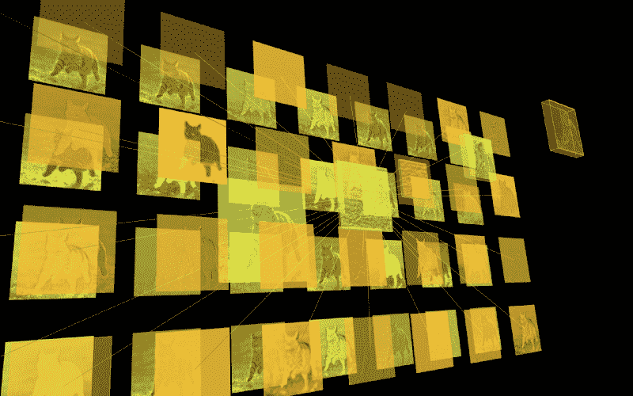
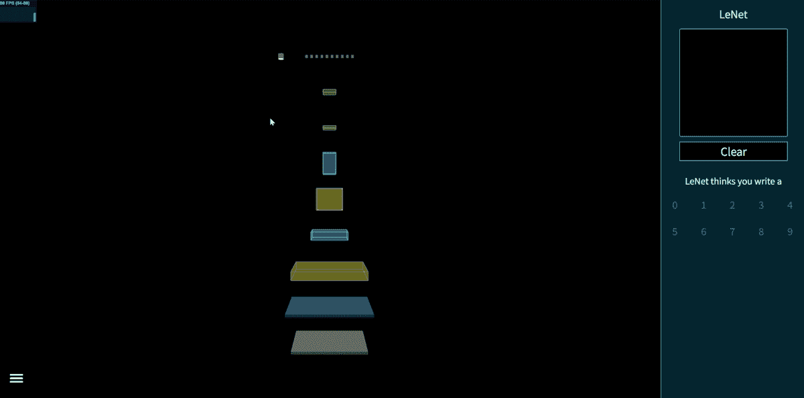
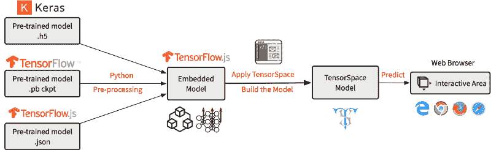

# TensorSpace.js 简介—一种在浏览器中 3D 可视化神经网络的方法

> 原文：<https://www.freecodecamp.org/news/tensorspace-js-a-way-to-3d-visualize-neural-networks-in-browsers-2c0afd7648a8/>

作者:朱

# TensorSpace.js 简介—一种在浏览器中 3D 可视化神经网络的方法



Feature Abstractions of a Tiger Cat Image

在我上第一堂深度学习课之前，神经网络一直都是很高级，遥不可及，很神秘的东西。对我来说，它们只是魔法:神经网络应用程序可以完成我们日常生活中的对象检测、图像分类甚至数据预测等任务。

“这个模型计算什么？”“为什么我们要使用这个特定的网络来完成这项任务？”“其他人怎么可能想出这样的结构？”

也许你有和我一样的问题。我和我的朋友们发现，有时理解和解释神经网络真的很难。然后我们想出了一些主意:

为什么不设想一个神经网络？
*3D 模型怎么样？*
*它可以互动！*

既然我们找不到这样的东西，我们想，为什么不自己创造一个呢？6 个月后，我很自豪地向大家介绍我们的成果: [TensorSpace.js](https://github.com/tensorspace-team/tensorspace) 。

### TensorSpace.js 是什么？



**Fig. 1** — Interactive LeNet model created by TensorSpace.js

> TensorSpace.js 是用 TensorFlow.js、Three.js 和 Tween.js 构建的神经网络三维可视化框架。

因为我们希望能够在大多数 web 浏览器中轻松呈现模型，所以我们选择 JavaScript 来实现这个框架。

从上面的图 1 中，您可以很容易地检查出模型结构:每个“立方体”代表神经网络中的一个“层”对象。

接下来，您可以通过单击、拖动和滚动来与模型进行交互。不同的角度可以提供模型的不同视点。一些对象是可扩展的，这允许您观察更多细节。

此外，我们为 TensorSpace.js 设计了一个混合架构，以支持不同的库，如 TensorFlow、Keras 和 TensorFlow.js(将来会有更多)。

TensorSpace.js 不仅可以展示基本的模型结构，还可以呈现内部特征抽象、中间数据操作和最终推理生成的过程。

综上所述，TensorSpace.js 是:

*   **交互式** —使用类似 Keras 的 API 在浏览器中构建交互式模型。
*   **直观** —将来自中间推理的信息可视化。
*   **综合**-支持来自 TensorFlow、Keras 和 TensorFlow.js 的预训练模型。

### TensorSpace.js 是怎么运作的？

下面的部分介绍了如何建立一个张量空间模型。我使用 LeNet 手写识别模型作为例子。你可以在这里找到 repo 的所有示例文件: [TensorSpace — HelloWorld](http://repo) 。



**Fig. 2** — Workflow to present a TensorSpace model

一般工作流程是创建或预处理具有多个中间输出的预训练模型。然后，基于神经网络结构，我们可以建立一个张量空间模型。最后，我们加载并初始化模型，该模型可以接受输入数据进行推理。

在正确地[安装 TensorSpace.js](https://tensorspace.org/html/docs/startInstall.html) 和适当地[预处理预训练的模型](https://tensorspace.org/html/docs/preIntro.html)之后，我们可以很容易地创建一个 LeNet 手写识别 TensorSpace 模型。为了方便起见，我们使用[预处理张量空间兼容模型](https://github.com/tensorspace-team/tensorspace/tree/master/examples/helloworld/model)和一个[提取文件](https://github.com/tensorspace-team/tensorspace/blob/master/examples/helloworld/data/5.json)作为模型输入。

```
let container = document.getElementById( "container" );
```

```
// Create sequential modellet model = new TSP.models.Sequential( container );
```

```
// Add LeNet Layersmodel.add( new TSP.layers.GreyscaleInput({ shape: [28, 28, 1] }) );model.add( new TSP.layers.Padding2d({ padding: [2, 2] }) );model.add( new TSP.layers.Conv2d({ kernelSize: 5, filters: 6, strides: 1 }) );model.add( new TSP.layers.Pooling2d({ poolSize: [2, 2], strides: [2, 2] }) );model.add( new TSP.layers.Conv2d({ kernelSize: 5, filters: 16, strides: 1 }) );model.add( new TSP.layers.Pooling2d({ poolSize: [2, 2], strides: [2, 2] }) );model.add( new TSP.layers.Dense({ units: 120 }) );model.add( new TSP.layers.Dense({ units: 84 }) );model.add( new TSP.layers.Output1d({    units: 10,    outputs: ["0", "1", "2", "3", "4", "5", "6", "7", "8", "9"]}) );
```

```
// Load preprocessed modelmodel.load({    type: "tfjs",    url: './lenetModel/mnist.json'});
```

```
// Initialize the model in the browsermodel.init(function() {    // Predict input "5"    model.predict( image_5 ); });
```

就是这样！

您可以在 CodePen 中试用它:

[*在 CodePen*](https://codepen.io/syt123450/pen/667a7943b0f23727790ca38c93389689/) *中查看。*

很容易以同样的方式构建其他预处理模型。如果你有兴趣，请查看我们的[游乐场](https://tensorspace.org/html/playground/index.html)以获得更多有趣的演示，如 Yolov2-tiny、ACGAN 和 ResNet-50。

### 你应该什么时候使用它？

如果你想把你的模型呈现给别人，解释模型的一些细节特征，或者从头开始搭建一个 demo，我觉得 TensorSpace 可以是一个很好的工具，直观清晰的描述模型。与您刚刚构建的模型进行交互和探索非常有趣。

### **结论**

我和我的团队希望 TensorSpace 至少可以帮助你在如何可视化神经网络方面向前迈进一小步。我们相信这会吸引更多的人进入这个领域。

有关 TensorSpace.js 的更多信息，请查看:

*   官方网站:[TensorSpace.org](https://tensorspace.org/)
*   GitHub 资源库:[tensor space-Team/tensor space](https://github.com/tensorspace-team/tensorspace)。