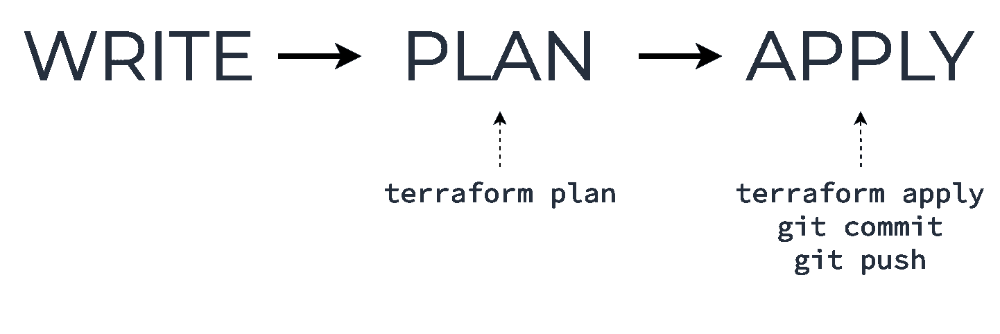
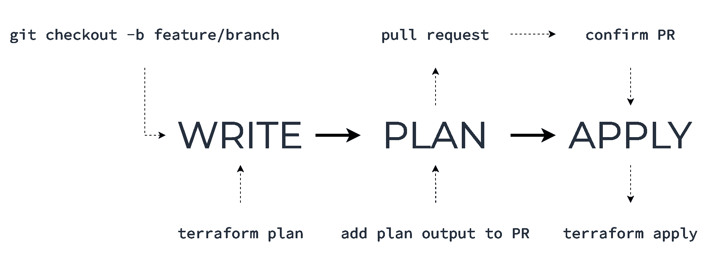
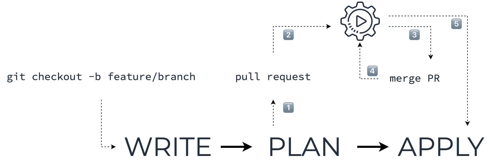
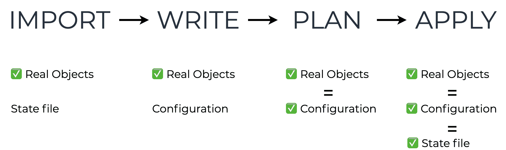

# Terraform 工作流程:如何在团队中独立工作

> 原文：<https://www.freecodecamp.org/news/terraform-workflow-working-individually-and-in-a-team/>

一个工作流程，或者说一种工作模式，给你一个标准化的方法去做一些事情。

这对团队非常有帮助，即使你单独工作也能从中受益。一个好的工作流程能让你简化流程，组织流程，减少出错几率。

本文总结了使用 Terraform 时的几种方法，包括个人和团队。我试图收集最常见的，但你可能也想发展自己的。

它们的共同需求是一个版本控制系统(比如 Git)。这就是你如何确保没有丢失任何东西，并且你所有的代码变更都被正确地版本化跟踪。

目录:

*   [基本概念](#basic-concepts)
*   [核心个人工作流程](#core-individual-workflow)
*   [核心团队工作流程](#core-team-workflow)
*   [自动化团队工作流程](#team-workflow-with-automation)
*   [导入工作流程](#import-workflow)

## 基本概念

我们先定义一下基本动作。

所有描述的工作流都建立在三个关键步骤之上:编写、计划和应用。然而，它们的详细信息和操作在不同的工作流中会有所不同。


写下——这是你修改代码的地方。

**计划**——这是你回顾变化并决定是否接受它们的地方。

**应用**–这是您接受变更并将其应用于实际基础设施的地方。

这是一个简单的想法，有多种可能的实现。

## 核心个人工作流程

如果你独自从事一个相对较小的 TF 项目，这是最简单的工作流程。这个工作流非常适合本地和远程后端。



### 写

您克隆远程代码报告或获取最新的更改，编辑配置代码，然后运行`terraform validate`和`terraform fmt`命令以确保您的代码运行良好。

### 计划

这是您运行`terraform plan`命令的地方，以确保您的更改符合您的需要。这是提交您的代码更改的好时机(或者您可以在下一步中完成)。

### 应用

这是您运行`terraform apply`并引入对真实基础设施对象的更改的时候。此外，这也是您将提交的变更推送到远程存储库的时候。

## 核心团队工作流程

当您在团队中处理配置代码并希望使用功能分支来准确管理变更时，此工作流非常有用。



### 写

首先检查一个新的分支，进行修改，并运行`terraform validate`和`terraform fmt`命令以确保您的代码运行良好。

在这一步运行`terraform plan`将有助于确保你得到你想要的。

### 计划

这是代码和计划评审发生的地方。

将`terraform plan`命令的输出与您的更改一起添加到 Pull 请求中。最好只添加公共输出中已更改的部分，即以“ *Terraform 将执行以下操作*字符串”开头的部分。

### 应用

一旦 PR 被审查并被合并到上游分支，就可以安全地最终本地拉动上游分支并应用带有`terraform apply`的配置。

## 自动化团队工作流程

简而言之，这个工作流允许您为您的基础设施代码引入一种冒烟测试(使用`plan`),并且在 CI 过程中自动化反馈。

该工作流的自动化部分包括一个关于提交和/或拉请求(PR)的推测性计划，以及将`plan`的输出添加到 PR 的注释中。一个推测性的计划意味着只是展示变化，而不是事后应用。

‌‌



### 写

这一步与前面的工作流程相同。

### 计划

这是您的 CI 工具发挥作用的地方。

让我们一步一步地回顾一下:

1.  您创建一个 PR，其中包含您希望实现的代码更改。
2.  CI 管道由代码库中的事件触发(比如 webhook push ),它针对您的代码运行一个推测性的计划。
3.  将变更列表(所谓的“计划差异”)添加到 PR 中，供 CI 审查。
4.  合并后，CI 渠道将再次运行，您将获得准备应用于基础架构的最终计划。

**应用**

现在您有了一个要应用新代码的分支(即 main ),您需要将它拉到本地并运行`terraform apply`。

您还可以在此处添加自动应用–下图中的步骤 5。这对于诸如测试、登台、开发等一次性环境可能非常有用。

这里使用的确切 CI 工具由您决定:Jenkins、GitHub Actions 和 Travis CI 都工作良好。

需要注意的重要一点是，CI 管道必须与您的存储库双向配置，以便从中获取代码，并向 PR 报告注释。

作为一个选项，您可以考虑使用 Terraform Cloud，它有很多功能，包括上面提到的回购集成，甚至可以免费订阅。

如果你以前从未使用过 Terraform Cloud，并想获得入门建议，我会在本文末尾提供链接。

## 导入工作流

‌‌This 工作流指的是这样一种情况，即您已经创建了一些对象(即启动并运行)，并且您需要使用 Terraform 来管理它们。

假设我们在 AWS 中已经有了一个名为“someassetsbucket”的 S3 存储桶，我们希望将它包含到我们的配置代码中。‌‌



### 准备

您应该创建一个资源块，稍后用于您要导入的真实对象。

你不需要一开始就在其中填入参数，所以它可能只是一个空白的资源块，例如:

```
resource "aws_s3_bucket" "assets" {
‌‌
}
```

### 导入

现在，您需要将真实对象的信息导入到现有的 Terraform 状态文件中。

这可以通过`terraform import`命令来完成，例如:

```
terraform import aws_s3_bucket.assets "someassetsbucket"
```

‌Be sure to also check the list of possible options `import` accepts with `terraform import -h`

### 写

现在你需要为这个桶编写相应的 Terraform 代码。

为了避免在`terraform apply`动作中修改您的真实对象，您应该用导入阶段的精确值指定所有需要的参数。

您可以通过运行`terraform state show`命令查看详细信息，例如:

```
terraform state show aws_s3_bucket.assets
```

该命令的输出将非常类似于配置代码。但是它包含了资源的参数和属性，所以在应用它之前需要清理它。

您可以使用以下策略之一:

*   复制/粘贴它，然后运行`terraform validate`和`terraform plan`几次，以确保没有类似于“*参数不应在此处出现*”或“*该字段不能设置*”的错误
*   或者你可以只选择和写必要的参数

在任何情况下，在此过程中一定要参考资源文档。

### 计划

目标是让`terraform plan`输出只显示“ *~就地更新*”变更。

但是，并不总是清楚是修改真实对象还是只更新状态文件。这就是为什么你应该了解一个真实的对象是如何工作的，并知道它的生命周期，以确保应用该计划是安全的。

### 应用

这是通常的`terraform apply`动作。

一旦应用，您的配置和状态文件将对应于真实的对象配置。

## **结束**

以下是 Terraform 云的概述，供从未使用过它的人参考:‌‌[terra form 云功能概述](https://www.terraform.io/docs/cloud/overview.html)

这里有一个很好的教程可以开始:[入门-地形云](https://learn.hashicorp.com/collections/terraform/cloud-get-started)

此外，这是 HashiCorp 首席技术官对大规模工作流的概述，可能对更有经验的 Terraform 用户有用: [Terraform 大规模工作流最佳实践](https://www.hashicorp.com/resources/terraform-workflow-best-practices-at-scale)

感谢您的阅读。我希望你能尝试这些工作流程中的一个，或者开发你自己的工作流程！‌‌

‌‌