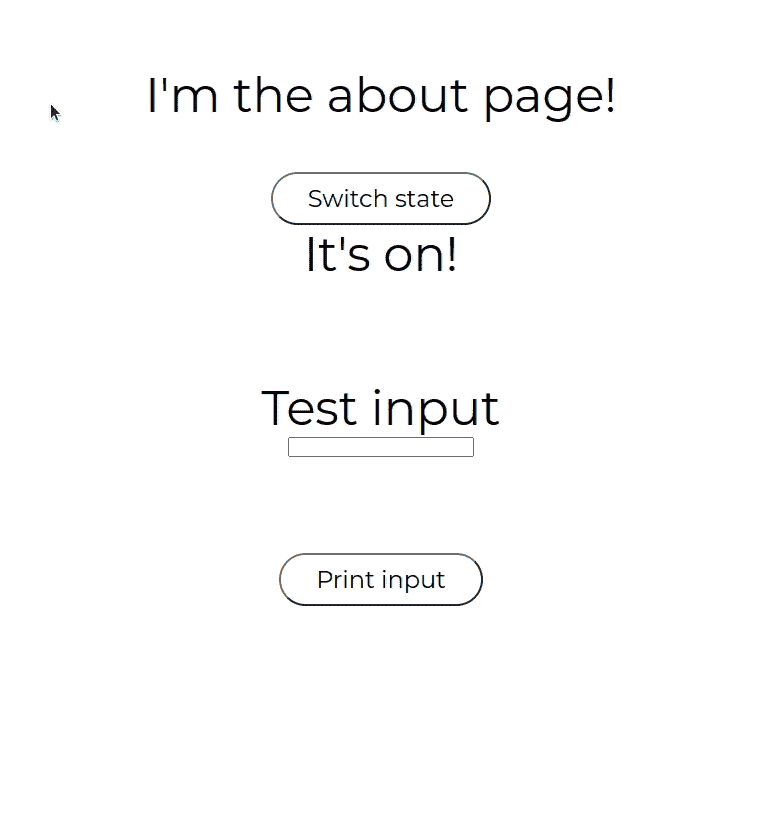
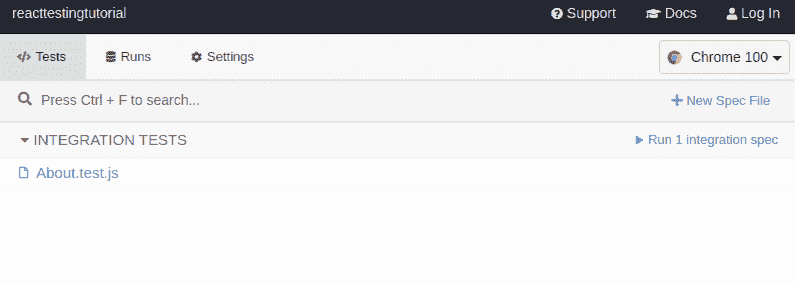
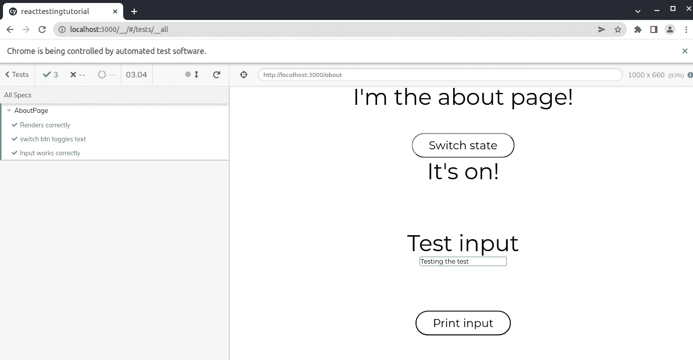
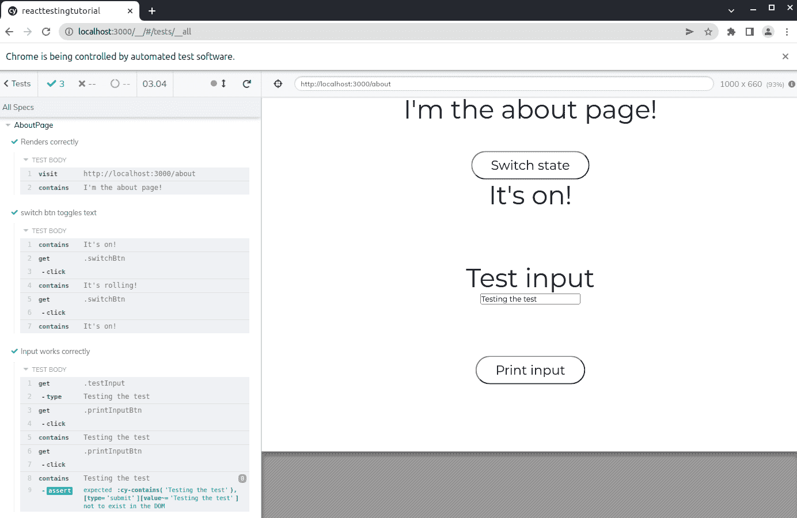

# 如何使用 Jest、Testing Library、Cypress 和 Supertest 测试你的应用

> 原文：<https://www.freecodecamp.org/news/test-a-react-app-with-jest-testing-library-and-cypress/>

大家好！在这篇文章中，我们将谈论测试。我将对什么是测试做一个很好的概述，并介绍如何在 JavaScript 项目中实现测试。我们将使用四个非常流行的工具——Jest、测试库、Cypress 和 Supertest。

首先，我们将讨论什么是测试，为什么测试我们的代码是一个好主意，以及可以实现的不同种类的测试。

然后，我们将介绍我们将使用的每个工具，最后，我们将给出普通 JS 代码、前端 React 应用程序和后端 Node 应用程序的实际示例。

我们走吧！

## 目录

*   [什么是测试，为什么它有价值](#what-is-testing-and-why-is-it-valuable)
*   [不同类型的测试](#different-types-of-tests)
    *   [手动与自动测试](#manual-vs-automated-testing)
    *   [功能与非功能测试](#functional-vs-non-functional-testing)
    *   [单元 vs 集成 vs 端到端测试](#unit-vs-integration-testing-vs-end-to-end-testing)
    *   [白盒 vs 黑盒 vs 灰盒测试](#white-box-vs-black-box-vs-grey-box-testing)
*   [何时测试](#when-to-test)
*   [我们的工具集](#our-toolset)
    *   [什么是玩笑](#what-is-jest)
    *   [什么是测试库](#what-is-testing-library)
    *   [柏树是什么](#what-is-cypress)
    *   [什么是超级测试](#what-is-supertest)
    *   [工具综述](#tools-roundup)
*   [如何测试香草 JS 代码](#how-to-test-vanilla-js-code)
*   [如何用 Jest 和 React 测试库测试前端 React app](#how-to-test-a-front-end-react-app-with-jest-and-react-testing-library)
*   [如何用 Cypress 测试前端 React app](#how-to-test-a-front-end-react-app-with-cypress)
*   [如何测试后端节点 app](#how-to-test-a-back-end-node-app)
*   [总结](#wrap-up)

# 什么是测试，为什么它有价值

测试是检查一个软件是否按预期运行的实践。这通常被认为是 QA 或质量保证，旨在将进入生产的 bug 数量减少到最低限度。

我们测试软件以识别错误、差距或缺失的需求，并在将代码交付生产之前修复这些问题。

彻底测试我们的代码提高了我们项目的可靠性，节省了我们以后修复 bug 的时间，从而降低了成本，并增加了我们的客户对我们的产品完全满意的机会。


这里有一个 Fireship 制作的很好的短片介绍一些我们稍后会谈到的概念。

# 不同类型的测试

测试实践可以根据许多因素分为不同的类型。我个人认为关于这个话题有很多晦涩难懂的东西，有数百个术语经常指代非常相似的事物。因此，让我们保持简单，只回顾最流行的术语及其含义。

这将有助于阐明软件测试的许多方式，并更好地理解我们稍后将展示的工具。

### 手动测试与自动化测试

根据我们用来测试软件的工具，我们可以将测试分为**手动**或**自动测试**。

**手动测试**是“点击”并手动检查我们产品的所有功能的实践，模拟实际用户会做什么。

自动化测试是通过代码来完成的，编写程序来检查我们的应用程序如何运行。

有许多测试框架和库可供我们使用。当谈到功能测试时(我们马上会看到这意味着什么)，大多数库都以类似的方式工作:

*   首先我们**定义**我们想要测试哪段代码。
*   然后我们给这段代码提供某种类型的**输入**或者对它执行一个**动作**。
*   然后我们定义这段代码**应该做什么**给定我们执行的输入/动作。
*   最后，我们将**比较**这段代码实际做了什么和我们说它应该做什么。

如果它按照我们说的做了，测试就通过了。如果没有，它就失败了。

### 功能测试与非功能测试

**功能**测试是指我们产品的实际**特性。例如，如果我们有一个博客平台，功能测试应该确保用户可以创建新的文章，编辑这些文章，浏览其他人写的文章，等等。**

**非功能性**测试是指任何与我们产品的核心特性没有严格关联的**。这又可以分为不同的类别，例如:**

*   **压力测试**检查基础设施如何应对大量使用。
*   **安全测试**检查应用程序是否容易受到常见的黑客攻击。
*   **可访问性测试**检查应用程序的编码方式是否适合不同残障人士。

### 单元测试与集成测试与端到端测试

对测试进行分类的另一种方式是根据它的广度或综合性。

**单元测试**旨在以独立的方式测试单个功能、方法或小块代码。在单元测试中，以隔离的方式检查小段代码。

**集成测试**检查单个代码片段如何相互作用和协同工作。在集成测试中，我们将各个部分放在一起，看它们是否正确交互。

端到端测试，也称为 E2E，在模拟实际用户行为的模拟环境中执行程序。以一个网站为例，我们的代码将在一个实际的浏览器中打开，所有的功能将以用户使用它们的相同方式执行。在这个意义上，E2E 测试很像手工测试，但是完全自动化。

E2E 测试是这三种测试中最广泛或最全面的一种，因为它评估整个特性和行为，而不是代码的特定部分。

### 白盒对比黑盒对比灰盒测试

我们将看到的最后一个分类取决于我们的测试对实现细节或用户体验的关注程度。

假设我们有一个简单的网站，有一个按钮，当它被点击时，它打开一个模态。在我们的代码中，按钮有一个执行函数的 click 事件侦听器。该函数更改了我们的模态 HTML 元素的 CSS 类，并在屏幕上呈现了模态。

我们在测试**实现细节**时，会谈到“**白盒**测试。按照这个例子，在这个范例下，我们可以测试按钮点击执行相应的功能，并且在功能执行之后，我们的模态元素的 CSS 类相应地改变。

另一种方法是完全忘记实现，只检查单击按钮后是否呈现了模态。我们不关心 CSS 类是什么，也不关心相应的函数是否执行。我们只是专注于测试**用户应该感知什么。**那是“**黑盒**测试。

而且，你可能已经猜到了，“灰箱”测试只是前两者的结合。

这里要提到的最后一件事是，这些不同类型的测试不一定是互斥的。我的意思是，它们可以并且经常在相同的项目中同时实现。

手动测试和自动化测试、功能测试和非功能测试、单元测试和 E2E 测试都很常见...这个想法总是试图在合理的时间和精力内预测和解决尽可能多的问题。

# 何时测试

乍一看，这似乎是一个简单的问题，但实际上也有不同的方法。

有些人喜欢在他们的应用程序完全开发出来后进行测试。其他人喜欢在编写应用程序的同时编写测试，并在开发过程中测试每个特性。

其他人喜欢先写测试，用这种方式定义程序要完成的最低要求。然后他们以尽可能快地通过测试的方式编写应用程序(这被称为[测试驱动开发或 TDD](https://en.wikipedia.org/wiki/Test-driven_development) )。

一旦你开发了一个应用程序或一个完整的功能，并且你有了一个测试套件(测试套件是一组检查特定功能或整个应用程序的测试)，另一个常见的做法是每次你对代码库进行任何类型的修改时运行你的测试，以验证没有任何东西被破坏。

最后，如果您有一个 [CI/CD](https://en.wikipedia.org/wiki/CI/CD) 系统，通常会在任何部署之前自动执行测试。因此，如果任何测试失败，部署就会停止，并发出某种警报(这当然总比看到您的应用程序在 prod 上着火要好🔥😱).

与测试类型一样，在不同的时间测试应用程序是很常见的。每个公司通常都有自己的测试时间表或实践来遵循，以满足他们的需求。

# 我们的工具集

好了，现在我们对什么是测试以及我们可以执行的测试类型有了一个更清晰的概念，让我们回顾一下我们将在例子中使用的工具。

如前所述，有许多不同的库可供选择来运行我们的测试。我选择这四个是因为它们是 JavaScript 应用中最受欢迎的，但是我知道还有更多选择。我将为我们将使用的大多数工具命名备选方案，以防您想要进行更多调查。😉

## 什么是玩笑

Jest 是一个 JavaScript 测试者。测试运行程序是一个软件，允许你运行测试来评估你的应用程序。这是一个由 Meta(原脸书)维护的开源项目，于 2014 年首次开源。

旁注:每次我说“测试赛跑者”，我都会想到这个。只有我一个人吗？🤔


Test runner, not Blade runner!

无论如何...在使用 [Babel](https://babeljs.io/) 、 [TypeScript](https://www.typescriptlang.org/) 、 [Node.js](https://nodejs.org/en/) 、 [React](https://reactjs.org/) 、 [Angular](https://angular.io/) 、 [Vue.js](https://vuejs.org/) 、[svelite](https://svelte.dev/)等技术的项目中也可以使用 Jest。你可以像安装任何库一样通过 NPM 安装 Jest，它只需要很少的配置就可以启动。

使用 [create-react-app](https://create-react-app.dev/) 设置 React 应用时，Jest 会默认安装。

Jest 通常也被称为测试框架，因为除了运行测试之外，它还有许多其他内置特性(并非所有的测试运行程序都是如此)。这些功能包括:

*   **断言库:** Jest 附带了许多内置的函数和方法，您可以使用它们来断言您的代码(断言基本上意味着检查一段代码是否像预期的那样运行)。
*   Jest 允许你使用快照，这是一种捕捉大型对象并将其存储在内存中的方式，这样你就可以在以后将其与其他对象进行比较。
*   Jest 允许你获得测试的代码覆盖率报告。这些报告显示了您的代码目前被测试的百分比，您甚至可以看到目前没有被覆盖的确切的代码行。
*   Jest 也像一个模仿库，它允许你模仿数据(像一个函数或模块)并在你的测试中使用它。

Jest 的一些众所周知的替代品是[摩卡](https://mochajs.org/)、[茉莉](https://jasmine.github.io/)和[因果](https://karma-runner.github.io/latest/index.html)。

这里有一个很好的小视频解释什么是笑话。

## 什么是测试库？

Testing library 不是一个测试运行程序，而是一组将与 Jest 或 Mocha 之类的测试运行程序一起工作的实用程序。这个实用程序是我们可以用来轻松测试代码的工具，并且更注重用户体验(黑盒测试)。

Testing library 是由 [Kent C Dodds](https://kentcdodds.com/) 开发的(他也是地球上最好的 JS 老师之一，所以我推荐你跟随他)。

引用[官方文件:](https://testing-library.com/)

> “Testing Library 系列库是一个非常轻量级的测试解决方案，不需要所有的实现细节。
> 
> *它提供的主要实用程序包括查询节点，类似于用户如何找到它们。通过这种方式，testing-library 有助于确保您的测试让您对 UI 代码充满信心。”*

简单地说，通过测试库，我们可以测试 UI 元素(比如一个段落、一个按钮、一个 div...)而不是测试负责呈现 UI 的代码。

该库背后的原则是:

> “你的测试越像你的软件被使用的方式，它们就越能给你信心。”

...这正是我们所说的“黑盒”测试的含义。😉

测试库实际上是一组库,每一个库都是为了实现相同的目标而创建的，但是适用于不同的技术，例如 React、Angular、Vue、Svelte、React Native 等等...这就是为什么你可能会听到“React-testing-library”或者“Vue-testing-library”。这是一样的东西，但适用于不同的技术。

使用 [create-react-app](https://create-react-app.dev/) 设置 React 应用程序时，默认安装 React-testing-library。

测试库的一个替代方法是[Enzyme](https://enzymejs.github.io/enzyme/)(Airbnb 开发的一套 UI 测试工具)。

## 柏树是什么？

Cypress 是一个开源的测试运行程序，它允许你在一个自动化的浏览器中执行你的项目，就像用户一样。

有了 Cypress，我们可以对浏览器将要做的事情进行编程(比如访问一个 URL，点击一个按钮，完成并提交一个表单...)并检查每个动作是否与相应的响应相匹配。

令人高兴的是，测试与用户将体验到的非常相似。由于制作软件的全部目的是用户，我们越接近他们的视角，我们就越能捕捉到代码中最有意义的错误。(此外，看到自动化浏览器在几秒钟内浏览整个应用程序真的很酷...🤓)

Cypress 的另一个很好的特点是“时间旅行”。在 Cypress 的自动化浏览器上，我们可以看到我们编写的所有测试，只需将鼠标悬停在上面就可以看到其结果的图形快照。这是一件非常有用的事情，有助于更好地了解什么在发生，什么时候发生。

尽管它可以用于单元和集成测试，但 Cypress 主要用于端到端测试，因为它可以在几秒钟内轻松评估完整的特性。

您可以使用 Cypress 来测试在浏览器中运行的任何东西，因此您可以轻松地在 React、Angular、Vue 等上实现它。

与 Jest 和 React-Testing-Library 不同，Cypress 没有预装 create-react-app。但我们可以很容易地安装它与 NPM 或您的软件包管理器的选择。

一些柏树的替代品是硒和 T2 木偶师。

Fireship 提供了一段甜蜜的视频，解释了柏树是什么以及它是如何工作的。

旁注:...每次我谈到柏树时，它就会在我脑海中浮现。😎

## 什么是超级测试？

[Supertest](https://github.com/visionmedia/supertest) 是一个模拟 HTTP 请求的库。用 Jest 测试后端节点应用程序非常方便(我们将在接下来的例子中看到)。

### 工具综述

作为这个话题的快速总结:

*   Jest 是我们用来编写和运行 JavaScript 测试的库。
*   测试库和 Jest 一起工作，为我们提供了直接测试 UI 的函数和方法，忘记了背后的代码。
*   Cypress 在模拟浏览器中运行您的应用程序，并检查 UI 中执行的操作是否如预期那样响应。
*   Supertest 是一个模仿 HTTP 请求的库，它可以和 Jest 一起用来测试后端应用程序。

现在让我们开始有趣的部分...


Let the testing begin!!

# 如何测试普通的 JS 代码

好了，让我们从测试一些简单的普通 JS 代码开始。这里的想法是看看我们如何在我们的项目中实现 Jest，并学习它如何工作的基本知识。

让我们首先在我们的机器中创建新目录，并用`npm init -y`创建一个节点 app。然后通过运行`npm i -D jest`安装 Jest(`-D`将其保存为开发依赖)。

现在您应该在您的`package.json`文件中看到类似这样的内容:`"devDependencies": { "jest": "^27.5.1" }` 。

说到这里，在你的`package.json`中，把你的`test`剧本换成`"test": "jest"`。这将允许我们稍后通过运行`npm test`来运行我们的测试。；)

您的整个`package.json`文件应该如下所示:

```
{
  "name": "vanillatesting",
  "version": "1.0.0",
  "description": "",
  "main": "index.js",
  "scripts": {
    "test": "jest"
  },
  "keywords": [],
  "author": "",
  "license": "ISC",
  "devDependencies": {
    "jest": "^27.5.1"
  }
} 
```

酷，我们都准备好写一些可以测试的 JS 了！创建一个`index.js`文件，并将以下代码放入其中:

```
// index.js
function isPalindrome(string) {
    // O(n)
    // Put a pointer at each extreme of the word and iterate "inwards"
    // At each iteration, check if the pointers represent equal values
    // If this condition isn't accomplished, the word isn't a palindrome
    let left = 0
    let right = string.length-1

    while (left < right) {
        if (string[left] === string[right]) {
            left += 1
            right -= 1
        }
        else return false
    }

    return true
} 
```

这个函数是一个[回文](https://en.wikipedia.org/wiki/Palindrome)检查器。它接收一个字符串作为参数，如果该字符串是回文，则返回`true`,否则返回`false`。(这是一个经典的技术面试问题，但那是另一篇文章的内容。🤫)

请注意，我们也在导出函数。补充说明:如果你想了解更多关于 JS 模块的工作原理，我最近写了一篇文章。

太好了，现在让我们测试这个函数，看看它是否如预期的那样工作。让我们创建一个名为`index.test.js`的文件。

这个文件是我们编写测试的地方。我们使用的后缀(`.test.js`)在这里很重要，因为 Jest 会自动识别`.test`文件，并在我们命令 Jest 测试我们的项目时执行它们。

Jest 还识别带有`.spec`后缀的文件，比如`index.spec.js`(对于“规范”，指的是你的项目的需求)。就我个人而言，我更喜欢`.test`，因为它对我来说感觉更清晰，但两者都一样。

现在让我们编写我们的第一个测试！把这个放在你的`index.test.js`文件里。

```
// index.test.js
isPalindrome = require('./index.js')

test('neuquen is palindrom', () => {
    expect(isPalindrome("neuquen")).toBe(true)
})

test('bariloche is not palindrom', () => {
    expect(isPalindrome("bariloche")).toBe(false)
}) 
```

让我们回顾一下我们实际正在做的事情:

1.  需要我们要测试的函数:`isPalindrome = require('./index.js')`
2.  Jest 提供了`test()`函数，我们将在其中放置我们希望 Jest 执行的代码。
3.  `test()`需要两个参数。第一个是测试描述，这是一个独特的名称，当测试运行时，它将显示在我们的控制台上。我们马上会看到一个例子。
4.  第二个参数是回调，它包含实际的测试代码。
5.  在这个回调函数中，我们调用了`expect()`函数(也由 Jest 提供)。`expect()`将我们的函数作为参数，它本身正在接收一个我们编造的参数。
6.  最后，我们链接`.toBe()`函数(也由 Jest 提供),并作为参数传递我们期望`isPalindrome()`在每种情况下返回的值。(“neuquen”是一个回文，所以我们的函数应该返回`true`，而“bariloche”不是，所以它应该返回`false`。)

我最喜欢 Jest 的一点是它的设置非常简单。我非常喜欢的另一件事是它的语法是如何自我解释的。请注意，我们可以很容易地通过阅读来理解我们的测试将评估什么。👌

现在让我们试试这个！如果我们在控制台中运行`npm test`,我们应该得到以下结果:

```
// console
> jest PASS 
./index.test.js
✓ neuquen is palindrom (1 ms)
✓ bariloche is not palindrom

Test Suites: 1 passed, 1
total Tests:       2 passed, 2
total Snapshots:   0
total Time:        0.244 s
Ran all test suites. 
```

恭喜你，你刚刚通过了你的第一个笑话测试。


为了看看失败的测试是什么样子，让我们通过编辑`return`行来改变我们的函数。

```
// index.js
function isPalindrome(string) {
    // O(n)
    // Put a pointr at each extreme of the word and iterate "inwards"
    // At each iteration, check if the pointers represent equal values
    // If this condition isn't accomplished, the word isn't a palindrome
    let left = 0
    let right = string.length-1

    while (left < right) {
        if (string[left] === string[right]) {
            left += 1
            right -= 1
        }
        else return 1
    }

    return 2
} 
```

现在您应该得到类似这样的结果:

```
// console
> vanillatesting@1.0.0 test
> jest

 FAIL  ./index.test.js
  ✕ neuquen is palindrom (4 ms)
  ✕ bariloche is not palindrom

  ● neuquen is palindrom

    expect(received).toBe(expected) // Object.is equality

    Expected: true
    Received: 2

      3 | // describe('isPalindrome function', () => {
      4 |   test('neuquen is palindrom', () => {
    > 5 |     expect(isPalindrome("neuquen")).toBe(true)
        |                                     ^
      6 |   })
      7 |
      8 |   test('bariloche is not palindrom', () => {

      at Object.<anonymous> (index.test.js:5:37)

  ● bariloche is not palindrom

    expect(received).toBe(expected) // Object.is equality

    Expected: false
    Received: 1

       7 |
       8 |   test('bariloche is not palindrom', () => {
    >  9 |     expect(isPalindrome("bariloche")).toBe(false)
         |                                       ^
      10 |   })
      11 | // })
      12 |

      at Object.<anonymous> (index.test.js:9:39)

Test Suites: 1 failed, 1 total
Tests:       2 failed, 2 total
Snapshots:   0 total
Time:        0.28 s, estimated 1 s
Ran all test suites. 
```

请注意，您会得到一个关于哪些测试失败了以及在什么地方失败了的详细描述。在我们的例子中，当我们断言(检查)返回值时，它们失败了。

这非常有用，我们应该始终关注这些描述，因为有时我们的测试可能会因为没有正确编写而失败。我们通常也不会为我们的测试编写测试...😅所以当你看到一个失败的测试时，首先检查它是否如预期的那样工作，然后再去检查你的实际代码。

现在让我们添加并测试另一个函数来展示更多 Jest 特性:

```
// index.js
function twoSum(nums, target) {
    // O(n)
    // Iterate the array once
    // At each iteration, calculate the value needed to get to the target, which is target - currentValue
    // If the neededValue exists in the array, return [currentValue, neededValue], else continue iteration
	for (let i = 0; i < nums.length; i++) {
		const neededNum = target - nums[i]
		if (nums.indexOf(neededNum) !== -1 && nums.indexOf(neededNum) !== i) return [nums[i], nums[nums.indexOf(neededNum)]]
	}
    return false
}

module.exports = { isPalindrome, twoSum } 
```

这又是一个经典的面试问题。该函数有两个参数，一个数字数组和一个目标数值。它的作用是识别数组中是否有两个数字加起来等于第二个参数值。如果这两个值存在于数组中，它将在数组中返回它们，如果不存在，它将返回 false。

现在让我们为此编写一些测试:

```
({ isPalindrome, twoSum } = require('./index.js'))

...

test('[2,7,11,15] and 9 returns [2, 7]', () => {
    expect(twoSum([2,7,11,15], 9)).toEqual([2,7])
})

test('[3,2,4] and 6 returns [2, 4]', () => {
    expect(twoSum([3,2,4], 6)).toEqual([2,4])
})

test('[3,2,4] and 10 returns false', () => {
    expect(twoSum([3,2,4], 10)).toBe(false)
}) 
```

看到结构几乎相同，除了我们在两个测试中使用了不同的**匹配器**，`toEqual()`。

**Matchers** 是 Jests 为我们提供的评估值的函数。有许多类型的匹配器可以用于许多不同的场合。

例如，`.toBe()`用于计算字符串、数字或布尔值等原语。`toEqual()`用于评估对象(几乎涵盖了 Javascript 中的所有内容)。

如果你需要比较返回值和一个数字，你可以使用`.toBeGreaterThan()`或者`toBeGreaterThanOrEqual()`等等...

要查看可用匹配器的完整列表，[查看文档](https://jestjs.io/docs/using-matchers)。

如果我们现在运行测试，我们将得到以下结果:

```
> vanillatesting@1.0.0 test
> jest

 PASS  ./index.test.js
  ✓ neuquen is palindrom (2 ms)
  ✓ bariloche is not palindrom
  ✓ [2,7,11,15] and 9 returns [2, 7] (1 ms)
  ✓ [3,2,4] and 6 returns [2, 4]
  ✓ [3,2,4] and 10 returns false (1 ms)

Test Suites: 1 passed, 1 total
Tests:       5 passed, 5 total
Snapshots:   0 total
Time:        0.256 s, estimated 1 s
Ran all test suites. 
```

这很酷，但是我们的测试结果看起来有点乱。随着我们测试套件的增长，识别每个单独的结果可能会更加困难。

为了帮助我们做到这一点，Jest 为我们提供了一个`describe()`函数，我们可以用它将测试分组在一起，并以一种更示意性的方式显示结果。我们可以这样使用它:

```
({ isPalindrome, twoSum } = require('./index.js'))

describe('isPalindrome function', () => {
  test('neuquen is palindrom', () => {
    expect(isPalindrome("neuquen")).toBe(true)
  })

  test('bariloche is not palindrom', () => {
    expect(isPalindrome("bariloche")).toBe(false)
  })
})

describe('twoSum function', () => {
  test('[2,7,11,15] and 9 returns [2, 7]', () => {
    expect(twoSum([2,7,11,15], 9)).toEqual([2,7])
  })

  test('[3,2,4] and 6 returns [2, 4]', () => {
    expect(twoSum([3,2,4], 6)).toEqual([2,4])
  })

  test('[3,2,4] and 10 returns false', () => {
    expect(twoSum([3,2,4], 10)).toBe(false)
  })
}) 
```

第一个参数是我们想要为给定的测试组显示的描述，第二个参数是包含我们的测试的回调。现在如果我们再次运行`npm test`，我们得到这个😎：

```
// console
> vanillatesting@1.0.0 test
> jest

 PASS  ./index.test.js
  isPalindrome function
    ✓ neuquen is palindrom (2 ms)
    ✓ bariloche is not palindrom
  twoSum function
    ✓ [2,7,11,15] and 9 returns [2, 7] (1 ms)
    ✓ [3,2,4] and 6 returns [2, 4]
    ✓ [3,2,4] and 10 returns false

Test Suites: 1 passed, 1 total
Tests:       5 passed, 5 total
Snapshots:   0 total
Time:        0.216 s, estimated 1 s
Ran all test suites. 
```

# 如何使用 Jest 和 React 测试库测试前端 React 应用程序

现在我们知道了 Jest 的基本知识，让我们来看看如何将它与测试库结合起来测试 React 应用程序。

为此，我们将使用一个非常简单的例子。只是一个随机文本的页面，一个切换另一段文本的按钮，一个文本输入，和一个切换输入呈现的按钮。



考虑到我们将使用 [create-react-app](https://create-react-app.dev/) 来创建这个应用程序(它默认安装了 Jest 和测试库)。如果您没有使用 create-react-app，您可能需要安装这两个库并添加一些额外的配置。

我们在这里不会看到任何 React 代码，我们只关注测试。

我们项目的文件夹结构如下:

```
> src
    > components
        - About.jsx
    - App.jsx
    - Index.js
    - setupTests.js 
```

这里的`setupTests.js`文件很重要。默认情况下，它是使用 create-react-app 创建的，内容如下:

```
// jest-dom adds custom jest matchers for asserting on DOM nodes.
// allows you to do things like:
// expect(element).toHaveTextContent(/react/i)
// learn more: https://github.com/testing-library/jest-dom
import '@testing-library/jest-dom'; 
```

它全局导入 Testing library 提供的`jest-dom`库，这给了我们额外的 Jest matchers，我们可以用它来测试 DOM(比如`toHaveTextContent(), toBeInTheDocument()`等)。

我们一会儿会看到一些例子，但是要知道我们将要使用的一些函数和匹配器来自这里。

关于我们的测试文件，通常的做法是为我们测试的每个组件准备一个不同的测试文件。

关于将它们放在哪里，两种常见的做法是将它们都放在一个文件夹中，比如`__tests__`或类似的文件夹，或者将每个测试文件放在与被测试组件相同的文件夹中。

我更喜欢后者，因为我经常会从组件代码跳到测试代码，而且有他们在身边也不错。但是真的没关系。只要我们使用`.test`或`.spec`后缀，Jest 就会识别并运行这些文件。

创建了测试文件后，我们的文件夹结构应该如下所示:

```
> src
    > components
        - About.jsx
        - About.test.jsx
    - App.jsx
    - Index.js
    - setupTests.js 
```

酷！让我们从测试我们的`About`组件开始。

首先让我们测试它的渲染是否正确，就像这样:

```
// About.test.jsx
import { render, screen } from '@testing-library/react'
import About from './About'

describe('About', () => {

  test('About renders correctly', () => {
    render( <About/> )
    expect(screen.getByText("I'm the about page!")).toBeInTheDocument()
  })

}) 
```

*   看到我们开始从测试库导入两个东西:`import { render, screen } from '@testing-library/react'`。

`render`函数将一个 React 组件作为参数，它将呈现它，以便我们可以测试它。

`screen`是一个带有大量查询的对象，我们可以用它来直接测试 UI，跳过实现细节，专注于用户实际看到的内容。

*   然后我们导入我们的`About`组件:`import About from './About'`
*   我们使用前面提到的`describe`和`test` Jest 函数。
*   我们渲染`About`组件:`render( <About/> )`
*   我们使用`expect` Jest 函数，作为参数，我们使用测试库提供的`screen`对象。我们使用它的`getByText`查询，该查询扫描 React 组件，查找我们作为参数传递的文本。
*   最后，我们使用测试库的`.toBeInTheDocument()`匹配器，它只是检查先前的查询结果是否被呈现。

然后，我们可以测试“切换状态”切换按钮是否正常工作，如下所示:

```
// About.test.jsx
import { render, screen } from '@testing-library/react'
import userEvent from '@testing-library/user-event'
import About from './About'

describe('About', () => {

  ...

  test('Switch state works correctly', async () => {
    render( <About/> )

    expect(screen.getByText("It's on!")).toBeInTheDocument()
    userEvent.click(screen.getByText('Switch state'))
    expect(screen.getByText("It's rolling!")).toBeInTheDocument()
    userEvent.click(screen.getByText('Switch state'))
    expect(screen.getByText("It's on!")).toBeInTheDocument()
  })

}) 
```

请注意，我们导入了一个名为`userEvent`的附加实用程序。这是一个包含许多方法的对象，我们可以用它来模拟用户触发的事件，比如点击、悬停、输入等等。

*   我们首先检查默认字符串是否被呈现:`expect(screen.getByText("It's on!")).toBeInTheDocument()`
*   然后，我们模拟一次点击，并检查屏幕中的字符串是否发生了变化:

```
userEvent.click(screen.getByText('Switch state'))
expect(screen.getByText("It's rolling!")).toBeInTheDocument() 
```

*   最后，我们模拟另一次点击，检查字符串是否恢复为默认值:

```
userEvent.click(screen.getByText('Switch state'))
expect(screen.getByText("It's on!")).toBeInTheDocument() 
```

最后，我们将编写另一个测试来验证文本输入及其切换是否正常工作。

```
import { render, screen } from '@testing-library/react'
import userEvent from '@testing-library/user-event'
import About from './About'

describe('About', () => {

  ...

  test('Input works correctly', async () => {
    render( <About/> )

    userEvent.type(screen.getByTestId("testInput"), "Testing the test")
    userEvent.click(screen.getByText("Print input"))

    expect(screen.getByText("Testing the test")).toBeInTheDocument()

    userEvent.click(screen.getByText("Print input"))
    expect(screen.queryByText("Testing the test")).not.toBeInTheDocument()
  })

}) 
```

*   我们再次使用`userEvent`来模拟文本被写入我们的输入元素:`userEvent.type(screen.getByTestId("testInput"), "Testing the test")`
*   然后，我们模拟单击切换按钮，并检查文档中的输入文本:

```
userEvent.click(screen.getByText("Print input"))
expect(screen.getByText("Testing the test")).toBeInTheDocument() 
```

*   我们通过模拟另一次点击并检查测试是否不再存在来结束:

```
userEvent.click(screen.getByText("Print input"))
expect(screen.getByText("Testing the test")).toBeInTheDocument() 
```

您可以看到测试库提供的实用程序有多好，将它们与 Jest 结合起来有多容易。🤓

我们可以通过运行`npm test -- About.test.jsx`来运行这个特定的测试文件，这是我们得到的结果:

```
// console
PASS  src/components/About.test.jsx
  About
    ✓ About renders correctly (34 ms)
    ✓ Switch state works correctly (66 ms)
    ✓ Input works correctly (67 ms)

Test Suites: 1 passed, 1 total
Tests:       3 passed, 3 total
Snapshots:   0 total
Time:        0.997 s, estimated 1 s
Ran all test suites matching /About.test.jsx/i. 
```

我想展示的最后一个 Jest 特性是**测试覆盖率**。
您可以通过运行`npm test -- --coverage`获得覆盖报告。

这将正常运行您的测试，在结果报告的最后，您应该会看到类似这样的内容:

```
// console
...

----------------|---------|----------|---------|---------|-------------------
File            | % Stmts | % Branch | % Funcs | % Lines | Uncovered Line #s 
----------------|---------|----------|---------|---------|-------------------
All files       |      75 |      100 |   85.71 |      70 |                   
 src            |       0 |      100 |       0 |       0 |                   
  App.jsx       |       0 |      100 |       0 |       0 | 7                 
  App.t.js      |       0 |        0 |       0 |       0 |                   
  index.js      |       0 |      100 |     100 |       0 | 5-6               
 src/components |     100 |      100 |     100 |     100 |                   
  About.jsx     |     100 |      100 |     100 |     100 |                   
----------------|---------|----------|---------|---------|------------------- 
```

在报告中，我们可以看到我们的`About.jsx`组件被完全覆盖，但是我们的`App.jsx`和`index.js`文件没有被测试。

这个特性在处理大项目时非常方便，并且您想快速知道您的大部分代码是否被正确测试。

# 如何用 Cypress 测试前端 React 应用程序

我们已经谈论了很多关于 Jest 的内容，现在让我们来看看如何使用 Cypress 测试我们的应用程序。

我们将通过运行`npm i -D cypress`来安装 Cypress。

这应该会添加到我们的`package.json`:

```
"devDependencies": {
    "cypress": "^9.5.4"
} 
```

然后我们就跑`npx cypress open`。这将打开 Cypress 浏览器，并在我们的项目中创建一个`cypress`目录。在这个目录中，您可以找到示例、文档和配置选项。

你也可以找到一个“集成”文件夹，我们必须把我们的测试放在里面。因此，让我们在该文件夹中创建我们的`About.test.js`文件，并复制我们在 Jest 中看到的相同测试示例:

```
// About.test.js
describe('AboutPage', () => {
    it('Renders correctly', () => {
        cy.visit('http://localhost:3000/about')
        cy.contains("I'm the about page!")
    })

    it('switch btn toggles text', () => {
        cy.contains("It's on!")
        cy.get('.switchBtn').click()
        cy.contains("It's rolling!")
        cy.get('.switchBtn').click()
        cy.contains("It's on!")
    })

    it('Input works correctly', () => {
        cy.get(".testInput").type("Testing the test")
        cy.get('.printInputBtn').click()
        cy.contains("Testing the test")

        cy.get('.printInputBtn').click()
        cy.contains("Testing the test").should('not.exist')
    })
}) 
```

*   `describe`函数的工作原理和 jest 中的一样。
*   `it()`与我们之前见过的`test()`函数相同。
*   在第一个测试中，我们告诉浏览器访问我们的应用程序的 URL，并检查相应的文本是否已呈现:

```
cy.visit('http://localhost:3000/about')
cy.contains("I'm the about page!") 
```

*   然后，我们检查默认的切换文本是否已呈现，模拟一次单击并检查它是否相应地发生了变化:

```
cy.contains("It's on!")
cy.get('.switchBtn').click()
cy.contains("It's rolling!")
cy.get('.switchBtn').click()
cy.contains("It's on!") 
```

*   最后，我们模拟一个文本输入，模拟一次点击，并检查输入文本是否被呈现:

```
cy.get(".testInput").type("Testing the test")
cy.get('.printInputBtn').click()
cy.contains("Testing the test")

cy.get('.printInputBtn').click()
cy.contains("Testing the test").should('not.exist') 
```

syntaxt 与 Jest 略有不同，但其思想和结构几乎是相同的。🤙

现在，如果我们再次运行`npx cypress open`，将会打开一个窗口，内容如下:


我们可以点击“Run integration spec ”,我们的测试将在模拟浏览器中自动运行。测试运行后，我们将在左侧面板看到结果:


我们可以打开这些结果来查看测试执行的每一步。如果我们将鼠标悬停在每个步骤上，我们会看到它在浏览器中实时执行。柏树的一个真正甜美的特征。👌👌



如您所见，用 Cypress 设置测试非常容易。如果你已经熟悉 Jest，你可以很快掌握它，因为它的语法并没有什么不同。

如果您想知道在同一个项目中同时使用 Jest 和 Cypress 作为测试运行程序是否有意义，我认为这个堆栈溢出 answe r 很好地总结了这一点。

# 如何测试后端节点应用程序

现在，我们已经对测试前端应用程序的方法有了基本的了解，让我们过河，看看如何使用类似的工具来测试后端应用程序。

为此，我们将使用一个只有 3 个端点的简单节点和 Express API。

创建一个目录，运行`npm init -y`创建一个节点 app。运行`npm i express`安装 Express，然后运行`npm i -D jest supertest`安装 Jest 和 Supertest 作为开发依赖。

在你的`package.json`里面，加上`"scripts": { "test": "jest" }`。
你的整个`package.json`应该是这样的:

```
{
  "dependencies": {
    "express": "^4.17.3"
  },
  "devDependencies": {
    "jest": "^27.5.1",
    "supertest": "^6.2.2"
  },
    "scripts": {
    "test": "jest"
  }
} 
```

然后创建一个`app.js`文件，并将这段代码放入其中:

```
// app.js
/* Import and initialize express */
const express = require('express')
const app = express()
const server = require('http').Server(app)
/* Global middlewares */
app.use(express.json())

/* Endpoint 1 */
app.get('/', async (req, res) => {

    try {
        res.status(200).json({ greeting: "Hello there!" })
    } catch (err) {
        res.status(500).send(err)
    }
})

/* Endpoint 2 */
app.get('/isPalindrome', async (req, res) => {

    try {
        const string = req.body.string
        let result = true        
        let left = 0
        let right = string.length-1

        while (left < right && result) {
            if (string[left] === string[right]) {
                left += 1
                right -= 1
            }
            else result = false
        }

        res.status(200).json({ result: result })

    } catch (err) {
        res.status(500).send(err)
    }
})

/* Endpoint 3 */
app.get('/twoSum', async (req, res) => {

    try {
        const nums = JSON.parse(req.body.nums)
        const target = JSON.parse(req.body.target)

        let result = false

        for (let i = 0; i < nums.length; i++) {
            const neededNum = target - nums[i]
            if (nums.indexOf(neededNum) !== -1 && nums.indexOf(neededNum) !== i) result = [nums[i], nums[nums.indexOf(neededNum)]]
        }

        res.status(200).json({ result: result })

    } catch (err) {
        res.status(500).send(err)
    }
})

/* Export server object */
module.exports = server

/* Initialize server */
server.listen(3001, () => console.log('Server is listening.') )
server.on('error', error => console.error(error) ) 
```

如您所见，端点 1 只是返回一条问候消息。端点 2 和 3 是我们在普通 JS 示例中看到的函数的改编。他们现在接收请求中的参数，返回值在响应中。😉

现在测试！创建一个`app.test.js`文件，并将以下代码放入其中:

```
// app.test.js
const supertest = require('supertest') // Import supertest
const server = require("./app") // Import the server object
const requestWithSupertest = supertest(server) // We will use this function to mock HTTP requests

afterEach(done => { // afterEach function is provided by Jest and executes once all tests are finished
    server.close() // We close the server connection once all tests have finished
    done()
})

test('GET "/" returns greeting', async () => {
    const res = await requestWithSupertest.get('/')
    expect(res.status).toEqual(200)
    expect(res.type).toEqual(expect.stringContaining('json'))
    expect(res.body).toEqual({ greeting: "Hello there!" })
})

describe("/isPalindrome", () => {
    test('GET "/isPalindrome" neuquen returns true', async () => {
        const res = await requestWithSupertest.get('/isPalindrome').set('Content-type', 'application/json').send({ "string":"neuquen" })
        expect(res.status).toEqual(200)
        expect(res.type).toEqual(expect.stringContaining('json'))
        expect(res.body).toEqual({ result: true })
    })

    test('GET "/isPalindrome" bariloche returns true', async () => {
        const res = await requestWithSupertest.get('/isPalindrome').set('Content-type', 'application/json').send({ "string":"bariloche" })
        expect(res.status).toEqual(200)
        expect(res.type).toEqual(expect.stringContaining('json'))
        expect(res.body).toEqual({ result: false })
    })
})

describe("/twoSum", () => {
    test('GET "/twoSum" [2,7,11,15] and 9 returns [7, 2]', async () => {
        const res = await requestWithSupertest.get('/twoSum').set('Content-type', 'application/json').send({ "nums":"[2,7,11,15]", "target": "9" })
        expect(res.status).toEqual(200)
        expect(res.type).toEqual(expect.stringContaining('json'))
        expect(res.body).toEqual({ result: [7, 2] })
    })

    test('GET "/twoSum" [3,2,4] and 6 returns [4, 2]', async () => {
        const res = await requestWithSupertest.get('/twoSum').set('Content-type', 'application/json').send({ "nums":"[3,2,4]", "target": "6" })
        expect(res.status).toEqual(200)
        expect(res.type).toEqual(expect.stringContaining('json'))
        expect(res.body).toEqual({ result: [4, 2] })
    })

    test('GET "/twoSum" [3,2,4] and 10 returns false', async () => {
        const res = await requestWithSupertest.get('/twoSum').set('Content-type', 'application/json').send({ "nums":"[3,2,4]", "target": "10" })
        expect(res.status).toEqual(200)
        expect(res.type).toEqual(expect.stringContaining('json'))
        expect(res.body).toEqual({ result: false })
    })
}) 
```

让我们分析一下我们正在做的事情:

*   我们用`requestWithSupertest.get('/')`模拟请求
*   然后我们将`res`对象分成几部分，并断言它的每一部分:
    *   检查响应状态:`expect(res.status).toEqual(200)`
    *   查看响应格式:`expect(res.type).toEqual(expect.stringContaining('json'))`
    *   检查响应正文内容:`expect(res.body).toEqual({ greeting: "Hello there!" })`

其他测试非常相似，只是我们在模拟请求体中发送数据，如下所示:

```
const res = await requestWithSupertest.get('/isPalindrome').set('Content-type', 'application/json').send({ "string":"bariloche" }) 
```

如您所见，一旦您熟悉 Jest，以这种方式进行测试真的很简单。我们只需要 Supertest 的一点帮助来模拟 HTTP 请求，剩下的只是断言响应。👏👏

我们可以用`npm test`运行我们的测试，我们应该得到如下响应:

```
// console
 PASS  ./app.test.js
  ✓ GET "/" returns greeting (46 ms)
  /isPalindrome
    ✓ GET "/isPalindrome" neuquen returns true (18 ms)
    ✓ GET "/isPalindrome" bariloche returns true (3 ms)
  /twoSum
    ✓ GET "/twoSum" [2,7,11,15] and 9 returns [7, 2] (4 ms)
    ✓ GET "/twoSum" [3,2,4] and 6 returns [4, 2] (3 ms)
    ✓ GET "/twoSum" [3,2,4] and 10 returns false (2 ms)

Test Suites: 1 passed, 1 total
Tests:       6 passed, 6 total
Snapshots:   0 total
Time:        0.552 s, estimated 1 s
Ran all test suites. 
```

# 包裹

就是这样！我们已经介绍了四种非常流行的工具的基础知识，它们将允许您测试 JS 应用程序的前端和后端。

当然，除了我们已经看到的所有工具，还有很多我们没有涉及到的特性。但是这个想法是给你一个介绍，这样你就可以在测试世界里迈出第一步。

一如既往，我希望你喜欢这篇文章，并学到一些新东西。如果你愿意，你也可以在 [linkedin](https://www.linkedin.com/in/germancocca/) 或 [twitter](https://twitter.com/CoccaGerman) 上关注我。

干杯，下期再见！=D

