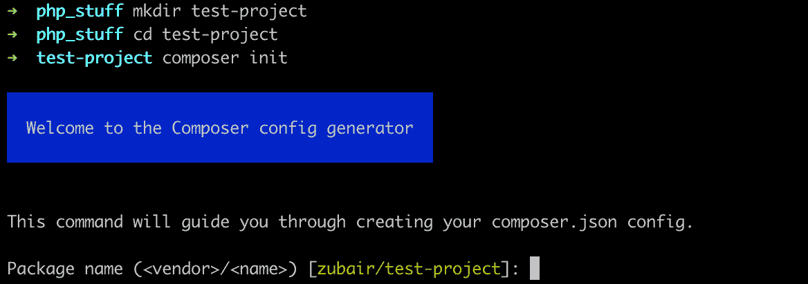
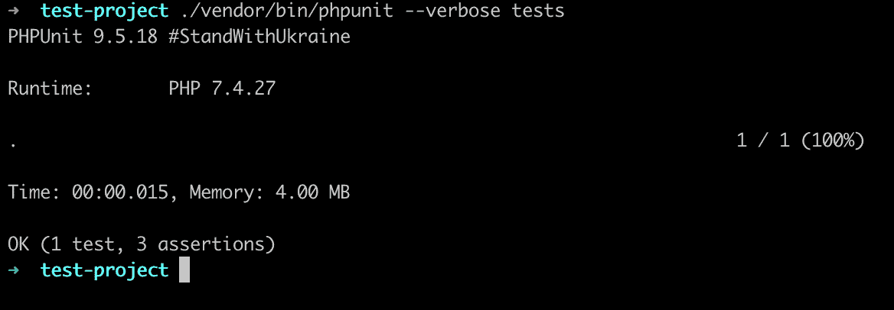
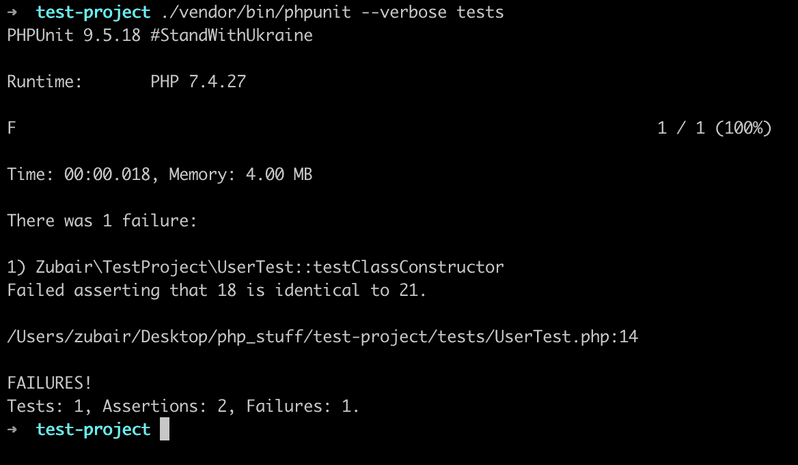

# 如何用 PHPUnit 测试 PHP 代码

> 原文：<https://www.freecodecamp.org/news/test-php-code-with-phpunit/>

有许多不同的方法来测试你的软件应用程序，单元测试是一种重要的方法。

那么什么是单元测试，如何进行单元测试呢？在本文中，您将了解到这一点以及更多。

## 什么是单元测试？

> 单元测试是一个软件开发过程，在这个过程中，一个应用程序的最小的可测试部分，称为单元，被单独和独立地审查过程操作。- [搜索软件质量](https://searchsoftwarequality.techtarget.com/definition/unit-testing#:~:text=Unit%20testing%20is%20a%20software,developers%20and%20sometimes%20QA%20staff.)

用基本术语来说，单元测试意味着将应用程序分解成最简单的部分，并测试这些小部分，以确保每个部分都没有错误(并且安全)。

这种测试是自动化的，由软件工程师编写，作为他们开发过程的一部分。这是开发过程中非常重要的一步，因为它有助于开发人员构建更好的、错误更少的应用程序。

## PHPUnit 是什么？

你可以用 PHP 的面向程序员的测试框架 [PHPUnit](https://phpunit.de) 在 PHP 中执行单元测试。PHPUnit 是用于单元测试框架的 xUnit 架构的一个实例。它非常容易安装和开始使用。

## PHPUnit 安装

您可以在您的服务器上全局安装 PHPUnit。您也可以使用 composer 在本地安装它，基于每个项目，在开发时作为项目的依赖项。本文将解释如何在每个项目的基础上使用它。

首先，使用以下命令创建并启动一个新的 composer 项目:

```
$ mkdir test-project
$ cd test-project
$ composer init
```

第一个命令在当前目录下创建一个文件夹，`test-project`,第二个命令移动到这个文件夹中。最后一个命令启动一个交互式 shell。



Composer init prompt

按照提示，根据需要填写详细信息(默认值即可)。您可以设置项目描述、作者姓名(或贡献者姓名)、依赖关系的最低稳定性、项目类型、许可证，并定义您的依赖关系。

您可以跳过依赖项部分，因为我们不会安装任何依赖项。PHPUnit 应该是一个`dev-dependency`，因为测试作为一个整体应该只发生在开发期间。

现在，当提示询问`Would you like to define your dev dependencies (require-dev) interactively [yes]?`时，按回车键接受。然后输入`phpunit/phpunit`将 PHPUnit 安装成一个`dev-dependency`。

接受其他默认值，并继续生成`composer.json`文件。当前生成的文件应该如下所示:

```
{
    "name": "zubair/test-project",
    "require-dev": {
        "phpunit/phpunit": "^9.5"
    },
    "autoload": {
        "psr-4": {
            "Zubair\\TestProject\\": "src/"
        }
    },
    "authors": [
        {
            "name": "Idris Aweda Zubair",
            "email": "zubairidrisaweda@gmail.com"
        }
    ],
    "require": {}
}
```

Composer generated compose.json

要了解如何在您的服务器上全局安装 PHPUnit，请阅读这里的。

## 如何用 PHPUnit 编写测试

用 PHPUnit 编写测试非常简单。这里有一些约定让你开始:

*   要在 PHP 中测试一个类，您将创建一个以该类命名的测试类。例如，如果我有某种类型的`User`类，测试类将被命名为`UserTest`。
*   测试类`UserTest`通常会继承`PHPUnit\Framework\TestCase`类。
*   对类的单个测试是以前缀`test`命名的公共方法。例如，为了在`User`类上测试一个`sayHello`方法，该方法将被命名为`testSayHello`。
*   在测试方法内部，比如说`testSayHello`，你使用 PHPUnit 的方法像`assertSame`来查看一些方法返回一些期望值。

一个流行的惯例是将所有测试放在一个`tests`目录中，所有源代码放在`src`目录中。

## PHPUnit 测试示例

为了帮助理解本文，这里有一个简单方法的示例`User`类将被测试:

```
<?php

namespace Zubair\TestProject;

use InvalidArgumentException;

class User
{
    public int $age;
    public array $favorite_movies = [];
    public string $name;

    /**
     * @param int $age
     * @param string $name
     */
    public function __construct(int $age, string $name)
    {
        $this->age = $age;
        $this->name = $name;
    }

    public function tellName(): string
    {
        return "My name is " . $this->name . ".";
    }

    public function tellAge(): string
    {
        return "I am " . $this->age . " years old.";
    }

    public function addFavoriteMovie(string $movie): bool
    {
        $this->favorite_movies[] = $movie;

        return true;
    }

    public function removeFavoriteMovie(string $movie): bool
    {
        if (!in_array($movie, $this->favorite_movies)) throw new InvalidArgumentException("Unknown movie: " . $movie);

        unset($this->favorite_movies[array_search($movie, $this->favorite_movies)]);

        return true;
    }
} 
```

Sample User Class

这个用户类可以是电影流应用程序中的`User`类。用户有姓名、年龄和可以更新的最喜欢的电影列表。在本文的其余部分，我们将测试所有这些特性是否如预期的那样工作。

在`tests`文件夹中创建一个`UserTest`类。将此粘贴到开始:

```
<?php

namespace Zubair\TestProject;

use PHPUnit\Framework\TestCase;

final class UserTest extends TestCase
{
    // Tests will go here
}
```

### 测试构造器

通常，你不会测试`__construct`方法。然而，因为我们在其中设置值，所以确保值设置正确是有意义的。

这看起来像是一件很小的测试，但是这就是单元测试的全部意义——确保你的应用程序的最小部分如预期的那样运行。

创建一个`testClassConstructor`方法来测试构造函数:

```
public function testClassConstructor()
{
    $user = new User(18, 'John');

    $this->assertSame('John', $user->name);
    $this->assertSame(18, $user->age);
    $this->assertEmpty($user->favorite_movies);
}
```

Test for __construct method

现在让我们休息一下，看看如何运行测试。

## 如何在 PHPUnit 中运行测试

您可以使用安装在您的供应商文件夹中的 PHPUnit 二进制文件在一个目录中运行所有测试。

```
$ ./vendor/bin/phpunit --verbose tests
```

您也可以通过提供测试文件的路径来运行单个测试。

```
$ ./vendor/bin/phpunit --verbose tests/UserTest.php
```

您可以使用`--verbose`标志来获得更多关于测试状态的信息。

现在，我们可以运行测试并查看输出:



Test Output

输出显示我们运行了 1 个测试，并在其中做了 3 个断言。我们还可以看到运行测试花费了多长时间，以及运行测试使用了多少内存。

PHPUnit 使用这些断言来比较从方法返回的值和它们的预期值。

这个例子使用`assertSame`来检查用户对象上的`name`和`age`属性是否匹配输入的值。它还使用`assertEmpty`来检查`favorite_movies`数组是否为空。

要查看所有这些断言的列表，您可以在这里查看 PHPUnit 的文档。

编辑代码，检查用户年龄是否与 *21* 相同。

```
public function testClassConstructor()
{
    $user = new User(18, 'John');

    $this->assertSame('John', $user->name);
    $this->assertSame(21, $user->age);
    $this->assertEmpty($user->favorite_movies);
} 
```

这一次再次运行测试会得到以下输出:



Failed Assertion Output

输出现在显示我们运行了 1 个测试，有 2 个成功的断言，还有一个失败的断言。我们可以看到一些对失败的解释，显示了期望值、得到的值以及错误所在的行。

### 测试名称和耕作

接下来，我们可以测试一下`testName`方法。这个方法以一个句子的形式告诉用户的名字。因此，我们可以编写测试来检查:

*   如果返回值是字符串。
*   如果返回的字符串中包含用户名(无论是否区分大小写)。

```
public function testTellName()
{
    $user = new User(18, 'John');

    $this->assertIsString($user->tellName());
    $this->assertStringContainsStringIgnoringCase('John', $user->tellName());
}
```

测试使用断言`assertIsString`和`assertStringContainsStringIgnoringCase`分别检查返回值是一个字符串，并且它包含字符串*约翰*。

`testAge`方法与`testName`非常相似，使用相同的逻辑。它的测试将类似于前一个:

```
public function testTellAge()
{
    $user = new User(18, 'John');

    $this->assertIsString($user->tellAge());
    $this->assertStringContainsStringIgnoringCase('18', $user->tellAge());
}
```

### addFavoriteMovie 测试

我们也可以测试这个方法。此方法将电影添加到电影列表中。为了测试它，我们可以检查新添加的电影是否在列表中，以及列表中的项目数量实际上是否增加了。

后者用于确认物品没有被移动。此外，由于函数最后返回一些值，我们可以检查这个值是否正确。

```
public function testAddFavoriteMovie()
{
    $user = new User(18, 'John');

    $this->assertTrue($user->addFavoriteMovie('Avengers'));
    $this->assertContains('Avengers', $user->favorite_movies);
    $this->assertCount(1, $user->favorite_movies);
}
```

这里，我们使用一些新的断言——`assertTrue`、`assertContains`和`assertCount`——来检查返回值是否为真，它是否包含新添加的字符串，以及数组中现在是否有一项。

### removeFavoriteMovie 测试

最后，我们可以测试删除电影的方法是否有效。

```
public function testRemoveFavoriteMovie()
{
    $user = new User(18, 'John');

    $this->assertTrue($user->addFavoriteMovie('Avengers'));
    $this->assertTrue($user->addFavoriteMovie('Justice League'));

    $this->assertTrue($user->removeFavoriteMovie('Avengers'));
    $this->assertNotContains('Avengers', $user->favorite_movies);
    $this->assertCount(1, $user->favorite_movies);
}
```

在这里，我们将一些电影添加到列表中。然后，我们删除其中一个，并确认函数返回 true。接下来，我们通过检查该值不再在列表中来确认删除。最后，我们确认列表中只有一部电影，而不是两部。

## 结论

现在您知道了如何在您的项目中设置 PHPUnit，以及如何测试和确保您正在构建世界一流的软件。你可以在这里找到这篇文章的所有代码。

如有任何问题或相关建议，欢迎联系我分享。

要阅读更多我的文章或关注我的工作，您可以在 [LinkedIn](https://www.linkedin.com/in/idris-aweda-zubair-5433121a3/) 、 [Twitter](https://twitter.com/AwedaIdris) 和 [Github](https://github.com/Zubs) 上与我联系。又快又简单，还免费！