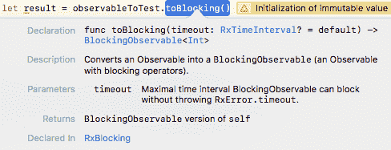
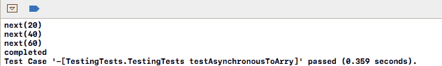

# 如何在 RxSwift 中运行测试

> 原文：<https://www.freecodecamp.org/news/testing-in-rxswift-2b6eeaeaf432/>

作者纳夫迪普·辛格

# 如何在 RxSwift 中运行测试


Image [source](https://raw.githubusercontent.com/ReactiveX/RxSwift/master/assets/Rx_Logo_M.png).

**RxTest** 和 **RxBlocking** 是 RxSwift 知识库的一部分。然而，它们是通过单独的吊舱提供的，因此需要单独进口。

**RxTest** 为测试 Rx 代码提供了有用的补充。它包括 **TestScheduler** ，这是一个虚拟的时间调度器，提供了在精确的时间间隔添加事件的方法。

另一方面，RxBlocking 使您能够将常规的可观察序列转换为阻塞可观察序列，阻塞可观察序列会阻塞正在运行的线程，直到可观察序列完成或达到指定的超时时间。这使得测试异步操作更加容易。

现在让我们来看看每一个。

### 重新检测

如上所述， **RxTest** 与 **RxSwift 是同一个存储库的一部分。**在我们深入一些 RxTesting 之前，还有一件关于 **RxTest** 的事情需要了解:RxTest 公开了两种用于测试的可观察对象。

*   光观测值
*   可观察到的寒冷

使用测试调度程序，在指定的时间观察重放事件，而不管是否有订户。

ColdObservables 的工作方式更像常规 Observables，在订阅时向新订户重播它们的元素。

### rx 阻塞

如果你熟悉 **XCTest** 中的期望，你会知道这是测试异步操作的另一种方式。使用 RxBlocking 恰好更容易。让我们从一个小的实现开始，这样我们可以看到如何在测试异步操作时利用这个库。

### 使用 RxBlocking 进行测试

我们将开始一个新的测试，并创建一个 10、20 和 30 的可观察值，如下所示:

```
func testBlocking(){        let observableToTest = Observable.of(10, 20, 30)    }
```

现在我们将结果定义为等于对我们创建的可观察对象调用 toBlocking():

```
let result = observableToTest.toBlocking()
```

**toBlocking()** 返回一个直线数组的阻塞可观察值，如下所示:



如果我们想要发现哪一个是投掷方法，我们将需要使用第一个方法。因此，我们将它包装在一个 do catch 语句中，然后如果成功，我们将添加一个 **AssertEquals** 语句，如下所示:

```
func testBlocking(){        let observableToTest = Observable.of(10, 20, 30)        do{            let result = try observableToTest.toBlocking().first()            XCTAssertEqual(result, 10)        } catch {        }    }
```

或者，如果不是这样，断言就会失败:

```
do{            let result = try observableToTest.toBlocking().first()            XCTAssertEqual(result, 10)        } catch {            XCTFail(error.localizedDescription)        }
```

就是这样！让我们运行测试，您将看到测试通过了。我们可以通过强制 try，用两行代码简化这个测试。

同样，这在测试中比在生产代码中更容易被接受。我们将注释掉 do catch 语句，然后在一行中编写 assert equals，如下所示:

```
XCTAssertEqual(try! observableToTest.toBlocking().first(), 10)
```

重新运行测试，您将看到测试再次通过。带有注释的整体代码如下所示:

```
func testBlocking(){        let observableToTest = Observable.of(10, 20, 30)//        do{//            let result = try observableToTest.toBlocking().first()//            XCTAssertEqual(result, 10)//        } catch {//            XCTFail(error.localizedDescription)//        }        XCTAssertEqual(try! observableToTest.toBlocking().first(), 10)    }
```

简洁怎么样？说实话，如果我们在订阅中打印出发射元素，然后加上一个标记，那么可观测序列实际上已经是同步的了。该标记将在订阅的完成事件后打印。

为了测试一个实际的异步操作，我们将再编写一个测试。这一次，我们将在后台线程上使用并发调度程序，如下所示:

```
func testAsynchronousToArry(){        let scheduler = ConcurrentDispatchQueueScheduler(qos: .background)    }
```

现在，我们将创建一个简单整数序列的可观察值。我们将使用 map 将每个值加倍，如下所示:

```
let intObservbale = Observable.of(10, 20, 30)            .map{ $0 * 2 }
```

然后，我们将订阅调度程序:

```
let intObservbale = Observable.of(10, 20, 30)            .map{ $0 * 2 }            .subscribeOn(scheduler)
```

现在，我们将编写一个类似于上一个测试的 do catch 语句，并调用 Observable 上的 toBlocking，这应该在主调度器上观察到，如下所示:

```
do{   let result = try intObservbale.observeOn(MainScheduler.instance).toBlocking().toArray()   } catch {   }
```

然后，我们将添加与上一个示例相同的断言:

```
do{   let result = try intObservbale.observeOn(MainScheduler.instance).toBlocking().toArray()            XCTAssertEqual(result, [20, 40, 60])        } catch {            XCTFail(error.localizedDescription)        }
```

现在我们将运行测试，您会注意到它通过了，并且在槽中有绿色的复选标记。

请注意，在控制台中，标记打印在发出的元素之前，如下所示:



这是因为这些操作是异步执行的。

关于其他更新，你可以在我的推特账号@NavRudraSambyal 上关注我

为了使用热和冷可观测量的例子，你可以在 Swift 4 中找到我的书[反应式编程的链接](https://www.amazon.com/Reactive-Programming-Swift-easy-maintain-ebook/dp/B078MHNSL1/ref=asap_bc?ie=UTF8)

感谢阅读，如果发现有用请分享:)