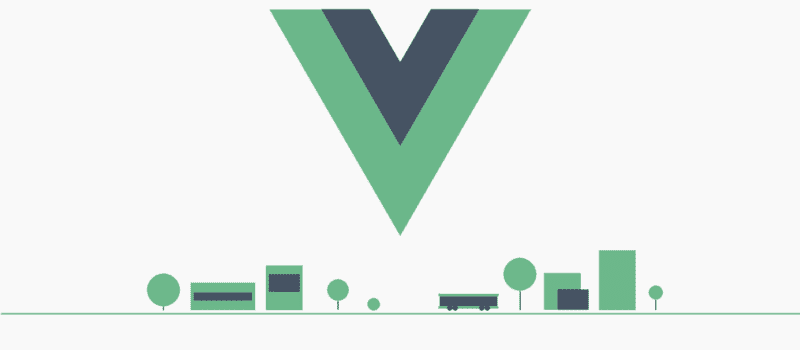
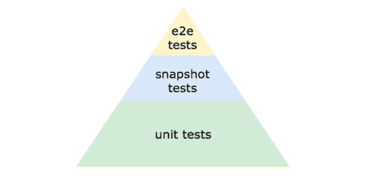
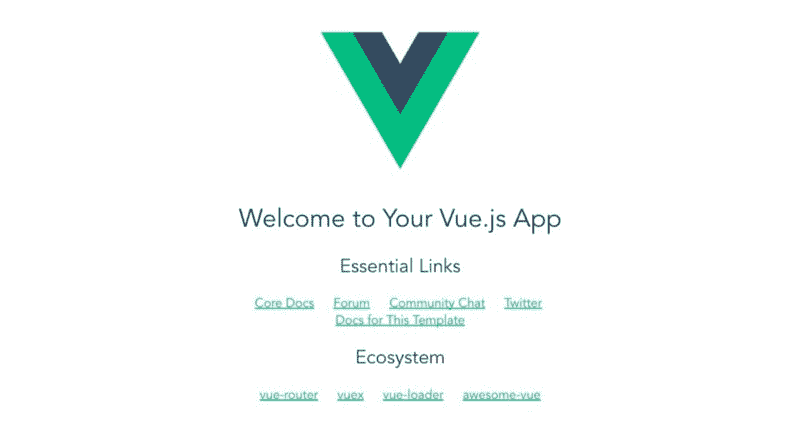
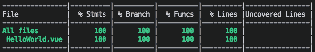
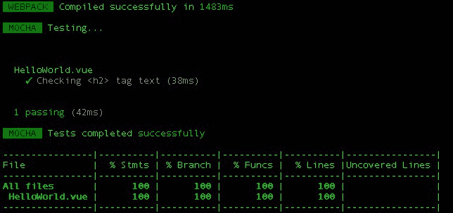
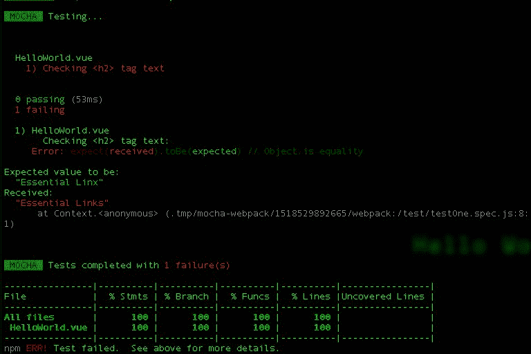

# 如何在不到 7 分钟的时间内测试你的 Vue.js 应用

> 原文：<https://www.freecodecamp.org/news/testing-vue-js-applications-vue-test-utils-39ec26ddaa4e/>

穆库尔·卡纳

# 如何在不到 7 分钟的时间内测试你的 Vue.js 应用



Source

在我们深入实现之前，让我们先弄清楚几个概念。

### 什么是测试？

手动尝试基本表单验证器的所有可能输入可能很麻烦。

对于一个小网站来说，这似乎没什么大不了的。但是对于更大更复杂的 web 应用程序，包括几十个组件以及它们的功能、路由、状态、变异等等，测试所有这些组件的功能是不可行的，也是不明智的。

对我们编写的代码进行这部分基于试验和错误的自动化评估被称为**测试**或**自动化测试**。

Edd Yerburgh 是 Vue 团队的核心成员，也是 vue-test-utils(前身为 **Avoriaz** )的维护者，他在自己的[一书中将自动化测试定义为:](https://livebook.manning.com#!/book/testing-vuejs-applications/chapter-1/v-3/point-1371-28-28-0)

> 自动化测试是编写程序对应用程序代码进行测试的实践。程序一旦写好，就可以自动执行。

基本上有三种类型的测试:

1.  单元测试
2.  端到端测试
3.  快照测试

#### **单元测试**

这些是检查网站的基本元素(Vue 组件和功能)是否正常工作的基本测试。Edd 称它们为**组件契约**。每个组件都被期望像它承诺的那样工作，并且这些测试确保它们被实现。

#### **端到端(E2E)测试**

E2E 测试测试网站的整个工作流程。可以说一个 E2E 测试是由多个粒度单元测试组成的。他们很慢，但他们检查网站的整体功能。

但是它们也很难调试，因为很难定位哪些部分没有正常工作。测试失败的原因可能不止一个。

#### 快照测试

代码中的 bug 不仅会影响网站的功能，还会影响组件在 UI 中的定位。快照测试检查应用程序外观的这种变化。它包括呈现 UI、捕获屏幕截图，并将其与测试中存储的参考图像进行比较。如果两个图像不匹配，测试失败。



[The testing pyramid](https://livebook.manning.com/#!/book/testing-vuejs-applications/chapter-1/v-3/156)

这些测试还帮助开发人员编写适当的代码文档，这在有多个参与者的大规模应用程序中非常有用。

既然我们已经确定了测试可以帮助我们节省大量时间并优化我们的代码，那么让我们看看测试是如何配置、创建和运行的。

我们将使用 **vue-test-utils** 作为 Vue.js *的测试工具库。*现在我们还需要选择一名试跑者。有很多可以选择，但是 Jest 和 Mocha-Webpack 都同样不错。他们只是在前期配置和对 sfc(单文件组件)的支持之间做了一些权衡。

在这个演示中，我们将使用 **mocha-webpack** 配置。

### **创建项目**

```
npm install vue
```

```
npm install --global vue-cli
```

```
vue init webpack vue-testing
```

```
cd vue-testing
```

```
npm install
```

```
npm run dev 
```

使用上面的命令，创建一个 Vue webpack 项目，我们将在其中设置测试环境。



#### **安装依赖关系**

安装 [vue-test-utils](https://github.com/vuejs/vue-test-utils) *、*摩卡、*、*和摩卡网络包:

```
npm install --save-dev @vue/test-utils
```

```
npm install --save-dev mocha mocha-webpack
```

为了模拟浏览器环境的子集来运行我们的测试，我们将安装 [jsdom](https://github.com/jsdom/jsdom) 和 [jsdom-globa](https://github.com/rstacruz/jsdom-global) l:

```
npm install --save-dev jsdom jsdom-global
```

我们将在测试中导入的一些依赖项对于 webpack 来说很难捆绑。因此，为了能够将它们从捆绑过程中移除并提高测试启动速度，我们安装了 **node-externals:**

```
npm install --save-dev webpack-node-externals
```

Vue 推荐将 [expect](https://github.com/Automattic/expect.js) 作为一个断言库，它根据收到的参数来决定测试是通过还是失败。

```
npm install --save-dev expect
```

我们需要让它在全球范围内可访问，以避免在每一个测试中导入它。我们在根目录下创建一个名为 **test** 的目录，并创建一个名为 **test/setup.js** *的文件。*导入需要 *:* 的模块

```
//setup.js
```

```
require('jsdom-global')()
```

```
global.expect = require('expect')
```

我们还可以使用**伊斯坦布尔** 插件将代码覆盖率包含在测试结果中，从而得到如下报告:



它用于描述当一个特定的测试套件运行时，应用程序的源代码被执行的程度。

```
npm install --save-dev nyc babel-plugin-istanbul
```

还在**里。babelrc** 在**外挂** 数组中，添加**伊斯坦布尔:**

```
//.babelrc
```

```
plugins": ["transform-vue-jsx", "transform-runtime", "istanbul"]
```

因此，我们已经安装了所有的依赖项，现在是在开始编写测试之前进行最终配置的时候了。

在 **package.json** 中，我们需要添加一个运行测试的**测试** 脚本:

```
//package.json
```

```
"scripts":{
```

```
"test": "cross-env NODE_ENV=test nyc mocha-webpack --webpack-config build/webpack.base.conf.js --require test/setup.js test/**/*.spec.js"
```

```
}
```

我们还需要在**包中指定代码覆盖需要包含的文件**

```
//package.json
```

```
"nyc":{    "include":[      "src/**/*.(js|vue)" ],    "instrument":false,    "sourceMap":false}
```

编写测试之前的最后一个配置是在 **webpack.base.conf.js 中添加以下内容:**

```
//webpack.base.conf.js
```

```
if (process.env.NODE_ENV === 'test'){  module.exports.externals = [require('webpack-node-externals')()]  module.exports.devtool = 'inline-cheap-module-source-map'}
```

我们可以在 webpack 样板文件自带的内置 Vue 组件上执行测试。

每个测试文件都会有一个**'***'*扩展名。

在测试目录中，我们添加了一个测试文件 **testOne.spec.js**

```
//testOne.spec.js
```

```
import {shallow} from '@vue/test-utils'
```

```
import HelloWorld from '../src/components/HelloWorld.vue'
```

我们先从 **vue-test-utils** *中导入**浅层** 开始。* **Shallow** 为我们想要运行测试的 Vue 组件创建一个[包装器](https://vue-test-utils.vuejs.org/en/api/wrapper/)。这个包装器是一个对象，它包含安装的组件和测试部分代码的方法。然后，我们导入运行测试的 Vue 组件。

```
//testOne.spec.js
```

```
describe('HelloWorld.vue',function(){        it('Checking <h2> tag text',function(){                const wrapper = shallow(HelloWorld)        const h2= wrapper.find('h2')        expect(h2.text()).toBe('Essential Links')        })})
```

然后我们使用 Mocha 测试框架的 **describe()** 方法创建一个我们称之为**的测试套件**。这个测试套件基本上将多个测试用例组合成一个，并提供一些关于测试和组件的信息。

在这个描述函数中，我们使用 **it()** 函数回调一个指定测试用例的函数。每个 it()方法描述一个测试用例，测试的目的作为第一个参数，后面跟着一个定义测试的回调函数。

然后:

*   我们创建了 Vue 组件的包装器
*   使用其 **find()** 方法获取所有< h2 >标签元素
*   将它的文本与它应该是什么进行比较。

耶！我们的测试已经准备好了。

```
npm run test
```



因此，我们的测试是成功的——代码能够在 HelloWorld.vue 组件中找到一个以“Essential Links”作为文本的

## 标记。

现在，如果我们将预期的测试更改为其他任何内容，测试将会失败。
我把它改成:

```
expect(h2.text()).toBe('Essential Linx')
```

测试失败了。不过，失败的测试错误非常具有描述性，您可以看到代码期望什么以及它接收到什么:



我们可以通过使用多个 **it()** 方法，并期望不同的条件，在一个测试文件中添加多个测试用例。

```
describe('HelloWorld.vue',function(){ 
```

```
it('Checking <h2> tag text',function(){        const wrapper = shallow(HelloWorld)                const h2 = wrapper.find('h2')        expect(h2.text()).toBe('Essential Links')        }), 
```

```
it('Checking <h1> tag text',function(){        const wrapper = shallow(HelloWorld)        const h1 = wrapper.find('h1')        expect(h1.text()).toBe('Welcome to Your Vue.js App')        })
```

```
})
```

这里我们还测试了

# 标签是否呈现了它应该呈现的内容。

所以这是一个非常基本的测试，它让你了解测试是如何配置、编码和运行的，甚至不需要打开浏览器或启动服务器。

GitHub 库的链接是这里的。

### 包扎

Edd Yerburgh 的书'[Testing vue . js Applications](https://www.manning.com/books/testing-vuejs-applications)'对我更广泛地了解测试的重要性以及如何实施测试帮助很大。我将把它推荐给任何想学习超出初级内容范围的测试并真正投入其中的人。

除此之外，我花了一些时间在 TDD(测试驱动开发)概念上，并期待着用 Vue.js 写一个关于 TDD 世界的初学者教程。

如果你喜欢这个帖子，请留下一两个掌声。谢谢:)