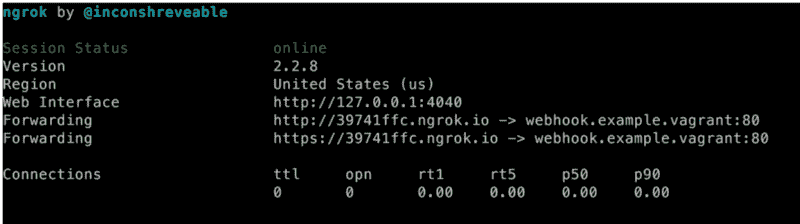
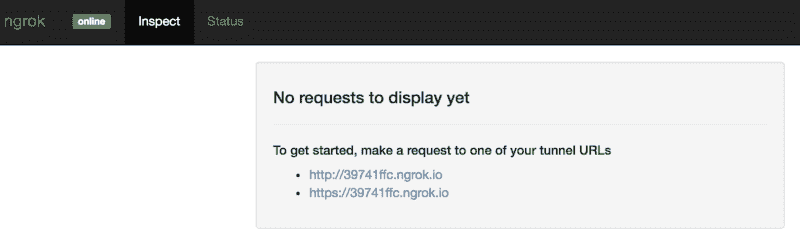
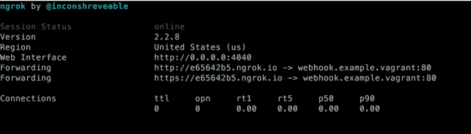

# 如何在本地开发时测试 Webhooks

> 原文：<https://www.freecodecamp.org/news/testing-webhooks-while-using-vagrant-for-development-98b5f3bedb1d/>

斯蒂芬·多恩

# 如何在本地开发时测试 Webhooks


Photo by [Fernando Venzano](https://unsplash.com/photos/MYTyXb7fgG0?utm_source=unsplash&utm_medium=referral&utm_content=creditCopyText) on [Unsplash](https://unsplash.com/?utm_source=unsplash&utm_medium=referral&utm_content=creditCopyText)

外部系统可以使用 Webhooks 来通知您的系统某个事件或更新。可能最广为人知的类型是支付服务提供商(PSP)通知您的系统支付状态更新。

它们通常以你在预定义的 URL 上收听的形式出现。比如说[http://example.com/webhooks/payment-update](http://example.com/webhooks/payment-update))。同时，另一个系统向该 URL 发送一个 POST 请求，请求中包含一个特定的有效负载(例如一个支付 ID)。请求一进来，您就获取支付 ID，通过他们的 API 向 PSP 请求最新状态，然后更新您的数据库。

其他的例子可以在这个关于 Webhooks 的精彩解释中找到。[https://sendgrid.com/blog/whats-webhook/](https://sendgrid.com/blog/whats-webhook/)。

只要系统可以通过互联网公开访问，测试这些 webhooks 就相当顺利。这可能是您的生产环境或可公开访问的暂存环境。当您在笔记本电脑上或在虚拟机(例如 VM，一个流浪者盒子)中进行本地开发时，这变得更加困难。在这种情况下，发送网络挂钩的一方不能公开访问本地 URL。此外，监控正在发送的请求是困难的，这可能会使开发和调试变得困难。

这个例子将解决什么问题:

*   在本地开发环境中测试 webhooks，不能通过互联网访问。从服务器向 webhook 发送数据的服务不能访问它。
*   监视发送的请求和数据，以及应用程序生成的响应。这将允许更容易的调试，从而缩短开发周期。

先决条件:

*   *可选*:如果你使用虚拟机(VM)进行开发，确保它正在运行，并确保接下来的步骤在 VM 中完成。
*   对于本教程，我们假设您在`webhook.example.vagrant`定义了一个 vhost。我在本教程中使用了一个漫游虚拟机，但是你可以自由选择你的虚拟主机的名字。
*   按照[安装说明](https://ngrok.com/download)安装`ngrok`。在 VM 内部，我发现它的节点版本也很有用:[https://www.npmjs.com/package/ngrok](https://www.npmjs.com/package/ngrok)，但是也可以随意使用其他方法。

我假设您的环境中没有运行 SSL，但是如果有，可以在下面的例子中用端口 433 替换端口 80，用`*https://*`替换`*http://*`。

#### **使 webhook 可测试**

让我们假设下面的示例代码。我将使用 PHP，但是把它当成伪代码来读，因为我漏掉了一些关键部分(例如 API 键、输入验证等)。)

第一档:*payment.php*。这个文件创建一个支付对象，然后注册到 PSP。然后，它获取客户需要访问以便支付的 URL，并将用户重定向到那里的客户。

注意，本例中的`webhook.example.vagrant`是我们为开发设置定义的本地 vhost。从外界是无法进入的。

```
<?php
/*
 * This file creates a payment and tells the PSP what webhook URL to use for updates
 * After creating the payment, we get a URL to send the customer to in order to pay at the PSP
 */
$payment = [
    'order_id' => 123,
    'amount' => 25.00,
    'description' => 'Test payment',
    'redirect_url' => 'http://webhook.example.vagrant/redirect.php',
    'webhook_url' => 'http://webhook.example.vagrant/webhook.php',
];

$payment = $paymentProvider->createPayment($payment);
header("Location: " . $payment->getPaymentUrl());
```

第二档:*webhook.php*。这个文件等待被 PSP 调用以获得更新通知。

```
<?php
/*
 * This file gets called by the PSP and in the $_POST they submit an 'id'
 * We can use this ID to get the latest status from the PSP and update our internal systems afterward
 */

$paymentId = $_POST['id'];
$paymentInfo = $paymentProvider->getPayment($paymentId);
$status = $paymentInfo->getStatus();

// Perform actions in here to update your system
if ($status === 'paid') {
    ..
}
elseif ($status === 'cancelled') {
    ..
}
```

我们的 webhook URL 无法通过互联网访问(记住:`webhook.example.vagrant`)。因此，文件*webhook.php*将永远不会被 PSP 调用。你的系统永远不会知道付款状态。这最终导致订单永远不会运送给客户。

幸运的是， *ngrok* 可以在解决这个问题。 [*ngrok*](https://ngrok.com) 形容自己为:

> ngrok 通过安全隧道将 NAT 和防火墙后面的本地服务器暴露给公共互联网。

让我们为我们的项目开始一个基本的隧道。在您的环境中(在您的系统或虚拟机上)运行以下命令:

`ngrok http -host-header=rewrite webhook.example.vagrant:80`

在他们的文档中阅读更多的配置选项:[https://ngrok.com/docs](https://ngrok.com/docs)。

会出现这样一个屏幕:



ngrok output

我们刚开始做什么？基本上，我们指示`ngrok`在 80 端口开始一个到`[http://webhook.example.vagrant](http://webhook.example.vagrnat/)`的隧道。这个相同的网址现在可以通过`[http://39741ffc.ngrok.io](http://39741ffc.ngrok.io/)`或`[https://39741ffc.ngrok.io](http://39741ffc.ngrok.io/)` [，](http://39741ffc.ngrok.io%2C/)访问，任何知道这个网址的人都可以通过互联网公开访问它们。

**注意**您可以获得现成的 HTTP 和 HTTPS。文档中给出了如何将这种限制仅限于 https://ngrok.com/docs#bind-tls 的[HTTPS 的例子。](https://ngrok.com/docs#bind-tls)

那么，我们现在如何让我们的 webhook 工作呢？将*payment.php*更新为以下代码:

```
<?php
/*
 * This file creates a payment and tells the PSP what webhook URL to use for updates
 * After creating the payment, we get a URL to send the customer to in order to pay at the PSP
 */
$payment = [
    'order_id' => 123,
    'amount' => 25.00,
    'description' => 'Test payment',
    'redirect_url' => 'http://webhook.example.vagrant/redirect.php',
    'webhook_url' => 'https://39741ffc.ngrok.io/webhook.php',
];

$payment = $paymentProvider->createPayment($payment);
header("Location: " . $payment->getPaymentUrl());
```

现在，我们告诉 PSP 通过 HTTPS 调用隧道 URL。一旦 PSP 通过隧道调用 webhook，ngrok 将确保你的内部 URL 以未修改的有效载荷被调用。

#### 如何监控对 webhook 的调用？

您在上面看到的屏幕截图概述了对隧道主机的调用。这个数据相当有限。幸运的是，`ngrok`提供了一个非常漂亮的仪表盘，允许您查看所有来电:



我不会深入探讨这个问题，因为一旦你让它运行起来，它就不言自明了。因此，我将解释如何在流浪者盒子上访问它，因为它不在盒子外工作。

仪表板将允许你看到所有的电话，他们的状态码，标题和数据被发送。您还将看到应用程序生成的响应。

仪表板的另一个巧妙之处是它允许你重放某个电话。假设您的 webhook 代码遇到了致命错误，启动新的支付并等待 webhook 被调用将会很乏味。重放之前的调用会使您的开发过程更快。

默认情况下，可以在 [http://localhost:4040 访问该仪表板。](http://localhost:4040.)

#### **虚拟机中的仪表板**

为了在虚拟机中实现这一点，您必须执行一些额外的步骤:

首先，确保可以在端口 4040 上访问虚拟机。然后，在虚拟机中创建一个文件来保存此配置:

`web_addr: **0.0.0.0:4040**`

现在，终止仍在运行的`ngrok`进程，并使用这个稍加调整的命令启动它:

`ngrok http -config=/path/to/config/ngrok.conf -host-header=rewrite webhook.example.vagrant:80`

您将看到一个看起来与之前的屏幕截图相似的屏幕，尽管 ID 已经更改。以前的网址已经不起作用了，但是你得到了一个新的网址。此外,`Web Interface` URL 也发生了变化:



现在，将您的浏览器指向`[http://webhook.example.vagrant:4040](http://webhook.example.vagrant:4040)`以访问仪表板。还有，打电话给`[https://e65642b5.ngrok.io/webhook.php](https://e65642b5.ngrok.io/webhook.php.)` [。](https://e65642b5.ngrok.io/webhook.php.)这可能会导致您的浏览器出错，但仪表盘应该会显示正在发出的请求。

#### **结束语**

上面的例子是伪代码。原因是每个外部系统都以不同的方式使用 webhooks。我试图给出一个基于虚拟的 PSP 实现的例子，因为可能很多开发者在某个时刻不得不处理支付问题。

请注意，你的 webhook 网址也可能被其他心怀不轨的人利用。确保验证发送给它的任何输入。

最好还向 URL 添加一个令牌，该令牌对于每次支付都是唯一的。这个令牌必须只有您的系统和发送 webhook 的系统知道。

祝你测试和调试 webhooks 好运！

**注:**我没有在 Docker 上测试过这个教程。然而，这个 Docker 容器看起来是一个很好的起点，并且包含了清晰的说明。https://github.com/wernight/docker-ngrok[。](https://github.com/wernight/docker-ngrok)

Stefan 荆棘

[https://github.com/stefandoorn](https://github.com/stefandoorn)
https://twitter.com/stefan_doornT5[https://www.linkedin.com/in/stefandoorn](https://www.linkedin.com/in/stefandoorn)