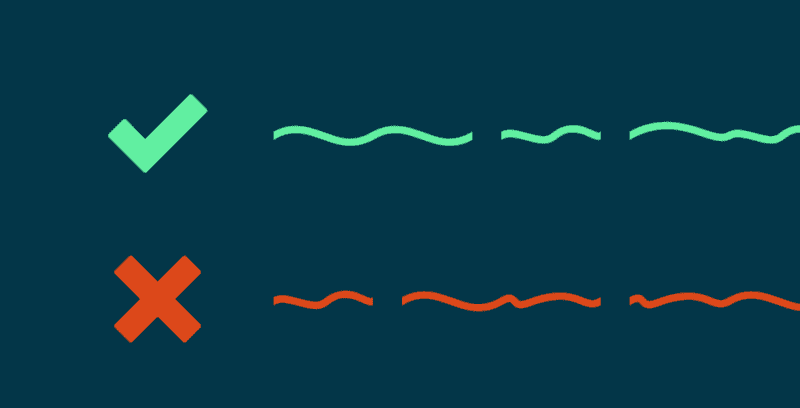
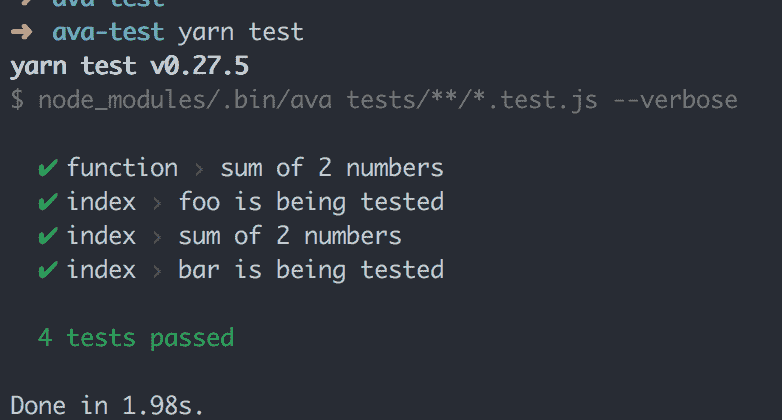
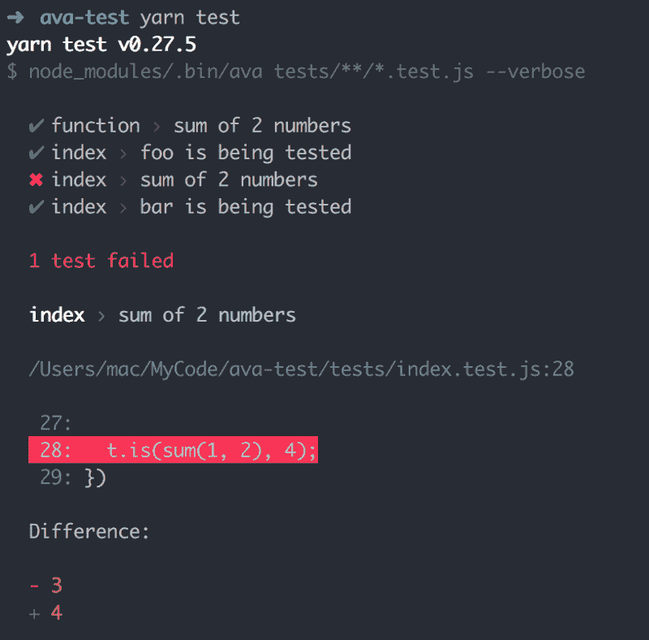
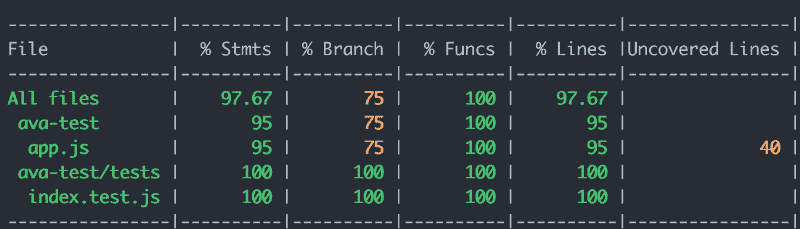
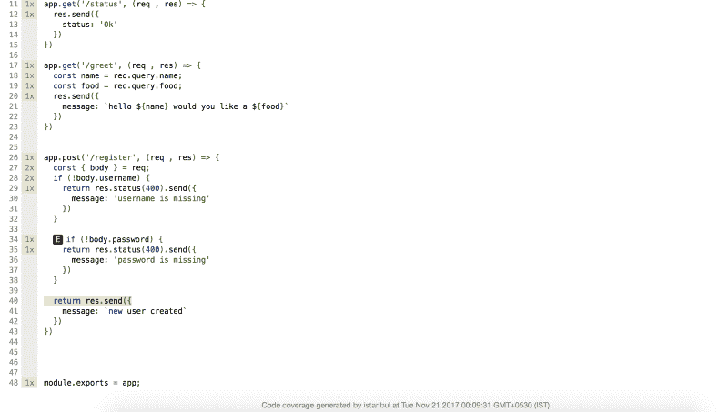
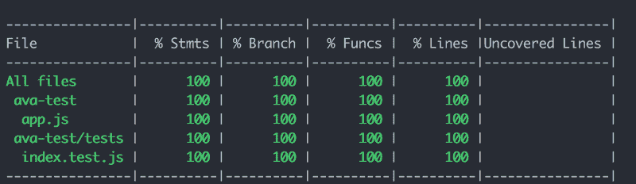

# 如何使用 Ava.js 测试 Node.js 应用程序

> 原文：<https://www.freecodecamp.org/news/testing-your-nodejs-applications-with-ava-js-99e806a226a7/>

作者 Nitish Phanse

# 如何使用 Ava.js 测试 Node.js 应用程序



无论如何，你为什么要为你的应用程序编写测试用例呢？嗯，这是一个许多开发人员试图回避的问题，纯粹是因为它需要努力和时间，并且因为手动测试更令人满意。点击…点击…填表…点击…转眼间。我的应用程序工作正常，我的 API 很好，一切都很好。

快进到每天将近 30 个拉取请求被合并到您的主分支机构。现在，你对手动测试 30 个特性或者重构一个代码块而在不知不觉中破坏了别人的代码有什么感觉？

在这一点上，你通常会说，“我希望我一开始就写了几个测试用例。”所以从脸书那里得到一些启发:他们在这里分享了一篇非常酷的文章，解释了团队如何用测试驱动开发来开发 React 16。

节点应用程序本身很容易构建。这涉及到很多社区支持，你通常会通过四处打听得到你需要的东西。对于许多 API 服务器来说，节点应用程序可以是一个很好的代理服务器，从而使它们的端点测试变得更加重要。

在本文中，我已经介绍了**如何为 Node.js 应用程序*设置和编写带有覆盖率报告的基本单元测试用例。*** 那么让我们跳进来吧。

### 你好，艾娃

艾娃是一名 JavaScript 测试者。它利用了 Node 的异步 I/O 特性，并运行并发测试，从而大大减少了测试时间。

#### 我们开始吧

在您的工作目录中，创建一个`package.json`文件并添加以下包:

```
yarn add ava babel-register
```

创建一个**测试**文件夹。将测试放在一个地方会很有帮助。您也可以将测试模块/控制器放在那里。

您更新后的`package.json`现在应该是这样的:

```
{  "name": "ava-test",  "version": "1.0.0",  "description": "",  "main": "index.js",  "scripts": {    "start" : "node server.js",    "test": "node_modules/.bin/ava tests/**/*.test.js --verbose",    "test:watch": "node_modules/.bin/ava --verbose --watch"  },  "dependencies": {    "ava": "^0.23.0",    "babel-register": "^6.26.0"  },  "ava": {    "require": [      "babel-register"    ]  }}
```

如果一些机器运行在不支持 ES6 的旧节点版本上，运行时`babel-register`trans files ES6 代码。根据我们的测试是通过还是失败,`verbose`标志会给我们一些简洁的输出。这个标志在调试测试时非常有用，但是如果您编写了数百个测试用例，您可能想要关闭它。

在您的`tests/index.test.js`中，您可以添加您的第一个测试用例:

艾娃的便利之处在于，它允许您通过异步 await 函数运行异步测试。语法也相当简单。plan 方法允许我们明确地提及我们希望每个测试拥有的断言数量。

从控制台运行`yarn test`会得到以下输出:



如果我们的一个测试失败了，我们会得到:



这就是`verbose`模式的妙处。它给你一个干净的错误堆栈，没有堆栈跟踪垃圾。如果遇到运行时错误，您还会看到一些漂亮的语法高亮显示。

你可以真正利用艾娃 API，使用它强大的断言工具来编写灵活的测试用例。

### 设置节点服务器

到目前为止，我们只讨论了编写测试的基本设置——坦率地说，这非常简单。因此，在这一节中，我将解释如何剥离一个简单的节点服务器，并使用艾娃测试其端点。

```
yarn add express body-parser 
```

在您的工作目录中，创建一个`app.js`并添加以下代码片段:

我导出 app 模块的原因是，它可以与模拟 API 服务器一起使用，艾娃将需要它来运行您的测试。

做一个新文件`server.js`，导入 app 模块启动服务器。

运行 npm start 应该会启动您的服务器，导航到 http://localhost/status 端点应该会给您一个 200OK 响应。

太好了，所以我们的服务器在工作。

代码显示我们已经创建了 3 个端点:一个状态端点、一个问候端点和一个注册端点。在注册端点上有一些验证，如果 post 主体参数丢失，就会抛出 400(错误请求)。上面的验证方法相当幼稚，但是它符合我们端点测试的目的——所以我将坚持使用它。

> 专业提示:你总是可以将错误处理分配给一个中间件，并使用 next 来调用错误处理程序。

让我们围绕端点再写一些测试。我将使用[**supertest**](https://github.com/visionmedia/supertest)**模块。它与 [superagent](https://github.com/visionmedia/superagent) 非常相似:它使用相同的 API，并且具有相似的语法。所以，双赢。**

**我们已经导入了之前导出的`app`模块，并将其传递给 supertest。Supertest 创建了一个代理服务器，它将访问测试中提到的所有端点 URL。您可以使用`**deepEqual**`方法测试整个对象，或者使用`**is**`方法手动测试每个字段。**

**运行纱线测试将产生以下结果:**

****

**太好了。我们已经编写了四个测试，它们都像预期的那样通过了。但是代码覆盖率呢？**

### ****你好纽约****

**为了创建这些可爱的报道，我们将使用伊斯坦布尔的命令行界面。它非常容易使用，有很多可配置的选项。为了简单起见，我们将使用一个非常简单的配置。**

```
`yarn add nyc --save`
```

****nyc** 命令很好地包装了您的测试命令，并将在您的工作目录中创建一个 coverage 文件夹(这应该在您的 gitignore 中)。**

**更新您的`package.json`,如下所示:**

```
`{  "name": "ava-test",  "version": "1.0.0",  "description": "",  "main": "index.js",  "scripts": {    "test": "node_modules/.bin/ava tests/**/*.test.js --verbose",    "test:watch": "node_modules/.bin/ava --verbose --watch",    "cover": "node_modules/.bin/nyc yarn test",  },  ... other dependencies   "nyc": {    "reporter": [      "lcov",      "text",      "html"    ]  }}`
```

**您想要的记者类型可以在您的`package.json`文件的 nyc 部分进行配置。**

**让我们运行纱盖:**

****

**好的，所以我们还没有 100%的覆盖率。让我们解决这个问题。首先，你需要进入工作目录的 coverage 文件夹，看看你的代码的哪一部分没有被覆盖。**

****

**很明显我们漏了一个地方。让我们在`tests/index.tests.js`文件中添加我们的最终测试用例，它将覆盖整个`app.js`文件。**

```
`test('Create a new user', async t => {  let username = 'some-hase'  const password = 'some-hase'  const response = await request(app)    .post('/register')    .send({username, password});`
```

```
`t.is(response.status, 200);    t.is(response.body.message, `new user created`);});`
```

**现在…**

****

**转眼间。**

> *****Pro 提示:*** *如果你想为测试用例添加一个阈值你可以在你的 package.json 文件中添加一个脚本。***

```
`"check-coverage": "node_modules/.bin/nyc check-coverage --lines 100 --functions 100 --branches 100 --statements 100"`
```

**该命令可以作为 travis / gitlab 管道构建系统的一部分运行。**

### ****结论****

**我们已经介绍了用艾娃对节点 API 进行单元测试的基本设置。文档非常广泛，如有疑问可以参考。**

**PS:希望你喜欢文章，如果我哪里说错了请指正。永远欢迎讨论。**