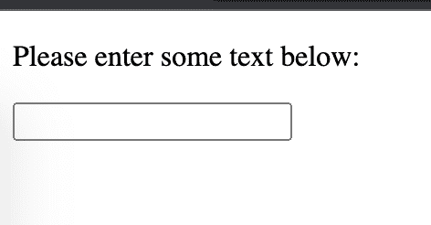
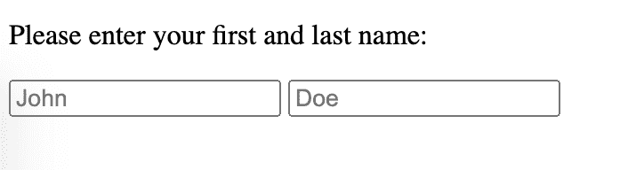
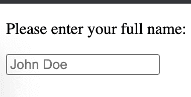
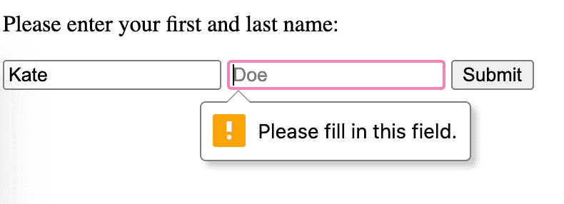
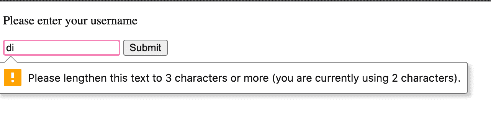
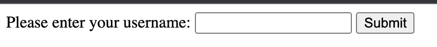

# HTML 中的文本框–输入字段 HTML 标记

> 原文：<https://www.freecodecamp.org/news/text-box-in-html-the-input-field-html-tag/>

在本文中，您将学习如何在 HTML 中创建文本输入字段。您还将了解 web 表单，并对它们的工作方式有一个大致的了解，因为文本框是每个表单的常见功能。

我们开始吧！

## 什么是 Web 表单？

表单是收集信息的有效方式。

在许多情况下，您需要填写一份物理表单、一份打印的物理文档，并提供个人详细信息。

例如，当你开始一份新工作时，或当你要去体检时，或当你正在租房/买房时，或任何其他需要文书工作的时候，你可能会填写一份表格并交给某人。

就像物理表单一样，在线数字 web 表单是一种接收和收集来自用户和访问者的输入、信息和重要数据的方式，它结合了多种 web 技术。

web 表单通过包含供用户填写信息的空间来模仿物理表单。

Web 表单使用各种工具，或称*表单控件*，来收集用户输入。

网站可以有搜索框或文本输入栏，用于输入单行文本。这使得用户能够搜索特定的内容。

网站还可以包含一个注册表单，让用户注册订阅时事通讯或其他更新。

它通常包含一个文本输入字段，用于输入用户的名、姓和电子邮件地址。

许多网站在网上购物时也有注册/登录表单，例如，用户在文本字段中输入用户名，在单独的字段中输入密码。虽然密码字段也是文本字段，但每个文本字符都被一个黑点掩盖，以隐藏正在键入的内容。

一个网站也可以有一个更大的文本区，让用户输入更长的文本，这对于在博客文章下面留下评论很有用。

许多表单还允许用户通过选择单选按钮从多个选项中选择一个特定的选项。他们可以允许用户通过选中/取消选中复选框来选择多个选项。

最后，所有的表单都有一个提交按钮，将数据提交到服务器，在那里数据将被存储或处理。

## Web 表单如何工作

互联网是一个巨大的全球性网络，它连接着全世界数百万台计算机。

作为网络一部分的计算机通过发送和接收信息来相互通信。

实现这一点的方法要归功于 web 的客户机/服务器请求/响应架构。

客户端通常是一个 web 浏览器，如 Google Chrome，它向 web 服务器发送请求。

web 服务器是一种计算机硬件或软件，它存储组成网站的文件，并在收到请求时分发这些文件。

该请求可以是查看作为网页一部分的表单。

服务器发回构成 web 表单的文件作为响应。然后，web 浏览器将这些文件组合在一起，用户在 web 浏览器中查看表单。

这个请求/响应循环由一个称为 HTTP(代表超文本传输协议)的协议构成。

因此，当使用 web 表单时，用户输入必要的数据。然后，在检查所有必填字段是否都已填写以及数据格式是否正确的客户端验证之后，用户单击 submit 按钮。

然后，数据在 HTTP 请求中以*名称-值对*的形式发送到服务器。这种在名称-值对中组织信息的方法确保了正确的数据对应于正确的表单元素。

然后，使用 PHP、Ruby 或 Python 等服务器端语言来处理信息，并将其存储在数据库中，供以后使用或检索。

## 如何用 HTML 创建 Web 表单

要在 HTML 中创建一个表单，您需要使用用于收集信息的`<form>`元素。

`<form>`元素有一个开始`<form>`和结束`</form>`标签。

```
<!DOCTYPE html>
<html lang="en">
<head>
    <meta charset="UTF-8">
    <meta http-equiv="X-UA-Compatible" content="IE=edge">
    <meta name="viewport" content="width=device-width, initial-scale=1.0">
    <title>Web form</title>
</head>
<body>
    <form>

    </form>
</body>
</html> 
```

`<form>`元素有两个属性:

*   `action`属性，它指定了您希望数据被发送和处理的 URL。
*   接受两个 HTTP 动词之一作为值的`method`属性，或者是`GET`或者是`POST`。如果没有包含`method`属性，则默认使用`GET`方法。

```
<!DOCTYPE html>
<html lang="en">
<head>
    <meta charset="UTF-8">
    <meta http-equiv="X-UA-Compatible" content="IE=edge">
    <meta name="viewport" content="width=device-width, initial-scale=1.0">
    <title>Web form</title>
</head>
<body>
    <form action="/url" method="GET">

    </form>
</body>
</html> 
```

然而，这本身并不收集任何用户输入。

## HTML `input`元素是什么？

元素最常用于从 web 表单中收集和检索用户数据。

这是用户输入数据的地方。

它嵌套在`<form>`元素中，并且是一个自结束元素。这意味着它不需要结束标记。(结束标签有一个正斜杠，`</>`。)

您可以使用它来创建不同样式的输入字段，或*表单输入控件*，供用户输入各种不同类型的信息。

它创建文本字段、电子邮件字段、密码字段、复选框、单选按钮、下拉菜单、提交按钮、从用户的计算机选择和上传文件和图像的能力，等等。

确定输入字段或表单输入控件类型的方法是设置`type`属性并给它赋值。

`<input>`的一般语法如下所示:

```
<input type="value"> <!-- the value of the type attribute determines the style of input field --> 
```

例如，要创建一个允许用户上传文件的字段，`<input>`元素如下所示:

```
<!DOCTYPE html>
<html lang="en">
<head>
    <meta charset="UTF-8">
    <meta http-equiv="X-UA-Compatible" content="IE=edge">
    <meta name="viewport" content="width=device-width, initial-scale=1.0">
    <title>Web form</title>
</head>
<body>
    <form action="/url" method="GET">
        <input type="file">
    </form>
</body>
</html> 
```

`type`属性决定了`input`元素可以接受哪种数据。

## 如何创建 HTML 文本框输入字段

未指定时，`input`的`type`属性的默认值为**文本**。所以文本输入是最常见的输入方式。

第`<input type="text">`行创建了一个单行文本输入字段，用户可以在其中输入任何文本。

```
<!DOCTYPE html>
<html lang="en">
<head>
    <meta charset="UTF-8">
    <meta http-equiv="X-UA-Compatible" content="IE=edge">
    <meta name="viewport" content="width=device-width, initial-scale=1.0">
    <title>Web form</title>
</head>
<body>
    <form action="/url" method="GET">
        <p>Please enter some text below:</p>
        <input type="text">
    </form>
</body>
</html> 
```

当您在浏览器中查看页面时，可以看到已经创建了一个单行文本输入字段:



### 如何将占位符文本添加到文本字段

占位符文本也称为填充文本，是一种提示用户需要在表单中填写何种信息的方式。它还可以在用户开始输入之前提供一个默认值。

```
<!DOCTYPE html>
<html lang="en">
<head>
    <meta charset="UTF-8">
    <meta http-equiv="X-UA-Compatible" content="IE=edge">
    <meta name="viewport" content="width=device-width, initial-scale=1.0">
    <title>Web form</title>
</head>
<body>
    <form action="/url" method="GET">
        <p>Please enter your first and last name:</p>
        <input type="text" placeholder="John">
        <input type="text" placeholder="Doe">
    </form>
</body>
</html> 
```

上面的代码会产生以下结果:



### 文本字段中`name`属性的重要性

当提交表单并将其发送到服务器时，服务器需要区分它收集的不同类型的提交数据。

例如，它需要知道哪个是用户名，哪个是密码，哪个是电子邮件地址。

这意味着每个文本字段需要一个`name`属性和一个值，以使提交的数据类型更加清晰。

例如，您可以使用以下内容提示某人在文本字段中输入全名:

```
<!DOCTYPE html>
<html lang="en">
<head>
    <meta charset="UTF-8">
    <meta http-equiv="X-UA-Compatible" content="IE=edge">
    <meta name="viewport" content="width=device-width, initial-scale=1.0">
    <title>Web form</title>
</head>
<body>
    <form action="/url" method="GET">
        <p>Please enter your full name:</p>
        <input type="text" name="name" placeholder="John Doe">
    </form>
</body>
</html> 
```



假设用户在文本字段中输入姓名“John Bexley”。这将成为`name`属性的值。

如前所述，表单中的数据是以名称-值对的形式发送的。在这种情况下，服务器将知道用户的`name`是`John Bexley`，具体来说，它看起来像`name=John Bexley`。

再举一个例子:

```
<!DOCTYPE html>
<html lang="en">
<head>
    <meta charset="UTF-8">
    <meta http-equiv="X-UA-Compatible" content="IE=edge">
    <meta name="viewport" content="width=device-width, initial-scale=1.0">
    <title>Web form</title>
</head>
<body>
    <form action="/url" method="GET">
        <p>Please enter your first  name:</p>
        <input type="text" name="first_name" placeholder="John">
        <p>Please enter your last  name:</p>
        <input type="text" name="last_name" placeholder="Doe">
    </form>
</body>
</html> 
```

上面的代码有两个单独的文本字段，供用户分别输入他们的名字和姓氏。

如果他们输入“John”作为名字，发送到服务器的名称-值对将是`first_name=John"`。

如果他们输入“Bexley”作为姓氏，发送到服务器的名称-值对将是`last_name=Bexley`。

### 如何使文本信息成为必需的

您可以设置为某些字段是必填的，需要用户填写。

HTML5 引入了客户端验证。

这是一项功能，如果用户没有填写必填字段或没有正确输入信息，将显示一条消息。这也意味着他们将无法提交表单。

要实现这一点，您需要做的就是将`required`属性添加到`<input>`元素中。此属性不需要有值。

请记住，在向`<input>`元素添加多个属性时，不必按照一定的顺序添加元素。

```
<!DOCTYPE html>
<html lang="en">
<head>
    <meta charset="UTF-8">
    <meta http-equiv="X-UA-Compatible" content="IE=edge">
    <meta name="viewport" content="width=device-width, initial-scale=1.0">
    <title>Web form</title>
</head>
<body>
    <form action="/url" method="GET">
        <p>Please enter your first  and last name:</p>
        <input type="text" name="first_name" placeholder="John" required>
        <input type="text" name="last_name" placeholder="Doe" required>
        <button type="submit">Submit</button>  
    </form>
</body>
</html> 
```

看看如果用户不填写其中一个字段会发生什么:



将出现一条消息，如果必填字段没有填写，用户将无法提交表单。

### 如何设置文本框中的最小和最大字符数

您可以指定用户可以在文本字段中输入的最小和最大字符数。

要创建最少数量的字符，使用`minlength`属性。

例如，用户的用户名至少有三个字符长:

```
<!DOCTYPE html>
<html lang="en">
<head>
    <meta charset="UTF-8">
    <meta http-equiv="X-UA-Compatible" content="IE=edge">
    <meta name="viewport" content="width=device-width, initial-scale=1.0">
    <title>Web form</title>
</head>
<body>
    <form action="/url" method="GET">
        <p>Please enter your username</p>
        <input type="text" name="username" minlength="3" required>
        <button type="submit">Submit</button>  
    </form>
</body>
</html> 
```

如果用户名少于三个字符，用户将无法提交表单:



要限制用户在文本字段中输入的字符数，请使用`maxlength`属性。

组合`minlength`和`maxlength`属性的示例如下:

```
<!DOCTYPE html>
<html lang="en">
<head>
    <meta charset="UTF-8">
    <meta http-equiv="X-UA-Compatible" content="IE=edge">
    <meta name="viewport" content="width=device-width, initial-scale=1.0">
    <title>Web form</title>
</head>
<body>
    <form action="/url" method="GET">
        <p>Please enter your username</p>
        <input type="text" name="username" minlength="3" maxlength="20" required>
        <button type="submit">Submit</button>  
    </form>
</body>
</html> 
```

在上面的例子中，用户的用户名长度必须至少为 3 个字符，不能超过 20 个字符。

### 如何`label`形成控件

到目前为止，我一直使用一个`<p>`元素在文本框前写一些文本，以这种方式提示用户，让他们知道他们需要输入什么。

但这不是最佳实践，也不可行。

每个表单控件，在本例中是每个文本字段，都应该有自己的`<label>`元素。

这使得使用辅助技术(如屏幕阅读器)的视障用户可以访问该表单。

使用它的一种方法是将任何介绍性文本和`<input type="text">`嵌套在一个`<label>`元素中，如下所示:

```
<!DOCTYPE html>
<html lang="en">
<head>
    <meta charset="UTF-8">
    <meta http-equiv="X-UA-Compatible" content="IE=edge">
    <meta name="viewport" content="width=device-width, initial-scale=1.0">
    <title>Web form</title>
</head>
<body>
    <form action="/url" method="GET">
        <label>
            Please enter your username
            <input type="text" name="username" minlength="3" maxlength="20" required>
        </label>
        <button type="submit">Submit</button>  
    </form>
</body>
</html> 
```



使用`<label>`元素并获得相同结果的另一种方法是将其与`<input>`元素分开。

在这种情况下，需要将`for`属性添加到`<label>`，将`id`属性添加到`<input>`，以便将两者关联起来。

`for`的值将与`id`相同。

```
<!DOCTYPE html>
<html lang="en">
<head>
    <meta charset="UTF-8">
    <meta http-equiv="X-UA-Compatible" content="IE=edge">
    <meta name="viewport" content="width=device-width, initial-scale=1.0">
    <title>Web form</title>
</head>
<body>
    <form action="/url" method="GET">
        <label for="username"> Please enter your username:</label>
            <input type="text" id="username" name="username" minlength="3" maxlength="20" required>
        <button type="submit">Submit</button>  
    </form>
</body>
</html> 
```

## 结论

总而言之，要在 HTML 中创建一个文本输入字段，至少需要:

*   一个`<input>`元素，它通常位于一个`<form>`元素内部。
*   将`type`属性的值设置为`text`。这将创建一个单行文本输入字段。
*   不要忘记添加一个`name`属性。这标识了创建的每个表单控件的信息，并使服务器更加清晰。

要了解更多关于 HTML 和 CSS 的知识，请查看 freeCodeCamp 的[响应式网页设计认证](https://www.freecodecamp.org/learn/2022/responsive-web-design/)，在这里，您可以通过互动的方式学习，同时构建有趣的项目。

感谢阅读和快乐编码！