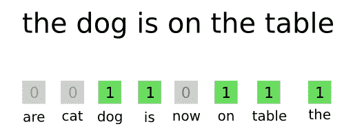
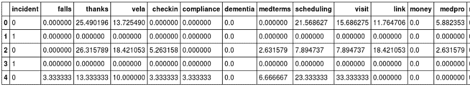

# 使用单词袋方法的文本分类和预测

> 原文：<https://www.freecodecamp.org/news/text-classification-and-prediction-using-bag-of-words-8aeb1396cded/>

由 gk_

# 使用单词袋方法的文本分类和预测


文本分类有多种方法。在其他文章中，我已经介绍过[多项式朴素贝叶斯](https://chatbotslife.com/text-classification-using-algorithms-e4d50dcba45)和[神经网络](https://machinelearnings.co/text-classification-using-neural-networks-f5cd7b8765c6)。

最简单也是最常见的方法之一叫做“单词袋”它已经被商业分析产品使用，包括 [Clarabridge](https://www.clarabridge.com/) 、 [Radian6](https://www.webanalyticsworld.net/analytics-measurement-and-management-tools/radian-6-overview) 和其他产品。



Image [source](https://machinelearnings.co/text-classification-using-neural-networks-f5cd7b8765c6).

这种方法相对简单:给定一组主题和与每个主题相关的一组术语，确定文档中存在哪些主题(例如，一个句子)。

虽然其他更奇特的算法也将单词组织成“包”，但在这种技术中，我们不创建模型，也不将数学应用于这个“包”与机密文档相交的方式。文档的分类将是多态的，因为它可以与多个主题相关联。

这是不是看起来太简单而没有用？在你匆忙下结论之前先试试。在 NLP 中，通常情况下，一个简单的方法有时可以走很长的路。


credit: Smitha Milli [https://twitter.com/smithamilli](https://twitter.com/smithamilli/status/837153616116985856)

我们需要三样东西:

*   主题/单词定义文件
*   分类器功能
*   测试我们的分类器的笔记本

然后我们将更进一步，使用我们的分类数据建立并测试一个预测模型。

#### 主题和单词

我们的定义文件是 JSON 格式的。我们将使用它来分类病人和负责他们护理的护士之间的消息。

#### topics.json

这个定义中有两点值得注意。

首先，让我们看看一些术语。例如，“bruis”是一个**词干。**它将涵盖“瘀伤”、“瘀伤”等超集。第二，包含 ***** 的术语实际上是**模式**，例如 ***dpm** 是数字 **d** igit 后跟“pm”的模式

为了简单起见，我们只处理数字模式匹配，但是这可以扩展到更广的范围。

在对包含日期、时间、货币价值等的文档进行分类时，这种在术语中寻找模式的能力非常有用。

让我们尝试一些分类。

分类器返回一个 JSON 结果集，其中包含与消息中找到的每个主题相关联的句子。一条消息可以包含多个句子，一个句子可以与零个、一个或多个主题相关联。

让我们看看我们的分类器。这里的代码是[这里的](https://github.com/ugik/notebooks/blob/master/msgClassify.py)。

#### msgClassify.py

代码相对简单，包括一个将文档分成句子的便利函数。

#### 预测建模

与结果相关联的一组文档的**的集合分类可用于建立预测模型。**

在这个用例中，我们想看看是否可以根据事件发生前患者和护士之间的信息来预测住院情况。我们比较了住院和未住院患者的信息。

对于与一些二进制结果相关联的其他类型的消息传递，您可以使用类似的技术。

这个过程需要几个步骤:

*   一组消息被分类，并且每个主题接收该组的计数。结果是**一个固定的主题列表，其中来自消息的分配百分比为%。**
*   主题分配然后被赋予二进制值，在我们的例子中，如果没有住院，则为 0，如果有住院，则为 1
*   使用逻辑回归算法来建立预测模型
*   该模型用于**预测新输入**的结果

让我们看看我们的输入数据。您的数据应该具有类似的结构。我们用的是熊猫的数据帧。



**“事件”**为二元结果，需要在输入数据中第一列。

随后的每一列都是一个主题和属于患者的消息集的分类百分比。

在第 0 行，我们看到该患者大约有四分之一的信息是关于**感谢**主题的，没有一条是关于**医学术语**或**金钱**的。因此，每一行都是一个二进制结果和一个跨主题的**消息传递分类配置文件**。

您的输入数据将具有不同的主题、不同的列标签和不同的二元条件，但在其他方面将是类似的结构。


让我们使用 [scikit-learn](http://scikit-learn.org/stable/) 来构建一个逻辑回归并测试我们的模型。

这是我们的输出:

```
precision    recall  f1-score   support          0       0.66      0.69      0.67       191          1       0.69      0.67      0.68       202avg / total       0.68      0.68      0.68       393
```

该模型相对于测试数据的[精确度和召回率](https://en.wikipedia.org/wiki/Precision_and_recall)都在 60%左右——**略好于猜测**，不幸的是，不够精确，没有多大价值。

在本例中，数据量相对较小(1000 名患者，每个患者约 30 条消息)。记住只有一半的数据可以用来训练，另一半(洗牌后)用来测试。

通过包括诸如年龄、性别、状况、过去事件等结构化数据，我们可以加强我们的模型并产生更强的信号。拥有更多数据也会有所帮助，因为定型数据列的数量相当大。

用您的结构化/非结构化数据尝试一下，看看您是否能获得一个高度可预测的模型。您可能无法获得导致自动操作的精确度，但“风险”概率可以用作过滤器或排序函数，或者作为人类专家的早期警告信号。

“单词袋”方法适用于某些类型的文本分类工作，特别是在语言没有细微差别的情况下。

**享受。**