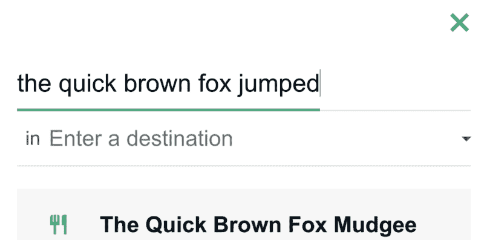
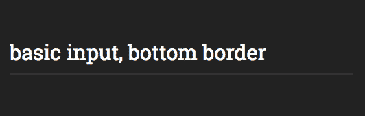
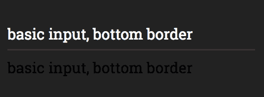
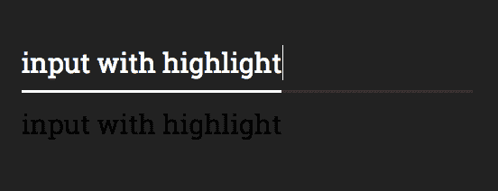
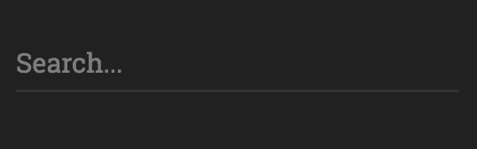

# 文本输入突出显示，猫途鹰风格

> 原文：<https://www.freecodecamp.org/news/text-input-highlight-tripadvisor-style-2a44477de1b2/>

彼得·加扎罗夫

# 文本输入突出显示，猫途鹰风格



最近，一位设计师要求我创建一种文本输入风格，就像在[猫途鹰](https://www.tripadvisor.com/)上的搜索输入一样。我非常喜欢它。我将把我的解决方案作为一步一步的指南来分享，这样你就可以自己构建了。


实现涉及 CSS 和 JavaScript。对于我们的版本，我将假设你对 SCSS 有基本的了解并做出反应。

这是完成的代码笔:

[//codepen.io/petrgazarov/embed/JyXvzB/?height=265&theme-id=0&default-tab=css,result](//codepen.io/petrgazarov/embed/JyXvzB/?height=265&theme-id=0&default-tab=css,result)

See the Pen [Tripadvisor input highlight](https://codepen.io/petrgazarov/pen/JyXvzB/) by Petr Gazarov ([@petrgazarov](https://codepen.io/petrgazarov)) on [CodePen](https://codepen.io).

### 让我们建造它

首先，我们将创建一个简单的 React 组件，并将其呈现给 DOM:

```
class App extends React.Component {
  render() {
    return (
      <div className='input-wrapper'>
        <input
          placeholder='Search...'
          spellCheck={false}
        />
      </div>
    );
  }
}

ReactDOM.render(
  <App />,
  document.getElementById('root')
);
```

给它添加一些 CSS:

```
$input-font-size: 30px;
$input-line-height: 70px;
$font-family: Roboto Slab, sans-serif;

body {
  background-color: #222222;
}

.input-wrapper {
  width: 500px;
  margin: 50px auto;
}

input {
  height: 60px;
  width: 100%;
  min-width: 100%;
  padding: 0;
  border-radius: 0;
  line-height: $input-line-height;
  background-color: transparent;
  color: white;
  font-size: $input-font-size;
  border: none;
  outline: none;
  border-bottom: 3px solid #333333;
  font-family: $font-family;
}
```

为 ReactDOM 添加一个 HTML 容器以呈现到:

```
<div id="root"></div>
```

这为我们提供了带有底部边框的基本文本输入。



### 现在让我们给边界添加生命！

实现突出显示的困难在于宽度需要与文本的结尾保持一致。它还需要与任何`font-family`和`font-size`一起工作。

由于输入元素`width`是固定的，我们需要一些其他技巧来检测在任何给定时间文本的结束位置。

假设我们可以使用第二个元素，其宽度为**动态**——在我们的例子中，它是一个具有`input-highlight`类的`span`元素。接下来，我们将复制输入文本并将其放入`span`中。

我通过提供一个`value`道具，将输入从不受控的[切换到受控的](https://gist.github.com/markerikson/d71cfc81687f11609d2559e8daee10cc)。

我们的 React 组件现在看起来像这样:

```
class App extends React.Component {
  render() {
    return (
      <div className='input-wrapper'>
        <input
          placeholder='Search...'
          spellCheck={false}
          value='basic input, bottom border'
        />
        <span className='input-highlight'>
          basic input, bottom border
        </span>
      </div>
    );
  }
}
```

为`input-highlight`添加以下 CSS 规则

**注意:**我们在这里使用 SCSS 变量来确保`input`和`span`之间的`font`属性是相同的:

```
.input-highlight {
  font-size: $input-font-size;
  line-height: $input-line-height;
  font-family: $font-family;
  max-width: 100%;
}
```

这让我们来到这里:



接下来，让我们在`span`上添加一个顶部边框，并定位它，使它的边框叠加在输入的底部边框上。此外，由于`input-highlight`现在有了`position: absolute`，父元素将需要`position: relative`规则。

```
.input-highlight {
  font-size: $input-font-size;
  line-height: $input-line-height;
  font-family: $font-family;
  max-width: 100%;

  border-top: 3px solid white;
  position: absolute;
  left: 0;
  bottom: 0;
  height: 0;
}

.input-wrapper {
  width: 500px;
  margin: 50px auto;
  position: relative;
}
```



Cool, right?

span 元素以文本结束。这使得它的宽度成为输入文本宽度的完美度量！

现在，简单的部分:让我们使用 JavaScript 在每次输入内容改变时更新 span 中的文本。我们将使用 React `state`来同时更新输入和跨度的值。

这是我们更新的组件:

```
class App extends React.Component {
  constructor() {
    super();

    this.state = {
      inputValue: ''
    };

    this.onInputChange = this.onInputChange.bind(this);
  }

onInputChange(e) {
    const { value } = e.target;

    this.setState({
      inputValue: value
    });
  }

render() {
    const { inputValue } = this.state;

    return (
      <div className='input-wrapper'>
        <input
          onChange={this.onInputChange}
          placeholder='Search...'
          value={inputValue}
          spellCheck={false}
          />
        <span className='input-highlight'>
          { inputValue.replace(/ /g, "\u00a0") }
        </span>
      </div>
    );
  }
}
```

`.replace(/ /g, "\u00a0")`部分是 React 正确处理空格所必需的。

然后，通过向`input-highlight` CSS 选择器添加以下行来隐藏跨度:

```
color: transparent;
user-select: none;
overflow: hidden;
```

我们需要 span 上的`overflow: hidden`来限制它的宽度(否则它将导致容器水平伸展——感谢[普拉桑娜](https://www.freecodecamp.org/news/text-input-highlight-tripadvisor-style-2a44477de1b2/undefined)和[安德里亚](https://www.freecodecamp.org/news/text-input-highlight-tripadvisor-style-2a44477de1b2/undefined)在评论中指出这一点！)



### 完成它

它已经运行得非常好了。最后一点是为高光添加不同的`onFocus`颜色。

为了实现这一点，我们需要一种基于输入的焦点状态来设计跨度样式的方法。输入和 span 是兄弟，所以我们将使用 CSS 兄弟选择器(`+`)。

下面是完整的`input`选择器的代码，包括`input-highlight`的同级选择器:

```
input {
  height: 60px;
  width: 100%;
  min-width: 100%;
  padding: 0;
  border-radius: 0;
  line-height: $input-line-height;
  background-color: transparent;
  color: white;
  font-size: $input-font-size;
  border: none;
  outline: none;
  border-bottom: 3px solid #333333;
  font-family: $font-family;

  &:focus {
    + .input-highlight {
      border-top: 3px solid #fbc91b;
    }
  }
}
```

谢谢你留下来！如果你喜欢这个帖子，通过推荐分享给更多的人。