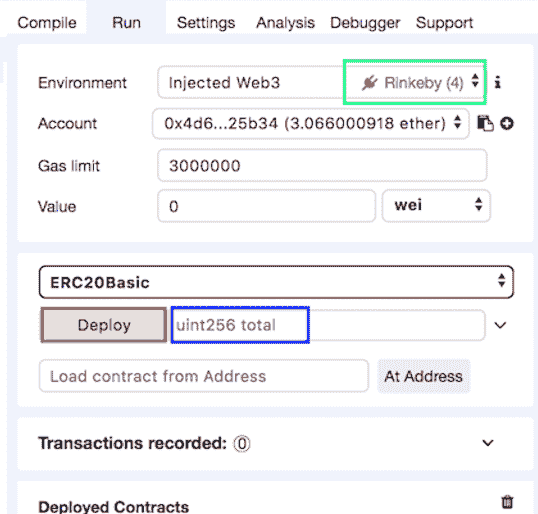

# 如何在一个小时内创建和部署一个成熟的初始硬币产品

> 原文：<https://www.freecodecamp.org/news/the-1-hour-ico-296568870cd2/>

作者:吉拉德·海莫夫

# 如何在一个小时内创建和部署一个成熟的初始硬币产品


本文将向您展示如何在不到一个小时的时间内创建和部署一个成熟的 ERC20 令牌。

在过去的几年里，ERC20 令牌规范实际上已经成为以太坊令牌的标准。事实上，大多数以太坊令牌都符合 ERC20 标准。

ERC20 如此成功有几个因素:

1.  很简单。非常简单。我们很快就会发现。
2.  它解决了一个实际问题:区块链市场和加密钱包需要一组命令来与它们管理的所有令牌进行通信，包括令牌之间的交互规则和令牌购买规则
3.  它是第一个(几乎是第一个)提供以太坊令牌标准化的规范。

与任何其他以太坊令牌一样，ERC-20 令牌被实现为智能合约，并以分散的方式在以太坊虚拟机(EVM)上执行。

以太坊智能合约是用一种叫做 Solidity 的语言写的(还有其他选项，但几乎没人用)。Solidity 有点类似于 JavaScript。事实上，如果你对 JavaScript、Java 或其他类似 C 语言有所了解，你可能会在学习语言之前就知道一段可靠的代码是做什么的。

现在有趣的部分来了:创建一个基本的 ERC20 合同。事实上，这是一项相当简单的任务。非常简单，我们将能够在不超过一个小时的时间内编写并部署您的第一个 ERC20 令牌。

诚然，我们将创建的令牌将是一个基本实现，但我已经看到许多基本令牌做得非常好。

### 标准


#### **这个 ERC20 到底是什么？**

ERC20 标准定义了由所有 ERC20 兼容令牌实现的一组简短的基本功能，以便允许与其他合同、钱包或市场集成:

```
 function totalSupply() public view returns (uint256); function balanceOf(address tokenOwner) public view returns (uint); function allowance(address tokenOwner, address spender) public view returns (uint);
```

```
 function transfer(address to, uint tokens) public returns (bool); function approve(address spender, uint tokens)  public returns (bool); function transferFrom(address from, address to, uint tokens) public   returns (bool);
```

这些功能将允许外部用户，比如钱包，找出用户的余额，并执行从一个用户到另一个用户的安全和授权的资金转移。

此外，合同定义了两个事件:

```
event Approval(address indexed tokenOwner, address indexed spender,   uint tokens);event Transfer(address indexed from, address indexed to,   uint tokens);
```

当另一个用户被授予从帐户中提取令牌的权利时，以及当令牌实际上已经被转移时，这些事件将被调用或发出*。*

*许多令牌还添加了以下字段，这些字段事实上已经成为标准的一部分:*

```
 *`string public constant name; string public constant symbol; uint8 public constant decimals;`*
```

*关于术语:*

*   *一个`public`函数可以在契约本身之外被访问*
*   *`view`基本上表示常量，即合同的内部状态不会被函数改变*
*   *一个`event` 是 Solidity 的一种方式，允许客户，例如你的应用程序前端在合同中的特定事件上得到通知*

*如果你曾经学过 Java/JavaScript，其余的语言结构应该是清楚的。*

### *代码*

*到目前为止，我们已经讨论了接口。现在让我们实际上写一些逻辑。*

*为此，我们需要定义两个映射对象，这是关联数组或键/值数组的可靠性概念:*

```
 *`mapping(address => uint256) balances; mapping(address => mapping (address => uint256)) allowed;`*
```

*表达式`mapping(address => uint2` 56)定义了一个关联数组，该数组的键是 ty`pe addr`ess——一个用于表示账户地址的数字，其值是 ty`pe uint`256——一个 256 位整数，通常用于存储令牌余额。

第一个映射对象`t, balan` ces，将保存每个所有者帐户的令牌余额。*

*第二个映射对象`allowed`将包括所有被批准从给定账户中提取的账户，以及每个账户允许的提取金额。*

*如您所见，允许映射的值字段本身就是一个映射，将帐户地址映射到其批准的取款金额。*

*这些映射连同所有其他合同字段将被存储在区块链中，并且将被*挖掘*，导致变化被传播到所有网络用户节点。*

*区块链存储价格昂贵。你的合同用户需要支付汽油费。在可能的情况下，始终尝试最小化存储大小和写入区块链。*

*既然我们已经设置了所需的数据结构，那么让我们继续将 ERC20 逻辑编写到适当的函数中。*

#### *获取令牌的总数*

*有几种方法可以设置 ICO 令牌的最大数量，事实上，这个问题本身就值得讨论。*

*根据我们的需要，我们将使用最简单的方法，即在合同创建时设置令牌的总量，并在最初将它们全部分配给“合同所有者”帐户，即部署合同的帐户:*

```
*`uint256 totalSupply_;   constructor(uint256 total) public {     totalSupply_ = total;    balances[msg.sender] = _totalSupply; }`*
```

*构造器是一个特殊的函数，以太坊会在契约部署后自动调用它。您通常会使用它，就像我们在这里做的那样，使用契约的部署者传递的参数来初始化令牌的状态。*

*`msg`是以太坊自己声明和填充的全局变量，包含履行契约职责的重要数据。我们这里使用的字段:`msg.sender`包含执行当前合约功能的以太坊账户。*

*因为只有部署帐户可以进入契约的构造函数，所以这个函数在契约启动时，将所有可用的令牌分配给“契约所有者”帐户。*

#### *获取总令牌供应*

```
*`function totalSupply() public view returns (uint256) {   return totalSupply_;}`*
```

*此函数将返回此契约分配的所有令牌的数量，而不管其所有者是谁。*

#### *获取所有者的象征性余额*

```
*`function balanceOf(address tokenOwner) public view returns (uint) {   return balances[tokenOwner];}`*
```

*balanceOf 将返回一个帐户的当前令牌余额，由帐户所有者的地址标识。*

#### *将代币转移到其他帐户*

```
*`function transfer(address receiver,                   uint numTokens) public returns (bool) {   require(numTokens <= balances[msg.sender]);   balances[msg.sender] = balances[msg.sender] — numTokens;   balances[receiver] = balances[receiver] + numTokens;   emit Transfer(msg.sender, receiver, numTokens);   return true;}`*
```

*`transfer` 功能顾名思义就是将`numTokens`数量的代币从所有者的余额转移到另一个用户`receiver`的余额中。请注意，转让所有者是`msg.sender`，即执行该功能的所有者，这意味着只有令牌的所有者可以将它们转让给其他人。*

*是 Solidity 断言谓词的方式，在这种情况下，转账账户有足够的余额进行转账。如果 require 语句失败，事务将立即回滚，不会将任何更改写入区块链。*

*就在退出之前，该函数触发 ERC20 事件`Transfer`,允许注册的侦听器对其完成做出反应。*

#### *允许代理人从我的帐户中提取代币*

```
*`function approve(address delegate,                  uint numTokens) public returns (bool) {   allowed[msg.sender][delegate] = numTokens;   emit Approval(msg.sender, delegate, numTokens);   return true;}`*
```

*该功能通常用于令牌市场环境中。它所做的是允许所有者，即`msg.sender`批准一个代理账户——可能是市场本身——从他的账户中提取一些代币，并将它们转移到其他账户。*

*这种场景的典型用例是所有者在市场上提供代币进行销售，而无需在实际交易发生之前获得自己的批准。在执行结束时，该函数触发一个`Approval` 事件。*

#### *获取批准提取的令牌数量*

```
*`function allowance(address owner,                    address delegate) public view returns (uint) {   return allowed[owner][delegate];}`*
```

*该函数将所有者当前批准的令牌数返回给特定的代表，如在`approve` 函数中设置的那样。

委托转让代币:*

```
*`function transferFrom(address owner, address buyer,                       uint numTokens) public returns (bool) {   require(numTokens <= balances[owner]);    require(numTokens <= allowed[owner][msg.sender]);`*
```

```
 *`balances[owner] = balances[owner] — numTokens;   allowed[owner][msg.sender] =          allowed[from][msg.sender] — numTokens;   balances[buyer] = balances[buyer] + numTokens;   Transfer(owner, buyer, numTokens);   return true;}`*
```

*`transferFrom`是我们已经访问过的`approve` 函数的对等体。它允许被批准提款的代表将所有者资金实际转移到第三方账户。*

*函数开始时的两个`require` 语句用于验证交易是合法的，即所有者有足够的代币可以转移，并且代表至少有`numTokens`的限额可以撤回。*

*除了将`numTokens`金额从所有者转移到买方之外，该功能还从代理人的津贴中减去`numTokens`。这允许一个有给定津贴的代表把它分成几次提款，这是典型的市场行为。*

*事实上，我们可以在这里停下来，有一个有效的 ERC20 实现。但我们的目标更高:我们想要一个工业实力的象征，尽管是一个简单的象征。这要求我们让代码更加安全。*

*SafeMath 是一个 Solidity 库，旨在应对黑客破坏合同的一种方式:整数溢出攻击。在这种攻击中，黑客通过传递参数迫使合同使用不正确的数值，这些参数将使相关的整数**超过它们的最大值**。*

**SafeMath* 通过在执行算术操作之前测试溢出来防止这种情况，从而消除溢出攻击的危险。它也很小，所以对契约大小的影响很小，所以让我们使用它。*

*首先，我们将把它添加到代码中:*

```
*`library SafeMath { // Only relevant functions`*
```

```
*`function sub(uint256 a, uint256 b) internal pure returns (uint256) {   assert(b <= a);   return a — b;} function add(uint256 a, uint256 b) internal pure returns (uint256)   {   uint256 c = a + b;   assert(c >= a);   return c; }}`*
```

**SafeMath* 使用`assert` 语句来验证传递参数的正确性。当`assert`失败时，功能执行立即停止，所有区块链更改回滚。*

*接下来，让我们添加以下语句，向 Solidity 编译器介绍该库:*

```
*`using SafeMath for uint256;`*
```

*最后，我们将用 SafeMath 函数替换我们在开始时使用的简单算法:*

```
 *`balances[msg.sender] = balances[msg.sender].sub(numTokens);`* 
```

```
 *`balances[receiver] = balances[receiver].add(numTokens);   balances[buyer] = balances[buyer].add(numTokens);  balances[owner] = balances[owner].sub(numTokens);`*
```

#### *现在让我们一起打包吧*

*在 Solidity 中，契约的功能和事件被打包到一个名为*契约*的实体中，您可以悄悄地将它翻译成一个“区块链类”。下面是我们到目前为止创建的与 ERC20 兼容的契约。名称和符号字段可以随意更改。大多数令牌将十进制值保持在 18。我们将在这里做同样的事情:*

### *合同部署*

*我们现在将把我们的合同部署到区块链。一旦部署，契约将被传送到参与网络的所有节点，并且对契约所做的所有改变将被传播到所有参与节点。*

*以太坊专业人员通常使用部署工具，如 [Truffle](https://truffleframework.com/) 。
对于我们的需要，一个简单的叫做 [Remix](https://remix.ethereum.org/) 的在线工具就足够了。*

*你首先需要在浏览器上安装一个[元蒙版插件](https://chrome.google.com/webstore/detail/metamask/nkbihfbeogaeaoehlefnkodbefgpgknn?hl=en)(我希望是 Chrome..)和一个 Rinkeby(以太坊测试网)账号，里面至少有一些 Rinkeby 以太。这两个先决条件超出了我们当前的范围，而且做起来也很简单。*

*如果你没有其中任何一个，请随时访问 [MetaMask](https://metamask.io/) 和 [Rinkeby](https://www.rinkeby.io/#stats)
以获得清晰的安装和使用说明。*

*假设我们已经设置了先决条件，我们现在将转到 [Remix](https://remix.ethereum.org/) 并将上面的代码(包括 pragma 行和 SafeMath 库)粘贴到在线编辑器中。*

*在此之后，我们将转到第二个选项卡，在右侧面板上运行，并点击 T2 部署和 T3。将出现一个元掩码弹出窗口，要求我们确认交易，我们当然会这样做。*

**

*   **绿色标记:确保你在 Rinkeby 网络上**
*   **蓝色标记:设置总代币供应量**
*   *红色标记:展开！*

***祝贺你！**您刚刚部署了第一个 ERC20 令牌。它简单但功能齐全，符合标准，安全，随时可以在整个区块链网络中购买、支付和转移！*

#### *仅此而已吗？*

*一点也不。智能合约可能会变得更加复杂，这取决于您的业务逻辑、您的用户交互建模、您是否允许令牌铸造和刻录、您在合约中引入的生命周期变化、对管理员级功能的需求(通常带有管理员授权的功能集),嗯，您已经了解了。*

*尽管如此，你在这里所取得的成绩为你在需要更复杂的合同时继续前进打下了坚实的基础。*

*希望这也只是一点乐趣。*