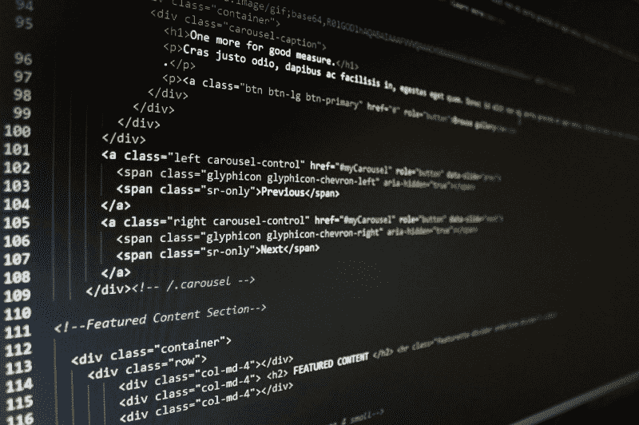

# 成为初级全栈 web 开发人员的 10 分钟路线图

> 原文：<https://www.freecodecamp.org/news/the-10-minute-roadmap-to-becoming-a-junior-full-stack-web-developer-1131d4ffc48/>

所以你已经开始了你的 web 开发之旅。但是你先学什么呢？互联网上充斥着 web 开发人员可能知道的数百万种不同技术的丰富信息。

不难看出这一切是多么令人困惑和厌恶。作为一名前初级开发人员，我了解这种挣扎。

本指南是根据我作为初级开发人员的行业经验汇编而成的。本指南也是我作为团队领导对初级开发人员的期望的总结。

这里有很多信息——所以去喝一杯，放松一下，让我们开始吧！

#### 必须知道的

不管你的道路和职业目标是什么，每个开发者都需要知道一些事情。

*   Git/源代码控制 —每个优秀的开发人员都需要知道如何使用 Git，尤其是在团队环境中。因此，学习如何克隆回购、提交、创建分支和合并代码
*   **调试** —前端，或者后端，都会有 bug。熟悉 IDE 的调试工具。说到 IDE 的…
*   **IDE** —有很多 IDE 可以用，挑一个了解一下吧。您的 IDE 是您最好的朋友，了解快捷方式和工具将使您成为更好的开发人员。个人推荐用 VS 代码。
*   **方法(敏捷/SCRUM/看板)——**在团队中工作时，你可能会使用产品开发方法，所以要确保你熟悉它们的工作方式

### 前端

前端开发人员通常可以执行以下任务:

*   使用 HTML/CSS 实现设计
*   使用 JavaScript 与 DOM 交互
*   使用 FETCH API 或类似工具与 API 交互

让我们更详细地探讨一下这个问题。

#### HTML/CSS

这是前端开发的基础。HTML 用于在网页上定位和放置元素，而 CSS 用于对这些元素进行*样式化*。

初级前端 web 开发人员应该非常了解这些东西。重要的是要知道:

*   使用 HTML 创建网页
*   使用 CSS 设计元素样式
*   将 CSS 应用于 HTML 的不同方式——内嵌样式、样式表等。

一旦你有了基本的东西，看看更高级的特性:

*   CSS 网格和 Flexbox 用于布局和更容易的元素定位
*   SCSS 通过使用变量使普通 CSS 更易于管理

查看[css-tricks.com](https://css-tricks.com/snippets/css/complete-guide-grid/)的 CSS 综合指南。这是最好的资源之一。

> 额外提示——用 CSS/HTML 创建几个项目来练习。现在还不要担心使用 JavaScript 或 API，将注意力完全集中在 CSS/HTML 元素上。

我们现在正在变成 CSS/HTML 专家！？

#### 结构

下一步是熟悉 CSS 框架。这些基本上是您可以在项目中使用的“开箱即用”的元素和样式。大多数公司使用这些方法，因为这样可以节省开发人员的时间，因为他们不必重新发明轮子。有太多的框架，但是我建议你选择一个并熟悉它。它们通常都非常相似，一旦你熟悉了其中一个，就很容易理解其余的。

#### 引导程序

我个人的建议是学习**自举**(【getbootstrap.com】T2)。它非常受欢迎，被许多公司使用。

“等等，如果我可以使用一个框架，为什么我必须从头开始学习 CSS/HTML？!"

好问题。是的，有一些框架，虽然很多公司都在使用它们，但是你经常需要根据项目不时地定制一些东西。为此，你需要了解一些基本知识。

#### 响应式设计

如今，在创建前端设计时，将众多移动设备考虑在内非常重要。幸运的是，到目前为止我们已经讨论过的 CSS 框架(Bootstrap、CSS Grid、Flexbox 等)使得创建响应式设计变得非常容易。

*   **媒体查询。**除了知道如何使用 CSS 创建响应式设计之外，你还需要了解如何使用**媒体查询**来定义元素在不同屏幕尺寸下的外观。
*   避免使用像素作为尺寸。我建议使用像素以上的**雷姆**单位。宽度为 100 像素的图像，无论屏幕大小如何，宽度始终为 100 像素。尽量使用**雷姆**、 **vh** 和 **vw** 等单元，实现响应式设计。

> **额外提示** -通常你需要开发一个既能使用手机屏幕又能使用大屏幕的应用程序。在创建设计时，首先关注移动设备，然后为更大的屏幕添加媒体查询。

#### Java Script 语言

JavaScript 是网络的编程语言。如果你想成为一名成功的前端开发人员，你需要了解 JavaScript。并且真正了解它。是的，有框架，但是就像我们在进入框架之前学习了 HTML 和 CSS 的基础一样，我们在这里也要做同样的事情。从长远来看，这将使你成为一名更好的开发人员。随着框架的出现和消失，语言的核心元素将保持不变。

作为初级开发人员，您至少需要知道:

*   对象、函数、条件、循环和运算符
*   模块
*   数组(包括如何操作它们)
*   使用 FETCH API 从 API 中检索数据
*   操作 DOM 和使用事件
*   Async/Await(更像是一个可选的高级主题，但是如果你知道的话，会给你留下深刻的印象)
*   JSON
*   是 6+
*   测试(Jest、酵素、柴等。)

初级开发人员不需要知道这些主题的所有内容，但是你知道的越多越好。一旦你可以创建一个没有教程的*基础 web 应用，*你就可以确定你懂 JavaScript 了。

如果您真的想成为 JavaScript 专家，完全理解这种语言并脱颖而出，那么学习更高级的 JavaScript 主题的一些很好的资源是:

*   [eloquentjavascript.net](http://eloquentjavascript.net/)
*   [freeCodeCamp.org](https://www.chrisblakely.dev/the-10-minute-road-map-to-becoming-a-junior-full-stack-web-developer/freeCodeCamp.org)
*   [github.com/getify/You-Dont-Know-JS](https://github.com/getify/You-Dont-Know-JS)

这些资源不仅教你 JavaScript，而且你还会学到很多编程概念。说真的，如果你学习了上面参考资料中的资源，你将会成为一名非常出色的初级开发人员——我所指的一些高级开发人员不知道这些东西！

一些项目想法:

*   创建一个超级马里奥游戏(您将学习 JavaScript、操作 DOM 和使用事件)
*   创建一个仪表板，显示一些从 API 中提取的统计数据。例如，Twitter 仪表板、GitHub 仪表板或任何你喜欢的东西(你将学习使用 API 和 JSON)
*   不要担心这里的情况。专注于学习 JavaScript，而不是 CSS/HTML。如果你愿意，以后你可以把它变得更漂亮！

#### JS 框架

JS 框架很多，挑一个好好学。目前比较流行的有 **Angular.js** 、 **React.js** 、 **Vue.js** 。这些都是可靠的选择，不会很快消失。我个人推荐 React.js，但是你可以试试其他的，看看你更喜欢哪个。

快速注意——如果你已经学习了 JavaScript 的基础知识，并且有了坚实的基础，学习框架应该是小菜一碟！不管你选择什么样的框架，一定要了解它。

**你不需要了解所有的框架，**如果你非常了解一个框架，而不是对多个不同的框架一知半解，这会给人留下更深刻的印象。

#### 反应

它得到了大型在线社区脸书的大力支持，是目前业内最受欢迎的。

如果您按照上面的步骤学习了一点 JavaScript，那么学习 React 应该不会太难。作为初级开发人员，您希望确保掌握 React 的核心概念:

*   理解 React 是基于组件以及组件如何工作的
*   在组件中使用状态和道具
*   JSX 以及如何使用它来呈现网页上的 HTML 元素
*   组件重新渲染的方式和时间
*   使用 React 挂钩
*   NPM、网络包和巴别塔

> **额外提示** —同样，作为一名初级开发人员，你不会被期望知道从里到外的反应。因此，要练习上面概述的技能，请尝试创建几个项目:

*   重新构建一些以前的 JavaScript 项目以使用 React
*   创建一个**计算器应用**(这是一个很好的实践状态管理的应用，因为许多用户操作都需要更新状态。提示:尝试使用 React 挂钩)
*   创建你自己的、 **Twitter** 、 **GitHub** 或**新闻源**。使用公共 API 获取数据，并在您的应用程序中显示这些数据。
*   同样，不要担心让你的应用程序变得完美，或者让它看起来超级性感。专注于让它工作，专注于学习 React 概念。

#### 状态管理(例如 Redux)

一旦明确了 React 的核心概念，下一步就是理解 **Redux** 。Redux 基本上是一个状态管理框架，主要是恭维式的反应。可以把它想象成一个前端数据库，它把 web 应用程序的状态保存在一个易于管理的地方。

有很多可移动的部分需要重复，所以如果你感到不知所措也不要担心(我还在学习进出！).在使用大型企业级 web 应用程序时，您只需要了解 Redux。重点了解使用 React 的基本原理和状态管理。

有许多工具可以帮助您调试 React/Redux(这是我喜欢它的部分原因)

*   [React 开发工具](https://chrome.google.com/webstore/detail/react-developer-tools/fmkadmapgofadopljbjfkapdkoienihi?hl=en)
*   [Redux 开发工具](https://github.com/zalmoxisus/redux-devtools-extension)

#### 网络浏览器

作为一名前端开发人员，了解 web 浏览器非常重要。以 Chrome，Firefox，Edge 为主。你需要有一个基本的概念:

*   调试工具(例如 Chrome 开发者工具)
*   使用存储方法(本地存储、会话存储、cookies)
*   浏览器特性 web 开发的最大痛苦是开发时考虑到浏览器支持。留意[**whatwebcando . today**](https://whatwebcando.today/)确保你的代码支持必要的浏览器。

#### 部署和托管

前端开发人员应该知道如何部署和托管 web 应用程序。这对你的投资组合、知识以及找工作都有好处。我建议使用托管服务(例如，让别人帮你做繁重的工作)，例如

*   github pages-github 页面
*   春子
*   Netlify
*   数字海洋
*   自动警报系统
*   重火力点

我个人推荐 **Netlify** 或者 **Heroku** 。它使得通过用户界面部署和托管应用程序变得非常容易。这些服务中的每一个都提供了一个免费层，所以运行它应该不会花费你太多。这些服务的缺点是它们不能给你一些开发者需要的*更精细的访问*，比如电子邮件服务、SSH 或 FTP。如果你不知道这些是什么，你可能不需要它们，所以简单的服务就可以了。

如果你决定在一个定制的域上运行你的一些项目(比如`<yourname&g`t；。com)，我觉得 **mmend Name** 的域名很便宜。同样，非常容易使用，域名也很便宜。？

### 后端

简而言之，这是保存前端数据的地方。例如，当用户创建一条 Tweet 时，它会通过服务器，并保存在数据库中。

后端开发人员通常可以执行以下任务:

*   创建前端将使用的 API(通常通过返回 JSON)
*   编写业务逻辑和验证逻辑
*   与第三方 API 集成
*   从数据库中保存和读取数据

#### 编程语言

有许多编程语言可供你选择。就像数百万人一样。不过不用担心，主要的有:

*   Java 语言(一种计算机语言，尤用于创建网站)
*   C#
*   计算机编程语言
*   Node.js(技术上不是一种语言，更像是一个让你在服务器上运行 JavaScript 的运行时)
*   去
*   PHP(除非你对 WordPress 开发感兴趣)

还是那句话，我的建议是挑一个，好好学。我建议使用 **Node.js** ，因为你已经有了学习 JavaScript 的心态。Node.js 使得创建 REST API 变得非常容易，这是初级开发人员应该完成的主要任务之一。

无论您选择哪种语言，请确保您了解以下内容:

*   创建 API
*   语言基础(创建函数、使用条件、操作符、变量等)
*   如何连接到数据库
*   如何查询数据库
*   包装管理
*   写作测试

如果您决定学习 Node.js，那么其中的许多内容对您来说都很熟悉。不要试图全部学会！作为初级开发人员，您不需要。选择最符合你目标的语言(如果是 web 开发，任何一种都可以)并专注于它，学好它。当然，如果你对其他语言感到好奇(Node.js 和 Python 有很大的不同)，那就尽情满足你的好奇心，尽情使用它们吧。

#### REST API 和 JSON

创建一个好的 REST API 是后端开发人员的主要工作之一。你需要知道:

*   不同的动词和它们的用途
*   如何创造一个好的回应
*   如何处理请求
*   认证请求
*   如何记录你的 API

REST API 的是后端和前端开发之间的桥梁，所以确保你理解它们是如何工作的。

JSON 是通过 REST API 传输数据的主要语言。数据被表示为*对象和数组。*同样，如果你已经使用概述的步骤学习了 JavaScript 或前端开发，你会觉得很熟悉。

#### 数据库和开发运维

这几乎是 web 开发的基础设施方面。我不会说初级开发人员需要大量这方面的知识。我几乎会提出相反的建议，如果你想进入 DevOps 领域，你只需要深入了解这些东西。您需要了解的广泛领域包括:

*   如何管理数据库
*   不同的托管平台(AWS、Azure、Google 等)
*   CICD 和工具，如詹金斯，GitLab 等
*   记录和监控

根据您的团队或公司，可能会有其他团队或人员来管理此事。它仍然是一套有趣且令人印象深刻的技能，所以如果你有好奇心和一些空闲时间，学习一些数据库和 DevOp 的技能将大有帮助。

### 高级主题

一旦你掌握了以上内容，下面是我推荐的一些高级主题。已经有很多东西需要学习了，所以我不会在这里详细介绍，但是现在可以随意跳过/浏览这一部分，以后再回来。

#### 使用 JWT/OAuth 的身份验证

这是行业中验证和授权用户(例如登录)的常用方法。

更多信息请访问:[https://oauth.net/2/](https://oauth.net/2/)

#### 设计模式

设计模式是针对常见问题的常见解决方案。学习设计模式会更容易解决问题，不可避免地成为更好的开发者。

*   更多信息(Java 示例):[github.com/iluwatar/java-design-patterns](https://github.com/iluwatar/java-design-patterns)
*   更多信息(JavaScript):[github.com/fbeline/Design-Patterns-JS](https://github.com/fbeline/Design-Patterns-JS)

> **额外提示** —设计模式有很多种，所以不要尝试一下子全部学会。相反，*熟悉它们*，当你在项目中遇到问题时，看看有什么设计模式可供你使用。

#### 渐进式网络应用和移动开发

渐进式网络应用本质上是像用户手机上的本地应用一样运行的网络应用。很酷吧？如果你有时间，可以去看看。

更多信息请访问:[developers.google.com/web/progressive-web-apps/](https://developers.google.com/web/progressive-web-apps/)

其他选项包括:

**React Native** —让您编写 React 代码，编译到 Android/IOS 上

**Flutter** —类似于 React Native，只使用 Dart 编程语言

这是在服务器端呈现前端代码，它们返回并显示给浏览器。一个先进的主题，它有自己的优点，如搜索引擎优化和速度的好处。

更多信息请访问:[medium . freecodecamp . org/demystifying-reactions-server-side-render-de 335d 408 Fe 4](https://medium.freecodecamp.org/demystifying-reacts-server-side-render-de335d408fe4)

#### 使用命令行(SSH/Bash 等)

有时，当 GUI 不可用时，您需要使用命令行。在非常基础的层面上，您需要知道如何:

*   如何使用 SSH 连接到服务器
*   使用命令(cd、ls 等)导航
*   使用 vim(或类似工具)编辑文件。这是一张小抄[vim.rtorr.com](https://vim.rtorr.com/)

感谢阅读！

要让初级开发人员直接获得最新的指南和课程，请务必加入邮件列表，网址为 [www.chrisblakely.dev](https://www.chrisblakely.dev/#signup)

*原载于[www . chrisblakely . dev](https://www.chrisblakely.dev/the-10-minute-road-map-to-becoming-a-junior-full-stack-web-developer/)2019 . 3 . 15。*