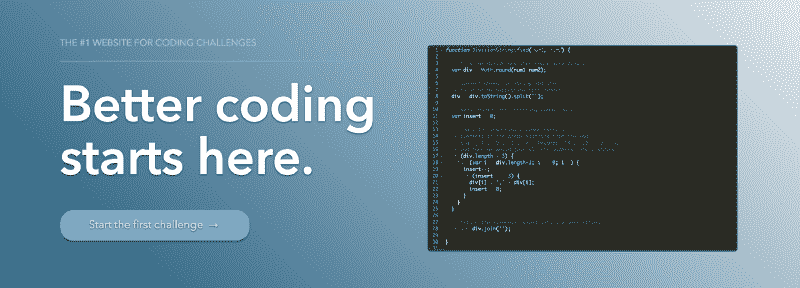
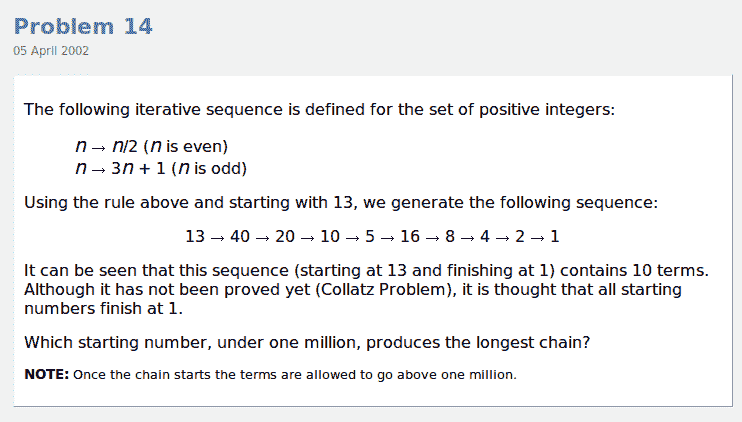
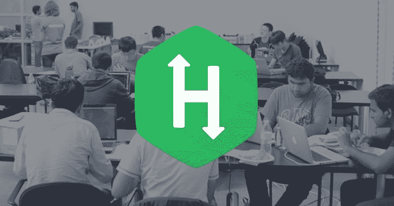
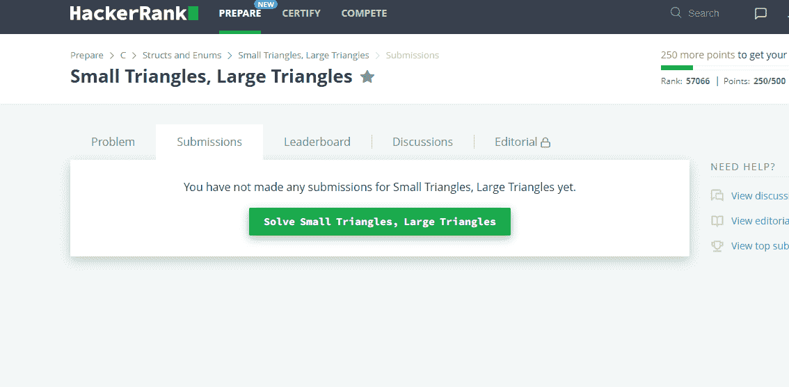
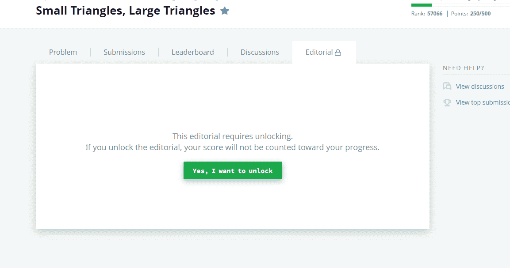
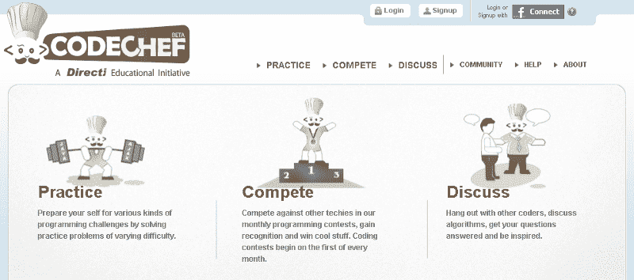
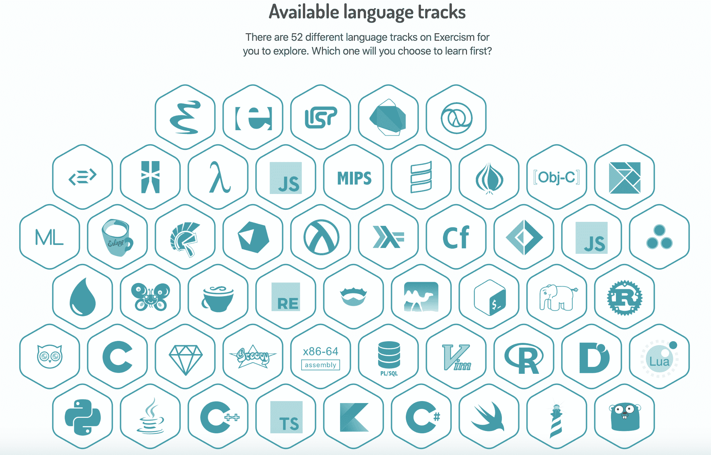
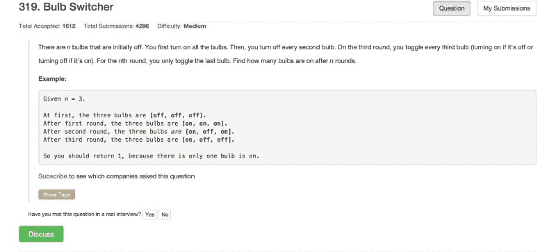
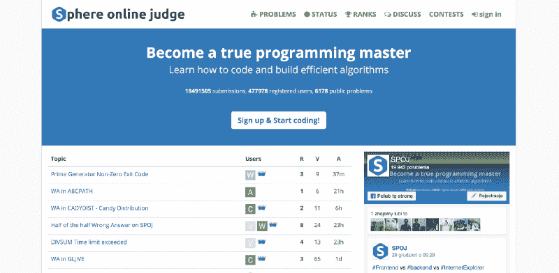
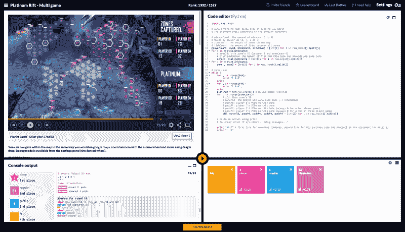

# 十大最受欢迎的编码挑战网站[2021 年更新]

> 原文：<https://www.freecodecamp.org/news/the-10-most-popular-coding-challenge-websites-of-2016-fb8a5672d22f/>

学习编码时提高技能的一个好方法是解决编码挑战。解决不同类型的挑战和难题可以帮助你成为更好的问题解决者，学习编程语言的复杂性，为工作面试做准备，学习新的算法，等等。

下面是一些流行的编码挑战网站的列表，并简要描述了每个网站提供的内容。

### [1。顶部编码器](https://www.topcoder.com/challenges/?pageIndex=1)

TopCoder 是在线竞技编程的原创平台之一。它提供了一个过去的[算法挑战](https://www.topcoder.com/community/how-it-works/)的列表，你可以使用他们的代码编辑器直接在线完成。他们受欢迎的单轮比赛每个月都会在特定的时间举行几次，在那里你可以和其他人竞争，以最快的速度和最好的分数解决挑战。

TopCoder 上[排名靠前的用户](https://www.topcoder.com/tc?module=AlgoRank)都是非常优秀的竞技程序员，定期参加编程比赛。排名第一的用户维护着他自己的[博客](http://petr-mitrichev.blogspot.com/)，名为*算法周刊，作者彼得·米特里切夫*，他在那里写关于编码竞赛、算法、数学等等。

### [2。代码字节](https://www.coderbyte.com/)

Coderbyte 提供了 200 多种编程挑战，你可以用 10 种编程语言中的一种直接在线解决(查看这个[例子](https://www.coderbyte.com/information/First%20Factorial))。挑战从简单(找到字符串中最大的单词)到困难(打印图形的最大基数匹配)不等。

他们还提供了一系列的[算法教程](https://www.coderbyte.com/algorithm/tree-traversal-algorithms)、入门视频和[面试准备课程](https://www.coderbyte.com/course/google-interview-questions)。与 HackerRank 和其他类似网站不同，除了 Coderbyte 发布的*官方*解决方案之外，你还可以查看其他用户为任何挑战提供的解决方案。

### [3。欧拉项目](https://projecteuler.net/)

欧拉项目提供了计算机科学和数学领域的大量挑战。这些挑战通常涉及编写一个小程序来找出一个聪明的数学公式或方程的解，例如[找到一个序列中每个数字之前的所有数字的数字总和](https://projecteuler.net/problem=551)。

您不能在编辑器中直接在网站上编写代码，因此您需要在自己的计算机上编写解决方案，然后在他们的网站上提供该解决方案。

### [4。黑客排名](https://www.hackerrank.com/dashboard)

HackerRank 为算法、数学、SQL、函数式编程、AI 等多个不同领域提供了挑战。你可以直接在线解决所有的挑战(查看这个[例子](https://www.hackerrank.com/challenges/simple-array-sum))。

他们为每个挑战提供了讨论和排行榜，大多数挑战都附有一篇社论，详细解释了挑战以及如何应对挑战以提出解决方案。

当前，如果你不解决问题，那么你就看不到别人的解决方案。如果你也试图在解决问题之前检查社论，那么你根本不会得到解决问题的要点。

举个例子，这里我还没有解决问题，我在试着检查别人的提交:

在这里，我还没有解决这个问题，我正在检查社论:

HackerRank 还通过解决公司赞助的编码挑战，为用户提供提交申请和申请工作的能力。

### [5。CodeChef](https://www.codechef.com/)

CodeChef 是一家总部位于印度的竞争性编程网站[提供数百项挑战。你可以在他们的在线](https://en.wikipedia.org/wiki/CodeChef)[编辑器](https://www.codechef.com/ide)中编写代码，并根据你的技能水平查看分成不同类别的挑战集合(查看这个[示例](https://www.codechef.com/problems/TREEFUN))。他们有一个庞大的程序员社区，为论坛做贡献，写教程，参加 CodeChef 的编码竞赛。

### 6.[练习 io](https://exercism.io/)

Exercism 是一个编码挑战网站，提供 3100 多个跨越 52 种不同编程语言的挑战。在选择了您想要掌握的语言之后，您就可以在您的机器上解决编码问题了(您可以从 GitHub 下载 Exercism 自己的命令行界面)。

然而，它与其他挑战网站有一点不同，因为你在完成每个挑战后都会和一位导师一起工作。导师会在网上审核你的答案，并在需要时帮助你改进。一旦您的答案被批准并提交，您将解锁更多挑战。

### [7。代码大战](https://www.codewars.com/)

Codewars 提供了大量由他们自己的社区提交和编辑的编码挑战。你可以在他们的编辑器中用几种语言中的一种直接在线解决挑战。您可以查看每个挑战的讨论以及用户解决方案。

### [8。LeetCode](https://leetcode.com/)

LeetCode 是一个受欢迎的在线评委，它提供了 190 多项挑战，可以帮助你准备技术性工作面试。你可以用 9 种编程语言中的一种直接在线解决挑战。您无法查看其他用户的解决方案，但是您可以查看自己的解决方案的统计数据，例如与其他用户的代码相比，您的代码运行速度有多快。

他们还有一个专门为工作面试准备的[模拟面试](https://leetcode.com/mockinterview/)部分，他们举办自己的编码[竞赛](https://leetcode.com/contest/)，他们还有一个[文章](https://leetcode.com/articles/recursive-approach-segment-trees-range-sum-queries-lazy-propagation/)部分来帮助你更好地理解某些问题。

### [9\. SPOJ](http://www.spoj.com/)

球体在线法官(SPOJ)是一个在线法官，提供超过 20k 的编码挑战。你可以在[在线编辑器](http://www.spoj.com/problems/TETRA/)中提交你的代码。SPOJ 也举办他们自己的[竞赛](http://www.spoj.com/contests/)，并有一个供用户讨论编码挑战的区域。不过，他们目前不像其他一些网站那样提供任何*官方*解决方案或社论。

### 10。编码名称

CodinGame 与其他网站有点不同，因为你不是简单地在编辑器中解决编码问题，而是实际上参与编写你直接在线玩的游戏的代码。你可以在这里看到目前提供的游戏列表[，在这里](https://www.codingame.com/training)看到一个[的例子。该游戏带有问题描述、测试案例和编辑器，您可以在编辑器中用 20 多种编程语言中的一种编写代码。](https://www.codingame.com/ide/puzzle/there-is-no-spoon-episode-1)

尽管这个网站不同于上面提到的那些典型的竞争性编程网站，但它仍然在喜欢解决挑战和参加竞赛的程序员中很受欢迎。

这个列表是基于一些东西:我自己使用网站的经验，一些谷歌搜索(T1)， [Quora 帖子(T3)，以及诸如](https://www.quora.com/What-are-good-coding-challenges-websites)[这个](http://infocreeds.com/top-10-coding-challenges-websites/)和[这个](https://www.linkedin.com/pulse/most-popular-programming-contest-sites-coding-practice-somenath-panda)的文章。我也经常去一些论坛和子论坛，比如 [r/learnprogramming](https://www.reddit.com/r/learnprogramming/) 看看那里的用户通常会推荐什么网站。声明:我在 Coderbyte 工作，这是上面提到的网站之一。