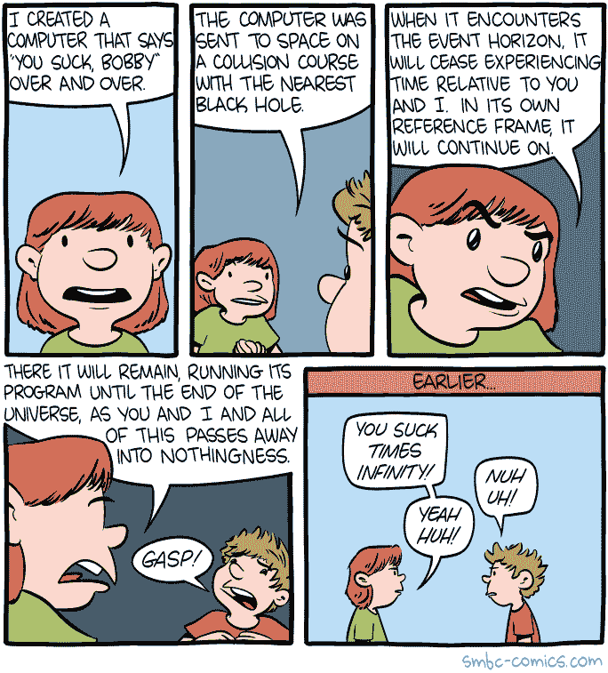

# 100%正确的编码风格指南

> 原文：<https://www.freecodecamp.org/news/the-100-correct-coding-style-guide-1862705b18cd/>

这里有三个值得你花时间的链接:

1.  100%正确的编码风格指南( [4 分钟阅读](http://bit.ly/2otwNBU))
2.  我写了一个编程语言。你也可以这么做( [10 分钟阅读](http://bit.ly/2o2bzKG))
3.  是的，React 正在接管前端开发。问题是为什么( [14 分钟读完](http://bit.ly/2n4g9J7)

额外收获:在过去的 13 年里，“语法义务警员”一直在秘密纠正布里斯托尔标牌上的错误语法

### 想到这一天:

> “外行黑系统，内行黑人。”—布鲁斯·施奈尔

### 今日趣事:

网络漫画作者[周六早餐麦片](http://bit.ly/2nP6za7)

### 今日学习小组:

[约翰内斯堡自由代码营](http://bit.ly/2opU0Fy)

编码快乐！

–昆西·拉森，自由代码营的老师

如果你从这封邮件中获得了价值，考虑一下[支持我们的非营利组织](http://bit.ly/donate-to-fcc)。