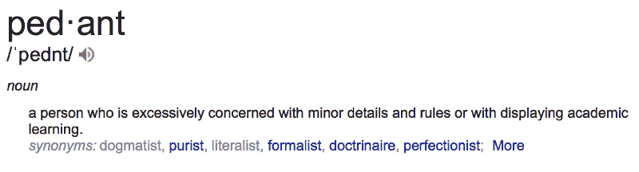
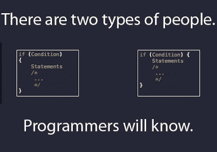
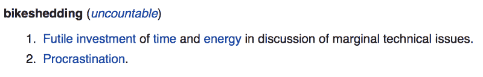

# 100%正确的编码风格指南

> 原文：<https://www.freecodecamp.org/news/the-100-correct-coding-style-guide-5b594a1655f0/>

[Photo credit](https://commons.wikimedia.org/wiki/File:Slava_Zaitsev_fashion_show-2.jpg)

制表符还是空格？花括号在同一行还是新行？80 字符宽还是 120？

程序员喜欢争论这类事情。tabs vs. spaces 的辩论甚至成为 HBO 节目*硅谷*T3[的著名剧集。](https://youtu.be/SsoOG6ZeyUI)

在这篇文章中，我将最终给你你所寻求的明确答案。

在我职业生涯的早期，我参与了各种各样的圣战。我会读一些关于为什么一个特定的惯例是正确的，而另一个是完全错误的文章。我会趾高气扬地站在那里，向任何愿意倾听的人宣布，他们错了，我是对的。

我花了很多年才找到正确的答案，但我终于找到了，结果答案是…

这些事情都不重要。

一致性很重要。可读性很重要。争论和强调一个公约胜过另一个公约无关紧要。

在过去的 20 多年里，我追随了每一个可以想象的趋势。我遵循不同语言的不同惯例。这些都没有影响我的 bug 数量，也没有让我的代码更有效率。

This is just sillyness. Still funny though.

不要误解我的意思，随着时间的推移，外观整洁、格式良好的代码将更容易更改和维护，这是一件好事。

希望你的代码看起来漂亮也没什么错。但是太多的时候，这被用来为本质上归结为拖延的事情辩护。

我们这样拖延是因为编码很难。事情可能会在一瞬间变得复杂，我们——尤其是那些可能不熟悉这种复杂程度的人——可能会被这种复杂性吓倒，并对自己驾驭它的能力变得不自信。

为鸡毛蒜皮的小事争论要安全得多。我们认为的无能不太可能以这种方式暴露出来。

争论琐事以回避难题的现象如此普遍，以至于有许多流行的理论来描述它。

其中最流行的是*琐碎的帕金森定律*,它指出一个组织的成员对琐碎的事情给予不相称的重视。

为了说明这一定律，帕金森用了一个虚构的例子，一个委员会的工作是批准一个新的核电厂的计划，但他们花了大部分时间争论员工自行车棚用什么材料。他们忽略了提议的工厂设计本身，这是一个更重要也更复杂的问题。

因为在这个典型的例子中提到了自行车棚，丹麦开发商 Poul-Henning Kamp 后来创造了“自行车棚效应”一词或简称为“自行车脱落”来描述它。

如果你从事软件开发——尤其是如果你和其他程序员在社交媒体上闲逛——你可能几乎每天都会遇到某种形式的自行车脱落。

Say what you will, but I think grey is a lovely color for a bike shed.

如果你发现自己正在与你的程序员同事进行异常激烈的辩论，无论是在线的还是面对面的，或许也值得记住塞尔定律

> "在任何争论中，感情的强烈程度与利害攸关的问题的价值成反比。"

作为一名顾问，我从一个客户到另一个客户，每个客户都有自己的规则和惯例。我很久以前就决定，我成功的唯一途径是放下琐事，专注于困难的问题。当涉及到编码标准时，我接受我所得到的，我不会感到不安。

如果你碰巧发现自己可以选择自己的风格指南，我建议你问自己这两个简单的问题:

1.  有没有工具可以自动将样式规则应用到我的代码中，而几乎不需要我的干预？
2.  声誉良好的组织是否积极维护和/或使用这些工具和底层风格？

如果你对这两个问题都回答“是”，那么你就可以开始了。就这么简单。

以下是一些适合当今一些更流行的网络语言的选项:

[**. net 代码格式化程序**](https://github.com/dotnet/codeformatter)

[**Java:Google-Java-Format**](https://github.com/google/google-java-format)

[**Javascript 标准样式**](https://standardjs.com) **(注意，这是产品名称，不是实际的、官方的 Javascript 标准)**

[**PHP 编码标准 Fixe** r](http://cs.sensiolabs.org)

[**Python:谷歌的 YAPF**](https://github.com/google/yapf/)

[**Ruby: Rubocop**](http://rubocop.readthedocs.io/en/latest/)

如果你喜欢这篇文章，请反复点击文章底部的拍手图标来帮助传播。如果你想阅读更多类似的东西，请注册下面我的每周开发掌握时事通讯。