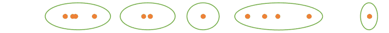
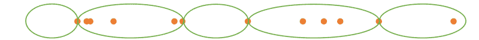
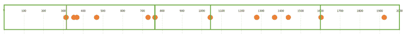
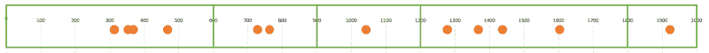
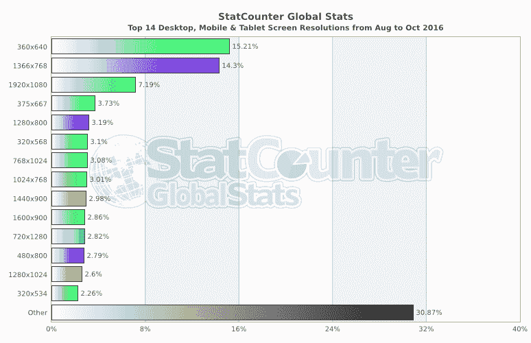
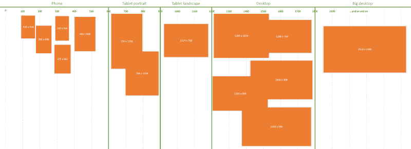
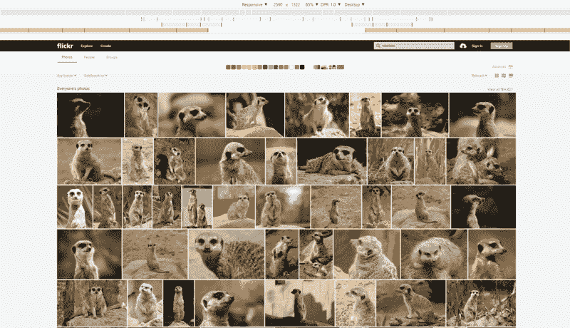

# 处理 CSS 断点的 100%正确的方法

> 原文：<https://www.freecodecamp.org/news/the-100-correct-way-to-do-css-breakpoints-88d6a5ba1862/>

大卫·吉尔伯森

# 处理 CSS 断点的 100%正确的方法


在接下来的一分钟左右，我希望你们忘记 CSS。忘了网络开发吧。忘掉数字用户界面吧。

当你忘记这些事情的时候，我希望你允许你的思想游荡。回到过去。回到你的青春。回到你上学的第一天。

那是一个更简单的时代，那时你所要担心的只是画形状和控制大小便失禁。


看看上面的点。注意它们中的一些是如何聚集在一起的，一些是如何散开的？我要你做的是把他们分成五组，你觉得合适就分成五组。

去吧。在确认没有人在看之后，用你孩子般的手指在五组中的每一组周围画一个圈。

你可能想出了类似下面的东西，对吗？(无论你做什么，不要告诉我你没有做练习就向下滚动。我将面对手掌。)



当然，右边的两个点可能是任何一种方式。如果你把它们组合在一起，我想没问题。他们说没有错误的答案，但我从来没有错过，所以我从来没有接受过这种陈词滥调。

在我继续之前，你画了类似下面的东西吗？



大概不会。对吗？

但是，如果您将断点设置在与流行设备(320px、768px、1024px)的宽度完全匹配的位置，那么这基本上就是您要做的事情。



下面的话有没有进入你的耳朵或离开你的嘴？

> “中断点*是达到* 768px，还是包含 768？我明白了…那是 iPad 的风景，还是“大”的？哦，大号是 768px *及以上。*我明白了。而小就是 320px？这个从 0 到 319px 的范围是什么？蚂蚁的断点*？”*

*我可以继续向您展示正确的断点，然后就此打住。但是我觉得很好奇，上面的方法(“傻分组”)居然这么普遍。*

*为什么会这样呢？*

*我认为这个问题的答案，就像许多问题一样，归结于术语的错位。毕竟，如果你不知道关塔那摩湾的水刑是什么，那么它听起来就超级棒。(哦[我希望那是我开的玩笑。)](https://www.reddit.com/r/Showerthoughts/comments/2ucx09/waterboarding_at_guantanamo_bay_sounds_super_rad/)*

*我认为我们在讨论和实现断点时混淆了“边界”和“范围”。*

*告诉我，如果你在 Sass 中做断点，你有没有一个叫做`$large`的变量也就是说，768px？*

*那是你所说的大范围的下限，还是上限？如果是更低的，那你肯定没有`$small`因为那应该是`0`吧？*

*如果是上边界，那么如何定义断点`$large-and-up`？那一定是一个`min-width`为`$medium`的媒体查询吧？*

*如果你说的“大”只是指一个界限，那么我们以后会感到困惑，因为媒体查询总是一个*范围*。*

*这种情况很糟糕，我们在浪费时间考虑它。所以我有三个建议:*

1.  *正确获得您的休息点*点数**
2.  *明智地命名您的*范围**
3.  *声明性*

### *技巧 1:获得正确的断点*

*那么有哪些*右*断点呢？*

*你幼儿园时的自己已经画了圈了。我给你把它们变成长方形。*

**

*600 像素，900 像素，1200 像素和 1800 像素，如果你打算给巨型显示器的人一些特别的东西。顺便说一句，如果你在网上订购一个巨型显示器，一定要注明是为电脑定制的。你不会想在邮件中收到一只巨大的蜥蜴。*

*你通灵的年轻自我一直在玩的那些点实际上代表了 14 种最常见的屏幕尺寸:*

*

[image credit](http://gs.statcounter.com/#desktop+mobile+tablet-resolution-ww-monthly-201608-201610-bar)* 

*因此，我们可以制作一个漂亮的小图片，允许装扮成商务人士、设计师、开发人员和测试人员的人们之间轻松交流。*

*

I’m regretting my choice of orange and green, but I’m not redoing all of these pictures now.* 

### *提示 2:合理命名你的范围*

*当然，如果你愿意，你可以把你的断点命名为熊爸爸和熊宝宝。但是如果我要和设计师坐下来讨论网站在不同设备上的外观，我希望它能尽快结束。如果命名一个尺寸的*肖像写字板*有助于这一点，那么我就被卖了。见鬼，我甚至原谅你称它为“iPad 肖像”*

*“但情况正在发生变化！”你可以喊。“手机越来越大，平板电脑越来越小！”*

*但是你网站的 CSS 大概有三年的保质期(除非是 Gmail)。iPad 已经出现了两倍的时间，它还没有被废黜。我们知道苹果不再生产新产品，他们只是从现有产品中去掉一些东西(按钮、孔等)。*

*伙计们，1024 x 768 将永远存在。让我们不要逃避现实。(有趣的事实:鸵鸟不生活在城市里，因为那里没有沙子，因此没有地方躲避捕食者。)*

*结论:沟通很重要。不要故意远离有用的词汇。*

### *技巧 3:声明性*

*我知道，我知道，又是“陈述性”这个词。我换一种说法:你的 CSS 应该定义*它想要发生什么*，而不是*它应该如何发生*。“如何”属于隐藏在某种混合体中。*

*如前所述，围绕断点的混乱部分是定义范围的*边界*的变量被用作范围的*名称*。`$large: 600px`如果`large`是一个范围，那就毫无意义。这和说`var coordinates = 4;`是一样的。*

*因此，我们可以将这些细节隐藏在 mixin 中，而不是暴露在代码中使用。或者我们可以做得更好，完全不用变量。*

*首先，我做了下面的片段作为一个简化的例子。但我真的认为它涵盖了所有的基础。为了看到它的实际效果，[看看这支笔](http://codepen.io/davidgilbertson/pen/aBpJzO)。我使用 Sass 是因为我无法想象没有它建立一个网站。这个逻辑同样适用于 CSS 或更少的内容。*

```
*`@mixin for-phone-only {
  @media (max-width: 599px) { @content; }
}
@mixin for-tablet-portrait-up {
  @media (min-width: 600px) { @content; }
}
@mixin for-tablet-landscape-up {
  @media (min-width: 900px) { @content; }
}
@mixin for-desktop-up {
  @media (min-width: 1200px) { @content; }
}
@mixin for-big-desktop-up {
  @media (min-width: 1800px) { @content; }
}

// usage
.my-box {
  padding: 10px;

  @include for-desktop-up {
    padding: 20px;
  }
}`*
```

*请注意，我强迫开发人员指定`-up`或`-only`后缀。*

> *含糊不清会导致混乱。*

*一个明显的批评可能是，这不处理自定义媒体查询。好消息，各位。如果您需要自定义媒体查询，请编写自定义媒体查询。(实际上，如果我需要比上面更复杂的东西，我会减少损失，投入到 Susy 的工具箱中。)*

*另一个批评可能是，我这里有八个混音。当然，单个 mixin 将是明智的做法，然后只传入所需的大小，就像这样:*

```
*`@mixin for-size($size) {
  @if $size == phone-only {
    @media (max-width: 599px) { @content; }
  } @else if $size == tablet-portrait-up {
    @media (min-width: 600px) { @content; }
  } @else if $size == tablet-landscape-up {
    @media (min-width: 900px) { @content; }
  } @else if $size == desktop-up {
    @media (min-width: 1200px) { @content; }
  } @else if $size == big-desktop-up {
    @media (min-width: 1800px) { @content; }
  }
}

// usage
.my-box {
  padding: 10px;

  @include for-size(desktop-up) {
    padding: 20px;
  }
}`*
```

*当然，那行得通。但是如果传入一个不支持的名称，就不会出现编译时错误。传入一个 sass 变量意味着暴露 8 个变量来传递给 mixin 中的一个开关。*

*更不用说语法`@include for-desktop-up {...}`比`@include for-size(desktop-up) {...}`好看多了。*

*对这两段代码的批评可能是我输入了两次 900px 和 899px。当然，我应该只使用变量，并在需要时减去 1。*

*如果你想这么做，那就疯狂吧，但有两个原因我不会这么做:*

1.  *这些都不是经常变化的东西。这些也不是代码库中其他地方使用的数字。没有问题是由它们不是变量这一事实引起的——除非您想将您的 Sass 断点暴露给一个脚本，该脚本将带有这些变量的 JS 对象注入到您的页面中。*
2.  *当你想用 Sass 把数字转换成字符串时，语法是令人讨厌的。以下是你为相信重复一个数字是万恶之首而付出的代价:*

```
*`@mixin for-size($range) {
  $phone-upper-boundary: 600px;
  $tablet-portrait-upper-boundary: 900px;
  $tablet-landscape-upper-boundary: 1200px;
  $desktop-upper-boundary: 1800px;

  @if $range == phone-only {
    @media (max-width: #{$phone-upper-boundary - 1}) { @content; }
  } @else if $range == tablet-portrait-up {
    @media (min-width: $phone-upper-boundary) { @content; }
  } @else if $range == tablet-landscape-up {
    @media (min-width: $tablet-portrait-upper-boundary) { @content; }
  } @else if $range == desktop-up {
    @media (min-width: $tablet-landscape-upper-boundary) { @content; }
  } @else if $range == big-desktop-up {
    @media (min-width: $desktop-upper-boundary) { @content; }
  }
}

// usage
.my-box {
  padding: 10px;

  @include for-size(desktop-up) {
    padding: 20px;
  }
}`*
```

*哦，因为我在最后几段中采取了咆哮的语气…我很同情那些做一些神奇的事情的傻瓜，比如在 Sass 列表中存储断点并循环它们以输出媒体查询，或者类似的荒谬的事情，未来的开发人员将很难破译。*

> *复杂性是错误隐藏的地方。*

*最后，您可能会想“我不应该基于内容而不是设备设置断点吗？”。嗯，我很惊讶你能做到这一步，答案是肯定的…对于单一布局的网站。或者如果您有多个布局，并且乐于为每个布局设置不同的断点。哦，如果你的网站设计不经常改变，或者当你的设计更新时，你很乐意更新你的断点，因为你会希望*根据内容保持*它们，对吗？*

*对于复杂的站点，如果你选择一些断点在站点中使用，事情会简单得多。*

*我们完了！但是这个帖子并没有像我希望的那样毛茸茸的，让我看看我是否能想出一个借口来包含一些…*

*哦，我知道了！*

### *断点开发的额外提示*

*

Yes, even flickr has breakpoints at 768 and 1400* 

1.  *如果你需要体验屏幕尺寸大于你所坐的显示器的 CSS 断点，使用 Chrome DevTools 中的“响应”模式，输入你喜欢的任何大尺寸。*
2.  *蓝色条显示“最大宽度”介质查询，橙色条显示“最小宽度”介质查询，绿色条显示具有最小值和最大值的介质查询。*
3.  *单击媒体查询会将屏幕设置为该宽度。如果您多次单击绿色媒体查询，它会在最大和最小宽度之间切换。*
4.  *右键单击媒体查询栏中的媒体查询，转到 CSS 中该规则的定义。*

*嘿，感谢阅读！请说出你的想法，我很乐意听听。如果你认为我值得，就点一下那个小心脏，或者让它空着，就像我的自我价值感一样，如果你不这样做。*