# 2018 年新程序员调查:31，000 人告诉我们他们如何学习编码并获得开发工作

> 原文：<https://www.freecodecamp.org/news/the-2018-new-coder-survey-31-000-people-told-us-how-theyre-learning-to-code-and-getting-dev-jobs-e10feb9ed419/>

超过 31，000 人回应了我们 2018 年的新编码器调查，让研究人员前所未有地了解了成年人是如何学习编码的。

我们已经在一个公共的 GitHub 库上发布了参与者对超过 50 个问题的个人回答的整个数据集——在开放数据公共许可下。

在接下来的几个月里，数十名数据科学家将仔细研究这些数据，发现关于学习编码的人的各种见解。

现在，我将从高层次向您介绍这些新程序员是谁，他们是如何学习的，以及他们的目标是什么。

### 谁参加了？

超过 31，000 名新程序员参与了此次调查。这些人从事编码工作不到 5 年。

以下是关于它们的一些高级事实:

*   其中 67%的人生活在美国以外
*   他们的平均年龄大约是 30 岁
*   21%的女性
*   四分之一的人认为自己是本国少数民族的一员
*   8% 是退伍军人
*   他们平均已经编码了 **21 个月**
*   **17%** 已经获得了他们的第一份开发人员工作

### 学习者目标和方法

其中 40%的人想做自由职业者或者自己创业。

他们中的大多数都对 web 开发人员感兴趣，但也对各种各样的开发人员专业化感兴趣。

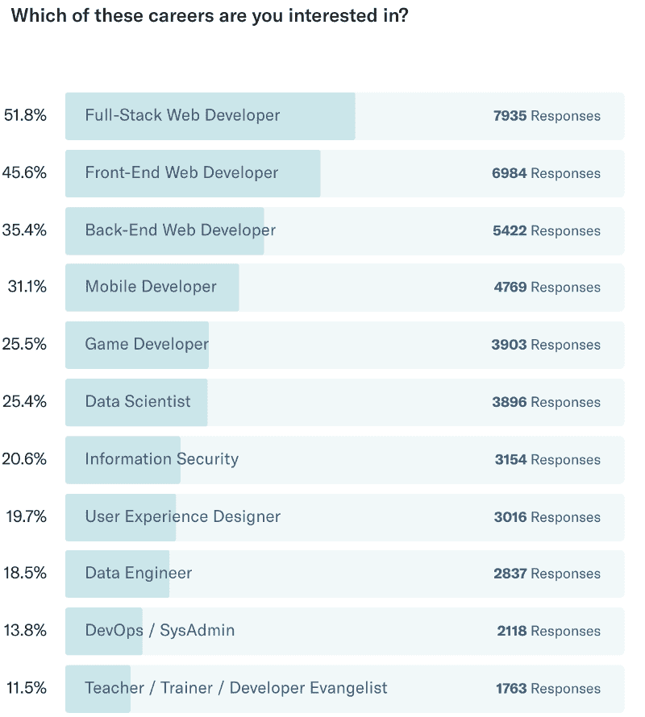

在尚未从事开发工作的受访者中，58%的人计划在未来 12 个月内开始申请工作。

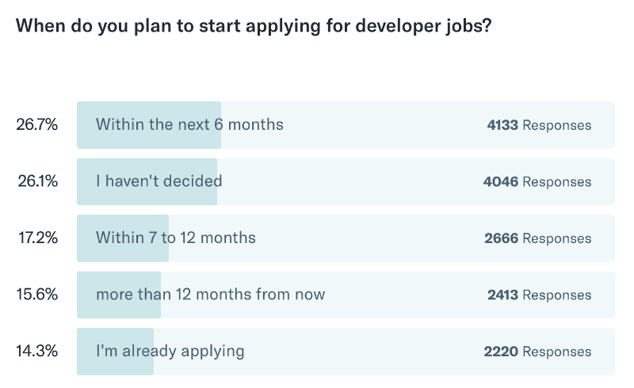

47%的人更喜欢在办公室工作，而不是远程工作——低于去年的 50%。

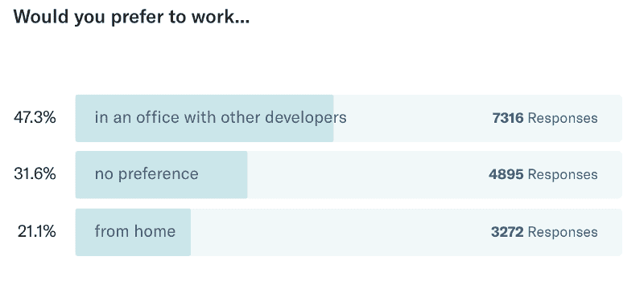

其中 76%的人愿意为了新的工作而搬迁。

### 学习资源

大多数新程序员报告使用各种在线学习资源。

但是只有不到一半的人亲自参加过与编码相关的活动。

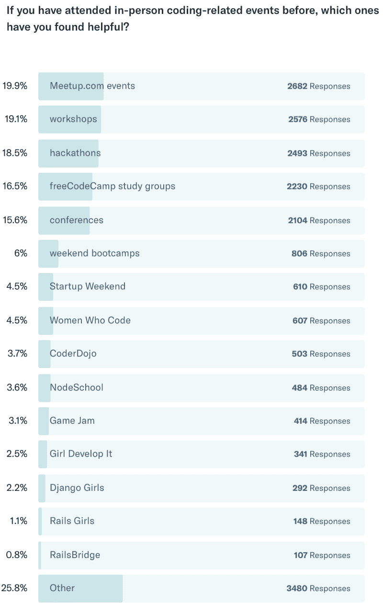

大多数新程序员还没有开始听播客，但是那些听了很多播客的人。

四分之三的新编码员观看编码相关的 YouTube 视频。

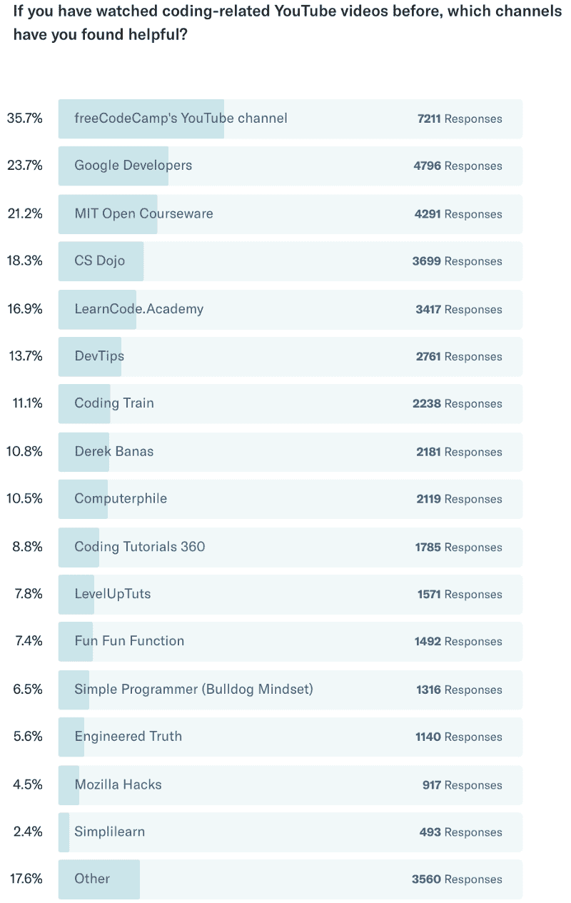

大约 3%的新程序员参加过密集的编码训练营。

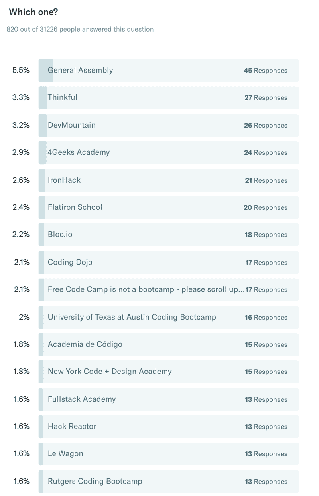

参加训练营的受访者中有 30%的人不得不贷款。尽管如此，76%的受访者表示，他们会向朋友推荐他们的训练营。

### 人口统计学和社会经济学

我们有来自 195 个不同国家的受访者。

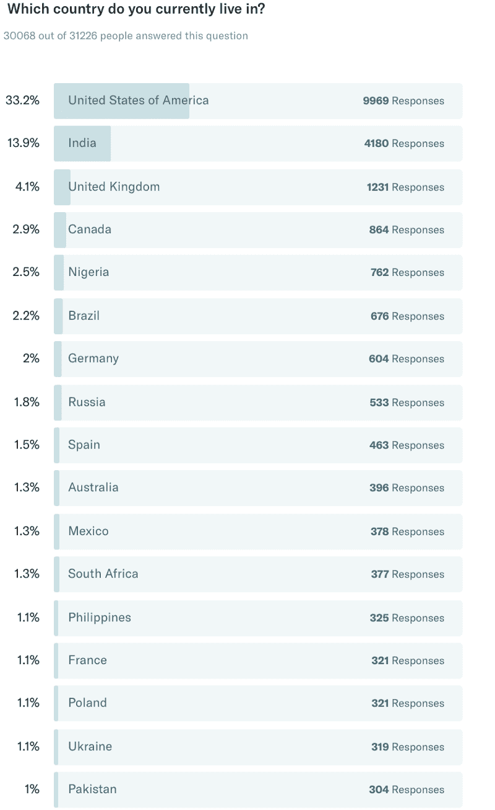

他们大多数住在大城市。

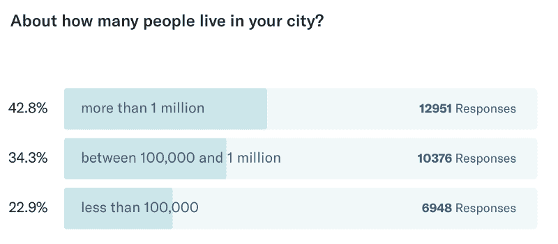

他们中的大多数是非英语母语者。他们从小说 200 多种不同语言中的一种。

只有大约一半的新程序员拥有学士学位或更高学位。

这些上过大学的新程序员学习 600 多个不同专业中的一个——其中大多数与技术无关。

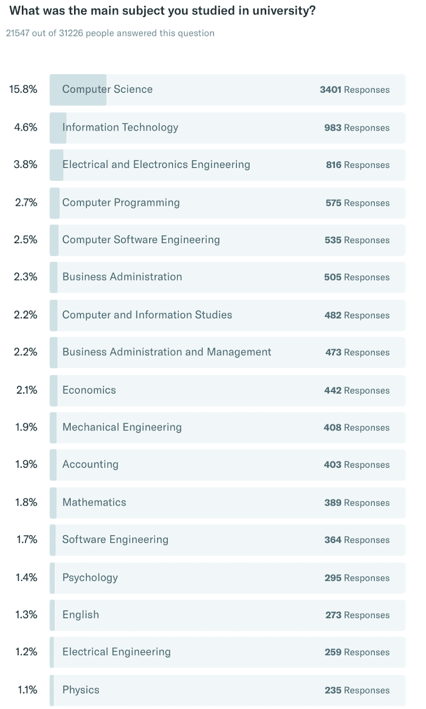

三分之二的人目前在从事某种工作。

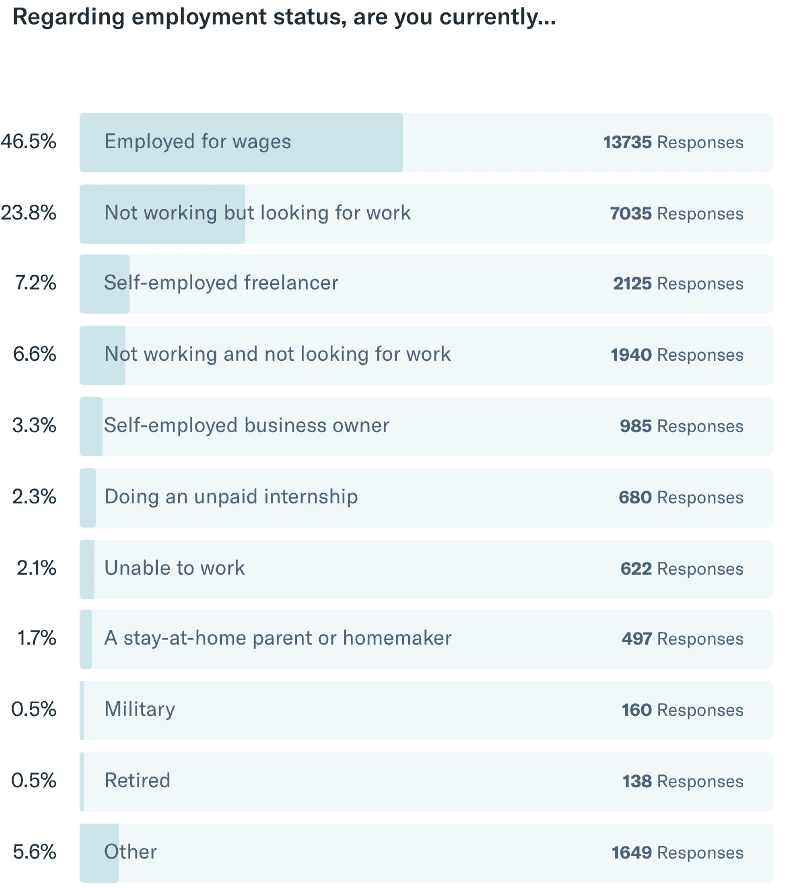

一半已经在技术相关领域。

他们中的大多数人花大量的时间上下班。

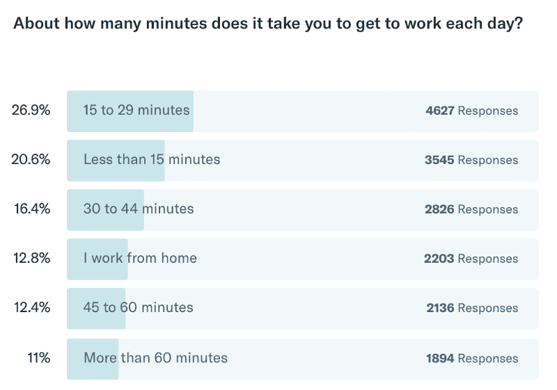

三分之二的新程序员是单身。

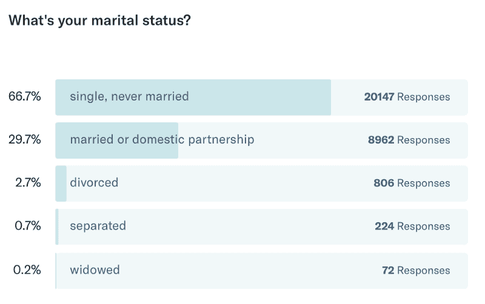

约 1/3 的受访者照顾被抚养人。16%的人有孩子，8%的人在照顾老年亲属或残疾亲属。

48%的人认为自己就业不足(从事低于其教育水平的工作)。

20%有学生贷款债务。

16%的人家里还没有高速互联网。

3%的人目前正从政府领取残疾津贴。

这些人正在学习编码。

您可以看到免费的、自定进度的学习资源为何如此重要。

freeCodeCamp.org 是一个小型非营利组织，帮助数百万人免费学习编程。

[成为支持者](https://donate.freecodecamp.org)。你每月 5 美元的捐款将有助于保持技术教育的免费和开放。

### 下一步是什么？

我们正在对所有 31，000 多条记录进行清理和规范化。我们的社区将使用这些来构建数据可视化，以回答一系列不同的问题。

如果您对分析该数据集或构建自己的可视化感兴趣，[加入我们的数据科学聊天室](https://gitter.im/FreeCodeCamp/DataScience)并介绍自己。