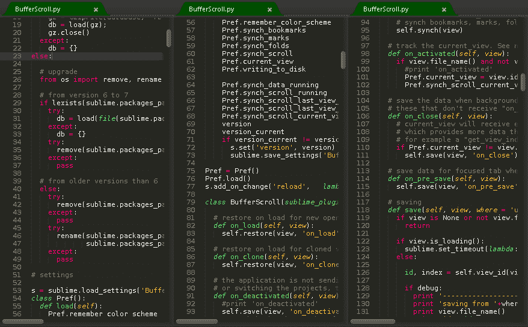
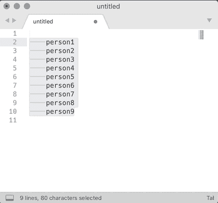
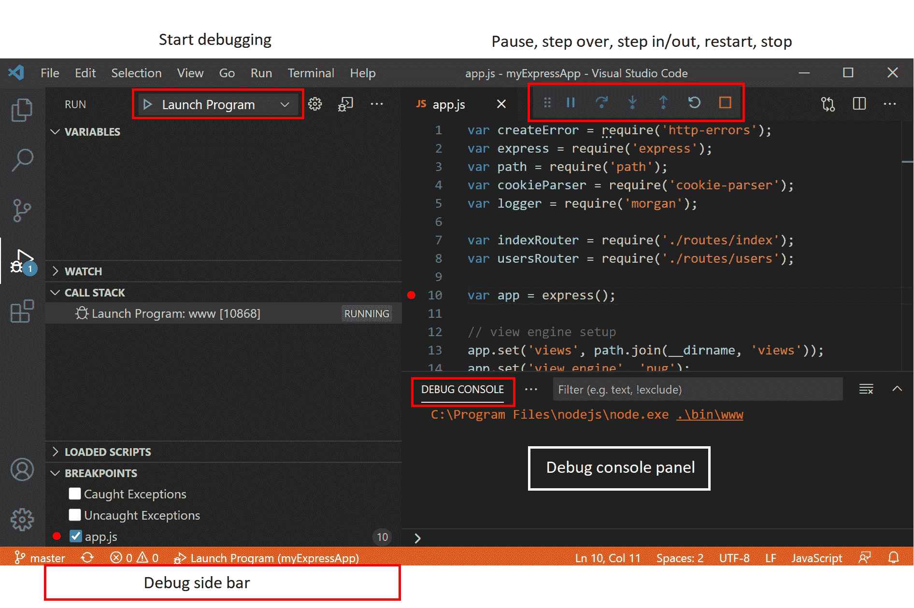
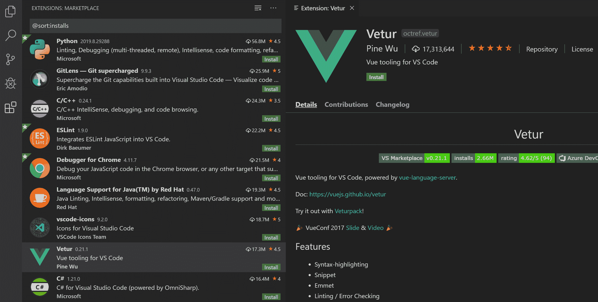
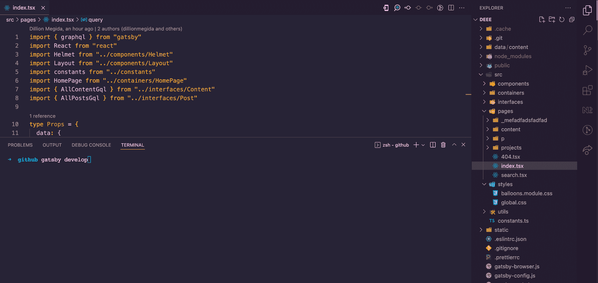
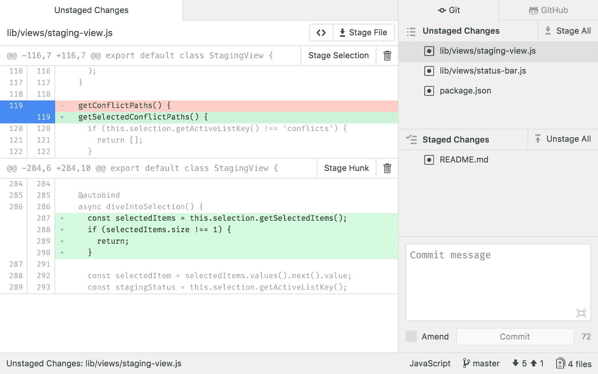
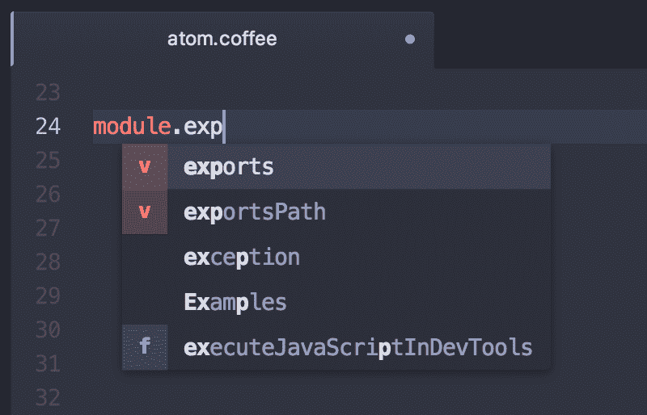
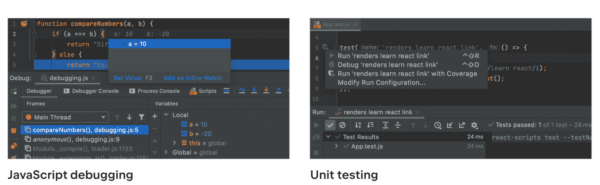
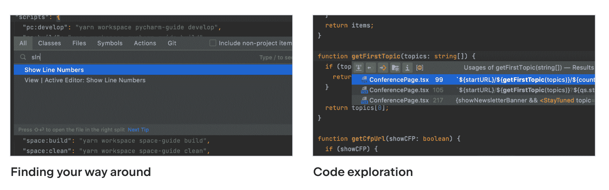
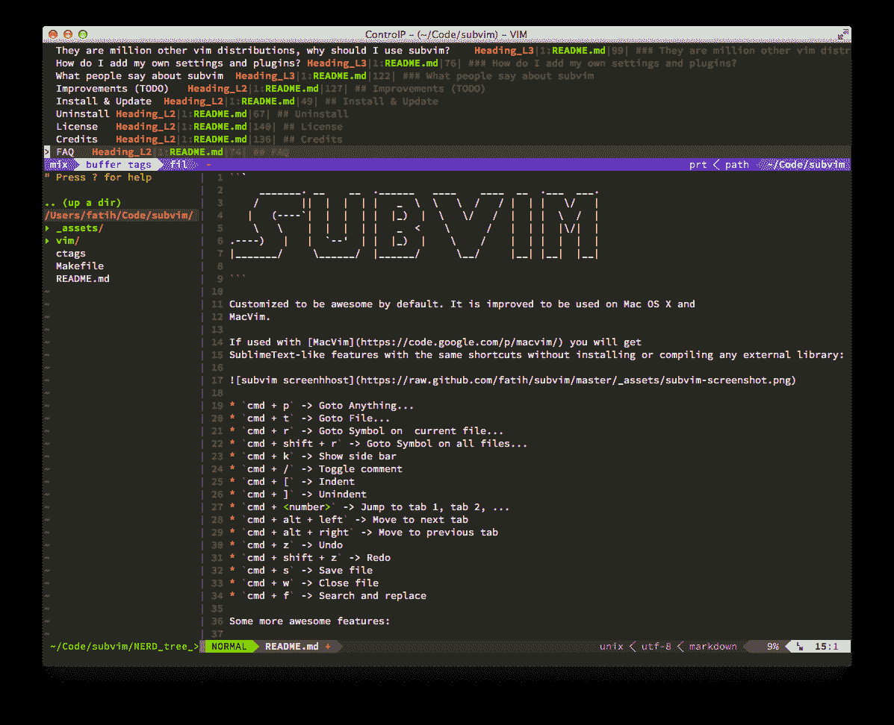

# 5 款最佳 Mac 代码编辑器——Mac OS 文本编辑器指南

> 原文：<https://www.freecodecamp.org/news/the-5-best-code-editors-for-mac-macos-text-editor-guide/>

当你编码时，你写的是不同语言编译器可以执行的各种文本。让这段文字变得有趣和容易写的是我们使用的编辑器。

不同的编辑器有不同的功能。但是他们有一个共同的目标:让编写代码更容易——更容易编写、调试和阅读。

在这篇文章中，我们将看看五个代码编辑器，它们可以改进您的 Mac 设备上的开发。

## 1.崇高的文本

Sublime Text 是一个轻量级的编辑器，有很多特性可以改善你的代码编写体验。以下是它的一些特点:

### 多个视图窗格

[Multiple view panes](https://forum.sublimetext.com/t/follow-mode-for-sublime/5100/4)

Sublime Text 为编写代码提供了多个视图窗格。这样，您可以一次查看多个文件。

更有趣的是，你可以在两个窗格中打开同一个文件。当您在具有长代码行的文件中编写代码时，这个特性会很有帮助，因为您可以滚动到一个窗格的顶部，然后在另一个窗格的底部编写代码。

### 类型定义的并排视图

Sublime Text 并不只是在一个小弹出窗口中查看类型定义或打开覆盖当前视图的定义文件，而是为当前文件中的类型提供定义文件的并排视图。

### 多重选择

[Multi-Line Selection Text Entry with Sublime Text](https://medium.com/sweetmeat/multi-line-selection-text-entry-with-sublime-text-77f226812324)

多选有两种形式:多选相同的字符或不同的字符。

#### 相同字符选择

假设您想在多个地方重命名一个文字(变量、函数等等)。Sublime Text 允许您突出显示该文字，并且使用`Ctrl/Cmd D`您可以选择该文字的其他实例并编辑、替换或做您想做的事情。

#### 不同字符选择

也许有些字面值拼写不同，但你想突出他们在一起。Sublime 允许你用鼠标一次高亮显示许多东西，并根据你的选择对它们进行操作。

## 2.虚拟代码

[VSCode](https://code.visualstudio.com/) 编辑器提供了语法光、[智能感知](https://code.visualstudio.com/docs/editor/intellisense#:~:text=IntelliSense%20is%20a%20general%20term,%2C%20and%20%22code%20hinting.%22)特性(自动完成、代码提示等等)、定制配置以及不同插件的空间。VSCode 还允许多重选择和多重视图窗格。

以下是 VSCode 的更多特性:

### 代码调试

使用 VSCode，您不需要在浏览器或其他工具上进行调试。

[Debugging in Visual Studio Code](https://code.visualstudio.com/docs/editor/debugging)

VSCode 允许您使用断点、调用堆栈甚至交互式控制台直接从编辑器中进行调试。

### 不同事物的许多扩展

VSCode 为不同的语言、框架甚至你的编辑器提供了一个巨大的市场。您拥有美化编辑器外观和体验的扩展，以及在编写代码时帮助自动完成的工具。

[Managing Extensions in Visual Studio Code](https://code.visualstudio.com/docs/editor/extension-marketplace)

### 内置终端

有了 VSCode，您就有了一个内置的 shell 终端，您可以在其中执行命令，而无需离开编辑器转到不同的终端应用程序。

The terminal view of VSCode

小屏幕可能会使您的编辑视图变小，有点不方便，但例如，使用大显示器，视图还可以。

VSCode 还有多个视图窗格、字符选择和多个字符替换。

## 3.原子

Atom 是一个高度可定制的代码编辑器。这就是该团队称之为“可破解文本编辑器”的原因。从编辑器上的外观和颜色到命令的组合键和许多其他东西，您可以随心所欲地定制 Atom，使其非常个性化。

以下是一些功能:

### 实时代码协作

[Teletype for Atom](https://teletype.atom.io/)

Atom 有一个[电传打字](https://teletype.atom.io/)功能，允许多人实时处理一个代码库。此功能改善了项目团队工作区中的协作。对于 VSCode，通常需要一个扩展。

### Git 集成

有了 Atom，您就再也不用去终端进行 Git 操作了。

[GitHub for Atom](https://github.atom.io/)

Git 操作使用 GitHub 包集成到 Atom 中，这在您编写代码时创建了一个流畅的版本控制体验。

### 智能自动完成

随着许多语言和语法集成到 Atom 中，在编写代码时，您还可以获得很好的自动完成特性。

[Autocomplete (atom.io)](https://flight-manual.atom.io/using-atom/sections/autocomplete/)

您不必再键入那些长方法和变量名。Atom 很聪明，可以帮你避免这种情况😉。

在 Atom 中，您还可以使用搜索和替换功能、视图窗格等等。

## 4.网络风暴

[WebStorm](https://www.jetbrains.com/webstorm/) 自称“最聪明的 JavaScript IDE”。这样称呼自己需要很大的自信，而 WebStorm 确实做到了。WebStorm 使得编写 JavaScript 及其相关技术不仅方便，而且更令人愉快。

一些功能包括:

### 内置开发人员工具

WebStorm 从字面上理解“开发编辑器”这个名字。从运行脚本到断点和一般调试，WebStorm 提供了允许您编写、执行和调试代码的开发工具。

[WebStorm: Integrated Developer Tools](https://www.jetbrains.com/webstorm/features/#integrated-developer-tools)

### 智能功能

这个编辑器允许你在文件夹之间无缝地移动文件。它还帮助您重构代码，并为错误提供修复建议。

我最喜欢的一个特点是，你可以很容易地在你的应用程序中重命名一个特定的变量。假设您在许多文件中导入了一个变量——您可以很容易地从其中一个文件中重命名该变量。

### 快速搜索和导航

人们普遍称赞的 WebStorm 的另一个奇妙特性是快速的文件或文件夹搜索和导航。

[WebStorm: Navigation and Search](https://www.jetbrains.com/webstorm/features/#navigation-and-search)

通过搜索文件名、类名、文件中的函数名和特殊的选择器，您可以很容易地找到您要找的文件。

WebStorm 中还有协作、视图窗格、搜索和替换功能。

## 5.精力

还有 [Vim](https://www.vim.org/) 。值得注意的是，Vim 并不适合所有人，因为它有一个陡峭的学习曲线——但 Vim 有许多特性值得尝试。我有一个朋友，他永远不会放弃 Vim，并一直主张人们正在错过。

以下是一些功能:

### 高度可定制性

我前面提到 Atom 是高度可定制的，但我认为它没有 Vim 灵活。

[Vim customized to be like SublimeText](https://github.com/fatih/subvim)

下至低级命令和编辑器的感觉，您可以配置许多东西，这使得使用另一个编辑器对您来说非常陌生。您还可以创建脚本来为您实现自动化。

### 支持多种语言和文件格式

Vim 支持多种语言和不同类型的文件。它还集成了许多工具。

### 强大的搜索功能

通过强大的选择器和正则表达式，你可以进行多层次的文件搜索和替换。使用 Vim 的脚本，您还可以获得将搜索功能提升到另一个水平的插件。

同意，不是很好学。但令人惊讶的是，它的功能非常强大，占用的内存也更少。它还有一个扩展的[脚本系统](https://www.vim.org/scripts/script_search_results.php)，在编写代码时给你很大的权力。

## 包扎

现在你有了它——五个代码编辑器，你可以用它们来编写更干净、更易读的代码。希望你找到最符合自己需求的！

感谢阅读:)