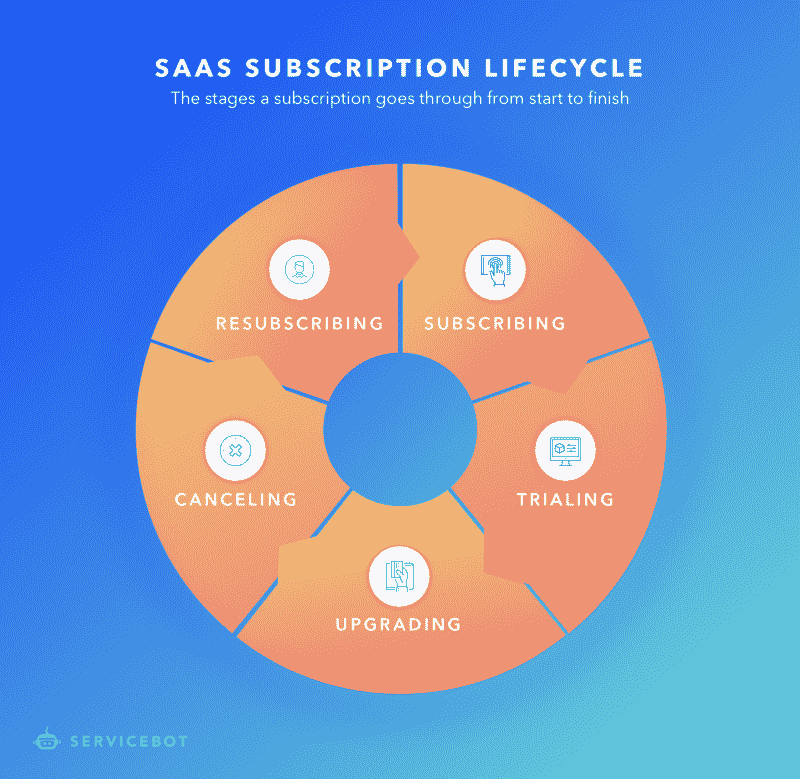
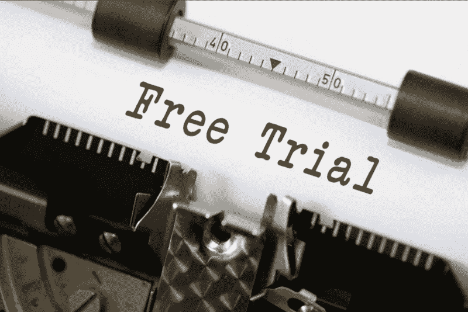
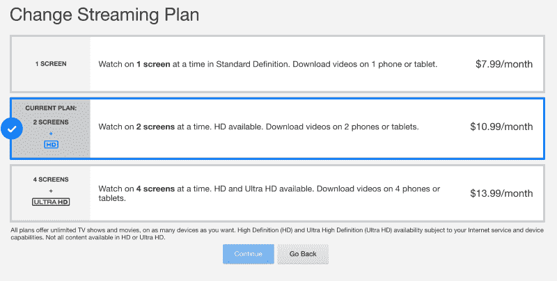

# SaaS 订阅的 5 个阶段

> 原文：<https://www.freecodecamp.org/news/the-5-stages-of-a-saas-subscription-5169307fd0c8/>

本文将详细介绍为了让您的 SaaS 公司拥有一个功能性订阅计费解决方案，您需要实现哪些自动化。

SaaS 公司在销售订阅时面临的一个问题是将他们的应用程序连接到计费流程。

需要考虑的一些事情是:

*   如何处理取消
*   免费试用
*   授予新客户访问权限

管理这些计费流程的挑战是处理这些事件，例如，当试用到期或帐户不再有有效的资金来源时，限制对应用程序的访问。

### SaaS 订阅生命周期

客户在与 SaaS 公司做生意时所经历的过程可以分为上述五个事件。管理这些事件是将计费系统与 SaaS 集成的关键。

#### 订阅？

这是用户订阅之旅的第一步。在此步骤中，客户刚刚注册了一个订阅，这需要触发一个自动化流程。

该过程通常如下所示:

1.  一位客户订购了您的应用程序。
2.  客户被授权访问您的应用程序。
3.  试用期结束后(如果有免费试用期)，客户将重复付费。

从 DevOps 的角度来看，这些被认为是“**第 1 天**的操作。这些是服务在被请求后所经历的步骤，以便被认为是“供应的”，例如软件的安装和配置。

#### 培养

在试用阶段，客户已经订购了一项服务，但在试用期到期之前不会付费。

大约 75%的 SaaS 公司提供免费试用。尽管免费试用几乎肯定会给你带来更多付费客户，但提供免费试用的一个更棘手的问题是，当试用到期而客户没有增加资金来源时，要决定会发生什么。

在服务生命周期的这个阶段，公司需要围绕试用建立逻辑，在到期时，限制对应用程序的访问，并提醒客户他们需要付费。

#### 升级？

Netflix offers different tiers

许多 SaaS 企业支持多层服务。如果客户支付额外费用，他们可以获得额外的功能。这被认为是“ **Day 2** ”操作，即在提供服务后采取的会影响最终用户的措施。

通常，它遵循以下模式:

1.  客户提交了升级其订阅的请求。
2.  客户的订阅费率将会提高。
3.  客户将被授权访问应用程序中的新功能。

虽然这通常采取严格的定价等级的形式，但有时客户会“按用户每月”付费，或者有“阈值”，如果超过阈值，将会触发更高的费率。

#### 取消❌

不可避免的，会有订阅的取消，也被称为[搅动](http://chaotic-flow.com/saas-metrics-faqs-what-is-churn/)。完成取消的步骤如下:

1.  客户请求取消 SaaS 套餐。
2.  他们将不再重复收费。
3.  对应用程序的访问将在当前计费周期结束时终止。

在你以前的客户取消订单后联系他们也需要一些过程。建议取消触发一个流程，向以前的客户发送一封自动电子邮件，也许是为了试图恢复客户或进行反馈调查，以了解他们取消的原因。

#### 重新订阅↪️

当以前的客户在取消后决定返回时，公司不能只通过原始流程将他们订阅为新客户，他们需要重新激活以前终止的访问，以便保留所有以前的数据。这个过程可以用三个步骤来描述:

1.  客户通过向其帐户添加有效的资金来源来重新订阅。
2.  对客户账户和数据的访问被重新激活。
3.  客户将再次被重复收费。

一些复杂的场景可能包括针对重新订阅者的限时折扣代码、免费试用，或者作为组合交易一部分的另一项服务的一部分。

### 结论

销售软件即服务的关键是将软件连接到计费系统，该系统可以支持我刚才描述的生命周期。能够自动化这一过程对企业来说是一个福音，因为手动过程是扩展的最大障碍之一。

试图应对 SaaS 计费的挑战？[我们来聊聊](https://servicebot.io/contact)。

我们通过提供能够触发自动化流程的易于集成的挂钩来解决 SaaS 公司在向客户开账单时面临的挑战。