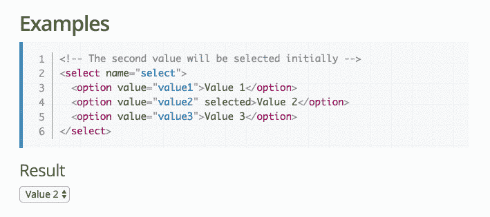
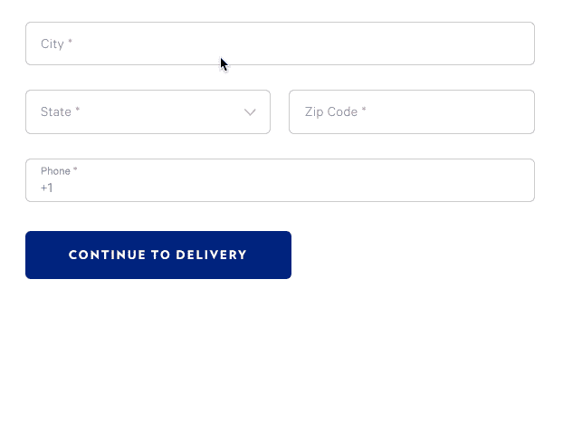
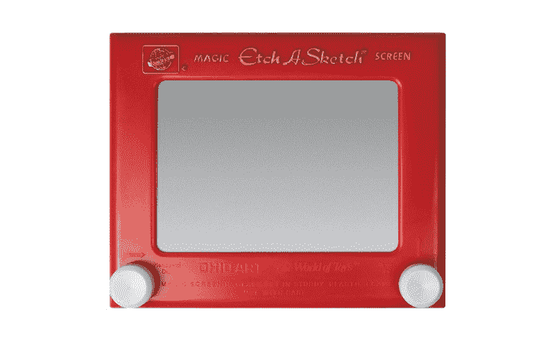
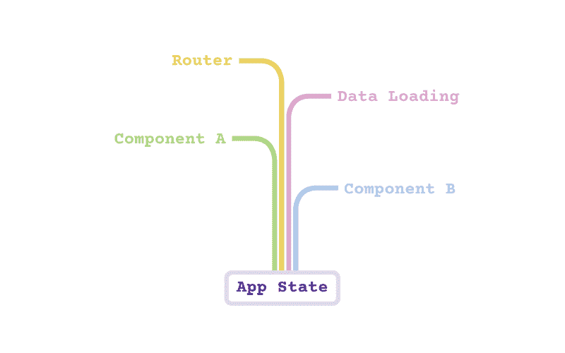
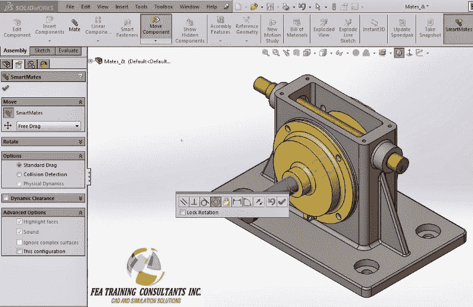

# React 的死亡五指。掌握这五个概念，然后掌握反应。

> 原文：<https://www.freecodecamp.org/news/the-5-things-you-need-to-know-to-understand-react-a1dbd5d114a3/>

萨沙·格里菲

# React 的死亡五指。掌握这五个概念，然后掌握反应。


Side effects of learning React include glowing red hands and being a bad ass ([photo credit](http://wrongsideoftheart.com/2009/12/5-fingers-of-death-tian-xia-di-yi-quan-aka-five-fingers-of-death-aka-king-boxer-aka-the-invincible-boxer-1972-hong-kong/))

几年前，我的朋友肖恩开始告诉我这个名为 [React](https://facebook.github.io/react/) 的全新前端库将如何接管网络。起初，我认为它只是另一种框架时尚。但是后来我开始越来越多地听到 React，以至于我觉得忽略它不再是一个选项。

也许你的处境和我一样:你一直在听说左右反应，但实际上坐下来学习感觉像是一件苦差事。

好消息是，你可以把你需要知道的关于 React 的一切归结为五个关键概念。

不要误解我的意思，这并不意味着我可以立刻把你变成一个反应大师。但至少你会理解所有的主要概念，如果你决定跳进去的话。

这五个关键概念是:

1.  **组件**
2.  **JSX**
3.  **道具&状态**
4.  **组件 API**
5.  **组件类型**

在我们开始之前，请注意我最初是通过 [Wes Bos](http://wesbos.com/) 的课程学习 React 的，并且包含了一些相关链接。只要有可能，我还包含了免费资源的链接。

哦，还有我的朋友肖恩？从那以后，他转向了更前沿的东西。毕竟 React 是*所以* 2015。

### 概念 React 组件如何工作

关于 React，你需要知道的第一件事是，它完全是关于**组件**的。您的 React 代码库基本上只是一大堆调用较小组件的大组件。

但你会问，什么是组件？组件的一个完美例子是普通的`<sele` ct > HTML 元素。它不仅有自己的可视化输出(组成元素本身的灰框、文本标签和向下箭头)，还处理自己的开始和结束逻辑。



The classic `<select>`

现在想象一下，您能够构建自己的自包含定制`<select>`，具有自己的风格和行为:



A fancier version of the good old `<select>`

这正是 React 让你做的。React 组件是一个单独的对象，它不仅像传统的模板一样输出 HTML，而且还包含了控制输出所需的所有代码。

实际上，编写 React 组件最常见的方式是作为一个包含返回 HTML 的`render`方法的 **ES6 类**。(还有一个超级秘密的*功能*方式，但是你必须等到概念 4 才能了解它):

```
class MyComponent extends React.Component {
```

```
 render() {    return <p>Hello World!<p>;  }
```

```
}
```

### 概念 2:JSX 是如何运作的

如您所见，组件方法意味着 HTML 和 JavaScript 代码位于同一个文件中。React 实现这一邪恶联盟的秘密武器是 [JSX 语言](https://facebook.github.io/react/docs/jsx-in-depth.html)(其中“X”代表“XML”)。

JSX 一开始可能看起来很尴尬，但是你很快就会习惯的。

是的，我知道。我们都被教导要在 HTML 和 JavaScript 之间保持严格的分离。但事实证明，稍微放宽这些规则实际上可以为您的前端生产力创造奇迹。

例如，既然您现在已经掌握了 JavaScript 的全部能力，那么您可以通过使用`{...}`在 HTML 中插入一段 JavaScript 来显示当前日期:

```
class MyComponent extends React.Component {
```

```
 render() {    return <p>Today is: {new Date()}</p>;  }
```

```
}
```

这也意味着您将对`if`语句或循环使用普通的 JavaScript，而不是某种特定于模板的语法。JavaScript 的[三元运算符](https://developer.mozilla.org/en/docs/Web/JavaScript/Reference/Operators/Conditional_Operator)在这里特别有用:

```
class MyComponent extends React.Component {
```

```
 render() {    return <p>Hello {this.props.someVar ?  'World' : 'Kitty'}</p>;  }
```

```
}
```

顺便说一句，如果你需要复习 JavaScript 语法的最新知识，我推荐韦斯·博斯的[ES6 for everybody](https://es6.io/friend/STATEOFJS)(如果你喜欢视频)或者尼古拉斯·贝瓦夸的 [Practical ES6](https://ponyfoo.com/books/practical-es6/chapters#toc) (如果你喜欢阅读)。

### 概念 3:道具和状态如何工作

也许你一直想知道上面的`this.props.someVar`变量是从哪里来的。

如果你曾经写过一行 HTML，你可能对 HTML 属性很熟悉，比如`<`；一个>s href。在 React 中，属性被称为**道具(“属性”的简称)。道具是组件之间相互交流的方式。**

```
class ParentComponent extends React.Component {
```

```
 render() {    return <ChildComponent message="Hello World"/>;  }
```

```
}
```

```
class ChildComponent extends React.Component {
```

```
 render() {    return <p>And then I said, “{this.props.message}”</p>;  }
```

```
}
```

正因为如此，React 的数据流是**单向**的:数据只能从父组件流向其子组件，而不能反过来。

尽管有时，组件需要对*不是来自父组件的数据(例如用户输入)做出反应。这就是**状态**出现的原因。*

理解道具和状态之间的区别的一个很好的比喻是蚀刻素描。与 Etch-A-Sketch 平板电脑的机身颜色和表盘位置(**道具**)不同，绘画本身(**状态**)并不是 Etch-A-Sketch 的固有属性。它只是用户输入的临时结果。



Pictured here: your typical React component

注意，组件的**状态**也可以作为**道具**传递给它自己的子组件。你可以把这想象成一条向下流的大河，路由器、数据层和各种组件各自添加自己的小数据流，形成主要的应用状态。



在组件内部，使用`[setState](https://facebook.github.io/react/docs/react-component.html#setstate)`函数管理状态，该函数通常在[事件处理程序](https://facebook.github.io/react/docs/handling-events.html)中调用:

```
class MyComponent extends React.Component {
```

```
 handleClick = (e) => {    this.setState({clicked: true});  }
```

```
 render() {    return <a href="#" onClick={this.handleClick}>Click me</a>;  }
```

```
}
```

实际上，React 应用程序中的绝大多数数据将是一个**道具**。只有当您需要接受用户输入时，您才会使用**状态**来处理更改。

注意，我们在这里使用一个粗箭头来负责绑定`handleClick`处理程序。你可以在这里了解更多关于这种技术的信息。

### 概念 4:组件 API 如何工作

我们已经提到过`render`和`setState`，它们都是一小组组件 API 方法的一部分。另一个有用的是`[constructor](https://facebook.github.io/react/docs/react-component.html#constructor)`，你可以用它来初始化你的状态和[绑定方法](https://medium.com/@housecor/react-binding-patterns-5-approaches-for-handling-this-92c651b5af56#.gzacvcu3h)。

除了这三个函数之外，React 还提供了一组在[组件生命周期](https://facebook.github.io/react/docs/state-and-lifecycle.html)的不同时间点触发的回调函数(加载前、加载后、卸载后等等)。除非你正在做一些先进的反应巫术，你可能几乎永远不需要担心这些。

如果这一节看起来很短，那是因为学习 React 实际上更多的是掌握编程和架构概念，而不是学习一套枯燥的 API 方法。这就是它如此令人耳目一新的原因！

### 概念 5:组件类型如何工作

我们已经看到了如何使用类来定义组件:

```
class MyComponent extends React.Component {
```

```
 render() {    return <p>Hello World!<p>;  }
```

```
}
```

我们还讨论了这些类支持的组件方法。现在忘了他们吧！越来越多的人把 React 组件写成**功能组件**。

功能组件是一个函数，它以一个`props`对象作为参数，并返回一堆 HTML。几乎和传统模板一样，关键的区别是您仍然可以在函数中使用任何您需要的 JavaScript 代码:

```
const myComponent = props => {
```

```
 return <p>Hello {props.name}! Today is {new Date()}.</p>
```

```
}
```

使用功能组件语法的后果是，您将无法访问我们刚刚讨论过的组件方法。但事实证明，在实践中这完全没问题，因为绝大多数组件可能不需要它们。

顺便说一下，其中一个方法是`setState`，这意味着功能组件不能有状态。因此，它们通常被称为无状态的 T2 功能组件。

因为功能组件需要的样板代码少得多，所以尽可能使用它们是有意义的。出于这个原因，大多数 React 应用程序都包含这两种语法的健康组合。

注意，还有第三种，使用[`createClass`函数](https://facebook.github.io/react/docs/react-api.html#createclass)的遗留语法。但是，任何使用它的人都应该感到羞耻，因为他们胆敢继续使用 18 个月前的编码模式:

```
var Greeting = React.createClass({     render: function() {         return <h1>Hello, {this.props.name}</h1>;     }
```

```
});
```

### 概念 6:组件角色如何工作

好吧，我撒谎了。其实有六样东西，不是五样。但我能说什么呢，这部电影不叫“死亡六指”虽然现在我想起来，这听起来像是一部非常酷的电影，可能涉及到某种寻求复仇的外星功夫大师。

但是回到手头的话题。现在是我刚才谈到的无聊的建筑概念。因此，如果这些都没有意义，那么一旦有机会再玩 React，请随时回来。

在使用 React 一段时间后，人们开始看到两种不同的代码“风格”出现在他们的组件中:一种风格与 **UI** 逻辑有关，比如显示和隐藏东西。另一个是关于**数据**逻辑，比如从你的服务器加载数据。

这导致了**容器**和**表示性**组件(有时也被称为“**智能**”和“**非智能**”组件)之间的区别。容器组件应该处理您的数据，但是——这是重要的部分— **不是您的 UI。**表象成分正好相反。



Google image result for “smart component”. I have no clue what this is. [Image credit](http://blog.fea-tc.com/2014/03/smart-mates-solidworks-2013-vs-solidworks-2014.html)

换句话说，在经典的待办事项列表示例中，一个组件将加载数据，然后将该数据传递给另一个*不同的*组件，该组件将负责输出实际的 HTML 标记并处理本地状态更改。

这与您在后端开发人员时代熟悉的视图/控制器模式非常相似。(*‘成员轨道？’姜戈成员？*)

容器/表示的区别在 Dan abra mov(Redux 的创建者)的博客文章[中很流行，如果你想深入了解，我推荐你去看看。](https://medium.com/@dan_abramov/smart-and-dumb-components-7ca2f9a7c7d0#.o74col49d)

### 高阶组件

在我们结束之前，我们应该谈谈一种叫做**高阶组件**(通常简称为 HoCs)的容器组件。

一个特设是一个组件，你可以**包装**另一个组件来传递特殊的道具，它通常是使用一个**高阶组件工厂函数**创建的。注意，人们通常将*函数*本身称为“[特设](https://github.com/ReactTraining/react-router/blob/master/upgrade-guides/v2.4.0.md#withrouter-hoc-higher-order-component)”，这在技术上可能不是 100%正确，但在实践中没什么大不了的。

作为一个例子，在`<MyCompone` nt >上调用 React 路由器的`withRouter`工厂函数将把它包装在 `a new<withRouter(MyCom`组件)/ >组件中，该组件是路由器对`e-mentioned &`lt；我的组件>。

你可以把一个特设的功能想象成一个高尔夫球童，跟随他们的高尔夫球手并把他们需要的球杆递给他们。球童自己实际上不能用高尔夫球杆做任何事情。它们只是为了给高尔夫球手提供更多的工具。


“Hand me the Router prop, James!”

HoCs 是一个非常强大的概念。例如，[重组](https://github.com/acdlite/recompose/)库甚至允许您通过 hoc 处理状态变化。换句话说，您现在可以管理状态，而不必涉及任何基于 ES6 类的组件。

随着特设组合变得如此普遍，看起来 React 可能正在远离 ES6 类语法，更倾向于纯函数式方法。有趣的时代！

### 概述

让我们回顾一下我们刚刚学到的内容:

*   React 基本代码由组件组成。
*   这些组件是使用 JSX 编写的。
*   数据从父节点流向子节点，除了来自组件内部的`state`。
*   组件拥有一小组生命周期和实用方法。
*   组件也可以写成纯函数。
*   您应该将数据逻辑和 UI 逻辑放在不同的组件中。
*   高阶组件是让组件访问新工具的常见模式。

信不信由你，我们刚刚介绍了 React 开发人员日常使用的 90%的知识。无论模式多么抽象或晦涩，React 中的一切都可以归结为函数和道具。

一旦你真正理解了这一点，反应将不再可怕。您将能够看到代码中的模式，一眼就能理解新的代码库，只有这样，您才能自豪地宣称:

“噗噗！React 是*所以* 2015！”

### 更进一步

如果我已经成功地让你相信 React 并没有那么糟糕，你可能想要尝试正确地学习它。如果是这样，我怎么推荐 [React for 初学者](https://reactforbeginners.com/friend/STATEOFJS)视频课程都不为过。这是我自己学习 React 的方式，实际上它刚刚被更新以涵盖所有很酷的新东西，如功能性无状态组件:


Don’t let the “artistic” background choice fool you: this is high-quality material

如果你不想让你辛辛苦苦挣来的钱资助邪恶的 React 游说团体(我听说丹·阿布拉莫夫已经拥有了他的第三艘游艇)，你也可以通过查看这个 React 资源的庞大列表来免费学习。

如果你需要通过参与一个很酷的 React 开源项目将所有这些新获得的知识付诸实践，请查看 [Telescope Nova](https://github.com/TelescopeJS/Telescope/tree/devel) 。这是快速创建一个完整的 React + GraphQL 应用程序的最简单的方法，包括开箱即用的用户帐户、表单和数据加载。我有没有提到我们正在寻找贡献者？

最后，如果你喜欢这篇文章，请分享并推荐它(下面那个绿色的小心脏)。请[在 Twitter 上告诉我](http://twitter.com/sachagreif)你希望我接下来写什么！