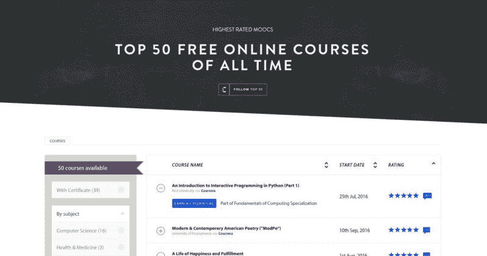

# 根据数据，50 个最好的免费在线大学课程

> 原文：<https://www.freecodecamp.org/news/the-50-best-free-online-university-courses-according-to-data-deb6fe34ef30/>

我带着有史以来最好的免费在线课程的最新列表回来了。Class Central [去年 7 月首次公布了 50 强榜单](https://www.classcentral.com/report/top-moocs/)。从那以后，大学和课程提供商增加了几千门新课程，Class Central 用户写了几千篇新评论。

现在，全球约 750 所大学有超过 8000 门大规模的在线开放课程。这可能会让全世界数百万以前从未上过网上课程的学习者望而生畏。

这就是为什么我们根据 Class Central 用户写的**成千上万条评论**列出了有史以来*排名前 50 的在线课程*。

我们提供了一个虽小但经过充分审核的课程列表，希望新学员在探索在线课程时不会不知所措。评论将有助于新学员判断一门课程是否适合他们，以及他们是否会有一个很好的初次体验。

#### 我们创建这个列表的方法

Class Central 有成千上万条用户写的评论，我们可以根据这些课程的贝叶斯平均评分对它们进行排序。

然后，我们删除了所有评论少于 20 条的课程(低门槛有助于较小的提供商在质量上竞争)，以及我们怀疑是否会再次提供的课程。

如果一门课程有多个部分，我们只将第一部分列入前 50 名。

#### 最好的课程

随着新课程的增加和我们收到新的评论，这份前 50 名的名单将定期更新。更好的是，你还可以在其特殊的[收藏页面](https://www.classcentral.com/collection/top-free-online-courses)上*关注*前 50 名(寻找标题下方的“关注前 50 名”按钮)。每当我们更新前 50 名课程列表时，关注者都会收到通知。

*The [Top 50 collection](https://www.classcentral.com/collection/top-free-online-courses) page. Use the Follow button to be notified when the list gets updated.*

哦……如果你觉得你学过的某门课应该在这个列表上，但是没有，请[在中央课堂上找到这门课](https://www.classcentral.com/search),并写一篇关于这门课的评论。

### Class Central 有史以来排名前 50 的免费在线课程

前 50 名里有很多常见的嫌疑人。想想像*学习如何学习*，哈佛的 *CS50x* ， *ModPo* ，Class Central 的[2016 年最佳在线课程](https://www.classcentral.com/report/best-free-online-courses-2016/) — *在你的课堂上编码，现在！edX、Coursera 和 Udacity 的创始人/首席执行官也参加了课程。*

艺术教育平台 Kadenze 的联合创始人兼首席执行官 Ajay Kapur 现在也有一门 50 强的课程。他的课程“音乐人和数字艺术家编程入门”是 2013 年在 Coursera 上首次推出的“T2”。他很快意识到，他想在艺术教育领域做的一些事情在 Coursera 上是不可能的，这促使他创建了 Kadenze。

前 50 名还包括一些知名人士的课程，比如迈克·布朗(又名“普鲁托基勒”)的*太阳系科学*和马丁·奥德斯基(Scala 的创始人)的*Scala 函数式编程原理*。

以下是前 50 名名单的简要总结:

1.  Coursera 是排名前 50 的顶级提供商，有 28 门课程，edX 第二，有 9 门课程；
2.  斯坦福大学和麻省理工学院各有四门课程名列榜首，开普敦大学有三门课程进入前 50 名——两门在 FutureLearn，一门在 Coursera
3.  这份名单包括 35 所大学和一个研究所(圣达菲)的课程，其中 22 所大学在美国；和
4.  世界上最受欢迎的在线课程的讲师芭芭拉·奥克利和特里·塞伊诺夫斯基有两门课程名列前 50。他们的新课程 *Mindshift* 加入*学习如何学习*进入前 50 名。

如果您想查看按评级排序的所有课程，请访问[前 50 名精选页面](https://www.class-central.com/collection/top-free-online-courses)。或者，我们将课程分为以下四大类。

1.  [技术(19 门课程)](https://www.classcentral.com/report/top-50-moocs-2017-edition/#technology)
2.  [科学(15 门课程)](https://www.classcentral.com/report/top-50-moocs-2017-edition/#sciences)
3.  [商务(6 门课程)](https://www.classcentral.com/report/top-50-moocs-2017-edition/#business)
4.  [人文学科(8 门课程)](https://www.classcentral.com/report/top-50-moocs-2017-edition/#humanities)

### 技术(19 门课程)

[**Python 交互式编程入门(第一部分)**](https://www.classcentral.com/mooc/408/coursera-an-introduction-to-interactive-programming-in-python-part-1)
*莱斯大学 via Coursera*
本课程旨在帮助很少或没有计算背景的学生学习构建简单交互式应用的基础知识。
★★★★([2973 收视率](https://www.classcentral.com/mooc/408/coursera-an-introduction-to-interactive-programming-in-python-part-1#reviews))

[**在你的教室编码，现在！**](https://www.classcentral.com/mooc/5652/emma-coding-in-your-classroom-now)
*【城市大学通过艾玛】*
这门课程雄心勃勃，简单易行。它有助于通过编码将计算思想引入课堂，只使用直观有趣的活动直接向学生提出。
[36 分](https://www.classcentral.com/mooc/5652/emma-coding-in-your-classroom-now#reviews)

[**面向音乐家和数字艺术家的编程入门**](https://www.classcentral.com/mooc/3749/kadenze-introduction-to-programming-for-musicians-and-digital-artists)
*加州艺术学院 via Kadenze*
课程、讲座和示例互为基础，讲授一般编程的基础知识(逻辑、循环、函数、对象、类)，还涉及多线程、事件和信号等高级主题。在整个课程中，学生创造有意义和有价值的表达性数字“乐器”,直接响应程序逻辑发出声音和音乐。
★★★★([20 评分](https://www.classcentral.com/mooc/3749/kadenze-introduction-to-programming-for-musicians-and-digital-artists#reviews))

[**MATLAB 编程入门**](https://www.classcentral.com/mooc/3396/coursera-introduction-to-programming-with-matlab)
*范德比尔特大学 via Coursera*
这门课程向以前经验很少甚至没有经验的人教授计算机编程。它使用称为 MATLAB 的编程系统和语言来这样做，因为它简单易学，功能多样，对工程师和其他专业人员非常有用。
★★★★([181 收视率](https://www.classcentral.com/mooc/3396/coursera-introduction-to-programming-with-matlab#reviews))

[**为大家编程(Python 入门)**](https://www.classcentral.com/mooc/4319/coursera-programming-for-everybody-getting-started-with-python)
*密歇根大学 via Coursera*
本课程旨在教大家使用 Python 进行计算机编程的基础知识。我们涵盖了如何从 Python 中的一系列简单指令构建程序的基础知识。这门课程没有先决条件，除了最简单的数学之外，它避开了所有内容。
★★★★([1648 收视率](https://www.classcentral.com/mooc/4319/coursera-programming-for-everybody-getting-started-with-python#reviews))

[**机器学习**](https://www.classcentral.com/mooc/835/coursera-machine-learning)
*斯坦福大学 via Coursera*
这门课程提供了机器学习、数据挖掘和统计模式识别的广泛介绍。
★★★★([313 收视率](https://www.classcentral.com/mooc/835/coursera-machine-learning#reviews))

[**学会编程:基本面**](https://www.classcentral.com/mooc/385/coursera-learn-to-program-the-fundamentals)
*多伦多大学 via Coursera*
每一次鼠标点击和触摸屏敲击的背后，都有一个让事情发生的计算机程序。本课程介绍了编程的基本构件，并教你如何使用 Python 语言编写有趣而有用的程序。
★★★★([96 评分](https://www.classcentral.com/mooc/385/coursera-learn-to-program-the-fundamentals#reviews))

[**深度学习与 TensorFlow 的创造性应用**](https://www.classcentral.com/mooc/6679/kadenze-creative-applications-of-deep-learning-with-tensorflow)
*via kaden ze*
本课程向您介绍深度学习:构建人工智能算法的最先进方法。我们涵盖了深度学习的基本组件，它意味着什么，它是如何工作的，并开发了构建各种算法所需的代码，如深度卷积网络，变分自动编码器，生成对抗网络和递归神经网络。
★★★★([30 收视率](https://www.classcentral.com/mooc/6679/kadenze-creative-applications-of-deep-learning-with-tensorflow#reviews))

[**从基本原理构建现代计算机:从 Nand 到 Tetris(以项目为中心的课程)**](https://www.classcentral.com/mooc/3234/coursera-build-a-modern-computer-from-first-principles-from-nand-to-tetris-project-centered-course)
*耶路撒冷希伯来大学 via Coursera*
在这个以项目为中心的课程中，你将从头开始构建一个现代计算机系统。我们将把这个迷人的旅程分成六个动手项目，将带你从构建基本逻辑门一直到创建一个全功能的通用计算机。在这个过程中，你将以最直接、最有建设性的方式学习计算机是如何工作的，以及它们是如何设计的。
★★★★([20 评分](https://www.classcentral.com/mooc/3234/coursera-build-a-modern-computer-from-first-principles-from-nand-to-tetris-project-centered-course#reviews))

[**编程语言，A 部分**](https://www.classcentral.com/mooc/452/coursera-programming-languages-part-a)
华盛顿大学 via Coursera
本课程是对编程语言基本概念的介绍，重点强调函数式编程。本课程使用 ML、Racket 和 Ruby 语言作为讲授概念的工具，但真正的目的是教授足够多的关于任何语言如何“组合在一起”的知识，以使您在任何语言中以及在学习新语言时更有效地编程。
★★★★([21 收视率](https://www.classcentral.com/mooc/452/coursera-programming-languages-part-a#reviews))

[**分析优势**](https://www.classcentral.com/mooc/1623/edx-the-analytics-edge)
*麻省理工学院 via edX*
通过鼓舞人心的例子和故事，发现数据的力量，并使用分析为您的职业和生活提供优势。
★★★★([71 收视率](https://www.classcentral.com/mooc/1623/edx-the-analytics-edge#reviews))

[**算法:设计与分析，第一部分**](https://www.classcentral.com/mooc/374/coursera-algorithms-design-and-analysis-part-1)
*斯坦福大学 via Coursera*
算法是计算机科学的核心，该学科有无数的实际应用以及智力深度。这门课程是对至少有一点编程经验的学习者的算法介绍。
★★★★([64 收视率](https://www.classcentral.com/mooc/374/coursera-algorithms-design-and-analysis-part-1#reviews))

[**人工智能**](https://www.classcentral.com/mooc/445/edx-cs188-1x-artificial-intelligence)
*加州大学柏克莱分校 via edX*
该课程将介绍智能计算机系统设计的基本思想和技术。
★★★★([30 收视率](https://www.classcentral.com/mooc/445/edx-cs188-1x-artificial-intelligence#reviews))

[**Scala 中的函数式编程原理**](https://www.classcentral.com/mooc/422/coursera-functional-programming-principles-in-scala)
*洛桑联邦理工学院 via Coursera*
在本课程中，您将发现函数式编程风格的元素，并学习如何在日常编程任务中有效地应用它们。
★★★★([61 收视率](https://www.classcentral.com/mooc/422/coursera-functional-programming-principles-in-scala#reviews))

[**计算机科学入门**](https://www.classcentral.com/mooc/442/edx-introduction-to-computer-science)
*哈佛大学 via edX*
这是 CS50x，哈佛大学对计算机科学的智力企业和编程艺术的入门，对专业和非专业的人都一样，不管有没有以前的编程经验。
★★★★([64 收视率](https://www.classcentral.com/mooc/442/edx-introduction-to-computer-science#reviews))

[**密码学 I**](https://www.classcentral.com/mooc/616/coursera-cryptography-i)
*斯坦福大学 via Coursera*
在这门课程中你将学习密码系统的内部工作原理，以及如何在现实应用中正确使用它们。
★★★★([49 收视率](https://www.classcentral.com/mooc/616/coursera-cryptography-i#reviews))

[**人工智能机器人**](https://www.classcentral.com/mooc/319/udacity-artificial-intelligence-for-robotics)
*斯坦福大学 via Udacity*
向谷歌和斯坦福的自动驾驶团队的领导者学习如何对机器人汽车的所有主要系统进行编程。这门课会教你人工智能的基本方法，包括:概率推理，规划
★★★★([20 评级](https://www.classcentral.com/mooc/319/udacity-artificial-intelligence-for-robotics#reviews))

[**算法，第一部分**](https://www.classcentral.com/mooc/339/coursera-algorithms-part-i)
普林斯顿大学 via Coursera
本课程涵盖了每一个认真的程序员需要了解的关于算法和数据结构的基本信息，重点是 Java 实现的应用和科学性能分析。
★★★★([55 评分](https://www.classcentral.com/mooc/339/coursera-algorithms-part-i#reviews))

[**计算机科学入门**](https://www.classcentral.com/mooc/320/udacity-intro-to-computer-science)
*弗吉尼亚大学 via Udacity*
在这门计算机编程入门课程中，您将通过构建自己版本的流行 web 应用程序来学习和实践关键的计算机科学概念。
★★★★☆ ( [65 评分](https://www.classcentral.com/mooc/320/udacity-intro-to-computer-science#reviews))

[**计算机科学与编程入门使用 Python**](https://www.classcentral.com/mooc/1341/edx-introduction-to-computer-science-and-programming-using-python)
*麻省理工学院 via edX*
计算机科学作为一种工具的最新更新入门使用 Python 3.5 解决现实世界的分析问题。
★★★★([110 评分](https://www.classcentral.com/mooc/1341/edx-introduction-to-computer-science-and-programming-using-python#reviews))

[**电路与电子 1:基本电路分析**](https://www.classcentral.com/mooc/4579/edx-6-002-1x-circuits-and-electronics-1-basic-circuit-analysis)
*麻省理工学院，通过 edX*
学习智能手机、电脑和互联网中使用的微芯片设计的基础技术。
★★★★([13 评分](https://www.classcentral.com/mooc/4579/edx-6-002-1x-circuits-and-electronics-1-basic-circuit-analysis#course-all-reviews))

### 科学(15 门课程)

[**山脉 101**](https://www.classcentral.com/mooc/7455/coursera-mountains-101)
*阿尔伯塔大学 via Coursera*
山脉 101 是对山脉世界的广泛而综合的概述。这门 12 节课的课程涵盖了一个跨学科的研究领域，重点是加拿大阿尔伯塔省和世界各地山区的物理、生物和人文层面。
★★★★([248 收视率](https://www.classcentral.com/mooc/7455/coursera-mountains-101#reviews))

[**什么是头脑？**](https://www.classcentral.com/mooc/3314/futurelearn-what-is-a-mind)
*开普敦大学 via FutureLearn*
这个免费的在线课程将汇集对大脑如何工作感兴趣的学习者和实践者。它的目的是在传统的对立方法之间建立理解心灵的桥梁。
★★★★([85 评分](https://www.classcentral.com/mooc/3314/futurelearn-what-is-a-mind#reviews))

[**动力系统与混沌简介**](https://www.classcentral.com/mooc/1182/complexity-explorer-introduction-to-dynamical-systems-and-chaos)
*圣达菲学院 via 复杂性探索者*
在这门课程中，你将获得动力系统的现代研究简介，这是应用数学的跨学科领域，研究随时间变化的系统。涵盖的主题包括:相空间、分叉、混沌、蝴蝶效应、奇怪的吸引子和模式形成。
★★★★([53 收视率](https://www.classcentral.com/mooc/1182/complexity-explorer-introduction-to-dynamical-systems-and-chaos#reviews))

[**复杂性介绍**](https://www.classcentral.com/mooc/557/complexity-explorer-introduction-to-complexity)
*圣达菲研究所通过复杂性探索者*
了解科学家用来理解复杂系统的工具。你将学习的主题包括动力学、混沌、分形、信息论、自组织、基于代理的建模和网络。
★★★★([80 评分](https://www.classcentral.com/mooc/557/complexity-explorer-introduction-to-complexity#reviews))

[**了解痴呆症**](https://www.classcentral.com/mooc/981/understanding-dementia)
*塔斯马尼亚大学*
这是一门关于痴呆症的课程，涉及广泛的主题，包括基础脑解剖、病理学、痴呆症研究、风险因素、症状、诊断、医疗管理、痴呆症生活、进展和分期、缓解、行为和治疗方法。
★★★★([26 评分](https://www.classcentral.com/mooc/981/understanding-dementia#reviews))

[**医学神经科学**](https://www.classcentral.com/mooc/384/coursera-medical-neuroscience)
*杜克大学 via Coursera*
这门在线课程旨在包括神经生理学和临床神经解剖学中的所有核心概念，这些概念将在医学院的大多数第一年神经科学课程中出现。
★★★★([32 收视率](https://www.classcentral.com/mooc/384/coursera-medical-neuroscience#reviews))

[**太阳系的科学**](https://www.classcentral.com/mooc/1813/coursera-the-science-of-the-solar-system)
*加州理工学院 via Coursera*
了解当前探索太阳系背后的科学。利用物理学、化学、生物学和地质学的原理来了解火星的最新情况，理解外太阳系，思考太阳系以外的行星，并在我们的邻居和更远的地方寻找可居住性。
★★★★([36 评分](https://www.classcentral.com/mooc/1813/coursera-the-science-of-the-solar-system#reviews))

[**了解临床研究:统计数据背后**](https://www.classcentral.com/mooc/5037/coursera-understanding-clinical-research-behind-the-statistics)
*开普敦大学 via Coursera*
如果你只是对正确理解已发表的文献感兴趣，或者如果你正着手进行自己的研究，本课程是你的第一步。它提供了一个简单的入口来解释普通的统计概念，而不进入本质的数学公式。能够解释和理解这些概念是开始进入临床文献世界的最佳方式。
★★★★([82 收视率](https://www.classcentral.com/mooc/5037/coursera-understanding-clinical-research-behind-the-statistics#reviews))

[**灭绝:过去和现在**](https://www.classcentral.com/mooc/8004/futurelearn-extinctions-past-and-present)
*开普敦大学 via FutureLearn*
这门免费的在线课程探索了地球上的生命是如何被遥远过去的五次大灭绝事件塑造的。目前，生物多样性正面临危机，今天有可能发生第六次灭绝事件。
★★★★([32 收视率](https://www.classcentral.com/mooc/8004/futurelearn-extinctions-past-and-present#reviews))

[**模型思维**](https://www.classcentral.com/mooc/317/coursera-model-thinking)
*密歇根大学 via Coursera*
*我们生活在一个复杂的世界里，有各种各样的人、公司和政府，他们的行为集合起来产生新奇的、意想不到的现象。我们看到政治暴动、市场崩溃和一系列永无止境的社会趋势。我们如何理解它？模特。*
★★★★([63 收视率](https://www.classcentral.com/mooc/317/coursera-model-thinking#reviews))

[**工程力学入门**](https://www.classcentral.com/mooc/564/coursera-introduction-to-engineering-mechanics)
*佐治亚理工学院 via Coursera*
本课程是学习和应用解决工程力学问题所需原理的入门课程。在这门课中，你将会用到以前学过的基础数学和物理课程中的概念。本课程强调静态平衡问题的建模和分析，重点是现实世界的工程应用和问题解决。
★★★★([98 评分](https://www.classcentral.com/mooc/564/coursera-introduction-to-engineering-mechanics#reviews))

[**日常思维的科学**](https://www.classcentral.com/mooc/1332/edx-the-science-of-everyday-thinking)
*昆士兰大学 via edX*
学习如何更好地思考，更好地辩论，更好地选择。
★★★★([36 评分](https://www.classcentral.com/mooc/1332/edx-the-science-of-everyday-thinking#reviews))

[**迪诺 101:恐龙古生物学**](https://www.classcentral.com/mooc/1057/coursera-dino-101-dinosaur-paleobiology)
*阿尔伯塔大学 via Coursera*
迪诺 101:恐龙古生物学是一门 12 节课的课程，教授非鸟类恐龙的全面概述。主题包括:解剖学，饮食，运动，生长，环境和行为适应，起源和灭绝。课程来自博物馆、化石制备实验室和挖掘现场。
★★★★([22 收视率](https://www.classcentral.com/mooc/1057/coursera-dino-101-dinosaur-paleobiology#reviews))

[**生物学入门——生命的秘密**](https://www.classcentral.com/mooc/637/edx-introduction-to-biology-the-secret-of-life)
*麻省理工学院 via edX*
通过生物化学、遗传学、分子生物学、重组 DNA、基因组学、理性医学等基础知识探索生命的秘密。通过 MITx 7.00x 能力考试认证。开放自学。
★★★★([25 评分](https://www.classcentral.com/mooc/637/edx-introduction-to-biology-the-secret-of-life#reviews))

[**微积分一**](https://www.classcentral.com/mooc/563/coursera-calculus-one)
俄亥俄州立大学 via Coursera
本课程是对微积分的第一次友好介绍，适合以前从未见过这门学科的人，或者看过一些微积分但想复习概念并练习应用这些概念解决问题的人。
★★★★([45 收视率](https://www.classcentral.com/mooc/563/coursera-calculus-one#reviews))

### 商务(6 门课程)

[**学会如何学习:强大的心智工具帮助你掌握棘手的学科**](https://www.classcentral.com/mooc/2161/coursera-learning-how-to-learn-powerful-mental-tools-to-help-you-master-tough-subjects)
*加州大学圣地亚哥分校 via Coursera*
这门课程让你轻松接触到艺术、音乐、文学、数学、科学、体育和许多其他学科的专家所使用的无价的学习技巧。我们将了解大脑如何使用两种非常不同的学习模式，以及它如何封装(“组块”)信息。
★★★★([1679 收视率](https://www.classcentral.com/mooc/2161/coursera-learning-how-to-learn-powerful-mental-tools-to-help-you-master-tough-subjects#reviews))

[**学习**](https://www.classcentral.com/mooc/4631/coursera-aprender)
*墨西哥国立自治大学通过跑步*
了解自己的学习过程相关资源和成绩水平？培养学习越来越好的技能感兴趣吗？
[【105 分】](https://www.classcentral.com/mooc/4631/coursera-aprender#reviews)

[**Mindshift:突破学习障碍，发现自己隐藏的潜力**](https://www.classcentral.com/mooc/8289/coursera-mindshift-break-through-obstacles-to-learning-and-discover-your-hidden-potential)
*麦克马斯特大学 via Coursera*
Mindshift 旨在帮助你在当今快节奏的学习环境中提升事业和生活。无论你的年龄或阶段如何，Mindshift 都会教你一些基本知识，比如如何最大限度地利用在线学习，如何寻找导师并与之合作，避免职业生涯(和灾难)以及生活中普遍规律的秘密，以及选择性忽视对一般能力的价值等见解。
★★★★([760 评分](https://www.classcentral.com/mooc/8289/coursera-mindshift-break-through-obstacles-to-learning-and-discover-your-hidden-potential#reviews))

[**复杂不确定世界中的决策**](https://www.classcentral.com/mooc/2218/futurelearn-decision-making-in-a-complex-and-uncertain-world)
*格罗宁根大学 via FutureLearn*
本课程将教你复杂性、不确定性的基本原理，以及如何在复杂的世界中做出决策。
★★★★([27 评分](https://www.classcentral.com/mooc/2218/futurelearn-decision-making-in-a-complex-and-uncertain-world#reviews))

[**数字世界中的营销**](https://www.classcentral.com/mooc/2750/coursera-marketing-in-a-digital-world)
*伊利诺伊大学厄巴纳-香槟分校 via Coursera*
本课程探讨了互联网、智能手机和 3D 打印等数字工具如何通过将权力平衡从企业转移到消费者，彻底改变营销世界。
★★★★([161 收视率](https://www.classcentral.com/mooc/2750/coursera-marketing-in-a-digital-world#reviews))

[**准备管理人力资源**](https://www.classcentral.com/mooc/5462/coursera-preparing-to-manage-human-resources)
*明尼苏达大学 via Coursera*
本课程通过阐述替代性人力资源管理(HRM)策略、介绍法律环境的重要性以及思考激励员工的因素，为开发您自己的方法来巧妙地管理员工奠定基础。
★★★★([26 评分](https://www.classcentral.com/mooc/5462/coursera-preparing-to-manage-human-resources#reviews))

### 人文学科(8 门课程)

[**【现代】&【ModPo】**](https://www.classcentral.com/mooc/356/coursera-modern-contemporary-american-poetry-modpo)
*宾夕法尼亚大学 via Coursera*
ModPo 是对美国现当代诗歌的快节奏介绍，重点是实验诗歌，从艾米莉·狄金森和沃尔特·惠特曼至今。参与者(不需要有诗歌方面的经验)将学习如何阅读被认为“困难”的诗歌
★★★★([130 评分](https://www.classcentral.com/mooc/356/coursera-modern-contemporary-american-poetry-modpo#reviews))

 ***印度商学院 via Coursera*
本课程基于印度商学院和德克萨斯大学奥斯汀分校麦库姆斯商学院提供的获奖课程，由 Raj Raghunathan 教授(又名“快乐智能博士”)开发，从多个领域汲取内容，包括心理学、神经科学和行为决策理论，为过上快乐和满足的生活提供经过测试的实用方法。
★★★★([403 收视率](https://www.classcentral.com/mooc/2860/coursera-a-life-of-happiness-and-fulfillment#reviews))**

**[**正义**](https://www.classcentral.com/mooc/610/edx-justice)
*哈佛大学 via edX*
正义是哈佛学院教授的最著名的课程之一，是道德和政治哲学的入门课程，提供了一个讨论当代困境和争议的机会。
★★★★([30 收视率](https://www.classcentral.com/mooc/610/edx-justice#reviews))**

**[**《圣经》的史前史、目的和政治未来**](https://www.classcentral.com/mooc/1406/coursera-the-bible-s-prehistory-purpose-and-political-future)
*埃默里大学 via Coursera*
通过研究丰富多彩的《圣经》和古代近东文本，并利用一系列比较实例，本课程阐述了《圣经》作者通过推进以社区为中心的大众议程来应对失败的彻底方式。
★★★★([32 收视率](https://www.classcentral.com/mooc/1406/coursera-the-bible-s-prehistory-purpose-and-political-future#reviews))**

**[**荷兰介绍**](https://www.classcentral.com/mooc/3014/futurelearn-introduction-to-dutch)
*格罗宁根大学 via FutureLearn*
你打算不久后去荷兰旅游、工作或学习吗？这个免费的在线课程是完美的，如果你以前很少或没有荷兰语知识，但想掌握基础知识，以便在低地国家生存。
★★★★([59 收视率](https://www.classcentral.com/mooc/3014/futurelearn-introduction-to-dutch#reviews))**

**[**清华汉语:与 13 亿人开始对话**](https://www.classcentral.com/mooc/5426/edx-tsinghua-chinese-start-talking-with-1-3-billion-people)
*清华大学 via edX*
这门汉语入门课程将强调普通话国家日常生活的基本语言技能。
★★★★([38 收视率](https://www.classcentral.com/mooc/5426/edx-tsinghua-chinese-start-talking-with-1-3-billion-people#reviews))**

**[**日常生活的道德观**](https://www.classcentral.com/mooc/911/coursera-moralities-of-everyday-life)
*耶鲁大学 via Coursera*
我们该如何解释善良与残忍？我们的是非感从何而来？为什么人们在道德问题上经常意见不一？这门课程探索了我们道德生活的心理学基础。
★★★★([34 收视率](https://www.classcentral.com/mooc/911/coursera-moralities-of-everyday-life#reviews))**

** ***莫纳什大学 via FutureLearn*
学习正念技巧，以减少压力，提高你的幸福感和工作/学习成绩。
★★★★([38 收视率](https://www.classcentral.com/mooc/3714/futurelearn-mindfulness-for-wellbeing-and-peak-performance#reviews))****

### ****方法学****

****我们在这个列表中使用的方法很简单。使用我们的用户写的成千上万的评论，Class Central 能够通过贝叶斯平均评级对这些课程进行排序。然后，我们删除了所有评论少于 20 条的课程(低门槛有助于较小的提供商在质量上竞争)以及我们怀疑是否会再次提供的课程。如果一门课程有多个部分，我们只将第一部分列入前 50 名。****

****注意:列表中的一些 Coursera 课程有分级作业的付费墙。你可以在这里阅读更多关于它的信息。****

****如果你想看看 2011 年 11 月的中央课堂是什么样子，你可以在[互联网档案馆](https://web.archive.org/web/20111201165930/http://www.classcentral.com/)这里看到。****

****Dhawal Shah 是 Class Central 的创始人兼首席执行官。[classcentral.com/@dhawal](https://www.classcentral.com/@dhawal)你可以在 dhawal@classcentral.com 找到他****

****[K-MOOC:看韩国官方 MOOC 平台](https://www.classcentral.com/report/k-mooc/)
[深度回顾:Coursera 上吴恩达的神经网络和深度学习 MOOC](https://www.classcentral.com/report/review-andrew-ng-neural-networks-and-deep-learning/)****