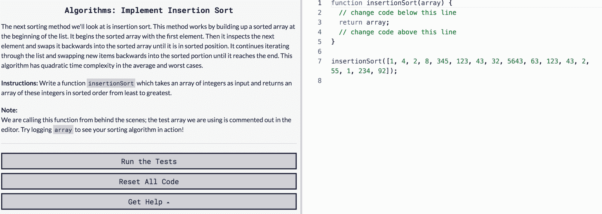
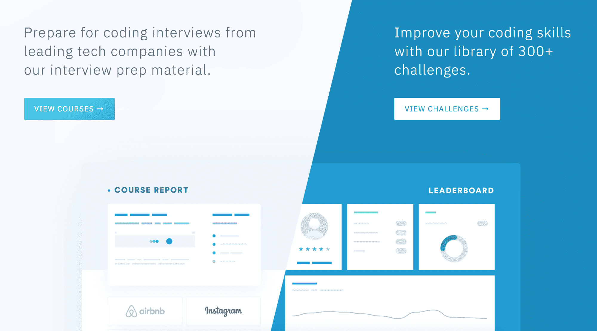
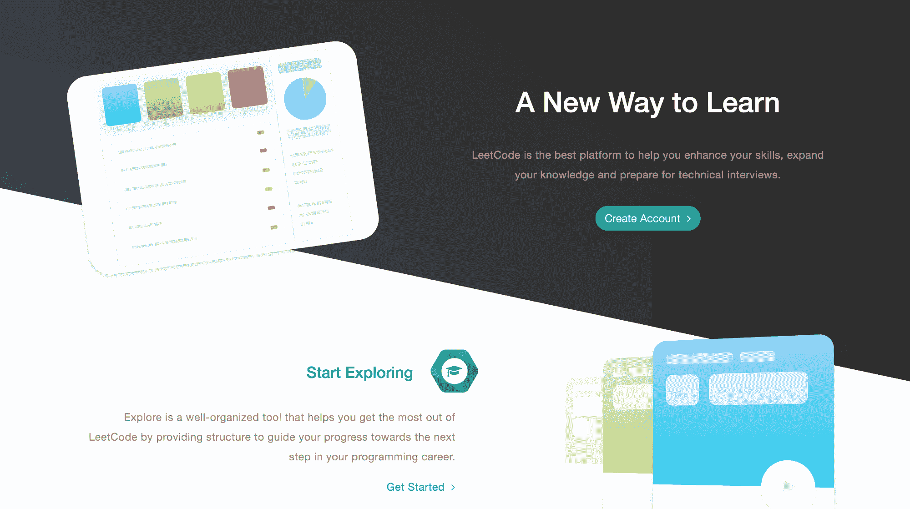
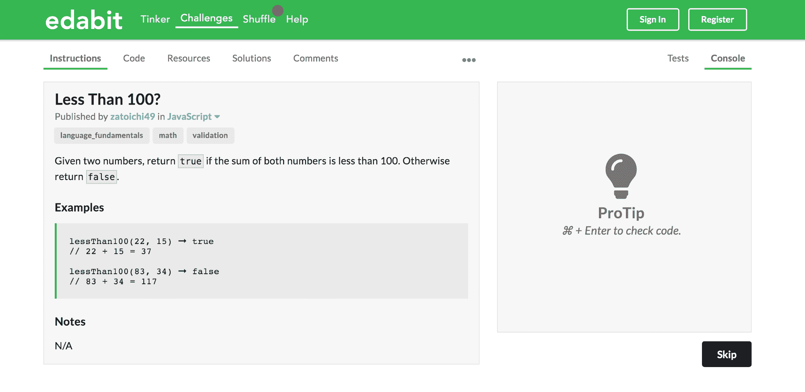
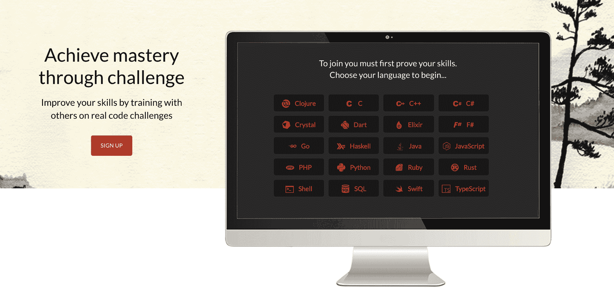
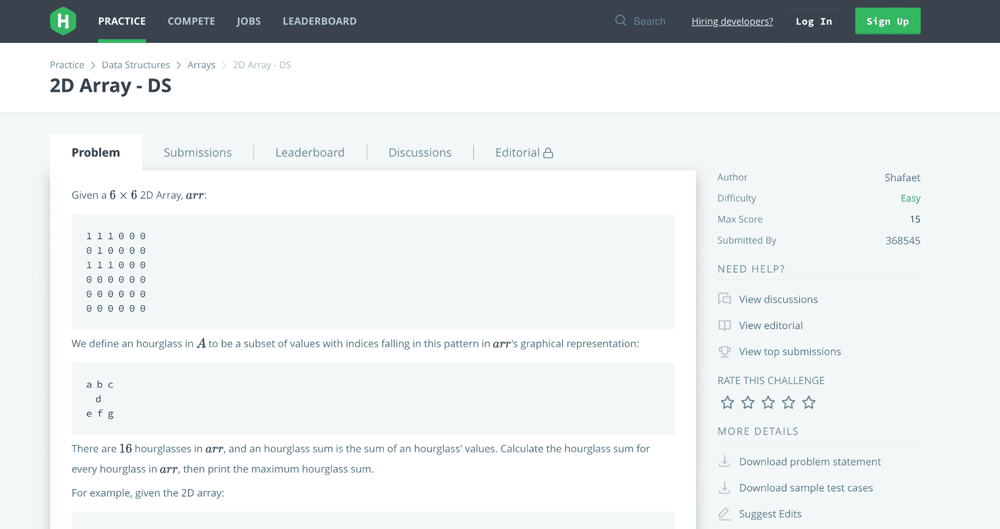
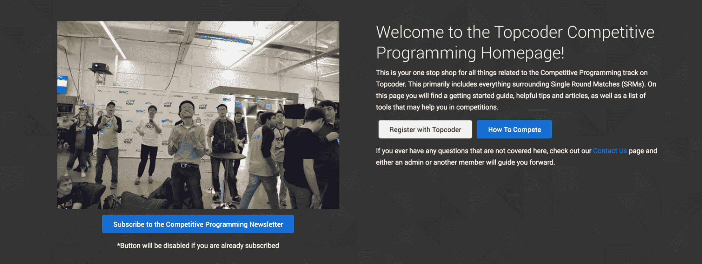
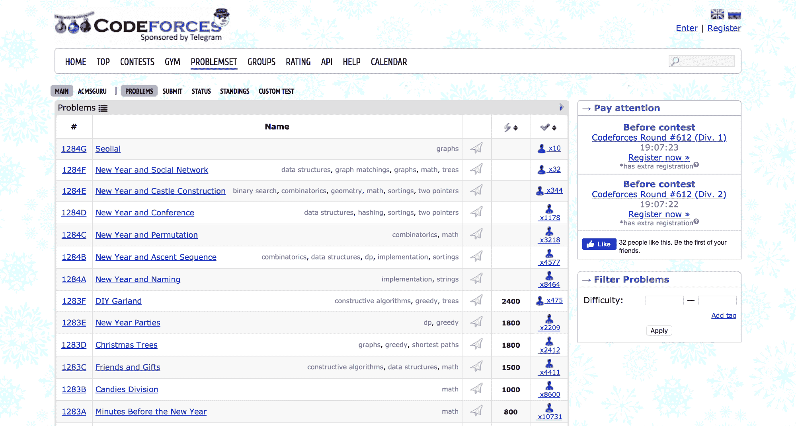

# 帮助你在 2020 年提升技能的 8 个最佳编码挑战网站

> 原文：<https://www.freecodecamp.org/news/the-8-most-popular-coding-challenge-websites-of-2020/>

尽管失业率处于几十年来的最低水平，分析家们预计科技招聘将持续稳定增长到 2020 年。

这对最近的计算机科学毕业生和目前在该领域工作的开发人员来说是个好消息，但这并不意味着雄心勃勃的工程师可以自满。

虽然整个市场可能会有增长机会，但仍有重大变化一直在发生，并且有一种跟上最新趋势的紧迫感。

今天，技术角色的类型比以往任何时候都多，新的语言、框架和技术也在不断涌现。想要获得成功的技术员工应该定期测试和完善他们的技能。

为此，我整理了以下平台列表，在这些平台上，你可以针对从数据科学到开发人员运营的各种角色提升技能。

# **1。免费代码营**

有用链接:[网站](https://www.freecodecamp.org/learn) | [论坛](https://www.freecodecamp.org/forum/) | [挑战](https://www.freecodecamp.org/learn/coding-interview-prep/data-structures/typed-arrays)

让我们从 freeCodeCamp 开始吧，这是一个非常棒的网站，适合刚刚开始编程的初学者。他们提供各种学习语法、练习编码、构建项目和准备面试的资源。

他们没有其他网站那么多的交互式编码挑战，但他们确实为学习 JavaScript 的初学者提供了一些有趣的挑战和面试准备。

### 非常适合

刚开始学习编码的新手。这是一个以有趣、互动的方式学习 HTML、CSS 和 JavaScript 的好地方。

### 定价/优质内容

freeCodeCamp 是完全免费的。

# **2。代码字节**

有用链接:[网站](https://coderbyte.com/) | [博客](https://medium.com/coderbyte) | [Dev.to](https://dev.to/coderbyte) | [免费挑战](https://coderbyte.com/challenges) | [Premium](https://coderbyte.com/member)

我的平台 Coderbyte 提供了 300 多个编码难题，你可以在一个在线编辑器中使用 10 种不同的编程语言来解决。然后，您可以访问官方解决方案、超过 150 万个用户解决方案，并阅读有关如何有效解决挑战的文章。

Coderbyte 被顶级编码训练营和公司推荐，因为它收集了面试准备的挑战。

### 非常适合

Coderbyte 非常适合处于职业生涯初级到中级阶段准备面试的人。对于那些喜欢以解决编码问题为乐的人来说，也有一个难度更大的挑战库，但这主要不是一个面向有竞争力的程序员的网站。

### 定价/优质内容

Coderbyte 上有一些免费挑战，然后有数百个高级挑战和超过 100 万个用户解决方案可供[成员](https://coderbyte.com/member)使用。

# **3。LeetCode**

有用链接:[网站](https://leetcode.com/) | [讨论](https://leetcode.com/discuss/interview-question?currentPage=1&orderBy=hot&query=) | [免费挑战](https://leetcode.com/problemset/all/) | [高级](https://leetcode.com/subscribe/)

LeetCode 收集了一些当今在线的最佳算法挑战。他们所涉及的主题需要二叉树、堆、链表等数据结构的知识，这就是为什么他们的挑战比其他一些网站更高级。但是如果用来准备软件工程面试，挑战是巨大的。

他们还有一个[模拟面试](https://leetcode.com/interview/)部分，专门为工作面试做准备。他们还举办自己的[编码竞赛](https://leetcode.com/contest/)，他们有一个很棒的[讨论板](https://leetcode.com/discuss/interview-question?currentPage=1&orderBy=hot&query=)，人们可以在那里讨论面试问题、工作、薪酬以及其他与工程相关的话题。

### 非常适合

LeetCode 非常适合中高级程序员。对于还不知道如何编写基本循环的新程序员来说，它可能不是最适合的，但是一旦你学会了基本原理，这是一个练习编码的好地方。

### 定价/优质内容

LeetCode 上有免费的挑战，他们也有一个 [premium](https://leetcode.com/subscribe/) 订阅，让你获得更多的挑战和平台的其他功能。

# **4。Edabit**

有用链接:[网站](https://edabit.com/) | [博客](https://dev.to/edabit) | [挑战](https://edabit.com/challenges)

这是 Edabit 第一次出现在我们的顶级网站榜单上( [2018 榜单](https://medium.com/coderbyte/the-10-best-coding-challenge-websites-for-2018-12b57645b654)， [2017 榜单](https://www.freecodecamp.org/news/the-10-most-popular-coding-challenge-websites-of-2016-fb8a5672d22f/))！它在过去的一年里越来越受欢迎，开发人员似乎真的很享受这些挑战。他们提供了超过 4000 个挑战的大集合，可以用几种语言中的一种在线解决。

该网站目前只提供在线交互式编码挑战——没有任何讨论板、文章、用户解决方案或其他网站提供的模拟采访，但随着时间的推移，他们可能会添加一些内容。

### 非常适合

Edabit 非常适合希望每天通过解决小问题来练习编码技能的初学者。一旦你达到中级阶段，其他网站会提供更难的挑战和更多面向竞争性编程和工作面试的内容。

### 定价/优质内容

Edabit 上的所有挑战都是免费的，没有溢价定价选项。

# **5。代码大战**

有用链接:[网站](https://www.codewars.com/) | [博客](https://medium.com/@Codewars) | [免费挑战](https://www.codewars.com/kata/latest/my-languages) | [高级](https://www.codewars.com/subscribe)

Codewars 提供了大量由他们自己的社区提交和编辑的编码挑战。您可以使用 20 多种编程语言在他们的编辑器中直接在线解决这些挑战。您可以查看每个挑战的讨论以及用户解决方案。你可以通过解决他们的挑战来获得积分和提升排名。

### 非常适合

Codewars 非常适合初级到中级阶段的人。这些挑战是由社区创造的，所以你会接触到许多不同类型的编码挑战。

### 定价/优质内容

他们免费提供社区创建的所有挑战，他们的 [premium](https://www.codewars.com/subscribe) 订阅让你可以访问他们平台上的一些很酷的功能。

# **6。黑客排名**

有用链接:[网站](https://www.hackerrank.com/) | [博客](https://blog.hackerrank.com/) | [挑战](https://www.hackerrank.com/dashboard)

HackerRank 收集了大量针对算法和数据结构的编码挑战，以及采访准备材料、每个挑战的讨论板和顶级用户解决方案列表。他们对其他主题也有挑战，比如函数式编程、人工智能、Shell、SQL 等等。

### 非常适合

HackerRank 非常适合已经掌握了一门语言的基础知识并准备解决更复杂问题的中高级程序员。这些挑战是用数学符号编写的，有时可能会有点混乱，这就是为什么它可能不太适合初学者。

### 定价/优质内容

HackerRank 上的所有挑战都是免费的，没有溢价定价选项。

# **7。顶部编码器**

有用链接:[网站](https://www.topcoder.com/) | [博客](https://www.topcoder.com/blog/) | [挑战](https://www.topcoder.com/challenges)

TopCoder 是在线竞技编程的原创平台之一。它提供了一个过去比赛中的算法挑战列表，你可以使用他们的代码编辑器直接在线完成。

他们受欢迎的单轮比赛每个月都会在特定的时间举行几次，你可以和其他人比赛来解决挑战。以下是他们的挑战可能涉及的一些[主题](https://www.topcoder.com/community/competitive-programming/tutorials/)。

除了在线解决挑战，他们还提供[赞助的](https://www.topcoder.com/challenges/30111105)竞赛，写出最佳解决方案的人可以获得奖励。

### 非常适合

TopCoder 更适合高级程序员，他们可以轻松地解决算法挑战，处理图形搜索和数论等高级主题。

### 定价/优质内容

TopCoder 上的所有挑战都是免费的，没有溢价定价选项。

# **8。Codeforces**

有用链接:[网站](https://codeforces.com/) | [讨论](https://codeforces.com/groups) | [挑战](https://codeforces.com/problemset)

Codeforces 现在可能是最有竞争力的编程网站(几年前，TopCoder 是大多数有竞争力的程序员花费时间的地方)。

有[个问题](https://codeforces.com/problemset)你可以在网上解决来练习，但是没有在线编辑器。相反，你用你自己的编辑器编写你的解决方案，然后上传到他们的系统，然后系统根据一套测试用例测试你的代码。

他们还经常举办竞赛，最好的有竞争力的程序员可以参加。

### 非常适合

真正享受解决困难的算法挑战的高级和有竞争力的程序员。

### 定价/优质内容

Codeforces 上的所有挑战都是免费的，没有溢价定价选项。