# 2018 年学习 web 开发的绝对初学者指南

> 原文：<https://www.freecodecamp.org/news/the-absolute-beginners-guide-to-learning-web-development-in-2018-d87ba925549b/>

*本文最初发表于[Coder-Coder.com](https://coder-coder.com/learn-web-development/)。*

如果你是一个初学编程的人，这个指南是为你准备的！

以下是本指南涵盖的内容:

*   web 开发中的**基本领域**的解释，
*   **编程语言和框架概述**，
*   以及**推荐资源**帮你学习。

它面向初学者，提供有用的链接和信息，让你在自己的研究中领先一步。

这是我们将要经历的。

### 目录

*包括跳转链接，所以如果你想的话可以跳过！

### 第 1 部分:我们将从基础开始:

*   **什么是 web 开发**:解释当你在浏览器中加载一个网站时实际发生了什么。
*   HTML、CSS 和 JavaScript 是每个网站的基础。
*   有用的工具:使用**代码编辑器和 Git**
*   什么是**前端**和**后端**？

### [第二部分:然后我们将进入更多的中级前端技能:](#part2)

*   响应式设计:确保你的网站在电脑、平板电脑和手机上看起来不错。
*   Grunt、Gulp 和 WebPack :使用构建工具为您做一些工作！
*   JavaScript 前端框架简介:React、Vue 和 Angular

### [第三部分:其次是后端技能:](#part3)

*   概述最常用的**后端语言**以及它们是如何叠加在一起的。
*   快速介绍**数据库**和你应该学习的数据库语言。
*   在**服务器**上建立网站的基础。

### [结语:学习资源](#epilogue)

*   推荐的在线课程、教程和书籍的简短列表。

现在，在我们讨论所有关于网站的事情之前，让我们从你开始吧！

### 你学习编码的最终目标是什么？

在他的书《高效能人士的 7 个习惯》中，斯蒂芬·R·科维断言，为了成功，你必须“从心中的目标开始”

考虑你自己进入编码领域的原因…你的目标是什么？

你的最终目标是什么？

你正在寻找一个有趣的爱好，一个职业改变，一个灵活的工作，你可以更接近你的家人吗？

你的整个网络开发方法应该以实现这个梦想为中心。

你甚至可以试着写下你的目标，并把它放在你每天都能看到的地方，比如你浴室的镜子或电脑旁边。

当你阅读这篇文章时，记住你的目标，让它决定你做什么决定:学习哪种语言，甚至你选择如何学习。

说了这么多，让我们从基础开始吧！

### 第 1 部分:基础知识

这似乎是显而易见的，但我还是要说:

从本质上来说，web 开发就是建立网站。

一个网站可能是一个简单的单页网站，也可能是一个非常复杂的 web 应用程序。

如果你能在浏览器上看到它，那它一定与网络开发有关。

下面简单解释一下互联网上的网站是如何工作的:

1.  **网站**基本上就是一堆储存在叫做服务器的电脑上的文件。
2.  **服务器**是用于托管网站的计算机，这意味着它们存储网站文件。这些服务器连接到被称为万维网(借用 90 年代的行话)或互联网的巨大网络上。
3.  浏览器是你在电脑上运行的程序。他们通过你的网络连接下载网站文件。你的电脑也被称为**客户端**，它连接到**服务器**。

**延伸阅读**

*   互联网是如何工作的？ — Mozilla 开发者网络
*   [网页、网站、web 服务器、搜索引擎有什么区别？](https://developer.mozilla.org/en-US/docs/Learn/Common_questions/Pages_sites_servers_and_search_engines) — Mozilla 开发者网络

### 构成每个网站的三个组成部分

如上所述，网站是由文件组成的，主要是 HTML、CSS、JavaScript 文件。

让我们仔细看看其中的每一个:

#### **HTML 或超文本标记语言**

HTML 是所有网站的基础。当你浏览一个网站时，它是浏览器中加载的主要文件类型。

你可以只用 HTML 而不用其他类型的文件来制作一个非常非常简单的网站。

它看起来不会很有趣，但这是网站成为网站的最低要求。

(如果你对 HTML 的基础感兴趣，你可以看看我的视频/博客教程。)

#### **CSS 或层叠样式表**

没有 CSS，一个网站看起来会像 Word 文档一样美观。

有了 CSS，你可以添加各种各样的颜色，引人注目的字体，并以你喜欢的任何方式来布局网站。

您甚至可以使用更高级的 CSS 添加动画和绘制形状。

#### **JavaScript**

JavaScript 是一种编程语言，允许你与网站上的元素进行交互并操纵它们。

CSS 为 HTML 增加了风格，JavaScript 增加了交互性，使网站更加动态。

例如，当您点按按钮时，您可以使用 JavaScript 滚动到页面顶部，或者创建带有按钮的幻灯片来浏览图像。

要处理 HTML、CSS 和 JavaScript 文件，你需要在电脑上使用一个叫做代码编辑器的程序。

这就引出了下一点:

### 您应该使用哪个代码编辑器？

这是一个很常见的问题，尤其是如果你刚刚开始。

对你来说最好的代码编辑器将高度依赖于你正在编写的代码类型。

如果你主要做 HTML、CSS 和 JavaScript，如果你愿意，你可以在 Windows 记事本或 MAC 版的文本编辑器中编写代码。

但是那有什么意思呢？

像 Sublime 或 VS Code 这样的代码编辑器程序提供了很多特性，这些特性使得编码变得更加容易。

它们允许您向左或向右缩进多行文本，并可以根据文件的语言以不同的方式突出显示文本。

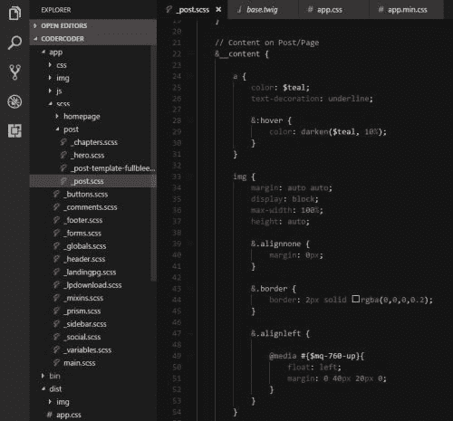

Example of syntax highlighting in VS Code

对于后端语言(我们将在后面的章节中讨论)，您需要一个更强大的代码编辑器，称为 IDE(集成开发环境)。ide 具有允许你调试和编译(处理)你的代码的特性。

以下是一些流行的代码编辑器:

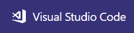

[**VS Code**](https://code.visualstudio.com/) :这个轻量级版本的 Visual Studio 是微软的主要 IDE，虽然只有几年的历史，但是由于它的速度、易用性和强大的功能，它已经变得非常受欢迎。VS Code 是我个人选择的编辑器，所以我可能比较偏向？

[**Atom**](https://atom.io/) **:** 由 GitHub 创建并标榜为“可黑客攻击的文本编辑器”，Atom 是一个深受喜爱的编辑器。它的主要优势之一是可定制性。您可以安装将向程序添加功能的包和主题。

**:一个非常受欢迎的节目，已经有一段时间了。和 Atom 一样，你可以安装包和主题，它的性能也很快。与其他两个编辑器不同，Sublime 许可证的价格为 70 美元(但可以免费试用)。**

**为了便于比较，我建议试用这些编辑器中的一部分或全部。然后挑一个坚持下去，学习它的功能和快捷键。**

### **版本控制**

**现在您有了代码编辑器，并且开始编写代码。**

**然而，如果你在代码中犯了一个错误，按 Ctrl-Z 键撤销一百万次都不起作用，会发生什么呢？你是做什么的？**

**答案是，版本控制！**

**版本控制就像为你的代码文件设置保存点。**

**如果您认为您可能要进行一些可能会破坏一切的代码更改，您可以创建一个新的保存点(称为提交)。**

**然后，如果您确实破坏了您的网站，您可以将您的代码恢复到之前的状态。**

**如果你犯了一个急需弥补的错误，它可以成为你的救命稻草。**

****版本控制听起来很棒！它是如何工作的？****

**使用[版本控制系统](https://www.atlassian.com/git/tutorials/what-is-version-control) (VCS)包括将你的代码文件和整个变更历史存储在所谓的存储库中。**

**通常每个网站或项目会使用一个存储库。**

**然后你将你的库在线存储在所谓的**中央库**中，并在你的计算机上的**本地库**中保存一个版本。**

**当您在计算机上进行更改时，您可以创建提交，然后将它们推送到中央存储库。**

**这个过程允许多人处理同一套代码，甚至修改同一个文件。**

****Git 是目前最受欢迎的 VCS****

**现在主要的版本控制系统是 [Git](https://git-scm.com/) 。它的主要竞争对手是 [Subversion](https://subversion.apache.org/) (SVN)，一个更老的系统。**

**但是绝大多数的编码训练营和教程都将使用 Git，所以这就是我建议您学习的。**

****延伸阅读****

*   **[关于使用 Git 的基础知识的快速教程](https://try.github.io/levels/1/challenges/1)**
*   **[GitHub 使用深度指南](https://guides.github.com/activities/hello-world/)**

**现在，当我们开始解释实际使用的语言和框架时，我们将使用你可能已经遇到过的术语:**前端和后端**。**

### **前端是所有关于如何看网站，视觉上。**

**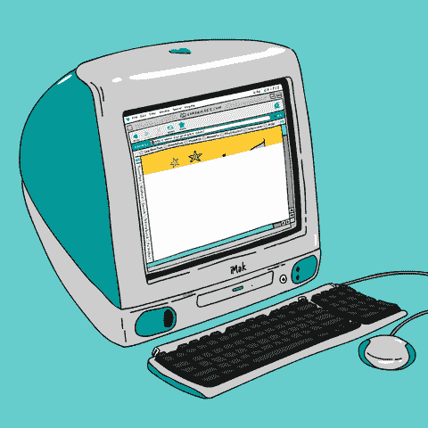

[Sarah Maes via GIPHY](https://giphy.com/sarahmaes/)** 

**前端(或客户端)指的是用户浏览器加载的内容，也称为客户端。**

**这就是我们开始谈论的 HTML 和 CSS。JavaScript 最初只是一种前端语言，但是现在你也可以使用 JavaScript 作为你的服务器端或后端语言。**

**前端工作主要是让网站看起来更好。**

**此外，它还包括使网站的行为方式对用户有意义(也称为 UX 或用户体验)。**

**如果你喜欢调整你的 CSS 以确保网站像素完美，并添加微妙的 JavaScript 动画来帮助用户，那么你可能会喜欢前端开发。**

### **后端是所有关于功能和确保一切工作。**

**虽然前端是关于网站的外观和视觉行为，后端是关于让一切在幕后工作。**

**如果您从事后端开发，您将会处理诸如对服务器和数据库的请求之类的任务。**

**后端工作的一些例子是当某人在联系人页面上填写表单时保存数据，或者检索数据以显示用户请求的特定类别的博客文章。**

**后端工作还可能包括在服务器上建立网站、处理部署和建立 SQL 数据库。**

**如果建立一个网站的所有功能部分的想法听起来很有趣，你可能会喜欢后端工作！**

### **把双方放在一起**

**前端和后端这两个名称的由来是因为前端就是你在浏览器中可以看到的东西。**

**后端是您看不到的部分，但它处理许多繁重的工作，并提供帮助前端的功能。**

**你可以把前端想象成一个企业的店面，大多数客户只会看到的部分。后端就像是帮助店铺运营的制造、配送、运营中心。**

**两者都有不同的功能，但同样重要。**

### **前端、后端还是全栈？**

**在 web 开发中，您可以只关注前端，也可以只关注后端。或者你可以两者兼而有之，这叫做全栈开发。**

**你选择关注什么应该主要取决于两件事:**

*   ****个人喜好:**不是每个人都喜欢前端和后端。**
*   ****工作机会:**浏览你当地的工作列表，参加当地的编码聚会，感受一下有哪些类型的工作。**

**值得一提的是，如果你同时喜欢前端和后端，成为一名全栈开发者会让你更有市场。**

**这是有道理的——你能使用的技术越多，你能完成的任务就越多。**

**Stack Overflow 在他们的 2017 年用户调查中报告说，63.7%的人认为是全栈，24.4%的人认为是后端，11.9%的人认为是前端开发人员:**

**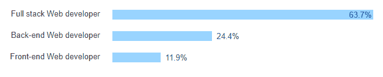

Source: [Stack Overflow 2017 Survey](https://insights.stackoverflow.com/survey/2017#developer-profile-specific-developer-types)** 

**然而，这将严重依赖于公司。一些公司可能会使用全栈开发人员，而其他公司会将后端和前端分开。**

**有些还让他们的前端开发人员参与设计，开发人员将设计和构建应用程序的前端。**

****

### **第 2 部分:让你的前端技能大放异彩**

**一旦你掌握了 HTML、CSS 和 JavaScript 的基础知识，你就可以开始学习更高级的前端技能了。**

**这一部分将介绍一些实践和工具，帮助你作为一名 web 开发人员建立更多有市场价值的技能。**

### **在这个手机友好的世界里，响应式设计是必须的**

**当网站刚出现时，只有一种方式可以浏览:在你的电脑上。**

**智能手机和移动数据当时还不存在。当制作一个网站时，你只需要担心它在你的电脑上是什么样子。**

**据 Statcounter.com 称，现在，更多的人使用手机而不是台式电脑来浏览互联网。**

**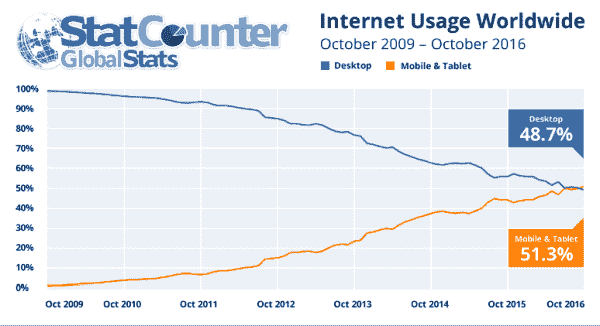**

**因此，我们需要确保我们所有的网站都能正常运行，从最大的显示器到最小的手机都能看起来不错。**

**这种实践被称为**响应式设计**。之所以这么叫，是因为这个设计可以“回应”任何正在观看它的设备。**

**您可以通过手动更改浏览器窗口的宽度来测试网站的响应速度，并查看设计在大宽度和小宽度下的外观。**

**构建一个真正响应迅速的网站需要在设计阶段进行大量的规划，考虑所有内容在所有设备上的外观。在 web 开发阶段，它涉及到使用媒体查询来控制在特定宽度下使用哪些 CSS 属性。**

### **框架可以帮助你快速构建一个响应性网站**

**正如你所想象的，编写一个响应式网站的所有 CSS 代码需要大量的工作。**

**如果你不能抽出很多额外的时间，你可以尝试使用一个响应框架，比如 [Bootstrap](https://getbootstrap.com/) 或者 [Zurb Foundation](https://foundation.zurb.com/) 。**

**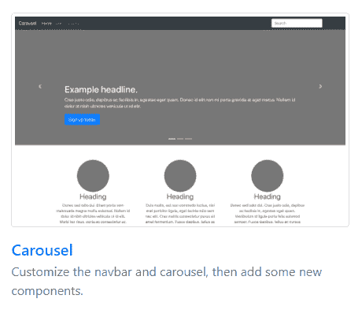

Example of a page you can create with [Bootstrap](https://getbootstrap.com/docs/4.0/examples/)** 

**这些框架的美妙之处在于它们预先打包了定制的 CSS 和 JavaScript。他们已经为你做了很多工作，比如预先设计好标题和按钮。**

**它们还带有 JavaScript 组件(本质上是小插件)，比如模态弹出窗口和导航栏。**

**因为你使用的是已经测试过的东西，这将使你的网站建设更加容易。唯一的警告是，你不应该变得过于依赖框架。**

**知道如何从零开始建立一个响应迅速的网站是无可替代的。**

****延伸阅读****

*   **[Designmodo.com 响应式设计的例子](https://designmodo.com/responsive-design-examples/)**
*   **[谷歌响应式网页设计基础](https://developers.google.com/web/fundamentals/design-and-ux/responsive/)**
*   **【W3Schools 的 Bootstrap 4 教程**
*   **[Zurb 基础教程](https://foundation.zurb.com/learn/tutorials.html)**

### **Sass 将节省你写 CSS 的时间和麻烦**

**一旦你掌握了 CSS 的基础知识，我就会开始学习 [Sass](http://sass-lang.com/) ，因为这简直太棒了。**

**甚至名字里都有！Sass 代表“语法上令人敬畏的样式表”在其网站上，它被描述为[“CSS 的扩展”](http://sass-lang.com/documentation/file.SASS_REFERENCE.html)**

**它使得编写你的 CSS 样式变得更容易、更直观、更快速。**

**不要误会，CSS 很棒。但是当你深入其中时，你会意识到普通的 CSS 会变得很乏味。而且，如果你在如何编写你的样式方面不是超级有条理的，你的 CSS 样式会很快变得令人沮丧地混乱。**

**萨斯给了你更多的权力和控制。**

**这里有几个例子可以说明 Sass 会让你的生活变得更轻松:**

*   **Mixins :你可以使用 Mixins，而不是为某些元素复制和粘贴 CSS 代码一百万次。它们允许您只为一个元素编写一组样式，并根据需要多次重用。**
*   ****嵌套:**不用编写特定样式的所有父类，您可以将所有子类嵌套在父样式中。这也减少了大量重复工作。**

**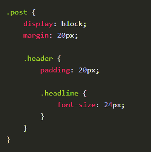

Here’s an example of using nesting in Sass.** 

**简而言之，使用 Sass 将节省您的时间和烦恼。值得花力气去学习它！**

****延伸阅读****

*   **[开始使用 Sass](http://thesassway.com/beginner/getting-started-with-sass-and-compass)**
*   **[Sass 基础知识](http://sass-lang.com/guide)**

**一个注意事项:由于浏览器本身不能读取 Sass 文件，您必须将您的 Sass 文件编译成 CSS。**

**为了做到这一点，你必须使用一种叫做构建工具的东西，并在你的电脑上运行它。**

**这就把我们带到了下一部分…**

### **不管怎样，所有这些构建工具是关于什么的？**

****

**你可能听说过下面的一个或几个术语:npm，Webpack，Grunt，Gulp，Bower，Yarn…这个列表变得很长！**

**这些工具通常被描述为构建工具、任务运行器、任务管理器，或者*“现在我需要安装什么？!"***

### **一些工具可以帮你完成繁重的工作(双关语！)给你**

**像 [Grunt](https://gruntjs.com/) 、 [Gulp](https://gulpjs.com/) 和 [Webpack](https://webpack.js.org/) 这样的构建工具通常用于完成以下一些任务:**

*   ****将** Sass 文件处理成 CSS**
*   ****串联**(组合)多个 CSS 文件或多个 JavaScript 文件成一个大的 CSS 或 JavaScript 文件。**
*   ****缩小**(压缩)CSS、JavaScript 甚至图像文件**
*   ****使用更新的 CSS 或 JavaScript 代码自动刷新**您的浏览器**

**当然，这些任务中有许多你可以自己动手完成。**

**但是每当你做一个小的 CSS 或 JavaScript 改变时，都不得不一遍又一遍地做，这很累人。**

### **您应该使用哪种构建工具？**

**目前，Webpack 正在接管这个领域，但 Grunt 和 Gulp 仍在使用。**

**我肯定会学习 Webpack，但学习 Grunt 或 Gulp 也无妨(Gulp 更快，似乎更容易启动和运行)。**

### **其他工具为您安装软件包(插件)**

**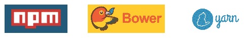**

**此外，为了完成所有这些任务，您通常需要下载并安装插件或软件包。**

**这就是像 [npm](https://www.npmjs.com/) (节点包管理器) [Bower](https://bower.io/) 或者 [Yarn](https://yarnpkg.com/en/) 这样的工具派上用场的地方。这些工具允许您通过在计算机的命令行中键入命令来快速安装软件包。**

**基本上，它们是让你获得更多工具的工具！**

**由于 **npm** 现在是占主导地位的包管理器，你肯定应该学习如何使用它。**

**Bower 是第一个包管理器工具之一，但是它已经正式过时了——Bower . io 的创建者现在推荐使用 Yarn。**

**Yarn 是一个非常类似 npm 的工具，由谷歌、脸书和其他公司创建，[承诺修复 npm 的一些问题。](https://scotch.io/tutorials/yarn-package-manager-an-improvement-over-npm)**

**虽然纱线是少数，我仍然建议检查一下，因为它似乎越来越受欢迎。**

****延伸阅读****

*   **[如何从头开始设置 web pack+2.0](https://codeburst.io/easy-guide-for-webpack-2-0-from-scratch-fe508a3ce44e)**
*   **[Javascript 工具——JS 的发展和未来&前端构建工具](https://blog.qmo.io/javascript-tooling-the-evolution-and-future-of-js-front-end-build-tools/)**
*   **[NPM vs 纱小抄](https://shift.infinite.red/npm-vs-yarn-cheat-sheet-8755b092e5cc)**

### **每个人都喜欢 JavaScript 框架**

**你可能已经注意到了很多 JavaScript 框架、库、工具包等等……你知道，这些名字都以“.”结尾。JS？”**

**让我们先退后一步，定义一下什么是 JavaScript 框架。**

**根据您的谈话对象，术语框架、库和/或工具包可能会也可能不会互换。这仍在争论中。)**

**但是它们本质上都是工具，令人惊讶的是，为你做了一些工作。**

#### **框架是一个预先构建的结构，您可以在其上进行构建。**

**一般来说，框架是由他人创建的工作部件的系统。**

**要使用这个框架，你需要把它安装到你自己的网站文件中。然后，你在现有结构的基础上工作，添加到它上面来完成你想做的事情。**

**使用框架就像买一栋有所有结构组件(地基、框架、屋顶)但并不完整的房子。**

**你还需要进去接水电，还要装橱柜，粉刷墙壁，装修。**

**JavaScript 前端框架的一些例子有 [React](https://reactjs.org/) 、 [Vue](https://vuejs.org/) 和 [Angular](https://angular.io/) 。**

#### **库是一组预制的工具，您可以将它们添加到自己的结构中。**

**相比之下，库是单个组件的集合，您可以将它插入到您自己的系统中。**

> ****这是框架和库的主要区别:****

> **虽然框架是预制的结构，但是库本身并不是一个结构。它们为现有系统提供了额外的功能。**

**继续房屋建筑的类比，你可以把图书馆想象成你选择添加到房子里的电器。**

**像烤箱、淋浴器和空调这样的机器都有不同的功能，但是你必须把它们安装到现有的房子里才能使用。**

**使用上述分类的库的一个例子是 jQuery。**

**jQuery 是一个 JavaScript 库，它本身没有任何结构，但是有超过 300 个不同的函数供你使用。**

**同样，这些定义并不是每个人都同意的。**

**React 和 jQuery 把自己归类为库，Angular 和 Vue 自称框架。**

**然而，就我个人的理解，将工具分成框架(系统)和库(工具)这两大类是有帮助的。**

**这就引出了我们的下一点…**

### **JavaScript 框架中的三巨头:Angular、React 和 Vue**

****

**在 2010 年初，以“.”结尾的框架激增。js，“几乎每个月都有新的。**

**然而，当我们接近 2020 年时，这个领域已经清理干净，我们只剩下三个大赢家:Angular，React 和 Vue。**

**JavaScript 框架可能已经开始成为一种趋势，但它们肯定会继续存在。**

**Angular、React 和 Vue 都在增长，JavaScript 本身现在非常受欢迎—[在 Stack Overflow 的年度调查中，它连续第五年成为使用最多的技术](https://insights.stackoverflow.com/survey/2017#most-popular-technologies)。**

**此外，Stack Overflow 还根据每月提问的数量来发布技术趋势。**

**您可以看到 Angular 的容量最大，并且 Angular 和 React 在过去的一年中都有相当大的增长。**

**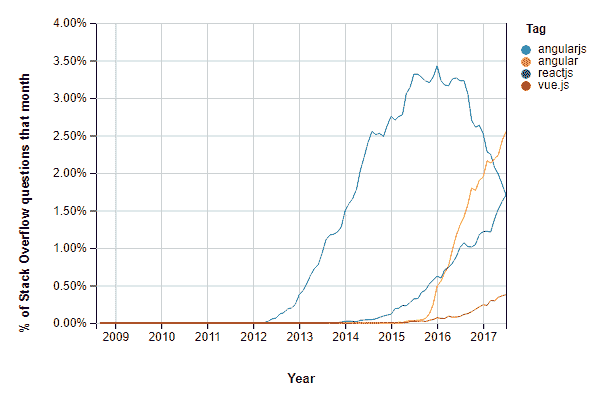

Source: Stack Overflow — [JavaScript Framework Trends](https://insights.stackoverflow.com/trends?utm_source=so-owned&utm_medium=blog&utm_campaign=trends&utm_content=blog-link&tags=angularjs%2Cangular%2Creactjs%2Cvue.js)** 

**JavaScript 调查的状况显示，React 在使用过它并喜欢它的开发人员数量上领先，而 Angular 似乎没有那么有趣，也没有那么大的重用欲望。**

**Vue 的实际使用量较低，但在成为开发者希望在未来尝试的技术方面处于领先地位。因此，Vue 有可能在未来几年成为更大的玩家。**

**然而，我认为这三者都存在，至少在未来几年内。**

### **TL，DR:我现在应该学习哪个框架？**

**视情况而定——如果你想找一份全职的网站开发工作，我会浏览你当地的工作列表，看看哪个框架似乎被提到得最多。**

**如果你现在刚刚开始学习，还没有明确的目标，Vue 对初学者来说是个不错的起点。它是轻量级的，并且有很好的文档记录。**

**但是，我个人不会只学 Vue。根据您的喜好，最终在您的工具带上添加“反应”或“角度”将是一个好主意。**

****延伸阅读****

*   **[2017 年最佳 JavaScript 框架、库和工具](https://www.sitepoint.com/top-javascript-frameworks-libraries-tools-use/)**
*   **[Noob 的 JavaScript 框架选择指南](https://webdesign.tutsplus.com/tutorials/the-noobs-guide-to-choosing-a-javascript-framework--cms-28538)**

****

### **第 3 部分:让我们进入后端**

#### **应该先学哪种语言？**

**有大量的后端语言。它们中的许多已经存在了相当长的一段时间，有些甚至在互联网存在之前就已经存在了！**

**这使得选择从哪种语言开始变得困难。为了缩小你的选择范围，我建议你在做决定时遵循以下原则:**

*   **选择一门可学的语言:它有一个合理的学习曲线，有很好的文档记录，和/或有一个好的在线支持系统。**
*   **选择一门与你最终职业目标相关的语言。**
*   **选择一门令人愉快的语言。学习 web 开发已经够难了——没有必要强迫自己去学习一门你真的不喜欢的语言。**

> **要记住的一件重要事情是，你不必学习每一种语言。**

> **事实上，如果你是初学者，我强烈建议你先专注于一门语言。**

**所有的编程语言都有一些共同的原则。**

**比如你可以用 JavaScript，PHP，C#和 Python 写一个“For”循环。**

**一旦你学会了用你的第一语言编程的基本原则，将这些概念移植到其他语言中就更容易了。**

**我希望这能减轻你选择学习第一种后端语言的压力？**

### **让我们来看看一些最流行的后端语言。**

****Java****

**[Java](https://www.oracle.com/java/index.html) 是一种稳定的语言，使用非常广泛，已经存在很长时间了。自 2001 年以来，它一直占据着 T2 TIOBE 指数的榜首。(TIOBE 是根据搜索次数对编程语言进行的排名。)**

**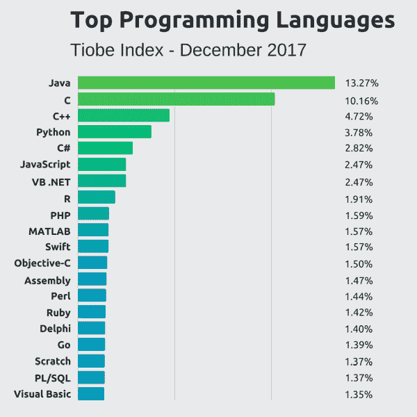

*Source: [Ben Putano](https://twitter.com/benjaminputano) on [Stackify.com](https://stackify.com/popular-programming-languages-2018/)*** 

**此外，Java 在栈溢出的最常用语言排名中排名第三，在栈溢出中排名第二的是 T2 标记问题。**

**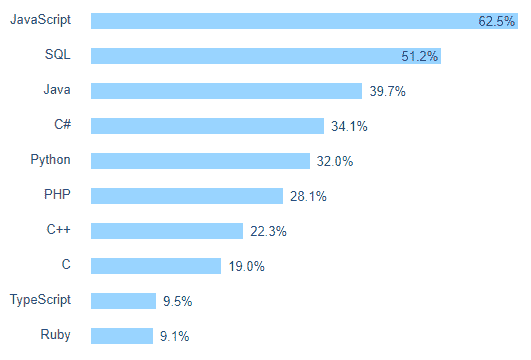

*Source: [Most Common Programming Languages](https://insights.stackoverflow.com/survey/2017#technology-programming-languages), Stack Overflow Developer Survey 2017*** 

**许多大型科技公司在他们的网站上使用 Java:谷歌、YouTube、脸书、亚马逊、推特等等。**

**其中一个原因是 Java 速度很快，可以扩展到处理大型网站。它也是一种一致的语言，允许更容易地维护长期项目。**

**Twitter 最初是用 Ruby on Rails 构建的。但在 2015 年，他们需要能够支持他们的巨大增长，所以他们[转向 Scala](https://www.quora.com/Why-did-Twitter-switch-to-a-Java-based-front-end-after-successfully-using-Ruby-on-Rails-with-200-million-users) ，一种在 Java 虚拟机上运行的语言。**

****C# (C 调)****

**C# 是微软创造的，是 Java 的竞争对手。你可以看到，C#在 2009 年达到了堆栈溢出趋势的顶峰，此后一直在走下坡路。**

**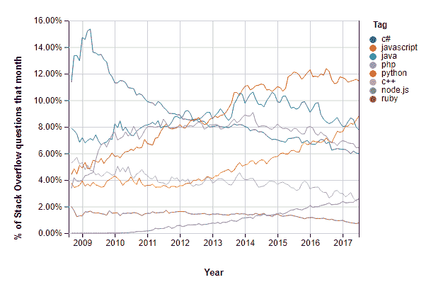

*Source: Stack Overflow [trends for back-end languages](https://insights.stackoverflow.com/trends?utm_source=so-owned&utm_medium=blog&utm_campaign=trends&utm_content=blog-link&tags=java%2Cpython%2Cc%23%2Cjavascript%2Cphp%2Cruby%2Cc%2B%2B%2Cnode.js)*** 

**但是我现在还不会把 C#排除在外。**

**这是一种强大的面向对象语言，拥有第三高数量的[堆栈溢出标签](https://stackoverflow.com/tags)。在 2017 年 12 月 Stackify 的[研究](https://stackify.com/popular-programming-languages-2018/)中，它在实际工作清单中最受欢迎的语言中排名第三。**

**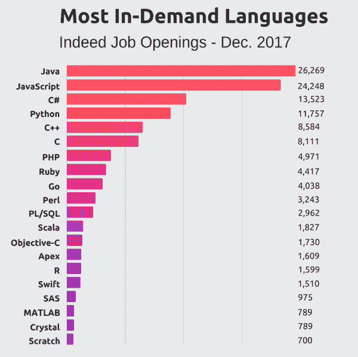

*Source: [Ben Putano](https://twitter.com/benjaminputano) on [Stackify.com](https://stackify.com/popular-programming-languages-2018/)*** 

**C#在各种各样的应用程序中使用，例如 Windows 桌面应用程序和 Android 编程。**

**它也在游戏开发中被大量使用，通过 [Unity 游戏引擎](https://www.quora.com/What-is-unity-game-engine/answer/Harshal-B-Kolambe)。因此，如果你对 Android 或游戏开发感兴趣，C#将是一个很好的学习选择。**

****Node.js****

**如前所述，在过去五年中，JavaScript 一直是堆栈溢出用户报告的最常用的语言。**

**这很大程度上与 [Node.js](https://nodejs.org/en/) 有关，它在 2017 年使用最多的框架和库的[列表](https://insights.stackoverflow.com/survey/2017#technology-frameworks-libraries-and-other-technologies)中名列榜首。**

**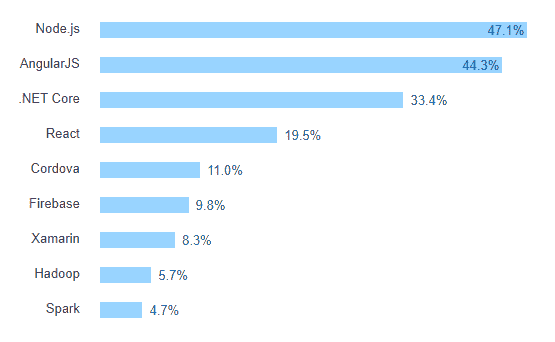

*Source: [Most Common Frameworks and Libraries](https://insights.stackoverflow.com/survey/2017#technology-frameworks-libraries-and-other-technologies), Stack Overflow Developer Survey 2017*** 

**Node.js 自诩为“JavaScript 运行时”，基本上是运行在后端的 JavaScript。**

**它最初的目的是作为 Apache HTTP 服务器的更有效的替代方案。自从 2009 年发布以来，Node.js 由于其快速、轻量级的特性，使用量稳步增长。**

**节点开发人员在构建 web 应用程序时经常使用 [Express](https://expressjs.com/) 框架。Express.js 是 Node.js 的“极简 web 框架”。**

**通过在后端使用 Node 和 Express，在前端使用 Angular 或 React，这意味着您可以成为全栈 JavaScript 开发人员。**

**这种技术组合目前非常流行，尤其是在初创公司中。**

****Python****

**Python 于 1991 年首次出现，是许多编程学生常用的“第一语言”。**

**由于它的可读性和英语关键词的使用，它被普遍认为是一种容易学习的语言。**

**有几个 Python 框架可供您使用:**

*   **Django (预建的功能，更多的铃声和哨声)，以及**
*   **[烧瓶](http://flask.pocoo.org/)(更小巧灵活)。**

**Python 近年来人气飙升。在撰写本文时，它在 TIOBE 指数上排名第 4 位。**

**根据他们的 2017 年回顾报告，2017 年它在 GitHub 上的拉请求数量排名第二。**

**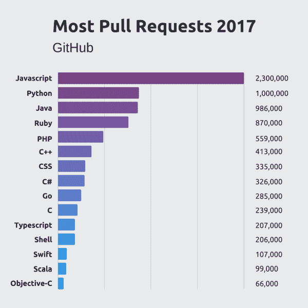

*Source: [Ben Putano](https://twitter.com/benjaminputano) on [Stackify.com](https://stackify.com/popular-programming-languages-2018/)*** 

**Stack Overflow [去年 9 月报道](https://stackoverflow.blog/2017/09/14/python-growing-quickly/)称，数据科学、机器学习和学术研究在很大程度上是这种快速增长的原因。**

**即使你不是数据科学家，处理和操作数据的能力也正在成为一项有用的技能。**

**代码学院的 Alexus Strong 写道:**

> **“Python 对我们这些非技术领域的人很有吸引力，因为它让数据分析变得触手可及。”**

**如果你对数据科学或机器学习感兴趣，Python 可能是一个非常好的选择，因为这些领域可能会在未来几年扩展。**

****红宝石****

**Ruby 于 1995 年首次发布。在 21 世纪初，当初创公司 [Basecamp](https://basecamp.com/about) 发明了框架 [Ruby on Rails](http://rubyonrails.org/) 时，它开始受到很多关注。**

**结合 Ruby 对初学者友好的语法和可读性，Rails 使得构建 web 应用程序变得非常快速和容易。**

**Ruby on Rails 越来越受欢迎，成为初创公司的首选框架。(Codepen.io、GitHub、 [Shopify](https://basecamp.com/about) [都使用](https://w3techs.com/technologies/details/pl-ruby/all/all) Ruby on Rails。)**

**然而，Ruby 从来都不是重量级人物。去年，它在 Stack Overflow 最常用语言排名和 T2 TIOBE 指数排名中都名列第十。**

**此外，Ruby on Rails 的可扩展性不是很好，导致那些初创公司最终在变得非常大的时候转而使用其他语言(就像我们上面提到的 Twitter 转而使用 Java)。**

**Ruby 可能不是排名最高的语言，但它仍然是你学习第一语言的一个不错的选择。**

**如果你对创业感兴趣，或者你所在的地区有很多 Ruby 工作，我会考虑学习 Ruby 和 Ruby on Rails。**

****PHP****

**PHP 是一种很多人又爱又恨的语言。**

**然而，尽管有很多 Quora 问题[询问 PHP 是否已死](https://www.quora.com/Is-PHP-dead-What-is-the-job-outlook-and-future-of-PHP-in-the-next-five-years)，事实仍然是 PHP 是当今使用最广泛的后端语言。**

**W3Techs.com 的研究显示 83%的网站使用 PHP。(第二高的语言是 ASP.NET 语，仅占 14%。)**

**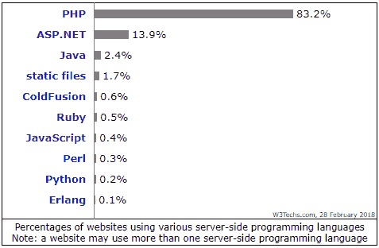

*Source: [W3Techs.com](https://w3techs.com/technologies/overview/programming_language/all)*** 

**内容管理系统(CMSs)是 PHP 拥有巨大市场份额的主要原因。前三大 CMS(WordPress、Joomla 和 Drupal)都是用 PHP 开发的。**

**WordPress 本身拥有 CMS 市场的最大份额，占所有网站的 29.5%。**

**如果你喜欢使用它，WordPress 开发可能是一个定制网站和构建插件或主题的好地方。**

**除了内容管理系统之外，PHP 还有一些框架可以使开发变得更加容易和快速。2011 年问世的框架 Laravel 是目前最流行的一个。**

****延伸阅读****

*   **[后端开发初学者指南(Upwork.com)](https://www.upwork.com/hiring/development/a-beginners-guide-to-back-end-development/)**
*   **[服务器端网络框架(Mozilla 开发者网络)](https://developer.mozilla.org/en-US/docs/Learn/Server-side/First_steps/Web_frameworks)**
*   **什么是最适合我的编程语言？**

### **使用数据和数据库**

**

Source: [Sherchle](https://giphy.com/gifs/art-design-illustration-l0HlN5Y28D9MzzcRy) via GIPHY** 

**如果你不熟悉数据库的话，它们可能看起来令人生畏。**

**然而，如果你仔细想想，你可能已经在你自己的生活中处理和使用过数据。**

**如果你曾经使用 Excel 来组织数据，或者创建一个图表来跟踪你的目标，那么你已经完成了一个类似于数据库的功能(尽管简单得多)。**

### **我需要学习什么来使用数据库？**

**幸运的是，你不需要学习大量不同的语言。主要的数据库语言是 [SQL](https://en.wikipedia.org/wiki/SQL) (读作*续*)。**

**SQL(结构化查询语言)是由 IBM 在 20 世纪 70 年代创造的，用于 T2 的关系数据库。**

**关系模型是将数据组织成行和列的一种方式(就像 Excel 电子表格一样)。**

**每一列都被指定用于某种类型的数据，并且可能要求数据的格式正确。每一行或每一条记录除了包含列或字段值之外，还包含一个唯一的 ID 或键。**

**你可以在下面看到这个:**

**

A simple spreadsheet similar to how data is stored in a table. The Rent column would require numeric values.** 

**然后，这些记录被存储在称为表的多个集合中。表的集合(以及其他东西)构成了整个数据库模式或结构。**

**SQL 数据库系统的主要类型有:**

*   **[MySQL](https://www.mysql.com/) (用于 PHP 和开源应用)**
*   **[微软 SQL Server](https://www.microsoft.com/en-us/sql-server/sql-server-2017) (一般用于。网络应用程序)**
*   **[PostgreSQL](https://www.postgresql.org/) (开源)**

****NoSQL****

**尽管 SQL 是数据库的主要类型，但还有另一种类型:NoSQL(即非 SQL)。顾名思义，NoSQL 数据库在某些方面与传统的 SQL 数据库相反。**

**[NoSQL](https://en.wikipedia.org/wiki/NoSQL) 不是关系型的，[不像 SQL 那样强制](https://www.infoworld.com/article/3240644/nosql/what-is-nosql-nosql-databases-explained.html)相同类型的结构。相反，您可以在更自由、更灵活的系统中存储任何类型的数据。**

**这创建了更快的过程，并且更适合于大型复杂的应用程序。缺点是牺牲了数据的一致性。**

**正如 Sitepoint [的克雷格·巴克勒在](https://www.sitepoint.com/sql-vs-nosql-differences/)中写道:**

> **NoSQL 更加灵活和宽容，但是能够在任何地方存储任何数据会导致一致性问题。**

**NoSQL 在 21 世纪初越来越受欢迎，因为脸书和亚马逊等大型科技公司需要一种快速的方法来操作和存储数据。**

**[MongoDB](https://www.mongodb.com/) 是最常用的 NoSQL 系统。根据 [Hackernoon](https://hackernoon.com/top-4-nosql-databases-infographic-b6acc389befc) 的说法，其他顶级类型是 Cassandra、Elasticsearch 和 Couchbase。**

****SQL vs NoSQL？****

**您可能会遇到关于 NoSQL 是否正在取代 SQL，或者哪一个更好的讨论。事实是，这两种类型的数据库都有各自的优点和缺点。**

**像其他事情一样，正确的选择会随着项目和工作的不同而改变。就个人而言，我建议学习 SQL 和 NoSQL 的基础知识。**

****延伸阅读****

*   **[SQL 的历史](https://www.thebalance.com/what-is-sql-and-uses-2071909)—TheBalance.com**
*   **[SQLCourse.com](http://www.sqlcourse.com/intro.html)—关于 SQL 的免费在线教程**
*   **[SQL 与 NoSQL 的区别](https://medium.com/xplenty-blog/the-sql-vs-nosql-difference-mysql-vs-mongodb-32c9980e67b2) — XplentyBlog**
*   **[NoSQL 解说](https://www.mongodb.com/nosql-explained) — MongoDB**

### **在服务器上创建网站**

****

**正如我们在开始时提到的，服务器只是存储网站文件和其他资源(如数据库)的计算机。**

**为了在互联网上公开访问网站，需要将其安装在服务器上。**

**为了创建一个实时网站，你需要做以下事情:**

#### ****域名和 SSL 证书****

**域名是网站的地址，如 Google.com、Wikipedia.org 或 Dartmouth.edu。**

**为了得到一个，你必须选择一个可用的，然后从域名注册商那里购买，比如 Namecheap.com 或 T2 的谷歌域名。**

**这些公司向互联网名称与数字地址分配机构注册域名。**

**ICANN 是监督和管理全球互联网的 DNS(域名系统)和 IP(互联网协议)领域的中央组织。**

**除了域名之外，您还应该为您的域获得一个 SSL(安全套接字层)证书。SSL 将[加密你网站上的流量](https://www.digicert.com/ssl/)，这将有助于保护它免受网络攻击。**

#### ****Web 主机服务器空间****

****

**一旦你有了 AwesomeStupendousAmazingSite.com 的域名，你就需要购买服务器空间。**

**有几个不同层次的虚拟主机计划:**

*   **共享服务器:最便宜的选择，从每月几美元到 12-20 美元不等。听起来，你与其他网站“邻居”共享你的服务器空间好处是负担得起，坏处是速度较慢，如果超过一个月的使用量，可能会停机。热门主机有 [SiteGround](https://www.siteground.com/) 、 [Bluehost](https://www.bluehost.com/) 和 [WP 引擎](https://wpengine.com/)。**
*   ****云服务器:** [云托管](https://www.interoute.com/what-cloud-hosting)是一个相对较新的选择。它由大量物理服务器组成，这些服务器的资源都是共享的。然后，每个单独的“租户”都有一个虚拟服务器，从集合池中提取资源。这种设置为带宽提供了更大的灵活性，并且可以快速扩展。一家名为[数字海洋](https://www.digitalocean.com/)的公司专门经营云服务器。价格取决于您的服务器规格，从每月几美元到近 1000 美元不等。**
*   ****VPS(虚拟专用服务器):**VPS 类似于云托管，每个租户都有自己的虚拟服务器，所有租户共享一个物理服务器。这比共享主机更好，因为你被分配了你自己的服务器资源。这个选项有点贵，每月 20-60 美元(根据 [BlueHost](https://www.bluehost.com/products/vps) )。**
*   ****专用服务器:**这些服务器为您提供一个完全属于您自己的完整物理服务器。可以想象，这个选项是最强大的，但也是最昂贵的。它们通常也是托管服务器，这意味着公司将为您运行维护和执行其他任务。根据 SiteGround 的定价，专门的虚拟主机通常每个月要花费你几到几百美元。**

#### ****服务器设置和维护****

**一旦你有了域名和服务器空间，你就必须在服务器上建立你的网站。**

**这包括将您的域名定向到您的服务器的唯一 IP 地址，设置您的网站文件和数据库(如有必要)，以及其他配置。**

**你需要做多少工作取决于你从你的网络主机上购买的服务器计划的类型。最简单的共享计划通常带有一键功能，可以自动为你安装 WordPress、Drupal 或其他网站。**

**其他服务器，如数字海洋，非常小，需要你手动设置。**

#### ****将文件部署到您的服务器上****

**您可能想知道如何将文件从自己的计算机上传到服务器。您可以通过使用[协议](https://en.wikipedia.org/wiki/Communication_protocol)来实现这一点，这基本上是一种向服务器传输文件或其他数据的方法。**

> ****边注:**
> HTTP，你的浏览器加载网站的方式，也是一种协议——HTTP 代表超文本传输协议。**

**最简单的方法是使用一种叫做 [FTP](https://en.wikipedia.org/wiki/File_Transfer_Protocol) (文件传输协议)的协议。然而，不建议再使用 FTP，因为它不安全(加密)。**

**现在大多数人使用更安全的协议 FTPS(基于 SSL 的 FTP)或 SFTP(安全外壳 FTP)。**

**要使 FTP/SFTP 正常工作，您需要在您的服务器上创建一个帐户。然后，您将使用服务器的 IP 地址、用户名和密码登录以进行身份验证，从而连接到服务器。**

**为了通过 FTP/SFTP 传输文件，你可以使用像 [Filezilla](https://filezilla-project.org/) 或 [CyberDuck](https://cyberduck.io/) 这样的程序。这些都有一个图形用户界面(GUI ),可以相对容易地从您的计算机和服务器上传和下载文件。**

#### ****部署工具****

****

**正如你可能想象的那样，每次做一点点代码更改都必须手动将文件上传到你的服务器，这可能会很乏味。此外，如果多人同时处理同一个文件并上传，事情会变得混乱。**

**幸运的是，您可以设置链接到 Git 存储库的部署。**

**部署工具存储您的 FTP/SFTP 设置，例如，当您将 Git 中的更改推送到您的主分支时，该工具将为您传输文件。这样你就不需要记住你修改了哪些文件，减少了你犯的错误。**

**对于有几个人的团队的更复杂的网站，有更高级的部署工具和系统可以用来使您的部署更加结构化。**

**这些系统超出了本文的范围，但是它们包括诸如[持续集成](https://aws.amazon.com/devops/continuous-integration/)的实践。**

****延伸阅读****

*   **[域名注册流程](https://whois.icann.org/en/domain-name-registration-process) — WHOIS**
*   **[8 种流行的虚拟主机服务](https://www.thebalance.com/types-of-web-hosting-services-2532072)—TheBalance.com**
*   **6 个最佳 FTP 客户端 — WP 初学者**
*   **[持续集成、持续交付和持续部署](https://www.atlassian.com/continuous-delivery/ci-vs-ci-vs-cd) — Atlassian**

### **恭喜你。！**

****

**你成功了！**

**现在，在我们继续资源列表之前，请注意以下部分包含一些附属链接。这意味着，如果你通过链接购买，我将从公司收到一小笔佣金。**

**这是一个简单的方法，你可以支持写这些类型的文章，不需要额外的费用。(我也包括了非附属链接，如果你喜欢使用的话。)**

### **结语:推荐的学习资源**

**我相信你知道，有大量的资源可以用来学习代码。**

**我在这里收录了一些最受欢迎和推荐的在线教程、书籍和其他资源。**

### **完成网络开发课程**

**有一些在线课程涵盖了所有或非常接近所有的 web 开发领域。**

**如果你不想跳来跳去，只想集中在一个地方学习一切，我会推荐以下一个或多个:**

**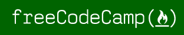**

**[**【freeCodeCamp】**](https://www.freecodecamp.org/)**是一个为有抱负的 web 开发者提供完全免费教育的非营利组织。****

****他们的课程是从前端到后端(使用 Node 和 Express)的一整套课程，还有更多！****

****许多人在参加 freeCodeCamp 后获得了全职工作。你也可以通过 GitHub 为[开源项目](https://www.freecodecamp.org/nonprofits/)做贡献。****

****freeCodeCamp 的一个主要好处是它非常以社区为中心，有留言板和脸书小组，所以你在学习的时候可以得到很多支持。****

****你可以在 [Quora](https://www.quora.com/How-did-Free-Code-Camp-change-your-life) 和 [Reddit](https://www.reddit.com/r/learnprogramming/comments/4cen3v/a_review_of_freecodecamp_the_first_25_hours_from/) 上阅读一些关于 freeCodeCamp 的评论。****

********

******柯尔特·斯蒂尔网络开发者训练营** *( [附属链接](https://www.udemy.com/the-web-developer-bootcamp/?siteID=T4jMTDexBoM-4eq5n6HlbL7PAfBCL8SWqw&LSNPUBID=T4jMTDexBoM) / [非附属链接](https://www.udemy.com/the-web-developer-bootcamp/) )*****

****Colt 是一名前编码训练营教练，他想以低廉的价格提供一个完整的训练营。****

****他最终在 Udemy 上创建了一个最受欢迎、评价最高的 web 开发人员课程，这是有充分理由的。****

****他的课程带你从基础到全栈开发(使用 Node 和 Express 作为后端)，内容很多，更新频繁。****

****你可以在 Udemy 页面以及自由代码营[论坛的帖子](https://forum.freecodecamp.org/t/the-web-developer-bootcamp-udemy-review/61595/4)上阅读对他课程的[评论](https://www.udemy.com/the-web-developer-bootcamp/#reviews)。****

********

****优达城提供免费的 T2 课程和付费的 T4 纳米学位课程。****

****纳米学位建立在免费课程的基础上——它们是密集的(12 小时/周)项目，在那里你可以建立投资组合项目，并有更多的社区互动和支持。****

****它们并不便宜，目前每月 199 美元，完成一个可能需要 6 到 10 个小时。****

****如果你感兴趣，这里有一些关于 Udacity 的纳米学位课程在 [Quora](https://www.quora.com/Are-Udacity-Nanodegrees-worth-it-for-finding-a-job) 和[黑客新闻](https://news.ycombinator.com/item?id=9313088)上的评论， [Quora 回答了](https://www.quora.com/What-is-the-difference-between-a-Udacity-nanodegree-degree-program-and-free-courses)关于 Udacity 的免费课程与纳米学位的区别。****

### ****其他资源****

********

****[**团队树屋**](https://teamtreehouse.com/tracks) 是一个非常流行的学习编码的网站。他们没有免费的内容，但他们使用订阅模式。****

****Treehouse 提供分层月计划(目前为每月 25 美元或 55 美元),你可以参加无限的课程。****

****如果你想休息几个月，你甚至可以暂停你的会员资格，等你准备好了再继续。****

****除了个别课程之外，他们还有结构化的课程，如 Java Web 开发或前端 Web 开发，指导您完成一系列选定的课程。****

********

******Udemy** *( [附属链接](https://www.udemy.com/courses/development/web-development/?siteID=T4jMTDexBoM-BdAzoxv_nMbWPIUjULEsSg&LSNPUBID=T4jMTDexBoM) / [非附属链接](https://www.udemy.com/courses/development/web-development) )*****

****Udemy 是最大的在线学习平台之一，不仅有编码方面的课程，还有其他专业和业余爱好领域的课程。****

****你为每门课程单独付费，他们经常打折，每门课程从 10-20 美元不等。****

****当然，由于课程数量多，授课老师多，质量参差不齐，所以买之前要做好调研。****

****我建议在 Udemy 课程页面和网上其他地方查看评分和评论。****

********

****[**韦斯·博斯**](http://wesbos.com/courses/) 是一位 web 开发讲师，他已经创建了相当多非常受欢迎的课程。****

****我肯定会检查的一门课程是 **JavaScript30** *( [附属链接](https://javascript30.com/friend/CODERCODER) / [非附属链接](https://javascript30.com/) )* 。这是他的 30 天免费香草(意味着没有框架或库)JavaScript 编码挑战。****

****他的网站上还有 React、Node 和更高级的 JavaScript 的高级课程。****

****如果你好奇，这里有一些他在 Reddit 和 T2 自由代码营论坛上的课程评论。****

********

****[**微软虚拟学院**](https://mva.microsoft.com/)**【MVA】**有一系列免费的在线课程，从 C#和 Python 到 SQL Server 以及游戏开发等其他领域。****

****他们的一些热门课程是[Python 编程入门](https://mva.microsoft.com/en-us/training-courses/introduction-to-programming-with-python-8360)、 [C#基础](https://mva.microsoft.com/en-US/training-courses/c-fundamentals-for-absolute-beginners-16169)和 [SQL 数据库基础](https://mva.microsoft.com/en-US/training-courses/sql-database-fundamentals-16944)课程。****

****这里有几张 MVA 课程在 Reddit 和 LinkedIn 上的评论。****

********

****SoloLearn 有一种学习编码的独特方法:你不仅可以从他们的网站上学习，还可以在他们的免费移动应用上学习。****

****他们最受欢迎的课程包括 Python、C++和 Java。****

****他们还有一个 StackOverflow 类型的留言板，里面有很多活跃的问题和讨论。****

****如果你好奇，你可以在 Reddit 和 T2 Quora 上查看一些关于 SoloLearn 的评论。****

### ****书****

****如果你喜欢从书中学习，或者想要一些现成的参考资料，这里有一个简短的列表，我认为对初学者来说是不错的。****

****其中一些是免费的，你可以在网上阅读，其他的是传统的纸质书。****

****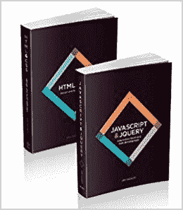****

****乔恩·达克特
*( [附属链接](http://amzn.to/2GNgyFt) / [非附属链接](https://www.amazon.com/gp/product/1118008189) )*****

****乔恩·达克特
*( [附属链接](http://amzn.to/2EZOq1m) / [非附属链接](https://www.amazon.com/gp/product/1118531647) )*****

****Jon Duckett 的书很可能是最受初学 web 开发人员欢迎的书籍。****

****它们不只是简单的教科书，而是设计精美的书籍，使用照片和插图来教授编码概念。****

********

****[**《前端开发者手册》**](https://www.gitbook.com/book/frontendmasters/front-end-developer-handbook-2018/details) 是由[前端大师](https://frontendmasters.com/)和[科迪·林德利](http://codylindley.com/)撰写的免费在线书籍。****

****它每年更新一次，你可以把它看作是一个“前端 web 开发的状态”指南，包含与该领域相关的新信息、资源、趋势和工具。****

****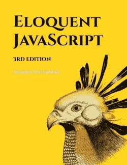****

****[**口才 JavaScript**](http://eloquentjavascript.net/) 是一本专注于 JavaScript 的编程入门书。****

****你可以在网站上免费在线阅读，网站上有一个简洁的控制台工具，你可以在阅读时编写和测试代码。****

****如果你想要实体书，这本书也可以在亚马逊 *( [附属链接](http://amzn.to/2EVJYof) / [非附属链接](https://www.amazon.com/Eloquent-JavaScript-2nd-Ed-Introduction/dp/1593275846) )* 上买到。****

### ****结束语****

****有没有可能利用网上资源自学 web 开发？我相信答案是肯定的。****

****然而，这一点也不容易。学习和掌握任何东西都很难，学习编码也不例外。****

****记住这一点，如果你真的想走这条路，这里有一些建议:****

#### ****保持专注。****

****当你独自学习时，从一个教程跳到另一个教程是很有诱惑力的。尤其是当你开始遇到障碍的时候。****

****但这会导致学习非常肤浅，而实际上你需要发展更深层次的技能知识。****

****试着坚持你正在学习的课程/书，除非你真的不喜欢它。克服障碍会帮助你对材料有更全面的理解。****

****你处理的看似不可能的问题越多，你就越习惯面对挑战。****

#### ****任何课程都只是你学习旅程的第一步。****

****仅仅参加一个教程或课程并不意味着当你完成的时候你会成为一个大师。在你真正“理解”它之前，你必须学习和练习很多次。****

****试着再读一遍教程，或者甚至用不同的课程或书籍学习相同的材料。****

****你会看到不同的人如何解释同一个概念，这可能有助于知识更好地留在你的大脑中。****

****当然，实践经验是不可替代的。****

****当你学习的时候，试着自己练习你正在学习的技能。建立随机项目，为朋友或非营利组织免费制作一个网站。你解决一个问题的次数越多，你就越能理解它。****

### ****感谢阅读！****

********

****我真的希望这篇文章对你有帮助！****

****欢迎在下面留下你的想法或反馈。****

#### ****想要更多吗？****

****我在我的博客上写网页开发教程，[Coder-Coder.com](https://coder-coder.com)！****

****你可能会喜欢的其他博客文章:****

*   ****[使用 flexbox 构建一个响应式网站布局](https://coder-coder.com/build-flexbox-website-layout/)****
*   ****[学习 web 开发的最佳书籍](https://coder-coder.com/best-web-development-books/)****
*   ****[学习 web 开发的最佳课程](https://coder-coder.com/best-web-development-courses/)****

****我还在 Instagram 上发布小技巧，在 T2 的 YouTube 上发布编码教程。****