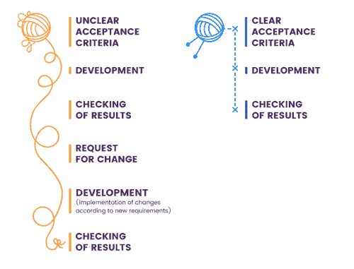

# 验收标准为书面验收标准

> 原文：<https://www.freecodecamp.org/news/the-acceptance-criteria-for-writing-acceptance-criteria-6eae9d497814/>

由 Elijah Valenciano

Image by [DirectWorksMedia](http://www.directworksmedia.com/blog/2015/10/12/getting-know-agile-software-development-team/)

# **书写验收标准的验收标准**

许多开发团队太熟悉不令人满意的验收标准或者甚至缺乏标准本身的沮丧。定义无需求就像在没有行动计划的情况下准备战斗——团队走向失败的步伐比走向成功的步伐要多。我提供了制定验收标准的具体建议，可以改进任何敏捷过程。

首先，让我们快速定义验收标准。

> 验收标准是“软件产品被用户、客户或其他利益相关者接受所必须满足的条件。”(微软出版社)

很简单，对吧？不完全是。在这一点上，我会问自己，我对接受标准的定义是否到此为止了。除了上述定义，任何产品所有者都应该准备好以下问题的答案:

> 这些条件是什么样的？谁创造了这些条件？应该有多少条件？如何衡量结果？

通常，验收标准是由产品所有者或利益相关者发起的。它们是在任何特性开发之前编写的。他们的角色是为业务或以用户为中心的观点提供指导。

然而，编写标准不仅仅是产品负责人的责任。验收标准应该由开发团队和产品所有者共同制定。

将这些标准结合在一起有助于开发团队理解需求特征。这也有助于产品所有者抓住遗漏的细节。此外，所有者可以更好地理解可行性、复杂性和范围。

Image by [Maryna Z. & Dmiriy G](https://rubygarage.org/blog/clear-acceptance-criteria-and-why-its-important).

### 格式化验收标准

标准可以用多种格式编写。大多数团队倾向于两种特定类型:**面向规则的**或**面向场景的**。

面向规则的需求是直接的。他们列出了可观察到的结果。"认证成功后显示对账单余额."

另一方面，面向场景的标准倾向于遵循“给定…当…然后…”模板。这源于行为驱动开发(BDD)。该要求概述了预期的可观察结果。这发生在*当*一个特定的动作被执行*给*一些上下文时。

### **3 有效验收标准的特征**

#### **1。可测试，有明确定义的通过/失败结果**

有可测试的标准。这允许测试人员正确地确认所有期望的条件已经满足。如果标准不可测试，那么就没有验证的方法。这些标准要么符合，要么不符合。开发人员应该知道达到标准的点。任何含糊不清都可能延长故事的时间。

例如，验收标准规定“增加下拉菜单中可用条目的数量”。开发人员不知道要添加多少新条目，可能会根据他对产品的经验随意假设一个数字。同样地，一个手工测试者可能会有同样的自由，并假设一个不同的增加定义。这导致了一种混乱，这种混乱会反过来影响到产品所有者。

#### 2.明确而简洁

这就是写作验收标准成为一门艺术的地方。学术论文强调清晰和简洁的重要性。类似地，编写验收标准要求同样的组织和关注水平。

类似于写一篇文学作品，必须把观众记在心里。阅读验收标准的人必须理解所写的内容。否则那些话完全没用。如果它们冗长且充满术语，那么所概述的条件的要点可能不会被理解。当时间紧迫时，许多人会在浩如烟海的文字中忽略重要的细节。即使没有时间限制，许多人也能轻易地掩饰冗长的广告。

不要责怪别人没有仔细阅读，你可以主动提出易于阅读、直截了当、没有多余细节的接受标准。

#### 3.建立共识

这可能是最重要的特征，也是最理所当然的特征。如果团队的所有成员都不在同一个页面上，那么过程和生产力就会受到危害。让开发团队在继续开发之前审查验收标准，可以最大限度地减少混淆。应对标准进行澄清，并相应更新标准。

我有过所有团队成员都参与编写验收标准的经历。它让每个人都能理解故事的所有部分。它还为团队成员提供了提出问题和想法的机会。然而，这样的过程可能并不总是理想的，尤其是对于较大的团队。

尽管如此，重要的是每个成员都能阅读验收标准。从这里开始，每个成员都应该了解如何完成这个故事。不管是开发还是测试。

### **当过多成为问题时**

我们已经探讨了不明确的接受标准的危险。这导致了在故事中引入无关特征的风险。然而，令人惊讶的相反情况也可能存在:验收标准可能变得过于详细。

> **“验收标准应说明意图，而不是解决方案”(** Segue Technologies **)**

提供“是什么”(意图)而不是“如何”(实现)的蓝图。否则，开发团队可能会失去探索不同方法来解决问题的机会。在这些方面，在对解决方案进行初步思考之后，可能会想到更好的实现。

一旦你写下了你的接受标准，你可能会问自己，“多少是太多了？”
我见过从零接受标准到超过 15 的故事(或者至少感觉是这样)。

根据经验，我个人喜欢看到每个故事有三到八个验收标准。然而，接近上限，大约五个或更多的接受标准，我会检查可管理性。我会仔细检查，看这个故事是否能被分解成更小、更易管理的故事。

其他人会不同意，认为八个已经太多了。然而，我喜欢在不牺牲简洁性的前提下，尽可能多地提供“是什么”的细节。

### **现在怎么办？**

好吧，我撒谎了。我没有提供一个详尽的验收标准列表来编写验收标准。诸如简明、清晰和理解等期望的特征是主观的。我希望他们是。

我认为写作验收标准没有“正确”的格式。他们的正确性是由团队的效率来衡量的。

我强烈建议一开始就使用模板。他们为许多团队提供了一个稳固安全的结构，促进了良好的验收标准的编写。然而，不要让这种结构阻止你进入可以提高效率和效能的想法。

如果你是一个产品所有者或者客户，正在编写验收标准，我建议你向你的开发团队询问关于当前验收标准的反馈。通过一点小心、实践和组织，制定有效的验收标准成为改进任何团队工作流程的强大工具。

### 更多阅读

*   https://ruby garage . org/blog/clear-acceptance-criteria-and-why-its-important——作者 Maryna Z .和 Dmiriy G
*   史蒂夫·波维拉蒂斯的《https://www.leadingagile.com/2014/09/acceptance-criteria/》
*   [https://www . seguetech . com/what-characters-make-good-agile-acceptance-criteria/](https://www.seguetech.com/what-characteristics-make-good-agile-acceptance-criteria/)Segue Technologies
*   [http://agileforgrowth . com/blog/acceptance-criteria-check list/](http://agileforgrowth.com/blog/acceptance-criteria-checklist/)——卡姆莱什·拉夫拉尼