# 剖析每月收入 1000 美元的引导仪表板

> 原文：<https://www.freecodecamp.org/news/the-anatomy-of-a-bootstrap-dashboard-that-earns-1-000s-each-month-ed3404010d25/>

我们在 [Creative Tim](https://www.creative-tim.com/) 一直希望为所有使用我们产品的网络开发者提供优秀的工具。如果你想了解更多关于我们如何建立我们的业务以及我们的驱动力是什么，你可以查看这篇文章:[将一个副业项目发展成一个 17，000 美元的月业务](https://medium.freecodecamp.com/growing-a-side-project-into-a-17-000-month-business-46024d2aa87f)。

我们希望在互联网上看到更好的网站和网络应用。因此，我们决定分享一些“秘密成分”，它们构成了我们最受欢迎的仪表盘之一的基础: [Light Bootstrap Dashboard](http://demos.creative-tim.com/light-bootstrap-dashboard/dashboard) 。当然，它们将不再是秘密，因为我们将与你分享它们。？

在这个案例研究中，我将分享我们如何产生创建仪表板的想法，我们从哪里获得灵感，我们如何实现一切，它如何在斯坦福大学的内部工具中使用，以及我们如何为开发和支持它提供资金。下面是这篇文章的概述:

1.  基本结构和核心功能
2.  设计是如何产生的
3.  构建在开源之上，以及为什么您应该站在巨人的肩膀上
4.  发射，升起，闪耀
5.  我们如何为支持和解决开发者的请求提供资金
6.  未来发展计划

我会尽量给出更多的信息，希望本教程不会是这样的:

### 1.基本结构和核心功能

您应该将创建仪表板背后的过程视为在您学到很多知识之后必须进行的一次测试。当然，在产品开发过程中，你会学到很多东西。但是首先，你需要对什么是“那个”以及它如何“被使用”有很强的了解。在写第一行代码之前，你应该做一些研究，制定计划，创建待办事项列表和草图，并尝试想象你最终想要什么。

既然你不是多此一举，你就需要四处看看那些创造出伟大产品的公司来获得灵感(比如 [Heroku](https://dashboard.heroku.com/) 、 [Slack](https://slack.com/) 、 [Mailchimp](https://mailchimp.com/) 、 [Stripe](https://stripe.com/) )。还要看你的竞争对手。你会得到很多信息。而且当你开始的时候，开发产品会更容易，因为你做了功课。在开始切割之前，你必须磨快你的斧子:

> "如果我有八个小时砍树，我会花六个小时磨利我的斧头。"—亚伯拉罕·林肯

我们做了功课，我们有一个超过 100 个免费仪表板的巨大列表，作为我们可以从中获得灵感的例子。以下是其中的一些:

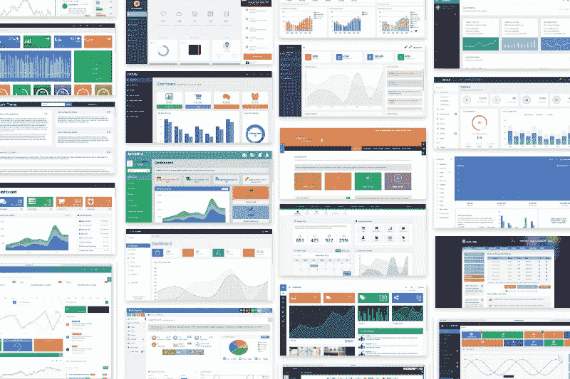

你有一个巨大的仪表板列表，有许多颜色、动画、漂亮的图标、小图表、大图表、静态或固定的侧边栏和数百种不同的功能。你如何知道哪一个对你的观众来说是最好的选择？

由于我们不知道人们想要什么样的仪表板，我们决定写下这些仪表板包含的所有功能，并且只使用最常用的功能。我们意识到**的核心特性**可以解决 95%的需要仪表盘的情况。剩下的 5%解决非常具体的问题。

基本元素是按钮、图标、版式、侧边栏、主面板、导航条和下拉框。大多数仪表板的核心功能是:

1.  桌子
2.  通知
3.  任务列表
4.  卡片(用于不同类型的表格和更容易可视化的信息)
5.  图表(圆环图、折线图、条形图)
6.  谷歌地图

通过微小的视觉调整，您可以使用核心元素复制世界上任何公司的任何仪表板的 95%。然后你还有剩下的 5%，根据公司和解决的问题不同，这个比例总是不一样的。在这里我们可以找到:

1.  [看板系统卡](https://en.wikipedia.org/wiki/Kanban)
2.  [拖动&放下](https://en.wikipedia.org/wiki/Drag_and_drop)功能
3.  时间轴组件
4.  所见即所得编辑器
5.  8 级导航侧栏菜单
6.  多文件上传+拖放文件上传
7.  表格 X-可编辑
8.  莫里斯图表，谷歌图表，Flot 图表，amChart，流程图和许多其他类型的图表
9.  该列表还可以继续列出 200 多种功能

问题是这些新插件都增加了额外的 CSS、JavaScript 或 jQuery 库以及 HTML。我们已经在普通的 HTML 上构建了产品，没有框架或模块化技巧，所以所有的 CSS/JavaScript 都在一个文件中。

不要误会我的意思，我不是说功能不好。这些都是很棒的人开发的插件。但这不是我们想在简单的仪表板上看到的东西。

所以我们决定让产品尽可能轻(还记得名字吗？).**灯光自举仪表盘**。我们决定只实现解决 95%核心问题的特性。

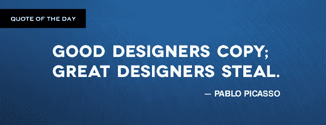

### 2.设计是如何产生的

在我们为产品的元素制定计划后，我们必须想出一个杰出的设计。一个用户友好的设计，使人们希望在他们的内容管理系统中有这个仪表板。我们已经有了著名的 Bootstrap [搞定狗屎套件](http://demos.creative-tim.com/get-shit-done/index.html)。网络开发人员非常喜欢它，它已经被下载了 30，000 多次。所以我们决定把它作为按钮、导航条、输入等基本元素的核心设计。

我们意识到我们需要更多的东西来产生影响，让人们非常想要我们的产品。我们不想成为“另一个基于 Bootstrap 的仪表板”。当你想要很棒的设计资源时，你会去哪里？

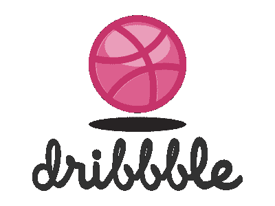

如果你在 Dribbble 上搜索“ [dashboard](https://dribbble.com/search?q=dashboard) ”，你会发现很多非常漂亮的仪表盘和管理面板。实际上，对于那些不知道的人来说， [Dribbble](https://dribbble.com/) 就像视觉可卡因。看看来自 CreativeMints 的 [Cosmin Capitanu](https://dribbble.com/radium) 和 [Mike 做的一些例子:](https://dribbble.com/creativemints)

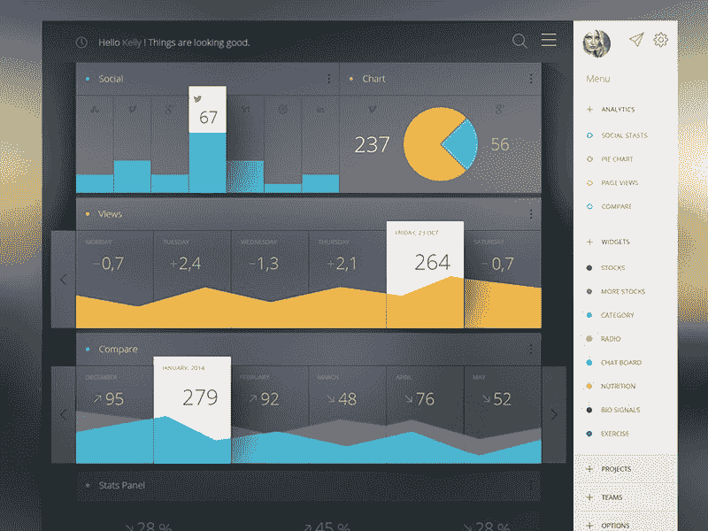

[https://dribbble.com/shots/1423171-Some-Analytics](https://dribbble.com/shots/1423171-Some-Analytics)

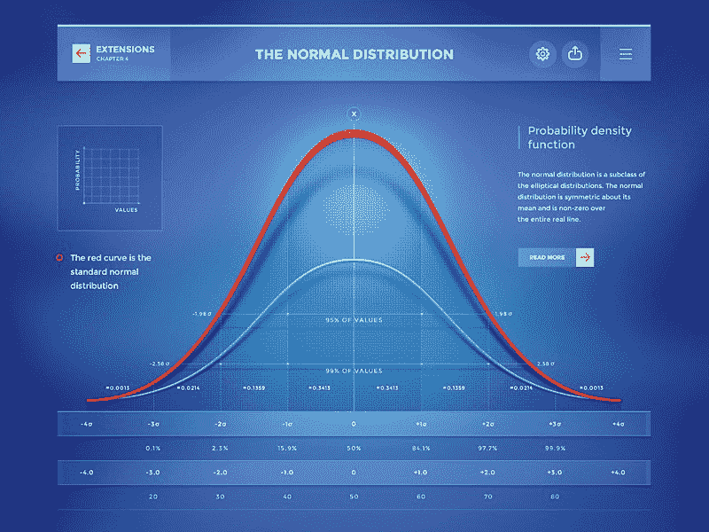

[https://dribbble.com/shots/1592816-Probability-theory](https://dribbble.com/shots/1592816-Probability-theory)

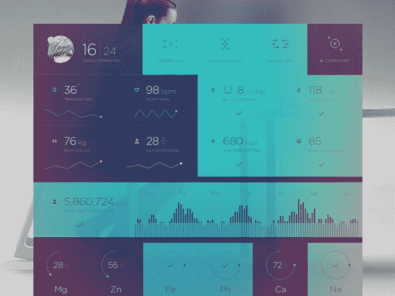

[https://dribbble.com/shots/1738453-Xonom](https://dribbble.com/shots/1738453-Xonom)

看到所有这些美丽的例子让我们意识到，如果我们建立这样的东西，我们一定会脱颖而出。此外，即使仪表板或图表看起来非常好，它们对我们来说很难或不可能用 HTML、CSS 和 JavaScript 来编码。或者他们正在解决一个非常具体的问题，比如最新的带有人体测量的仪表盘。

这在两年前是不可能的，因为我们对 HTML/CSS 的知识和经验水平还没有那么高。我确信，如果我们今天想要实现它们，我们将有很好的机会创造出非常相似的东西。此外，技术和浏览器的能力将帮助我们更多。

我们希望构建一些可以被不同业务领域的许多人使用的东西。也有一些简单而漂亮的仪表板，但我们不想用它们作为灵感，因为我们想要一些不同的东西。

我不能确切地解释我们想要什么，但是我们对任何一个例子都感到不舒服。所以我们继续研究，直到我们找到了我们真正喜欢的东西:

Heroku Dashboard in 2015

它并不完美，也不像我们希望的那样出色。但是我们认为这是一个正确的选择，是一个很好的例子，我们可以从这个例子中构建我们的仪表板。就连巴勃罗·毕加索(Pablo Picasso)也说过，伟大的设计师会偷窃，苹果尊重他的话:

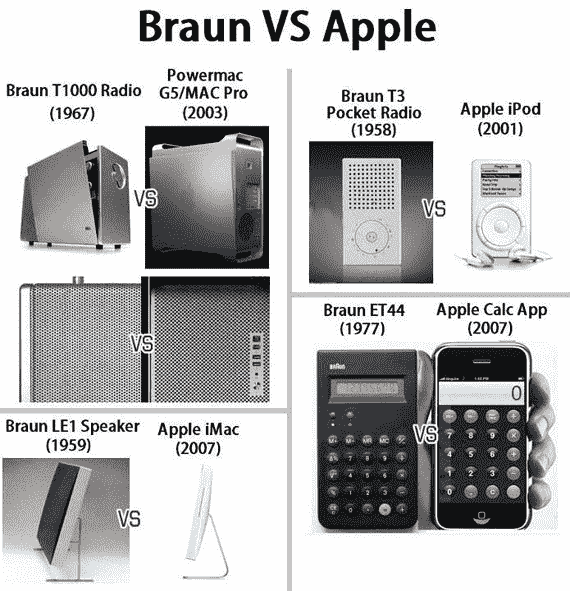

我们不能那么做。Heroku 的仪表板足够好，它给了我们火花。所以我们决定只用它来获得灵感，而不是最终的结果。这是第一次迭代:

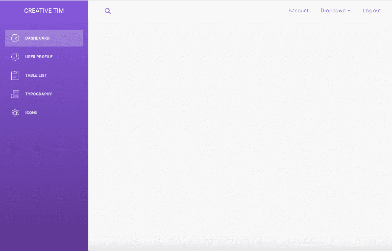

Iteration #1

这是一个很好的开始。为了更好地了解它的外观，我们只需在正确的区域填充一些带图表的卡片:

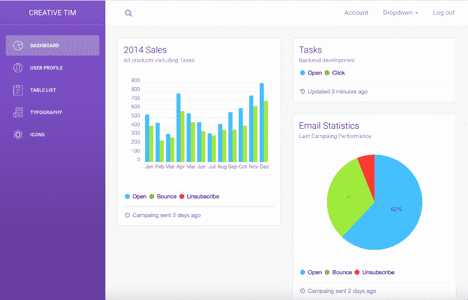

Iteration #2

卡片的颜色看起来不太好。对于左边栏来说，它们太亮了。所以我们开始为图表和侧边栏测试不同的颜色组合。

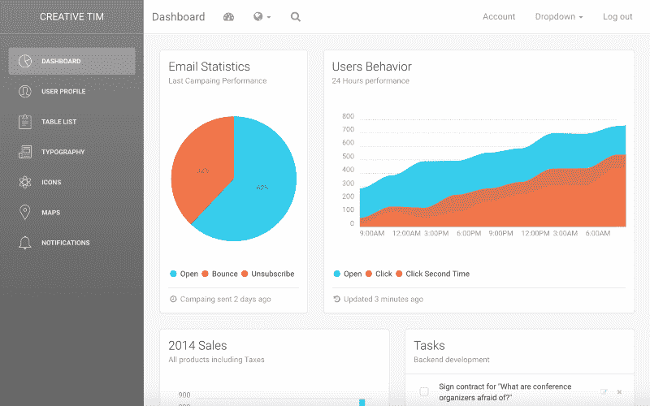

Iteration #3

在这一点上，我们意识到我们不必只为侧边栏的背景保留一种颜色。我们应该让用户选择他们想要的颜色。我们知道苹果的健身应用有一些漂亮的渐变，所以我们决定使用这些渐变作为我们未来渐变的基础。

我们一直认为，如果我们观察世界上最好的公司在设计和 UX 方面做了什么，我们就会为我们的界面设定非常高的标准。这样，越来越多的 web 开发者将可以免费获得高质量的产品。

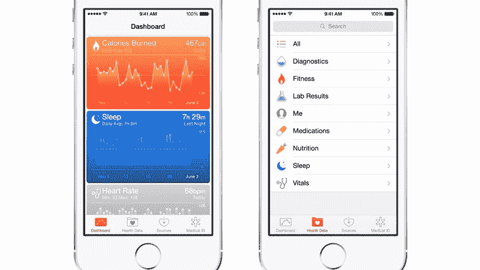

Apple’s Fitness App

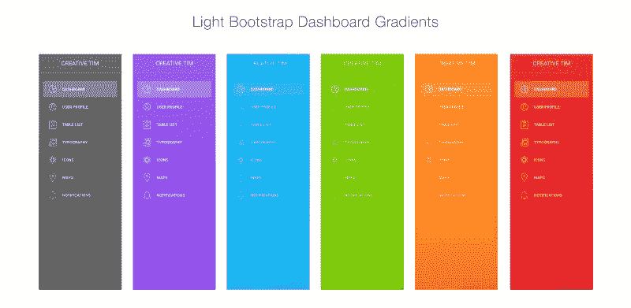

当我们在做所有这些颜色、渐变、卡片和图表的不同组合时，我们看到为 Slack 构建界面的 [Metalab](http://www.metalab.co) 的家伙写了一篇文章: [Slack 的 28 亿美元秘方](https://medium.com/@awilkinson/slack-s-2-8-billion-dollar-secret-sauce-5c5ec7117908#.h63snwe27)。这最终成为下一步的灵感。这篇文章的总体思想是，Slack 的秘密酱是由一个伟大的和有趣的界面与小互动的结合创造的，这使得产品更加用户友好。

> “看起来不一样，感觉不一样，听起来也不一样。”

我们想添加一些其他仪表板 没有的东西。我一直很喜欢带有一些透明度的渐变在图像上的表现。我已经开始玩不同的图像和渐变的不透明度。顺便说一下，我们在 2015 年使用的双色调渐变图像(我们甚至不知道它有名字)似乎是 2017 年网页设计的[趋势之一。这很酷，不是吗？？](https://thenextweb.com/dd/2016/12/22/web-design-trends-can-expect-see-2017/#.tnw_bdot2Bdf)

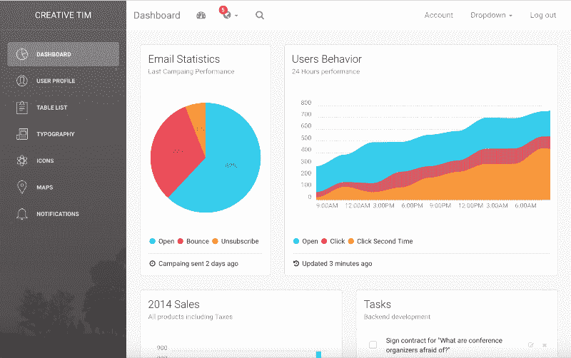

Iteration #4

不完全满意…

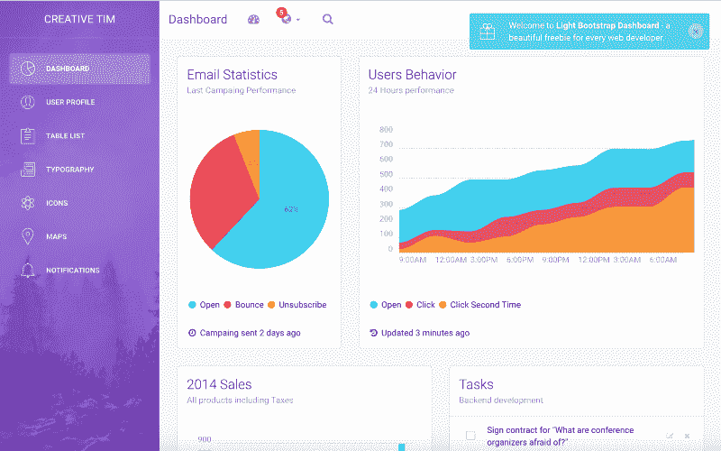

Final iteration

这是让我们感到快乐的景色，对我们来说太完美了？。我们还添加了一些小的交互，比如开始的下拉动画或者通知的显示效果:

添加渐变图像和小动画让我们感觉像这个人:

[https://www.instagram.com/nusr_et](https://www.instagram.com/nusr_et)

### 3.构建在开源之上，以及为什么您应该站在巨人的肩膀上

正如我们在开始时说的，我们不想重新发明轮子。我们也没有钱聘请专家来制造仪表板所需的元件。我们决定，对我们来说最好的选择是使用其他人创造并免费分享的或**开源**。

我们最近发现，我们实际上是站在巨人的肩膀上。这意味着我们尽可能多地使用已经很强大并且被大型社区很好维护的工具。关于这一点的更多信息，以及当你想从头开始构建一些东西时为什么你应该使用这种技术，请阅读这篇很棒的文章，作者是[昆西·拉森](https://twitter.com/ossia) : [如何站在巨人的肩膀上](https://medium.freecodecamp.com/how-to-stand-on-shoulders-16e8cfbc127b#.iyojaorb8)。

#### 让我们来看看引擎盖下到底是什么。

*   框架: [Bootstrap](http://getbootstrap.com/) — Bootstrap 是最流行的 HTML、CSS 和 JavaScript 框架，用于在 web 上开发响应迅速、移动优先的项目。
*   设计层:[搞定屎包](http://demos.creative-tim.com/get-shit-done/index.html) —免费 Bootstrap 3 用户界面包。这是您正在构建的任何在线项目的最佳起点。它已经成为一个干净漂亮的界面的在线社区的商标。
*   字体:[Roboto](https://fonts.google.com/specimen/Roboto)——一种具有双重性质的谷歌字体。它有一个机械骨架，形状主要是几何形状。
*   小图标:[字体牛逼](http://fontawesome.io/) —字体牛逼给你可缩放的矢量图标，可以用 CSS 定制。
*   大图标:[笔画 7 图标](http://www.pixeden.com/icon-fonts/stroke-7-icon-font-set) —这是一套完整的 202 个细笔画图标，灵感来自 iOS 7。
*   charts:[chart ist . js](https://gionkunz.github.io/chartist-js/)—chart ist . js 是一个对其他图表库提供的功能感到失望的社区的产品。
*   通知:[引导通知](http://bootstrap-notify.remabledesigns.com/) —这个插件帮助你把标准的引导警告变成类似“咆哮”的通知。
*   地图:[谷歌地图](https://developers.google.com/maps/) —查看地图的插件。
*   照片: [Unsplash](https://unsplash.com/) —免费([随心所欲](https://unsplash.com/license))高清照片。

> “天下没有不劳而获的事。任何事情，包括你个人的成功，都是有代价的。”——拿破仑·希尔

因为我们使用了社区的很多资源，所以回馈社区是公平的。所以我们几周前决定在麻省理工学院许可下发布它。这样，更多的开发者可以不受任何法律约束地贡献和使用它，用于个人和商业项目。

### 4.发射，升起，闪耀

做大约 50-60 天的研究(磨利斧头)给了我们在仅仅 15 天内开发仪表板(砍树)的可能性。？

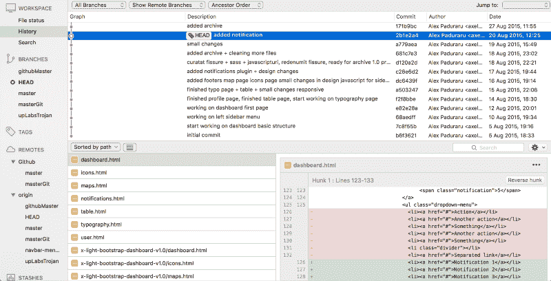

启动一个项目后，你会做什么？你需要看到它的反馈是什么，人们是否愿意使用它，你创建的简单仪表板是否为他们解决了问题。如果他们不想用它，那么，你就没有生意。我们在不同的社区提交了它，它做得非常好。例如，它得到了:

*   《黑客新闻》获得 170 次投票，最高排名第九，当周浏览量超过 88000 次
*   [247 张选票](https://www.reddit.com/r/webdev/comments/3jyyye/light_bootstrap_dashboard_an_useful_freebie_for/)on/r/webdev subeddy
*   /r/web_design subreddit 上的 80 个 upvotes (在 80 时被阻止，因为它有“垃圾邮件”标签，我们有一些订阅弹出窗口…我们后来删除了它们？)

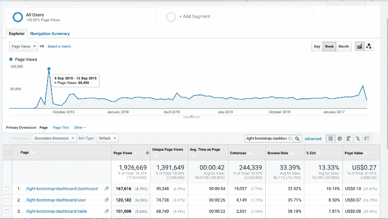

社区证实了这个想法。我们也得到了很多反馈，添加 SASS 文件以便于定制，或者发布在 GitHub 上。

然后我们看到有很多初学者只是想学习如何使用这个仪表板。它太美了，没有接触过这种东西的人都想学习如何使用它。

我们花了大约 3 周时间开发了一系列视频教程，介绍如何使用我们的产品复制 WordPress 仪表盘。我们选择使用 WordPress 仪表盘，因为它是一个非常受欢迎的仪表盘。我们想让人们明白，他们可以用我们的产品制造任何东西。

这些教程很受欢迎，截至今天已有超过 78，000 次浏览。这是关于如何使用 Light Bootstrap Dashboard 1/3 创建响应式管理模板的第一个视频。

### 5.我们如何资助来自网络开发者的支持和请求

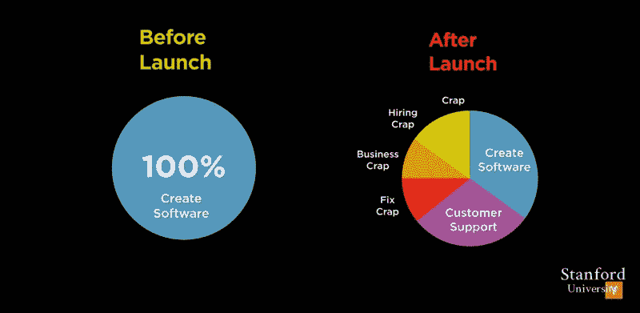

[https://youtu.be/sz_LgBAGYyo?list=PL5q_lef6zVkaTY_cT1k7qFNF2TidHCe-1](https://youtu.be/sz_LgBAGYyo?list=PL5q_lef6zVkaTY_cT1k7qFNF2TidHCe-1)

制造一个产品很容易，保持它的活力却很难。

有很多优秀的插件/模板正在消亡，因为它们的创造者没有足够的现金，或者他们没有足够的收入来继续开发或修复问题。

我们不希望我们的产品出现同样的情况。保持产品活力的最佳选择是创建一个 PRO 版本，它可以产生足够的收入来支持持续的开发。

我们利用了 web 开发者的反馈，决定创建一个包含更多元素和插件的高级版本。我们也想帮助那些想要特定功能并且属于 5%类别的人。对我们来说，从 5%的类别中选择合适的插件是非常困难的。

我们再次开始研究高级仪表板。我们还添加了插件，如[全日历](https://fullcalendar.io/)、【DataTables.net】和、[甜蜜警报](https://limonte.github.io/sweetalert2/)、[引导向导](http://vinceg.github.io/twitter-bootstrap-wizard/)以及一些额外的页面，如[登录页面](http://demos.creative-tim.com/light-bootstrap-dashboard-pro/examples/pages/login.html)、[注册页面](http://demos.creative-tim.com/light-bootstrap-dashboard-pro/examples/pages/register.html)、[锁定页面](http://demos.creative-tim.com/light-bootstrap-dashboard-pro/examples/pages/lock.html)。

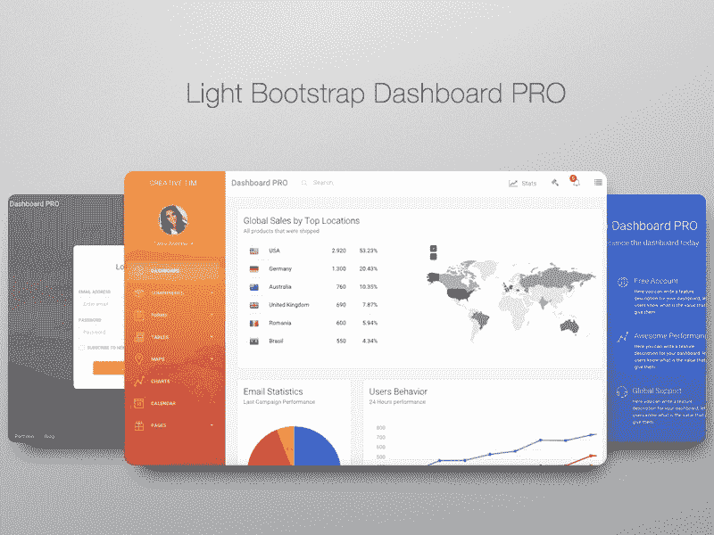

下面是 PRO 版的[现场预告](http://demos.creative-tim.com/light-bootstrap-dashboard-pro/examples/dashboard.html)。你会看到，我们保持了同样的结构，并希望让它更轻，没有太多的选择和功能。

来自专业版的收入使我们不仅支持产品，还创造了新的文件类型，如 [PSD/Sketch 版本](http://www.pixelsvibe.com/product/light-dashboard)或 [Angular 2 版本](https://www.creative-tim.com/product/light-bootstrap-dashboard-angular2)。两者都是免费共享的。

### 6.未来发展计划

以下是一些关于仪表板的统计数据:

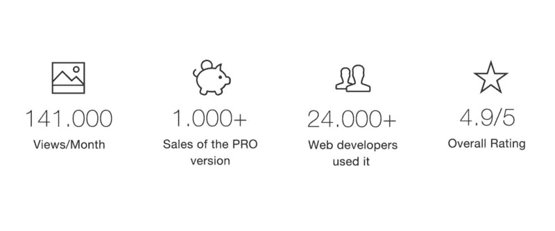

定制它来匹配你的品牌是非常容易的。它被用在内部工具中，如斯坦福的急诊医学目录:

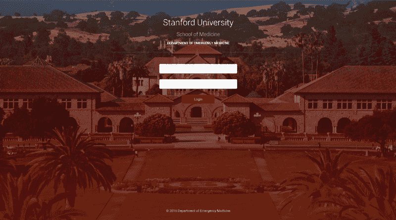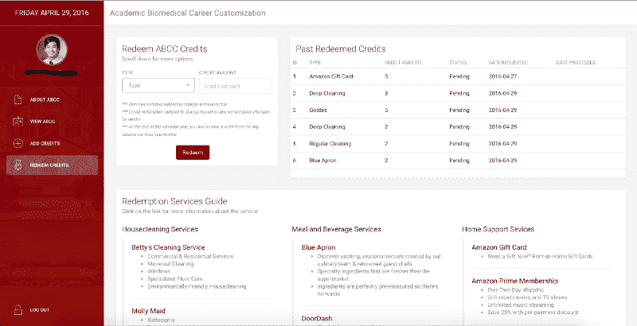

我们收到了许多 web 开发人员的请求，他们希望将仪表盘构建在不同的框架上，如 [Angular 2](https://angular.io/) 、 [Angular CLI](https://cli.angular.io/) 、 [React](https://facebook.github.io/react/) 、 [Meteor](https://www.meteor.com/) 、 [VueJS](https://vuejs.org/) 或作为 Rails 的一个瑰宝。创建所有这些版本，并在麻省理工学院许可下免费支持它们，只有在我们为每个版本都提供专业版的情况下才会起作用。我们从 Angular 2 开始，我们已经看到很多人使用它，我们也收到了很多关于如何改进它的反馈。因此，如果您想参与其他框架，或者您有任何关于如何使这些产品变得更好的想法，我们将很高兴与您详谈。

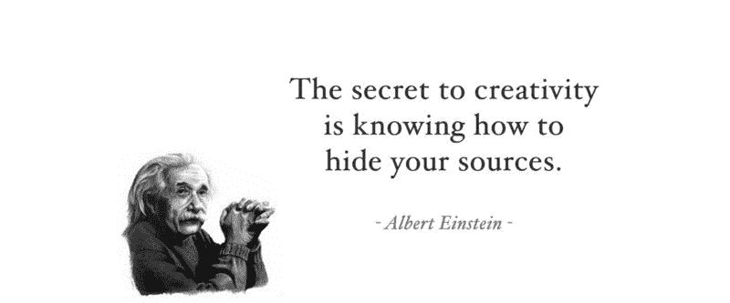

展示我们的资源和我们制作 [Light Bootstrap Dashboard](http://www.creative-tim.com/product/light-bootstrap-dashboard) 的过程需要很大的勇气。希望你能从中学到一些东西，如果你有任何反馈或建议，我很乐意在评论中与你交谈。

有用的链接:

*   从 www.creative-tim.com[下载 HTML 版本](https://www.creative-tim.com/product/light-bootstrap-dashboard)
*   从[www.creative-tim.com](https://www.creative-tim.com/product/light-bootstrap-dashboard-angular2)下载角版
*   从 www.pixelsvibe.com[下载 PSD/Sketch 版本](http://www.pixelsvibe.com/product/light-dashboard)
*   在[实时预览](http://demos.creative-tim.com/light-bootstrap-dashboard/dashboard)上玩它
*   在 [GitHub 知识库](https://github.com/creativetimofficial/light-bootstrap-dashboard)上贡献和报告问题
*   查看我们的博客:[http://blog.creative-tim.com/](http://blog.creative-tim.com/)

在以下位置找到我:

*   电子邮件:[alex@creative-tim.com](mailto:alex@creative-tim.com)
*   https://www.facebook.com/axelut
*   推特:[https://twitter.com/axelut](https://twitter.com/axelut)